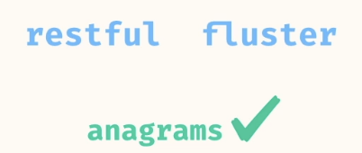
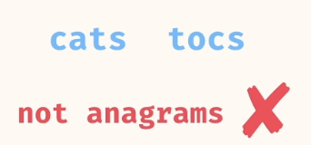
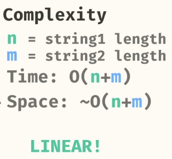
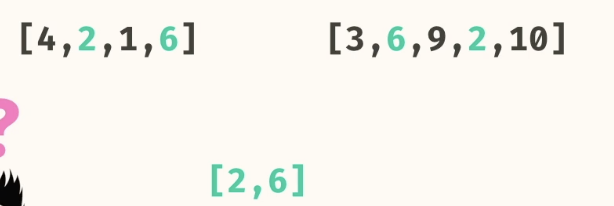
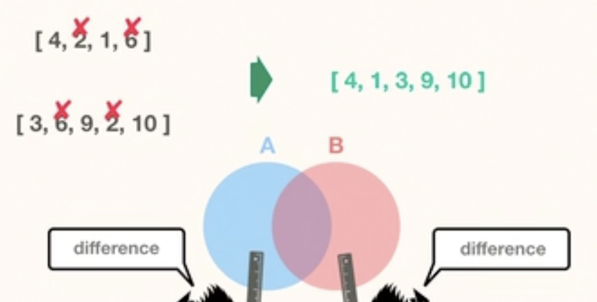

# Hashing
- [Introduction](#introduction)
- [Problems](#problems)
    - [1. Anagrams](#1-anagrams)
    - [2. Most Frequent Char](#2-most-frequent-char)
    - [3. Pair Sum](#3-pair-sum)
    - [4. Pair Product](#4-pair-product)
    - [5. Intersection](#5-intersection)
    - [6. Exclusive Items](#6-exclusive-items)
    - [7. Intersection with Dupes](#7-intersection-with-dupes)

## Introduction
Hashing Mainly involves Using Hash Based Data Structures
- Data Structure - HashMap & HashSet  
- Set Elements are unique and unordered
- Insertion Time - O(1)
- Cheacking items in set - O(1) - Same thing in List takes O(n) time
- The brute force solution for these problemns is O(n2). Using Hashing it can be improved to O(1).


## Problems

### 1. Anagrams
Return a boolean indicating whether or not the strings are anagrams. Anagrams are strings that contain the same characters, but in any order.
 - HashMap

  


  



```
public static HashMap<Character, Integer> charCount(String s) {
    HashMap<Character, Integer> count = new HashMap<Character, Integer>();
    for (char c : s.toCharArray()) {
      if (count.get(c) == null) {
        count.put(c, 0);
      }
      int current = count.get(c);
      count.put(c, current + 1);
    }
    return count;
  }

  public static boolean anagrams(String s1, String s2) {
    return charCount(s1).equals(charCount(s2));
  }
```

### 2. most frequent char

Return the most frequent character of the string. If there are ties, return the character that appears earlier in the string.

- HashMap

```
private static HashMap<Character, Integer> charCount(String s) {
    HashMap<Character, Integer> count = new HashMap<Character, Integer>();
    for (char c : s.toCharArray()) {
      if (count.get(c) == null) {
        count.put(c, 0);
      }
      count.put(c, count.get(c) + 1);
    }
    return count;
  }
  
  public static char mostFrequentChar(String s) {
    HashMap<Character, Integer> count = charCount(s);
    char mostFrequent = '\0';
    for (char c : s.toCharArray()) {
      if (mostFrequent == '\0' || count.get(c) > count.get(mostFrequent)) {
        mostFrequent = c;
      }
    }
    return mostFrequent;
  }
  ```

- n = length of string
- Time: O(n)
- Space: O(n)

### 3. pair sum
takes in a List and a target sum as arguments. The function should return a List containing a pair of indices whose elements sum to the given target. The indices returned must be unique.

- HashMap

```
public static List<Integer> pairSum(List<Integer> numbers, int target) {
    HashMap<Integer, Integer> previousNums = new HashMap<>();
    for (int i = 0; i < numbers.size(); i += 1) {
      int num = numbers.get(i);
      int complement = target - num;
      if (previousNums.containsKey(complement)) {
        return List.of(previousNums.get(complement), i);
      }
      previousNums.put(num, i);
    }
    return null;
  }
  ```
- n = size of input list
- Time: O(n)
- Space: O(n)


### 4. Pair Product
Takes in a List and a target product as arguments. The function should return a List containing a pair of indices whose elements product to the given target. The indices returned must be unique.
Be sure to return the indices, not the elements themselves.
There is guaranteed to be one such pair whose product is the target.

- HashMap

```
public static List<Integer> pairProduct(List<Integer> numbers, int target) {
    HashMap<Double, Integer> previousNums = new HashMap<>();
    for (int i = 0; i < numbers.size(); i += 1) {
      int num = numbers.get(i);
      double complement = (double) target / num;
      if (previousNums.containsKey(complement)) {
        return List.of(previousNums.get(complement), i);
      }
      previousNums.put(Double.valueOf(num), i);
    }
    return null;
  }
```

- n = size of input list
- Time: O(n)
- Space: O(n)

### 5. intersection
Write a method, intersection, that takes in two Lists, a,b, as arguments and returns a new list with common elements.

- Hash Set



Brute Force - Double Loops


Using HashSet


```
List<Integer> a = List.of(4,2,1,6);
List<Integer> b = List.of(3,6,9,2,10);
Source.intersection(a, b) // -> [2,6]
```

```
public static List<Integer> intersection(List<Integer> listA, List<Integer> listB) {
    HashSet<Integer> setA = new HashSet<>(listA);
    List<Integer> result = new ArrayList<>();
    
    for (int ele : listB) {
      if (setA.contains(ele)) {
        result.add(ele);
      }
    }
    
    return result;
}
```
- n = length of list a, m = length of list b
- Time: O(n+m)
- Space: O(n)

### 6. Exclusive items

Write a method, exclusiveItems, that takes in two lists, a,b, as arguments. The method should return a new list containing elements that are in either list but not both lists.

You may assume that each input list does not contain duplicate elements.




```
 public static List<Integer> exclusiveItems(List<Integer> a, List<Integer> b) {
    HashSet<Integer> setA = new HashSet<>(a);
    HashSet<Integer> setB = new HashSet<>(b);
    List<Integer> difference = new ArrayList<>();
    
    for (int item : a) {
      if (!setB.contains(item)) {
        difference.add(item);
      }
    }

    for (int item : b) {
      if (!setA.contains(item)) {
        difference.add(item);
      }
    }
    
    return difference;
  }
 public static List<Integer> exclusiveItems(List<Integer> a, List<Integer> b) {
    HashSet<Integer> setA = new HashSet<>(a);
    HashSet<Integer> setB = new HashSet<>(b);
    List<Integer> difference = new ArrayList<>();
    
    for (int item : a) {
      if (!setB.contains(item)) {
        difference.add(item);
      }
    }

    for (int item : b) {
      if (!setA.contains(item)) {
        difference.add(item);
      }
    }
    
    return difference;
  }
```

- n = length of array a, m = length of array b
- Time: O(n+m)
- Space: O(n+m)

### 7. Intersection with dupes

Take in two lists, a,b, as arguments. 
Return a new list containing elements that are common to both input lists. The elements in the result should appear as many times as they occur in both input lists.

You can return the result in any order.

```
intersectionWithDupes(
  List.of("a", "b", "c", "b"), 
  List.of("x", "y", "b", "b")
); // -> ["b", "b"]
```

Use Counter Hashmap to Maintain the counts of the first list. Then Parse the second element and check if element is present in HashMap. If present decrement the counter.


```
public static List<String> intersectionWithDupes(List<String> listA, List<String> listB) {
    Map<String, Integer> counterMap = new HashMap<>();
    
    for(String ele : listA){
      if(!counterMap.containsKey(ele))
        counterMap.put(ele,0);
      counterMap.put(ele, counterMap.get(ele)+1);
    }

    List<String> result = new ArrayList<>();
    
    for(String ele : listB){
      if(counterMap.containsKey(ele)){
        result.add(ele);
        int count = counterMap.get(ele);
        count = count -1;
        if (count == 0)
          counterMap.remove(ele);
        else
          counterMap.put(ele,count);
      }
    }
    
    return result;
  }
```
- n = length of array a
- m = length of array b
- Time: O(n+m)
- Space: O(n+m)


