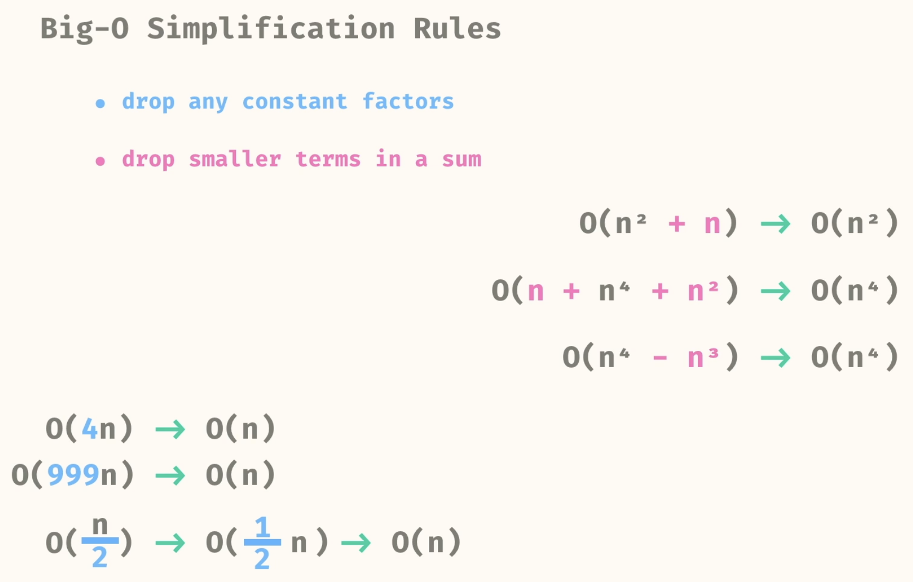
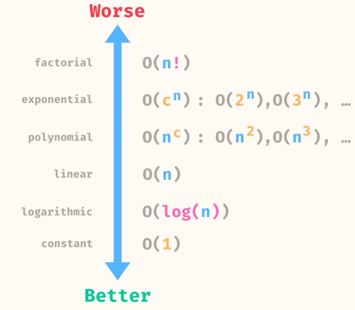
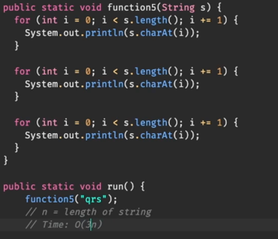

### What is Big-0 Notation ?
- Notation to describe performance of algorithms
- Emphasis on how performance scales with input size
- Approximation

### Why use Big-0 notation?
- allows us to compare performance of algorithms
- does not rely on the environment, (languages, hardware, etc)

### Add Complexities

### Multiply COmplexities

