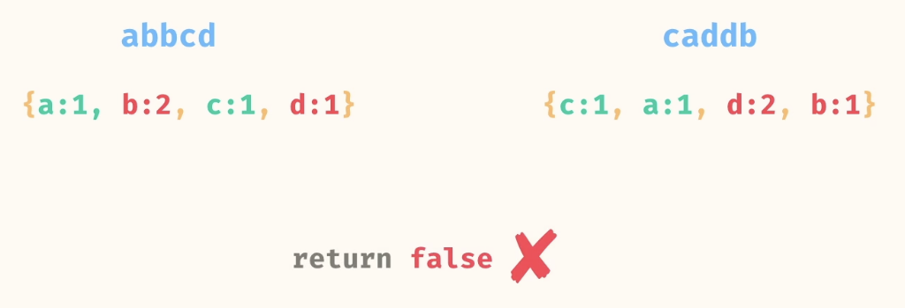
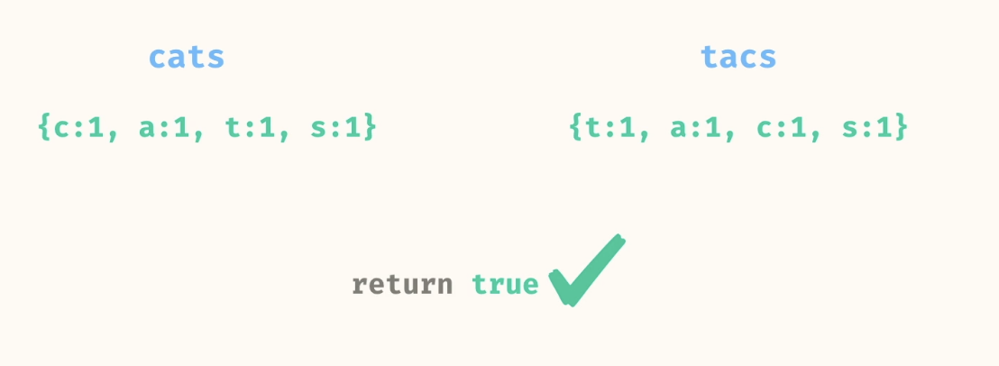
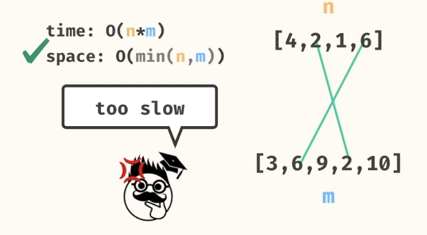
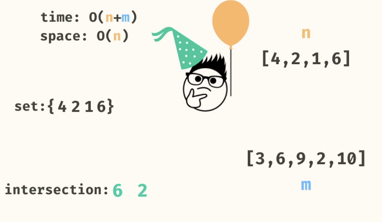

# Binary Trees






  



## Problems
### 1. depth first values


```
//      a
//    /   \
//   b     c
//  / \     \
// d   e     f

Source.depthFirstValues(a); 
//    -> ["a", "b", "d", "e", "c", "f"]
```

Use Stack

```
//Iterative
public static List<String> depthFirstValues(Node<String> root) {
    List<String> values = new ArrayList<>();
    Stack<Node<String>> stack = new Stack<>();

    if (root != null) {
      stack.push(root);
    }
    while (!stack.empty()) {
      Node<String> node = stack.pop();
      values.add(node.val);
      if (node.right != null) {
        stack.push(node.right);
      }
      if (node.left != null) {
        stack.push(node.left);
      }
    }
    return values;
  }
```

- n = number of nodes
- Time: O(n)
- Space: O(n)

```
//Recursive
public static List<String> depthFirstValues(Node<String> root) {
    if (root == null) {
      return List.of();
    }
    
    List<String> values = new ArrayList<>();
    values.add(root.val);
    values.addAll(depthFirstValues(root.left));
    values.addAll(depthFirstValues(root.right));
    return values;
}
```

- n = number of nodes
- Time: O(n^2)
- Space: O(n)


### 1. Breadth first values

```
//      a
//    /   \
//   b     c
//  / \     \
// d   e     f

Source.breadthFirstValues(a); 
//    -> ["a", "b", "c", "d", "e", "f"]
```

USE QUEUE

```
public static List<String> breadthFirstValues(Node<String> root) {
    if (root == null) 
      return List.of();
    }
    List<String> values = new ArrayList<>();
    Queue<Node<String>> queue = new ArrayDeque<>();
    queue.add(root);
    while (!queue.isEmpty()) {
      Node<String> node = queue.remove();
      values.add(node.val);
      if (node.left != null) {
        queue.add(node.left);
      }
      if (node.right != null) {
        queue.add(node.right);
      }
    }
    return values;
  }
  ````
  
- n = number of nodes
- Time: O(n)
- Space: O(n)


  No Recursive solution
