# Dynamic Programming

- [Dynamic Programming](#dynamic-programming)
  - [Introduction](#introduction)
  - [Problems](#problems)
    - [1. sum possible](#1-sum-possible)
    - [2. min change](#2-min-change)
    - [3. count paths](#3-count-paths)
    - [4. max path sum](#4-max-path-sum)
    - [5. non adjacent sum](#5-non-adjacent-sum)
    - [6. summing squares](#6-summing-squares)
    - [7. counting change](#7-counting-change)
    - [8 . array stepper](#8--array-stepper)
    - [9. max palin subsequence](#9-max-palin-subsequence)
    - [10. overlap subsequence](#10-overlap-subsequence)
      - [Intuition:](#intuition)
    - [11. can concat](#11-can-concat)
      - [Intuition](#intuition-1)
    - [12. quickest concat](#12-quickest-concat)
    - [13. knightly number](#13-knightly-number)


## Introduction
Normal Recursion

Time Complexity:
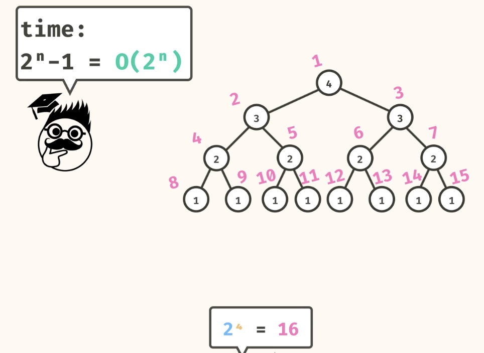

Space Complexity
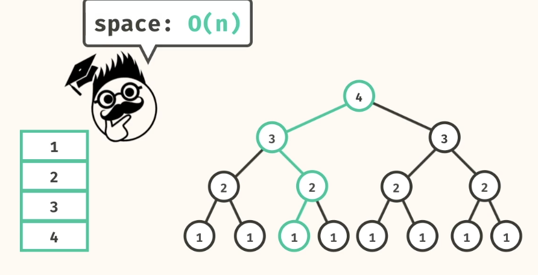

***MEMOISATION***.  
Avoid duplicate work by storing intermediate results.

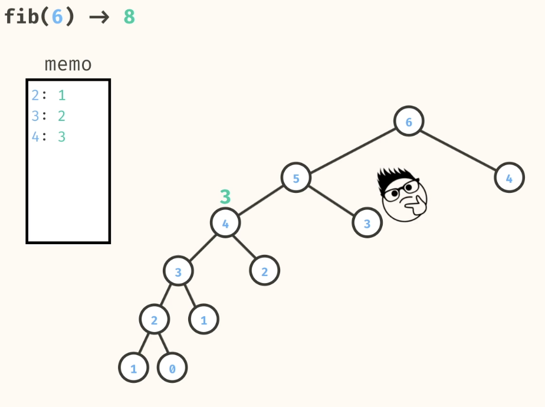

Improved Time Complexity

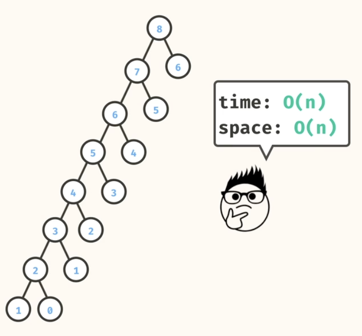

## Problems

### 1. sum possible

Write a method sumPossible that takes in an amount and a list of positive numbers. The method should return a boolean indicating whether or not it is possible to create the amount by summing numbers of the list. You may reuse numbers of the list as many times as necessary.

You may assume that the target amount is non-negative.

```
Source.sumPossible(8, List.of(5, 12, 4)); // -> true, 4 + 4
Source.sumPossible(15, List.of(6, 2, 10, 19)); // -> false
```

You start with Target value.You have n choices based on the denomination of coins. At each step you subtract the amount based on the coin chosen. Keep doing this until you hit the base case of amount 0 which would mean its possible or negative number which would mean its not possible.

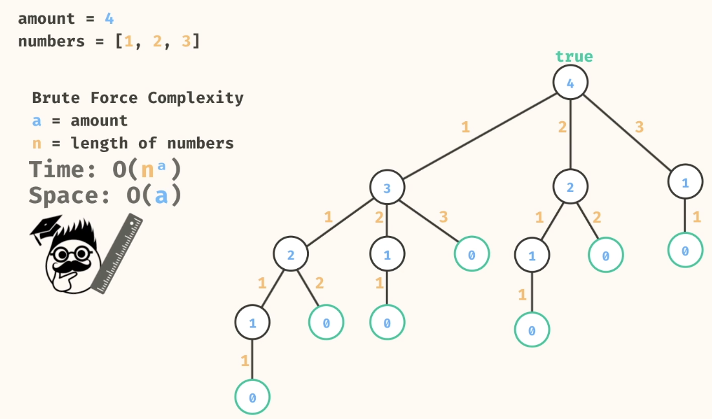

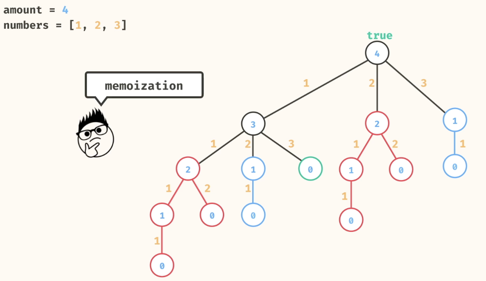

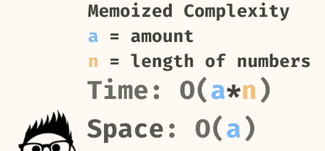

```
public static boolean sumPossible(int amount, List<Integer> numbers) {
    return sumPossible(amount, numbers, new HashMap<>());
  }
  
  public static boolean sumPossible(int amount, List<Integer> numbers, HashMap<Integer, Boolean> memo) {
    if (amount == 0) {
      return true;
    }
    
    if (amount < 0) {
      return false;
    }
    
    if (memo.containsKey(amount)) {
      return memo.get(amount);
    }
    
    for (int num : numbers) {
      if (sumPossible(amount - num, numbers, memo)) {
        memo.put(amount, true);
        return true;
      }
    }
    memo.put(amount, false);
    return false;
  }
```

### 2. min change

Write a method minChange that takes in an amount and an array of coins. The method should return the minimum number of coins required to create the amount. You may use each coin as many times as necessary.

If it is not possible to create the amount, then return -1

```
Source.minChange(8, List.of(1, 5, 4, 12)); // -> 2, because 4+4 
```

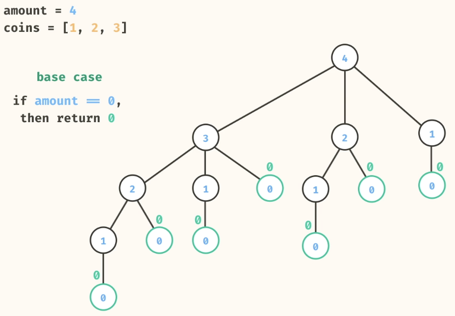

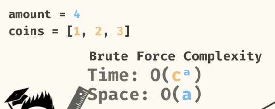

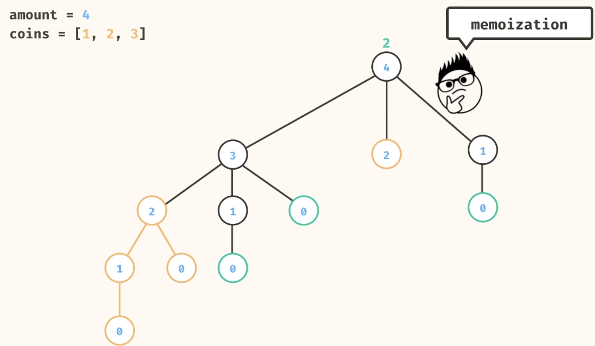

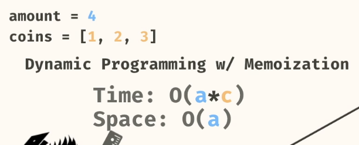

```
  public static int minChange(int amount, List<Integer> coins) {
    return minChange(amount, coins, new HashMap<>());
  }
  
  public static int minChange(int amount, List<Integer> coins, HashMap<Integer, Integer> memo) {
    if (amount == 0) {
      return 0;
    }
    
    if (amount < 0) {
      return -1;
    }
    
    if (memo.containsKey(amount)) { 
      return memo.get(amount);
    }
    
    int minCoins = -1;
    for (int coin : coins) {
      int subAmount = amount - coin;
      int subCoins = minChange(subAmount, coins, memo);
      if (subCoins != -1) {
        int numCoins = 1 + subCoins;
        if (numCoins < minCoins || minCoins == -1) {
          minCoins = numCoins;
        }
      }
    }
    
    memo.put(amount, minCoins);
    return minCoins;
  }
```

### 3. count paths

Write a method, countPaths, that takes in a grid as an argument. In the grid, 'X' represents walls and 'O' represents open spaces. You may only move down or to the right and cannot pass through walls. The method should return the number of ways possible to travel from the top-left corner of the grid to the bottom-right corner.

```
List<List<String>> grid = List.of(
  List.of("O", "O"),
  List.of("O", "O")
);
Source.countPaths(grid); // -> 2
```

Represent the Problem as a decision tree

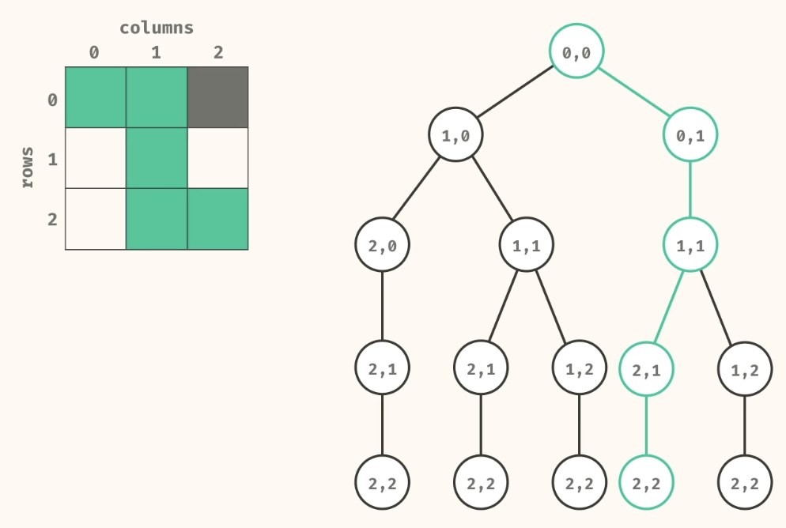

Base Case - Only one way to reach the last point if we were already at that point.

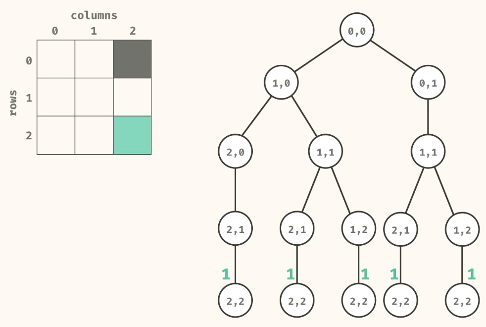

Then keep adding the values from Child trees as that represents the total paths

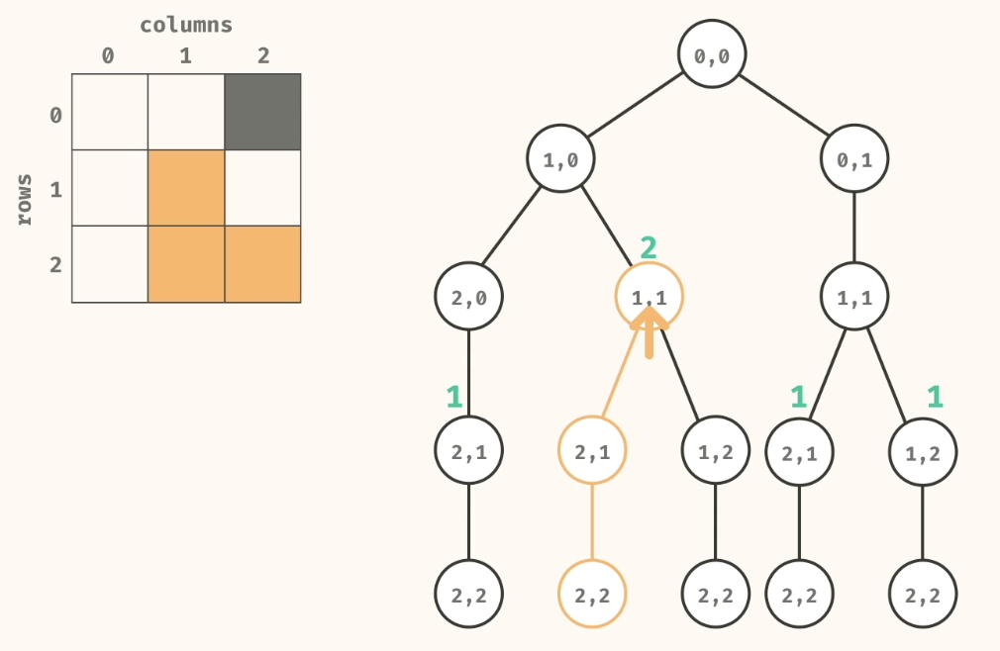.  

Time Complexity - 2 because we have 2 options(Binary Tree). r+c represent the height of the tree.

Space COmplexity - r+c Stack depth will be equal to the height of the tree.

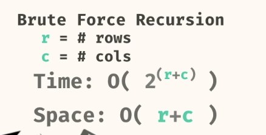.  

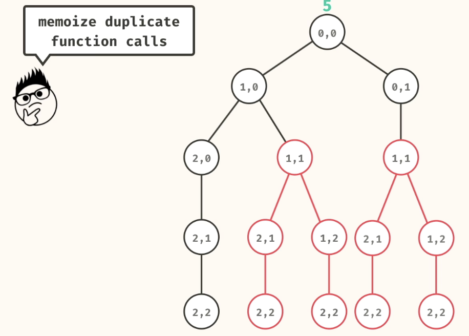

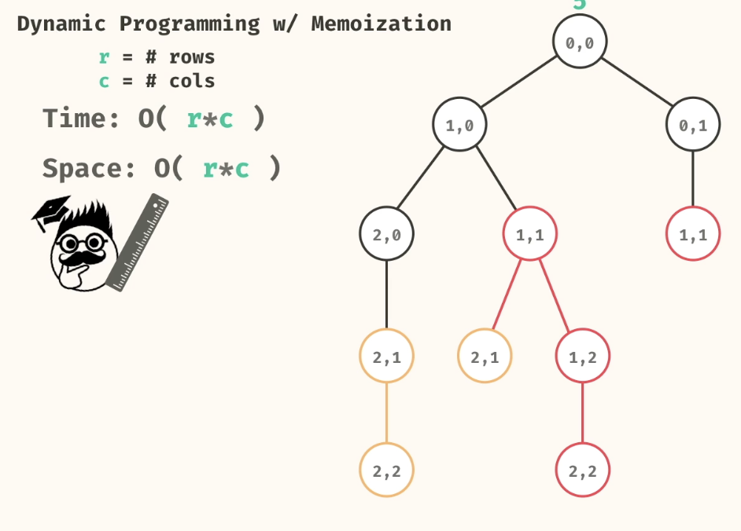

```
  public static int countPaths(List<List<String>> grid) {
    return countPaths(0, 0, grid, new HashMap<>());  
  }
  
  public static int countPaths(int r, int c, List<List<String>> grid, HashMap<List<Integer>, Integer> memo) {
    if (r == grid.size() || c == grid.get(0).size()) {
      return 0;
    }
    
    if (grid.get(r).get(c) == "X") {
      return 0;
    }
    
    if (r == grid.size() - 1 && c == grid.get(0).size() - 1) {
      return 1;
    }
    
    List<Integer> pos = List.of(r, c);
    if (memo.containsKey(pos)) {
      return memo.get(pos);
    }
    
    int result = countPaths(r + 1, c, grid, memo) + countPaths(r, c + 1, grid, memo);
    memo.put(pos, result);
    return result;
  }
```

### 4. max path sum

Write a method, maxPathSum, that takes in a grid as an argument. The method should return the maximum sum possible by traveling a path from the top-left corner to the bottom-right corner. You may only travel through the grid by moving down or right.

You can assume that all numbers are non-negative.

At every node we have 2 choice , so we draw a decision tree.
Base case is where there is no choice so the max path sum will be the value of node itself

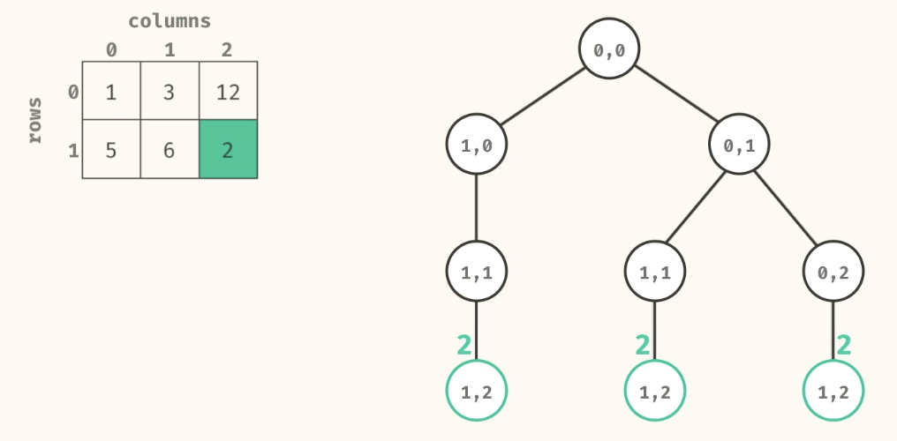

At every node we have to take the max of the 2 paths

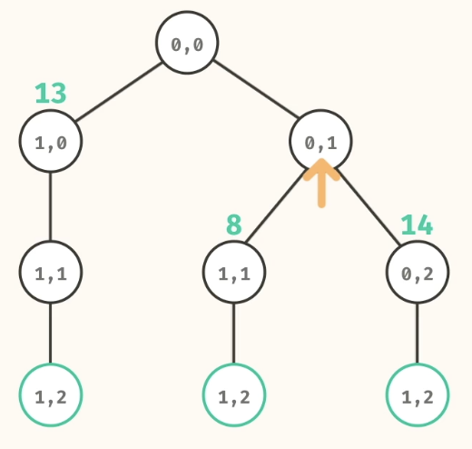

And then add the node value

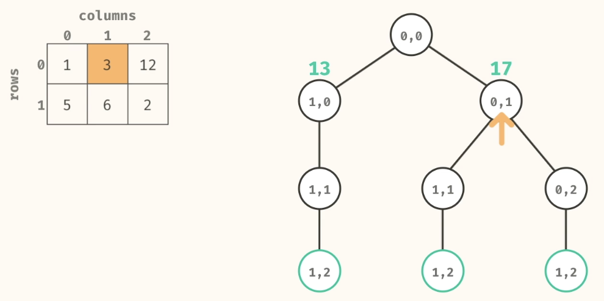

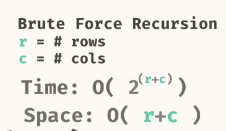

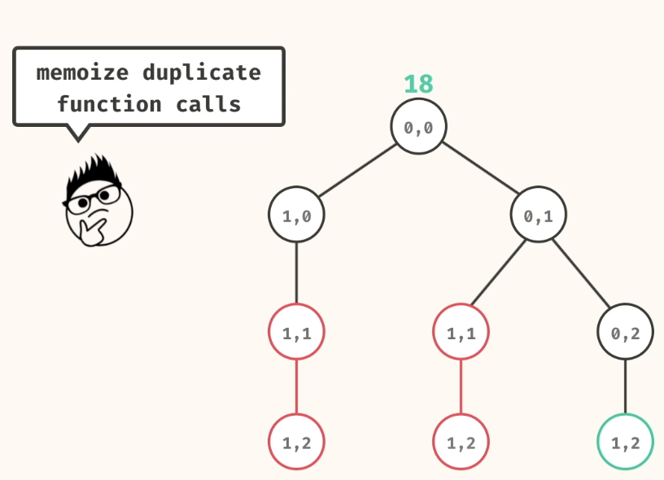


r = rows  
c = col  
Time Complexity - O(rc)  
Space Complexity - O(rc)  
As there will be total rc different nodes in the decision tree and we will have to calculate this rc times 

```
  public static int maxPathSum(List<List<Integer>> grid) {
    return (int) maxPathSum(0, 0, grid, new HashMap<>());
  }

  public static double maxPathSum(int r, int c, List<List<Integer>> grid, HashMap<List<Integer>, Double> memo) {
    if (r == grid.size() || c == grid.get(0).size()) {
      return Double.NEGATIVE_INFINITY;
    }
    
    if (r == grid.size() - 1 && c == grid.get(0).size() - 1) {
      return grid.get(r).get(c);
    }
    
    List<Integer> pos = List.of(r, c);
    if (memo.containsKey(pos)) {
      return memo.get(pos);
    }
    
    double result = grid.get(r).get(c) + Math.max(
      maxPathSum(r + 1, c, grid, memo), 
      maxPathSum(r, c + 1, grid, memo)
    );
    memo.put(pos, result);
    return result;
  }
```

### 5. non adjacent sum

Write a method, nonAdjacentSum, that takes in a list of numbers as an argument. The method should return the maximum sum of non-adjacent elements in the list. There is no limit on how many elements can be taken into the sum as long as they are not adjacent.

```
[2, 4, 5, 12, 7]

The maximum non-adjacent sum is 16, because 4 + 12. 
4 and 12 are not adjacent in the list.
```

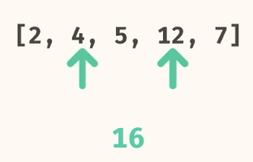
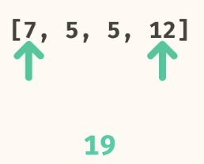

At every step we have 2 choices
1] Either we take the current element, which means we need to skip the adjacent element and take the remaining element.
2] We skip the current element and take the rest of the elements.

Base case is when there are no elements so, return 0
and then we take max of Left and right Child. For Left Child we need to add the current value before taking max. 
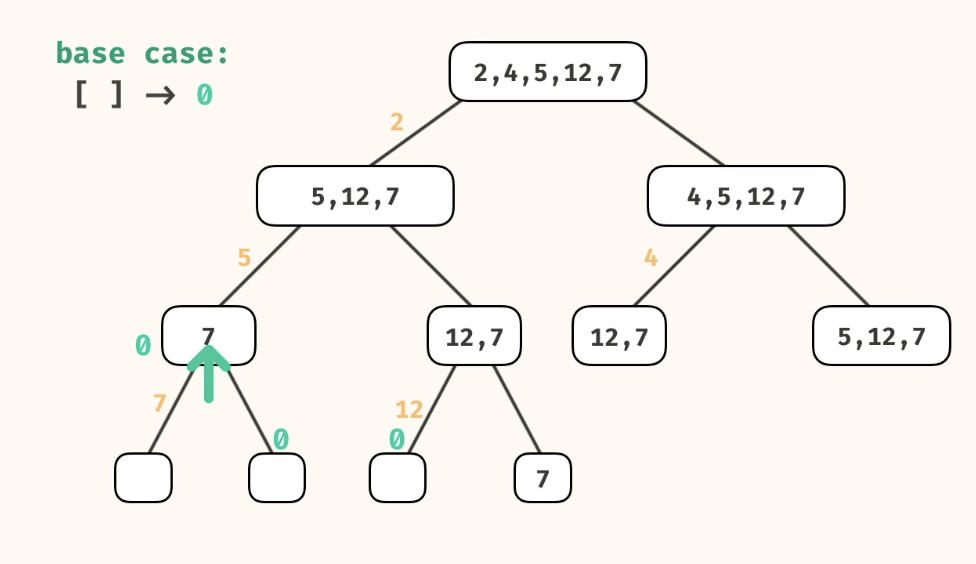

Memoisation.  
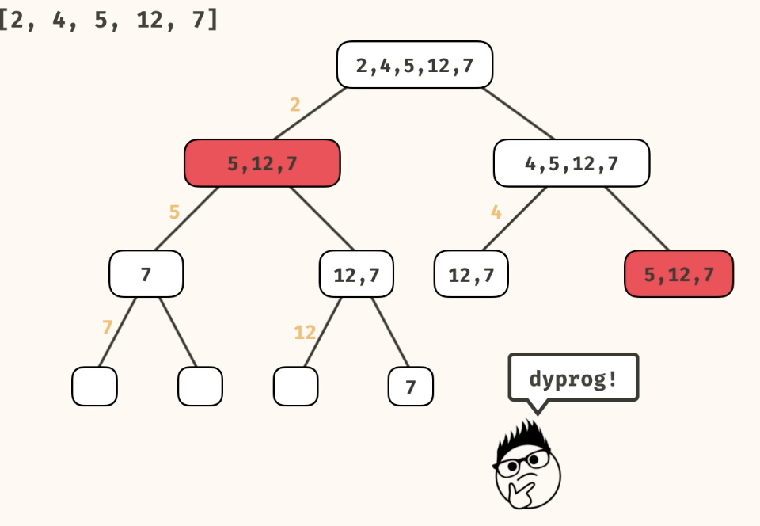

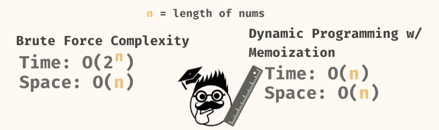.   

Check how we intepret the list elements.The code looks simple, but its very difficult to get the intution.

```
public static int nonAdjacentSum(List<Integer> nums) {
    return nonAdjacentSum(nums, 0, new HashMap<>());
  }

  public static int nonAdjacentSum(List<Integer> nums, int i, HashMap<Integer, Integer> memo) {
    if (i >= nums.size()) {
      return 0;
    }
    
    if (memo.containsKey(i)) {
      return memo.get(i);
    }
    
    int result = Math.max(
      nums.get(i) + nonAdjacentSum(nums, i + 2, memo),
      nonAdjacentSum(nums, i + 1, memo)
    );
    memo.put(i, result);
    return result;
  }
```

### 6. summing squares

Write a method, summingSquares, that takes a target number as an argument. The method should return the minimum number of perfect squares that sum to the target. A perfect square is a number of the form (i*i) where i >= 1.

For example: 1, 4, 9, 16 are perfect squares, but 8 is not perfect square.

```
Given 12:

summingSquares(12) -> 3

The minimum squares required for 12 is three, by doing 4 + 4 + 4.

Another way to make 12 is 9 + 1 + 1 + 1, but that requires four perfect squares.
```

Very difficult to get the intution.  
Given a number, the different choices are the different squares less than n.  
Eg: if n = 10    
Choices are 1(1) , 2(4) , 3(9).  
Note that we cannot take 4 as 16 >n.  
So if we take   
1 the number reduces to 10-1 = 9.  
2 the number reduces to 10-4 = 6.  
3 the number reduces to 10-9 = 1.  

Base case - if number is 0 there are 0 ways to make it.
As we return we need to add 1 to the recursive result as that reprsents the number of perfect square added to the path.


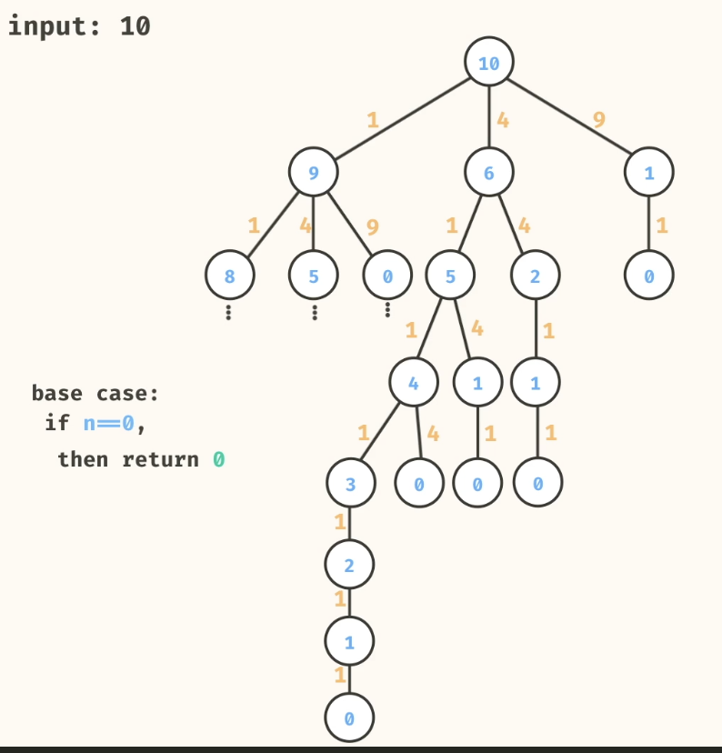

We then need to take the min of all paths.  
For instance for 4 there are 2 child paths.  
1+1+1 = 3.  
0 = 0.  
So we take min i.e 0 and thenadd 1 to it which gives us 4. 
Which means the min number of squares for generating 4 is 1 i.e 4. 
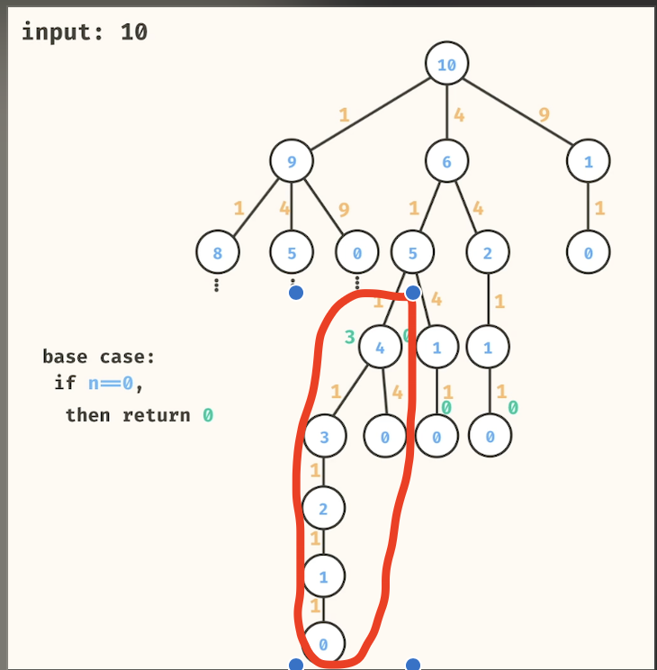.  


Height of the tree will be n , since if we consider all 1 it can go from 10, 9, 8...   
Branching factor is determied by sqrt(n).  
Hence Time Complexity = Branching factor^ height of the tree i.e O(sqrt(n)^n).  

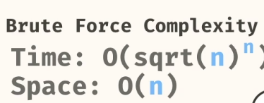

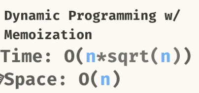

```
public static int summingSquares(int n) {
    return summingSquares(n, new HashMap<>());
  }

  private static int summingSquares(int n, HashMap<Integer,Integer> memo){
    
    if (n<0) return Integer.MAX_VALUE;
    if (n==0) return 0;
    if (memo.containsKey(n)) return memo.get(n);

    int min = Integer.MAX_VALUE;
    
    for(int i = 1;i<=n;i++){
      int remain = n - (i*i);
      if(remain>=0){
        min = Math.min(min,1 + summingSquares(remain, memo));         
      }           
    }
    memo.put(n,min);
    return min;
  }
```

The for Loop should ideally be as below, so then we do not need to check if the remainder is Negative.   
```
  for(int i = 1;i<=Math.sqrt(n);i++){
      int remain = n - (i*i);
      min = Math.min(min,1 + summingSquares(remain, memo));                 
    }
```

### 7. counting change

Write a method, countingChange, that takes in an amount and an array of coins. The method should return the number of different ways it is possible to make change for the given amount using the coins.

You may reuse a coin as many times as necessary.

```
For example,

countingChange(4, List.of(1,2,3)) -> 4

There are four different ways to make an amount of 4:

1. 1 + 1 + 1 + 1
2. 1 + 1 + 2
3. 1 + 3
4. 2 + 2
```

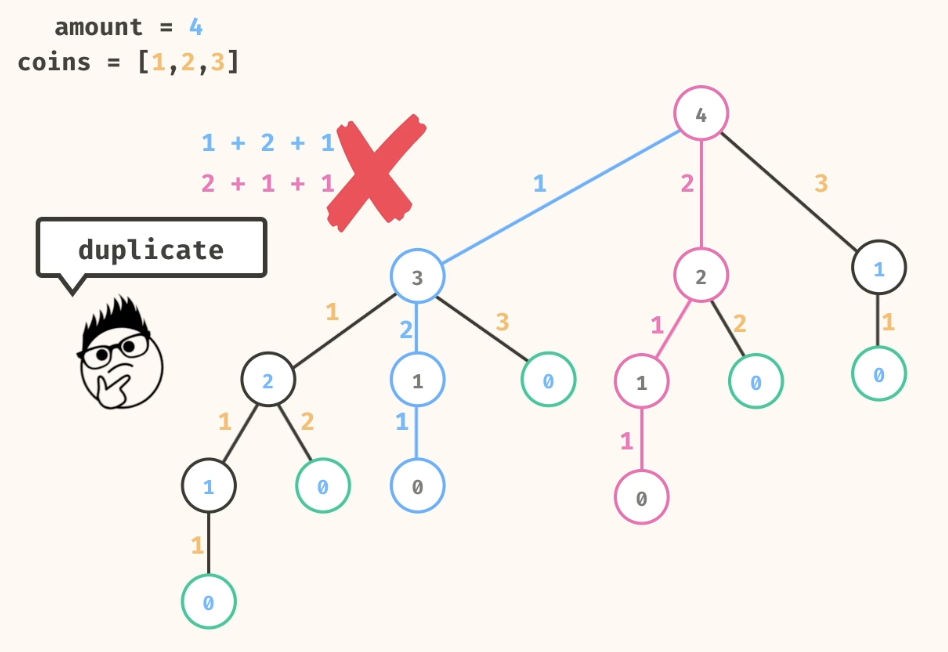

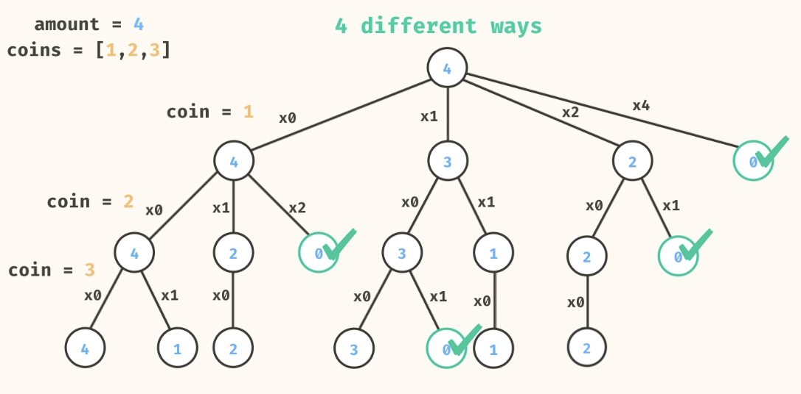

Height of the tree = Max no of coins as at every level we are choosing a different coin value
a = amount
c = no of coins 

Space complexity = a*c because that will be the no of combinations we need to store in our memo hash.

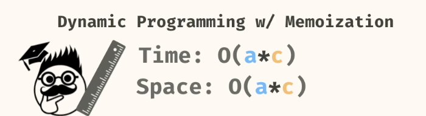


```
  public static int countingChange(int amount, List<Integer> coins) {
    return countingChange(amount, 0, coins, new HashMap<>());
  }
  
  public static int countingChange(int amount, int coinIdx, List<Integer> coins, HashMap<List<Integer>, Integer> memo) {
    if (amount == 0) {
      return 1;
    }
    
    if (coinIdx == coins.size()) {
      return 0;
    }
    
    List<Integer> key = List.of(amount, coinIdx);
    if (memo.containsKey(key)) {
      return memo.get(key);
    }
    
    int total = 0;
    for (int qty = 0; qty * coins.get(coinIdx) <= amount; qty += 1) {
      int subAmount = amount - (qty * coins.get(coinIdx));
      total += countingChange(subAmount, coinIdx + 1, coins, memo);
    }
    
    memo.put(key, total);
    return total;
  }
```

### 8 . array stepper

Write a method, arrayStepper, that takes in a list of numbers as an argument. You start at the first position of the list. The method should return a boolean indicating whether or not it is possible to reach the last position of the list. When situated at some position of the list, you may take a maximum number of steps based on the number at that position.    

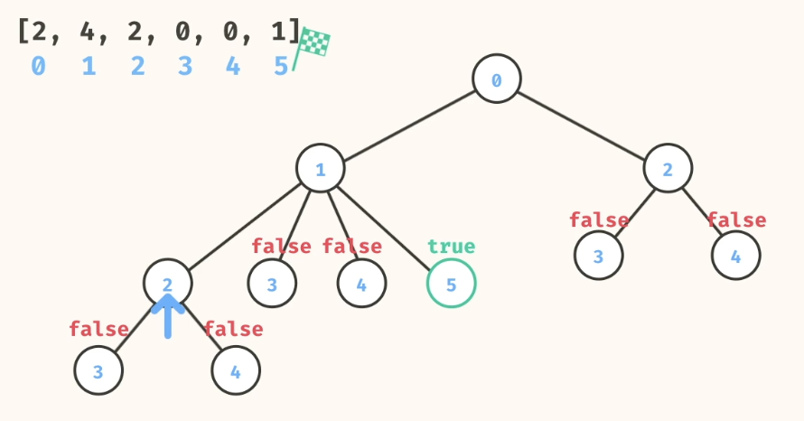. 

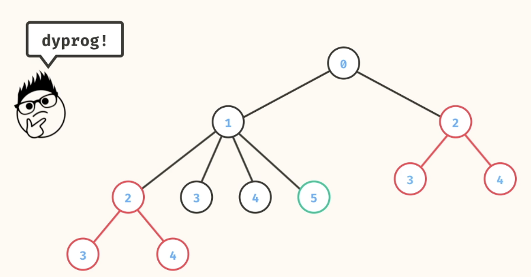. 

Time Complexity is O(n^2) as for worst cases we might need to check every index for each element (more like 2 loops).  
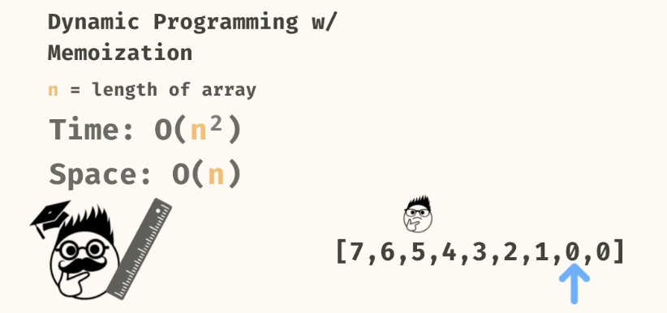.  

```
  public static boolean arrayStepper(List<Integer> nums) {
    return arrayStepper(0, nums, new HashMap<>());
  }
  
  public static boolean arrayStepper(int idx, List<Integer> nums, HashMap<Integer, Boolean> memo) {
    if (idx >= nums.size() - 1) {
      return true;
    }
    
    if (memo.containsKey(idx)) {
      return memo.get(idx);
    }
    
    for (int step = 1; step <= nums.get(idx); step += 1) {
      if (arrayStepper(idx + step, nums, memo)) {
        memo.put(idx, true);
        return true;
      }
    }
    memo.put(idx, false);
    return false;
  }
```

### 9. max palin subsequence

Write a method, maxPalinSubsequence, that takes in a string as an argument. The method should return the length of the longest subsequence of the string that is also a palindrome.

A subsequence of a string can be created by deleting any characters of the string, while maintaining the relative order of characters.

```
Source.maxPalinSubsequence("luwxult"); // luwul or luxul-> 5
Source.maxPalinSubsequence("xyzaxxzy"); yzxxzy// -> 6
Source.maxPalinSubsequence("z"); // -> 1
```

Check the first and last characters of a string.  
- If they match we remove them and increment the count by 2.  
- If not, we make 2 recursive calls, one by removing the first letter and second by removing the last letter.  
- Base cases.  
  - If Empty String return 0
  - If single char return 1.  

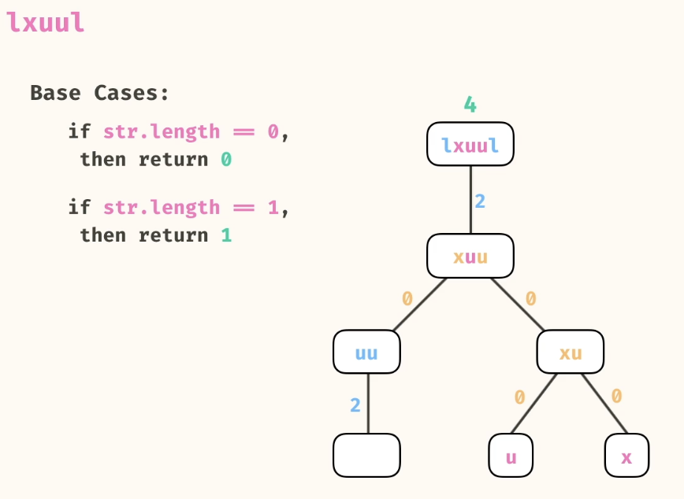.  
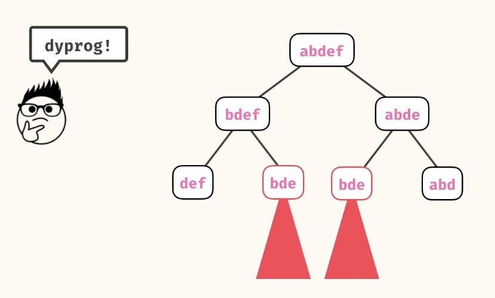.  

s = length of the String.  
Time Complexity = s^2
Space Complexity = s^2.  
This is because for a given string we will be considering all possible substrings which will be s^2.  

```
public static int maxPalinSubsequence(String str) {
    return maxPalinSubsequence(str,new HashMap<>());
  }
  
  public static int maxPalinSubsequence(String str, HashMap<String,Integer> memo) {
    
    if(str.length() == 0) return 0;
    if(str.length() == 1) return 1;

    if (memo.containsKey(str)) return memo.get(str);
 
    int maxl = 0 ;
    
    if (str.charAt(0) == str.charAt(str.length()-1)) {
       maxl = 2 + maxPalinSubsequence(str.substring(1,str.length()-1));
    }
    else{
      maxl = Math.max(maxPalinSubsequence(str.substring(0,str.length()-1)),
        maxPalinSubsequence(str.substring(1,str.length())));

    }

     memo.put(str,maxl);
    return maxl;
  }
```

The solution uses substring operation which could be expensive. The below solution adddresses this concern.      

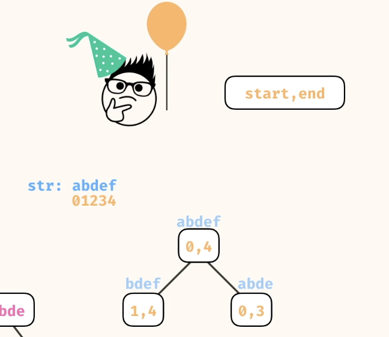

```
public static int maxPalinSubsequence(String str) {
    return maxPalinSubsequence(str, 0, str.length() - 1, new HashMap<>());
  }

  public static int maxPalinSubsequence(String str, int i, int j, HashMap<List<Integer>, Integer> memo) {
    if (i > j) {
      return 0;
    }
    
    if (i == j) {
      return 1;
    }
    
    List<Integer> key = List.of(i, j);
    if (memo.containsKey(key)) {
      return memo.get(key);
    }
    
    int result;
    if (str.charAt(i) == str.charAt(j)) {
      result = 2 + maxPalinSubsequence(str, i + 1, j - 1, memo);
    } else {
      result = Math.max(
        maxPalinSubsequence(str, i + 1, j, memo), 
        maxPalinSubsequence(str, i, j - 1, memo)
      );
    }
    memo.put(key, result);
    return result;
  }
```

### 10. overlap subsequence

Write a method, overlapSubsequence, that takes in two strings as arguments. The method should return the length of the longest overlapping subsequence.

A subsequence of a string can be created by deleting any characters of the string, while maintaining the relative order of characters.

```
Source.overlapSubsequence("dogs", "daogt"); // -> 3
Source.overlapSubsequence("xcyats", "criaotsi"); // -> 4
```

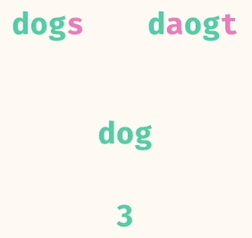

#### Intuition:
- Compare the First character of both strings
- If they match remove the first character, increment the count and recurse for rest of the string.
- If they do not match, we have 2 options
  - remove the first character from first string and call recurse for the 2 strings.
  - remove the first character from second string and call recurse for the 2 strings. 
- Base cases
  - if Both strings are empty return 0  

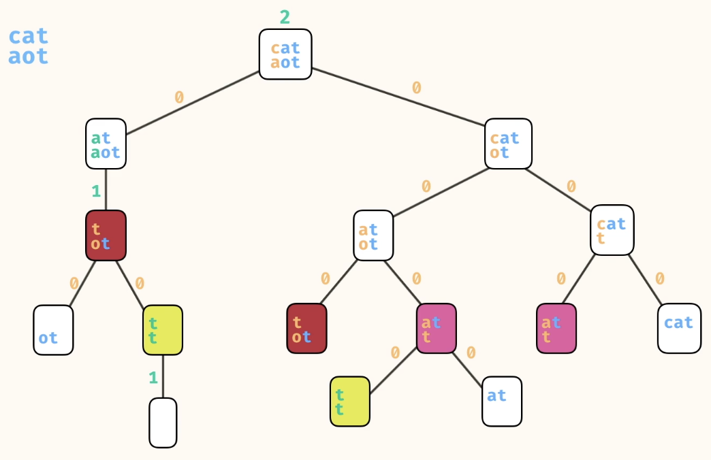.  


n = length of string 1
m = length of string 2
- Time Complexity = O(mn) as there will be max mn different nodes in the decision tree reprsenting mn different combination of strings. 
- Space Complexity = O(mn) reason same as time complexity.  


```
  public static int overlapSubsequence(String str1, String str2) {
     return overlapSubsequence (str1, str2, new HashMap<>());
  }
  
  private static int overlapSubsequence(String str1, String str2, HashMap<String,Integer> memo) {
    if (str1.length() == 0 || str2.length() == 0) return 0;

    String key = str1 + "--" + str2;
    if(memo.containsKey(key)) return memo.get(key);

    int res = 0;
    if(str1.charAt(0) == str2.charAt(0)){
      res =  1 + overlapSubsequence(str1.substring(1),str2.substring(1),memo);
    } else {
      res = Math.max(
        overlapSubsequence(str1.substring(1),str2,memo),
        overlapSubsequence(str1,str2.substring(1),memo)
      );
    }

    memo.put(key,res);
    return res;
  }
```

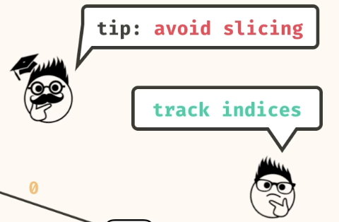

```
  public static int overlapSubsequence(String str1, String str2) {
    return overlapSubsequence(str1, str2, 0, 0, new HashMap<>());
  }
  
  public static int overlapSubsequence(String str1, String str2, int i, int j, HashMap<List<Integer>, Integer> memo) {
    if (i == str1.length() || j == str2.length()) {
      return 0;
    }
    
    List<Integer> key = List.of(i, j);
    if (memo.containsKey(key)) {
      return memo.get(key);
    }
    
    int result;
    if (str1.charAt(i) == str2.charAt(j)) {
      result = 1 + overlapSubsequence(str1, str2, i + 1, j + 1, memo);
    } else {
      result = Math.max(
        overlapSubsequence(str1, str2, i + 1, j, memo),
        overlapSubsequence(str1, str2, i, j + 1, memo)
      );
    }
    memo.put(key, result);
    return result;
  }
```

### 11. can concat

Write a method, canConcat, that takes in a string and a list of words as arguments. The method should return boolean indicating whether or not it is possible to concatenate words of the list together to form the string.

You may reuse words of the list as many times as needed.

```
Source.canConcat("oneisnone", List.of("one", "none", "is")); // -> true.  

Source.canConcat("oneisnone", List.of("on", "e", "is")); // -> false

```

#### Intuition
From the available choices, see which ons match the initial characters. If they match reduce the string by the matching characters. Keep reducing the string until it goes to empty string.If none of the options match, we get to a dead end and hence return false.   

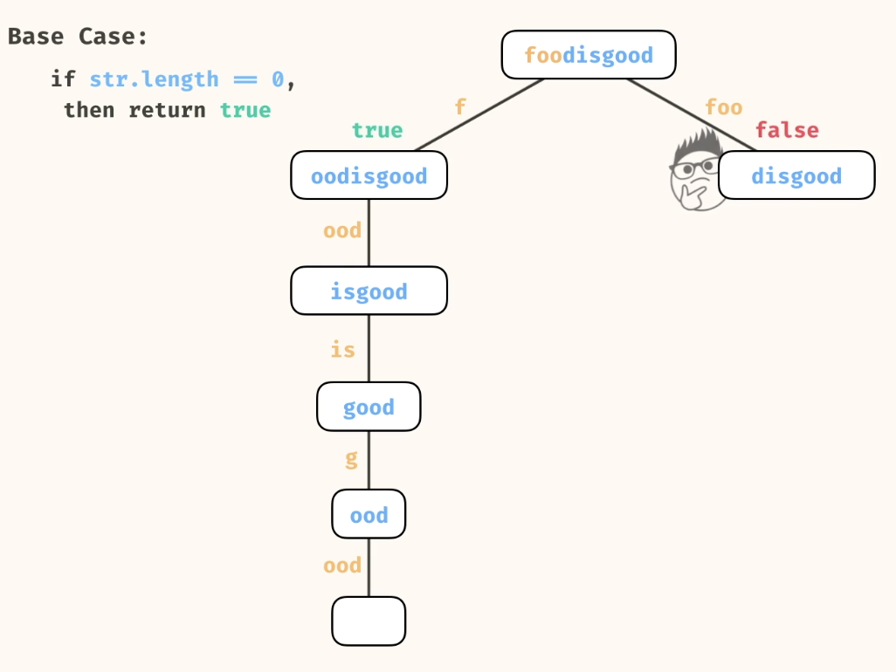

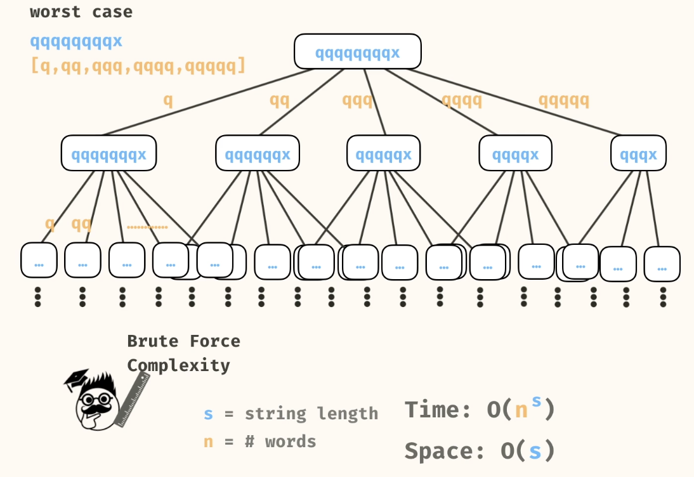.  

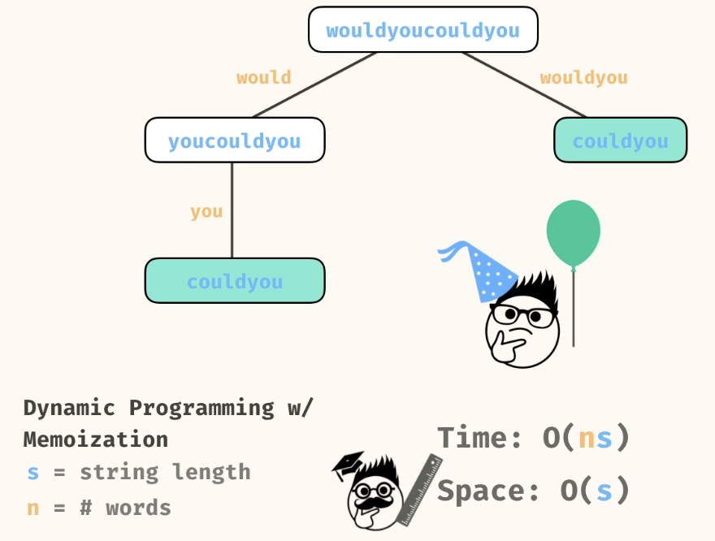.  

```
  public static boolean canConcat(String s, List<String> words) {
    return canConcat(s, words, new HashMap<>());
  }
  
  public static boolean canConcat(String s, List<String> words, HashMap<String, Boolean> memo) {
    if (s.length() == 0) {
      return true;
    }
    
    if (memo.containsKey(s)) {
      return memo.get(s);
    }
    
    for (String word : words) {
      if (s.startsWith(word)) {
        if (canConcat(s.substring(word.length()), words, memo)) {
          memo.put(s, true);
          return true;
        }
      }
    }
    memo.put(s, false);
    return false;
  }
```

### 12. quickest concat

Write a method, quickestConcat, that takes in a string and a list of words as arguments. The method should return the minimum number of words needed to build the string by concatenating words of the list. If it is not possible to build the string, then return -1.

You may use words of the list as many times as needed.

```
Source.quickestConcat("caution", List.of("ca", "ion", "caut", "ut")); // -> 2

Source.quickestConcat("caution", List.of("ion", "caut", "caution")); // -> 1
```

Base Case. 
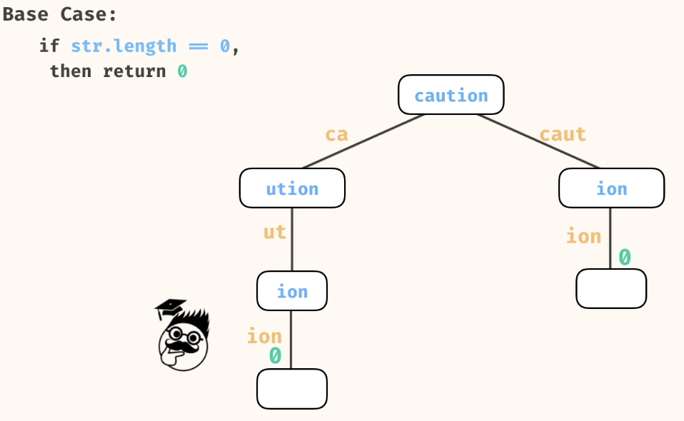

As we go up, we add 1 to the count. 
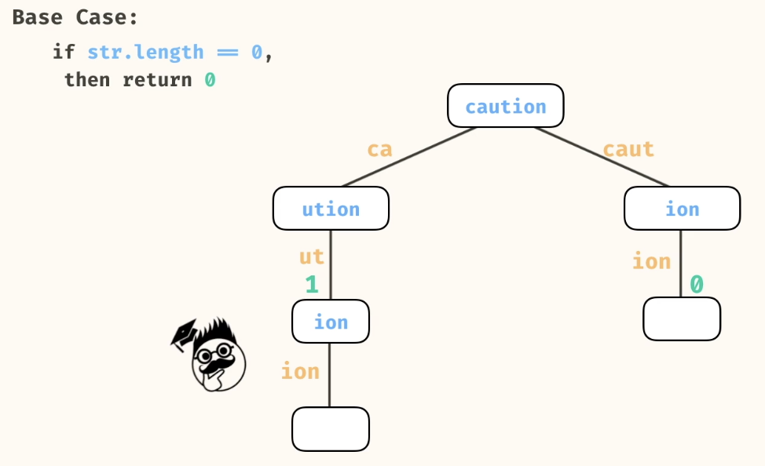.  

When we have 2 options we take the min of it, since we want to find the quickest path.  
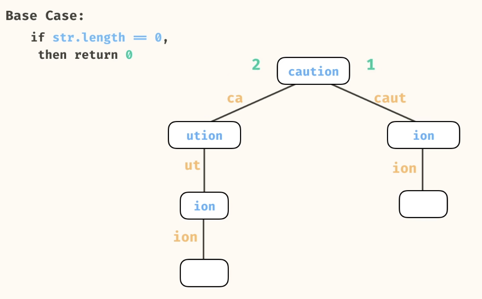.  

Memoisation.  
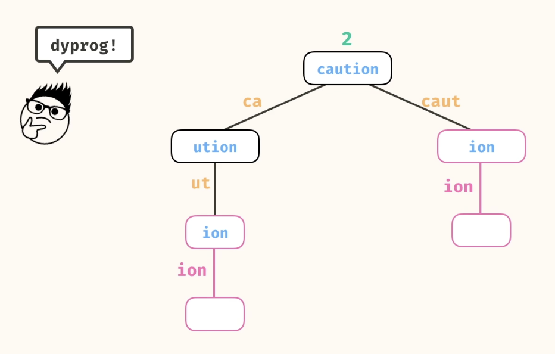.  

Space Complexity - Size of Memo - Worst case, if we keep matching a single string at each step, the depth of the tree will be equal to the height of the tree and memo needs to store all those options.

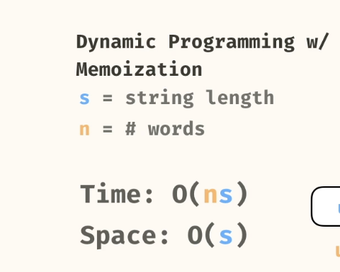.  


```
  public static int quickestConcat(String s, List<String> words) {
    double result = quickestConcat(s, words, new HashMap<>());
    if (result == Double.POSITIVE_INFINITY) {
      return -1;
    } else {
      return (int) result;
    }
  }

  public static double quickestConcat(String s, List<String> words, HashMap<String, Double> memo) {
    if (s.length() == 0) {
      return 0;
    }
    
    if (memo.containsKey(s)) {
      return memo.get(s);
    }

    double min = Double.POSITIVE_INFINITY;
    for (String word : words) {
      if (s.startsWith(word)) {
        String suffix = s.substring(word.length());
        double attempt = 1 + quickestConcat(suffix, words, memo);
        if (attempt < min) {
          min = attempt;
        }
      }
    }
    
    memo.put(s, min);
    return min;
  }

```

### 13. knightly number

A knight is on a chess board. Can you figure out the total number of ways the knight can move to a target position in exactly m moves? On a single move, the knight can move in an "L" shape; two spaces in any direction, then one space in a perpendicular direction. This means that on a single move, a knight has eight possible positions it can move to.

Write a method, knightlyNumber, that takes in 6 arguments:

n, m, kr, kc, pr, pc

    n = the length of the chess board
    m = the number of moves that must be used
    kr = the starting row of the knight
    kc = the starting column of the knight
    pr = the target row
    pc = the target column

The method should return the number of different ways the knight can move to the target in exactly m moves. The knight can revisit positions of the board if needed. The knight cannot move out-of-bounds of the board. You can assume that rows and columns are 0-indexed. This means that if n = 8, there are 8 rows and 8 columns numbered 0 to 7.

```
Source.knightlyNumber(8, 2, 4, 4, 5, 5); // -> 2
```

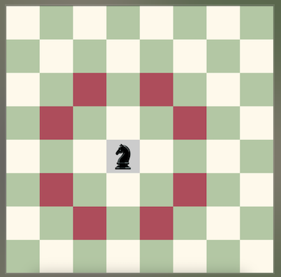.  

Notice that we want to be at the desired position in EXACTLY m MOVES.  
At every Step we have 8 options to move in eight different directions. Some of these options could result in out of chess board positions.  
When we have moved exactly m moves and we are at the desired position is when we found a way.   

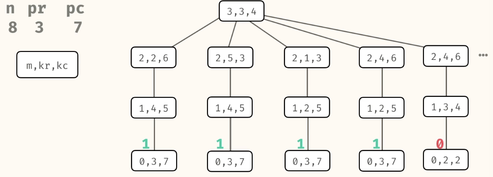.  

Memoisation.  
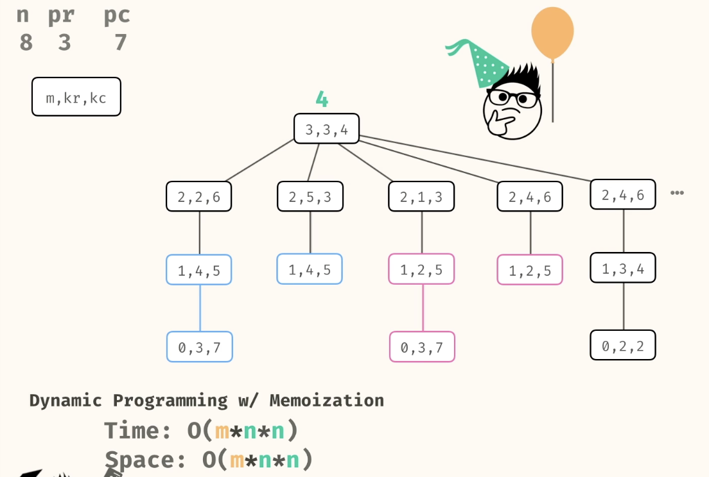.  

```
  public static int knightlyNumber(int n, int m, int kr, int kc, int pr, int pc) {
    return knightlyNumber(n, m, kr, kc, pr, pc, new HashMap<>());
  }
  
  public static int knightlyNumber(int n, int m, int kr, int kc, int pr, int pc, HashMap<List<Integer>, Integer> memo) {
    if (kr < 0 || kr >= n || kc < 0 || kc >= n) {
      return 0;
    }
    
    if (m == 0) {
      if (kr == pr && kc == pc) {
        return 1;
      } else {
        return 0;
      }
    } 
    
    List<Integer> key = List.of(m, kr, kc);
    if (memo.containsKey(key)) {
      return memo.get(key);
    }

    List<List<Integer>> deltas = List.of(
      List.of(1, 2),
      List.of(1, -2),
      List.of(-1, 2),
      List.of(-1, -2),
      List.of(2, 1),
      List.of(2, -1),
      List.of(-2, 1),
      List.of(-2, -1)
    );
    
    int total = 0;
    for (List<Integer> delta : deltas) {
      int dRow = delta.get(0);
      int dCol = delta.get(1);
      int newRow = kr + dRow;
      int newCol = kc + dCol;
      total += knightlyNumber(n, m - 1, newRow, newCol, pr, pc, memo);
    }
    
    memo.put(key, total);
    return total;
  }
```
