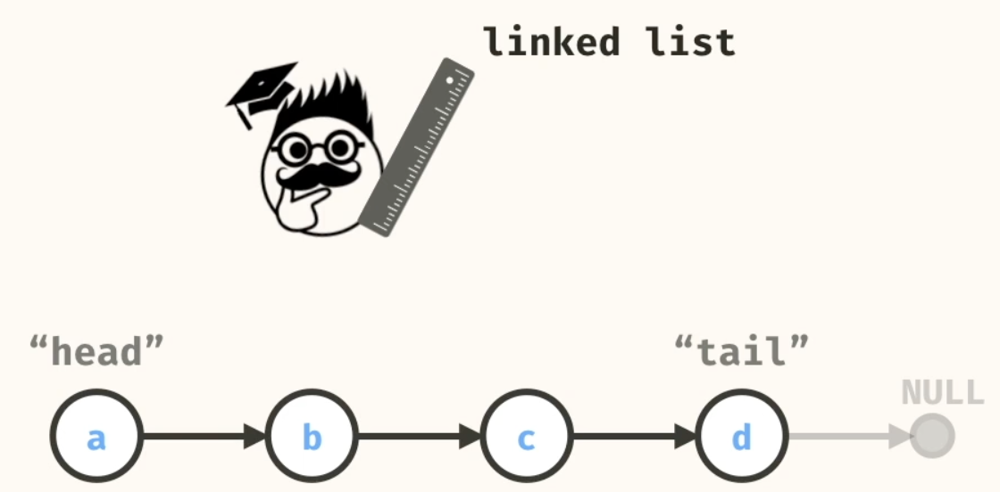
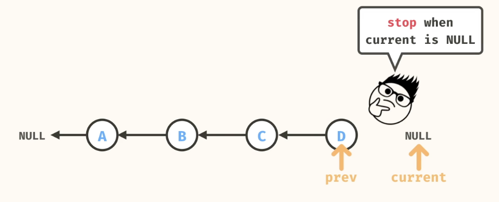
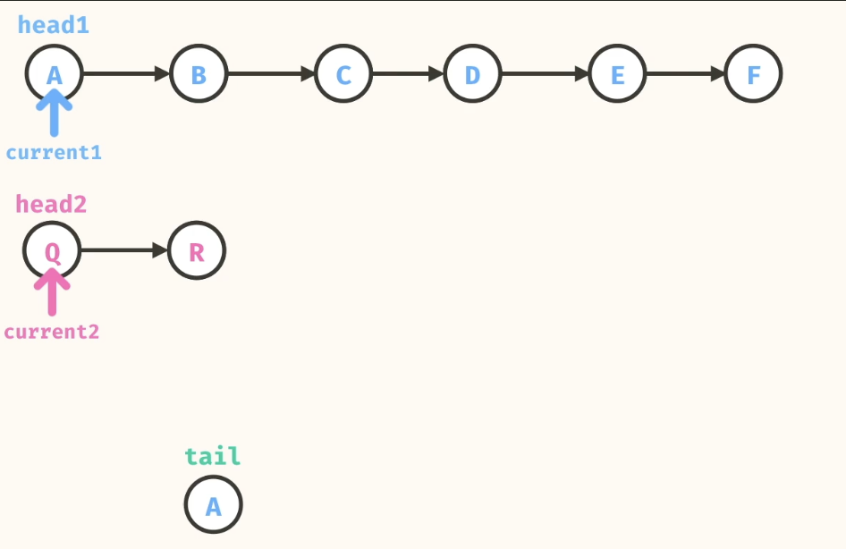
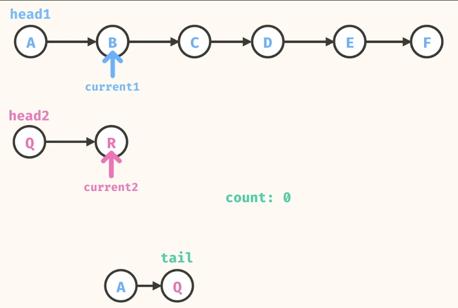
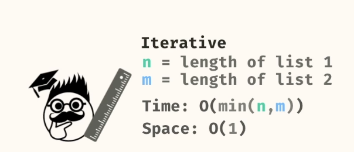
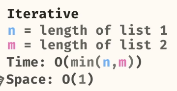
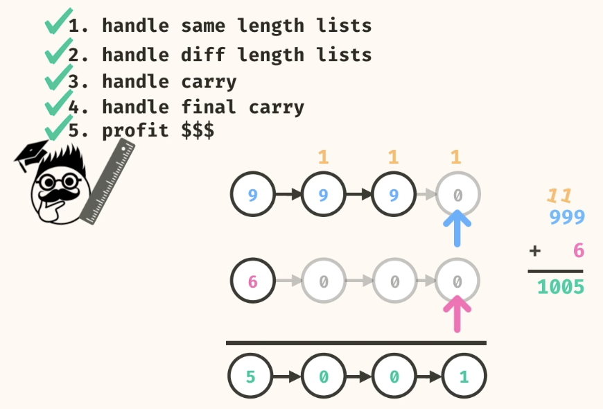

### Linked List




### Problems

#### 1. linked list values (Basic Traversal)
Write a method, linkedListValues, that takes in the head of a linked list as an argument. The method should return a List containing all values of the nodes in the linked list.

```
class Node<T> {
  T val;
  Node<T> next;
  
  public Node(T val) {
    this.val = val;
    this.next = null;
  }
}
```
```
/*Iterative*/
public static List<String> linkedListValues(Node<String> head) {
    List<String> values = new ArrayList<>();
    Node<String> current = head;
    while (current != null) {
        values.add(current.val);
        current = current.next;
    }
    return values;
}

/*Recursive*/
public static List<String> linkedListValues(Node<String> head) {
    List<String> values = new ArrayList<>();
    linkedListValues(head, values);
    return values;
  }
  
  public static void linkedListValues(Node<String> head, List<String> values) {
    if (head == null) {
      return;
    }
    values.add(head.val);
    linkedListValues(head.next, values);
  }
```

Both have 
- Time Complexity - O(n)
- Space Complexity - O(n)

#### 2. Reverse Linked List
Reverse the order of the nodes in the linked list in-place and return the new head of the reversed linked list.




##### Iterative

```
public static <T> Node<T> reverseList(Node<T> head) {
    Node<T> previous = null;
    Node<T> current = head;
    while (current != null) {
      Node<T> next = current.next;
      current.next = previous;
      previous = current;
      current = next;
    }
    return previous;
  }

```
- Time Complexity - O(n)
- Space Complexity - O(1)

##### Recursive
```
public static <T> Node<T> reverseList(Node<T> head) {
    return reverseList(head, null);
  }
  
  public static <T> Node<T> reverseList(Node<T> head, Node<T> prev) {
    if (head == null) {
      return prev;
    }
    Node<T> next = head.next;
    head.next = prev;
    return reverseList(next, head);
  }
```

- Time Complexity - O(n)
- Space Complexity - O(n)

#### 3. Zipper List
zipperLists, that takes in the head of two linked lists as arguments. The method should zipper the two lists together into single linked list by alternating nodes. If one of the linked lists is longer than the other, the resulting list should terminate with the remaining nodes. The method should return the head of the zippered linked list.

```
Node<String> a = new Node<>("a");
Node<String> b = new Node<>("b");
Node<String> c = new Node<>("c");
a.next = b;
b.next = c;
// a -> b -> c

Node<String> x = new Node<>("x");
Node<String> y = new Node<>("y");
Node<String> z = new Node<>("z");
x.next = y;
y.next = z;
// x -> y -> z

Source.zipperLists(a, x);
// a -> x -> b -> y -> c -> z
```

Maintain a counter. Dependening on the counter being odd or even take the node from list 1 or list 2






```
public static <T> Node<T> zipperLists(Node<T> head1, Node<T> head2) {
    Node<T> head = head1;
    Node<T> tail = head;
    Node<T> current1 = head1.next;
    Node<T> current2 = head2;
    
    int count = 0;
    while (current1 != null && current2 != null) {
      if (count % 2 == 0) {
        tail.next = current2;
        current2 = current2.next;
      } else {
        tail.next = current1;
        current1 = current1.next;
      }
      tail = tail.next;
      count += 1;
    }
    
    if (current1 != null) {
      tail.next = current1;
    }
    if (current2 != null) {
      tail.next = current2;
    }

    return head;
  }
  ```

  ```
  //Recursive(Not well explained in Video)
  public static <T> Node<T> zipperLists(Node<T> head1, Node<T> head2) {
    return zipperLists(head1, head2, 0);
  }
  
  public static <T> Node<T> zipperLists(Node<T> head1, Node<T> head2, int count) {
    if (head1 == null) {
      return head2;
    }
    if (head2 == null) {
      return head1;
    }
    
    if (count % 2 == 0) {
      head1.next = zipperLists(head1.next, head2, count + 1);
      return head1;
    } else {
      head2.next = zipperLists(head1, head2.next, count + 1);
      return head2;
    } 
  ```

#### 4. Merge List
takes in the head of two sorted linked lists as arguments. The method should merge the two lists together into single sorted linked list. The method should return the head of the merged linked list.
Do this in-place, by mutating the original Nodes.

```
Node<Integer> a = new Node<>(5);
Node<Integer> b = new Node<>(7);
Node<Integer> c = new Node<>(10);
Node<Integer> d = new Node<>(12);
Node<Integer> e = new Node<>(20);
Node<Integer> f = new Node<>(28);
a.next = b;
b.next = c;
c.next = d;
d.next = e;
e.next = f;
// 5 -> 7 -> 10 -> 12 -> 20 -> 28

Node<Integer> q = new Node<>(6);
Node<Integer> r = new Node<>(8);
Node<Integer> s = new Node<>(9);
Node<Integer> t = new Node<>(25);
q.next = r;
r.next = s;
s.next = t;
// 6 -> 8 -> 9 -> 25

Source.mergeLists(a, q);
// 5 -> 6 -> 7 -> 8 -> 9 -> 10 -> 12 -> 20 -> 25 -> 28 

```

We use a Dummy head as a starting point.




```
//Iterative
public static Node<Integer> mergeLists(Node<Integer> head1, Node<Integer> head2) {
    Node<Integer> dummyHead = new Node<>(0);
    Node<Integer> head = dummyHead;
    Node<Integer> current1 = head1;
    Node<Integer> current2 = head2;
    
    while (current1 != null && current2 != null) {
      if (current1.val < current2.val) {
        head.next = current1;
        current1 = current1.next;
      } else {
        head.next = current2;
        current2 = current2.next;
      }
      head = head.next;
    }
    
    if (current1 != null) {
      head.next = current1;
    }
    if (current2 != null) {
      head.next = current2;
    }
    
    return dummyHead.next;
  }
```

```
//Recursive 
public static Node<Integer> mergeLists(Node<Integer> head1, Node<Integer> head2) {
    if (head1 == null) {
      return head2;
    }
    if (head2 == null) {
      return head1;
    }
    if (head1.val < head2.val) {
      head1.next = mergeLists(head1.next, head2);
      return head1;
    } else {
      head2.next = mergeLists(head1, head2.next);
      return head2;
    }
  }
```

#### 5. Longest Streak
Write a method, longestStreak, that takes in the head of a linked list as an argument. The method should return the length of the longest consecutive streak of the same value within the list.

```
Node<Integer> a = new Node<>(5);
Node<Integer> b = new Node<>(5);
Node<Integer> c = new Node<>(7);
Node<Integer> d = new Node<>(7);
Node<Integer> e = new Node<>(7);
Node<Integer> f = new Node<>(6);

a.next = b;
b.next = c;
c.next = d;
d.next = e;
e.next = f;

// 5 -> 5 -> 7 -> 7 -> 7 -> 6

Source.longestStreak(a); // 3
```

```
public static <T> int longestStreak(Node<T> head) {
    Node<T> current = head;
    int maxStreak = 0;
    int currentStreak = 0;
    T prevVal = null;
    while (current != null) {
      if (prevVal == current.val) {
        currentStreak += 1;
      } else {
        currentStreak = 1;
      }
      if (currentStreak > maxStreak) {
        maxStreak = currentStreak;
      }
      prevVal = current.val;
      current = current.next;
    }
    return maxStreak;
  }

```


#### 6. remove node

The method should delete the node containing the target value from the linked list and return the head of the resulting linked list. If the target appears multiple times in the linked list, only remove the first instance of the target in the list.

```
public static <T> Node<T> removeNode(Node<T> head, T targetVal) {
    if (head.val == targetVal) {
      return head.next;
    }
    Node<T> prev = null;
    Node<T> current = head;
    while (current != null) {
      if (current.val == targetVal) {
        prev.next = current.next;
        break;
      } 
      prev = current;
      current = current.next;
    }
    return head;
  }
```


#### 7. insert node
The method should insert a new node with the value into the list at the specified index. Consider the head of the linked list as index 0. The method should return the head of the resulting linked list.

Look out for edge cases
- Insert node at the beginning and End of the list

```
public static <T> Node<T> insertNode(Node<T> head, T value, int index) {
    if (index == 0) {
      Node<T> newNode = new Node<>(value);
      newNode.next = head;
      return newNode;
    }
    
    Node<T> current = head;
    Node<T> prev = null;
    int count = 0;
    while (true) {
      if (count == index) {
        Node<T> newNode = new Node<>(value);
        newNode.next = prev.next;
        prev.next = newNode;
        return head;
      }
      count += 1;
      prev = current;
      current = current.next;
    }
  }
```

#### 8.create linked list
```

Source.createLinkedList(List.of("h", "e", "y"));
// h -> e -> y

```
Hint: Use the concept of Dummy Head.

```
public static <T> Node<T> createLinkedList(List<T> values) {
    Node<T> dummyHead = new Node<>(null);
    Node<T> tail = dummyHead;
    for (T val : values) {
      Node<T> newNode = new Node<>(val);
      tail.next = newNode;
      tail = newNode;
    }
    return dummyHead.next;
  }
```


#### 9.add lists
Write a method, addLists, that takes in the head of two linked lists, each representing a number. The nodes of the linked lists contain digits as values. The nodes in the input lists are reversed; this means that the least significant digit of the number is the head. The method should return the head of a new linked listed representing the sum of the input lists. The output list should have its digits reversed as well.

```
Say we wanted to compute 621 + 354 normally. The sum is 975:

   621
 + 354
 -----
   975

Then, the reversed linked list format of this problem would appear as:

    1 -> 2 -> 6
 +  4 -> 5 -> 3
 --------------
    5 -> 7 -> 9

```

Scenarios:



```
//Iterative
public static Node<Integer> addLists(Node<Integer> head1, Node<Integer> head2) {
    Node<Integer> dummyHead = new Node<>(0);
    Node<Integer> tail = dummyHead;
    Node<Integer> current1 = head1;
    Node<Integer> current2 = head2;
    int carry = 0;
    while (current1 != null || current2 != null || carry > 0) {
      int value1 = current1 == null ? 0 : current1.val;
      int value2 = current2 == null ? 0 : current2.val;
      int sum = value1 + value2 + carry; 
      int digit = sum % 10;
      carry = sum >= 10 ? 1 : 0;
      tail.next = new Node<>(digit);
      tail = tail.next;
      if (current1 != null) {
        current1 = current1.next;
      }
      if (current2 != null) {
        current2 = current2.next;
      }
    }
    return dummyHead.next;
  }
```


```
//Recursive
public static Node<Integer> addLists(Node<Integer> head1, Node<Integer> head2) {
    return addLists(head1, head2, 0);
  }
  
  public static Node<Integer> addLists(Node<Integer> head1, Node<Integer> head2, int carry) {
    if (head1 == null && head2 == null && carry == 0) {
      return null;
    }
    int value1 = head1 == null ? 0 : head1.val;
    int value2 = head2 == null ? 0 : head2.val;
    int sum = value1 + value2 + carry;
    int digit = sum % 10;
    int nextCarry = sum >= 10 ? 1 : 0;
    Node<Integer> newNode = new Node<>(digit);
    Node<Integer> next1 = head1 == null ? head1 : head1.next;
    Node<Integer> next2 = head2 == null ? head2 : head2.next;
    newNode.next = addLists(next1, next2, nextCarry);
    return newNode;
  }
```