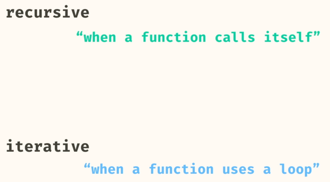
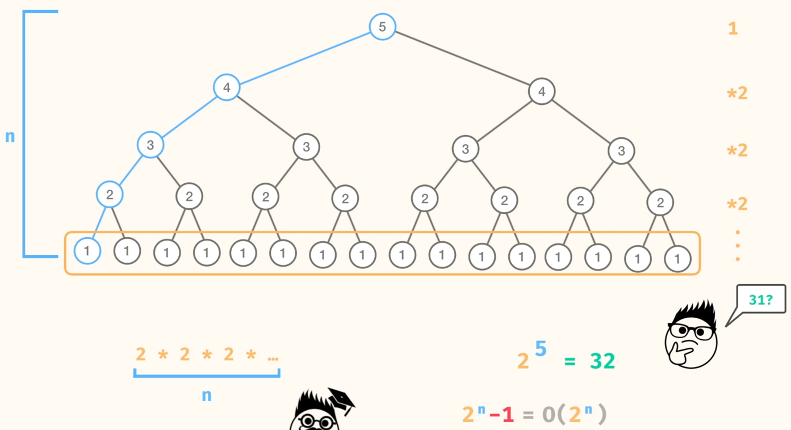
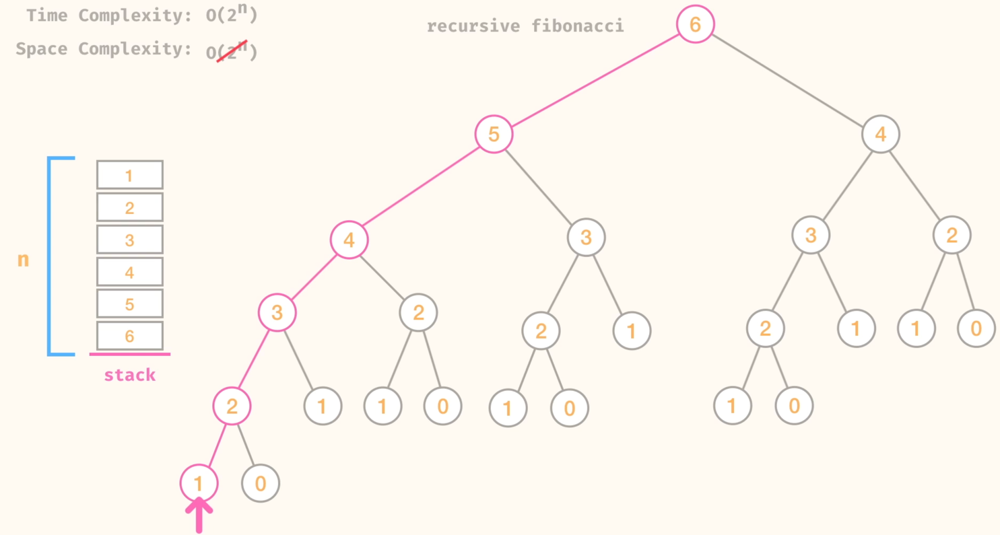

# Recursion Basics




# Problems
### 1. sum numbers recursive
method sumNumbersRecursive that takes in a list of numbers and returns the sum of all the numbers in the list

```
public static int sumNumbersRecursive(List<Integer> numbers) {
    if(numbers.size() == 0) {
      return 0;
    }
    return numbers.get(0) + sumNumbersRecursive(numbers.subList(1, numbers.size()));
}
```


Below is another solution with O(n) Time Complexity.
```
public static int sumNumbersRecursive(List<Integer> numbers) {
    
    return sumNumbersRecursive(numbers, 0);
  }

   public static int sumNumbersRecursive(List<Integer> numbers, int index) {
    if(index == numbers.size())
      return 0;
     
    return numbers.get(index) + sumNumbersRecursive(numbers , index+1);
  }
```

### 2. factorial
Write a method, factorial, that takes in a number n and returns the factorial of that number.

For example, the factorial of 6 is:
6 * 5 * 4 * 3 * 2 * 1 = 720

```
public static long factorial(int n) {
    if (n == 0) {
      return 1;
    }
    return n * factorial(n - 1);
}
```

- Time: O(n)
- Space: O(n)


### 3. sum of lengths
Write a method sumOfLengths that takes in a list of strings and returns the total length of the strings.
```
sumOfLengths(List.of("goat", "cat", "purple")); // -> 13
```
```
public static int sumOfLengths(List<String> strings) {
    return sumOfLengths(strings,0);
}

public static int sumOfLengths(List<String> strings, int index) {
  if (index == strings.size()) return 0;
    
  return (strings.get(index)).length() + sumOfLengths(strings, index+1);
}
```

### 4. Palindrome

```
 public static boolean palindrome(String s) {
    if (s.length() == 0 || s.length() == 1) {
      return true;
    }

    if (s.charAt(0) != s.charAt(s.length() - 1)) {
      return false;
    }

    return palindrome(s.substring(1, s.length() - 1));
  }
```

- Time: O(n^2)
- Space: O(n^2)

### 5. fibonacci

```
public static int fibonacci(int n) {
    if (n == 0 || n == 1) {
      return n;
    }
    return fibonacci(n - 1) + fibonacci(n - 2);
}
```

Time Complexity


Space Complexity = O(n)  
It will be the height of the recursion tree as not all recursive calls will be made in the same stack. The stack will be popped and pushed as the recursive call progresses
