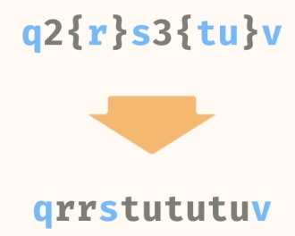
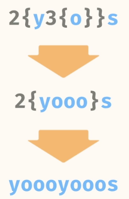
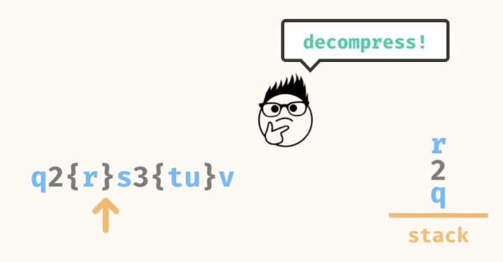
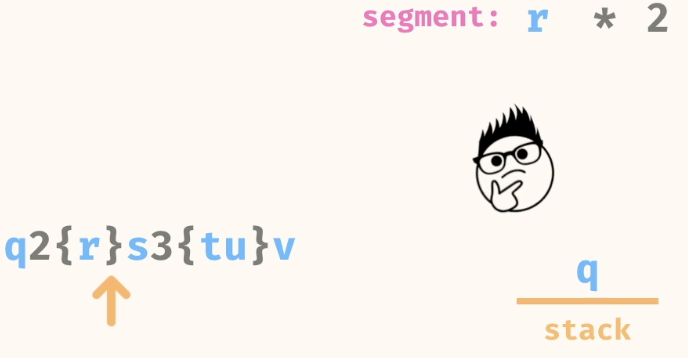
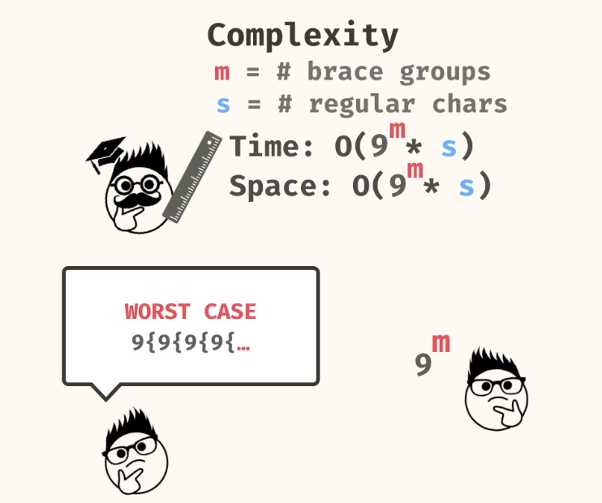
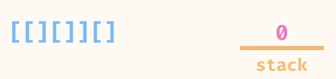
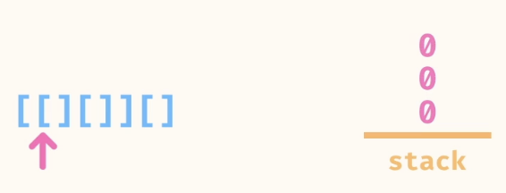
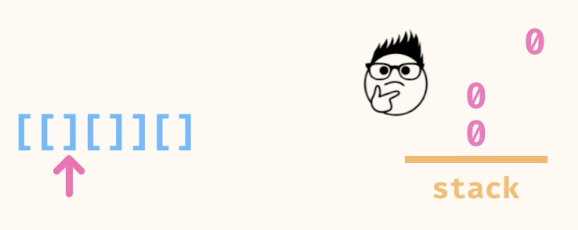
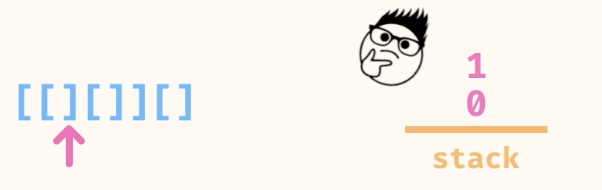
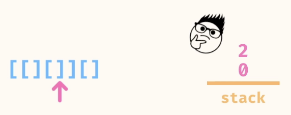

# Stacks

- [Stacks](#stacks)
  - [Problems](#problems)
    - [1. decompress braces](#1-decompress-braces)
    - [2. nesting score](#2-nesting-score)

## Problems
### 1. decompress braces

Write a method, decompressBraces, that takes in a compressed string as an argument. The method should return the string decompressed.

The compression format of the input string is 'n{subString}', where the subString within braces should be repeated n times.

You may assume that every number n is guaranteed to be an integer between 1 through 9.

You may assume that the input is valid and the decompressed string will only contain alphabetic characters.

```
Source.decompressBraces("2{q}3{tu}v"); 
// -> qqtututuv 

```





Keep ading elements to the stack until you hit a closing brace "}". When "}" is encountered, we start decompressing, but popping the elements from the stack until you find the digit. Then decompress as per the digit and the extracted string and then finally push the string to the stack.





.  

```
public static String decompressBraces(String str) {
    Stack<String> st = new Stack<>();
    Set<String> numberSet = Set.of("1","2","3","4","5","6","7","8","9");
    
    for(char c: str.toCharArray()){
      if( c == '}'){ // Decompress
          String s = "";
          while(!numberSet.contains(st.peek())){
            s = st.pop() + s ;
          }
          int number = Integer.valueOf(st.pop());
          st.push(s.repeat(number));
      }else if (c!='{'){
        st.push(String.valueOf(c));
      }
    }

    String finalString ="";
    while(!st.isEmpty()){
      finalString = st.pop() + finalString;
    }
    
    return finalString;
  }
```

### 2. nesting score

Write a method, nestingScore, that takes in a string of brackets as an argument. The method should return the score of the string according to the following rules:

    [] is worth 1 point
    XY is worth m + n points where X, Y are substrings of well-formed brackets and m, n are their respective scores
    [S] is worth 2 * k points where S is a substring of well-formed brackets and k is the score of that substring

You may assume that the input only contains well-formed square brackets.

```
Source.nestingScore("[]"); // -> 1
Source.nestingScore("[][][]"); // -> 3
Source.nestingScore("[[]]"); // -> 2
Source.nestingScore("[[][]]"); // -> 4
Source.nestingScore("[[][][]]"); // -> 6
```

We store the calculated value in the stack   
We start with a 0 value in the stack, since an empty string will result in the score to be 0.  

.  

Whenever we encounter an opening bracket '[' we push a 0 to the stack.    



When we encounter a closing bracket, we pop the element


If the popped element is 0, that means we just found a match, so we increment the top of the stack.

.  




If the popped value is not 0, that means we have encountered a nested structure, so we need to multiple the top of the stack by 2.


```
public static int nestingScore(String str) {
    Stack<Integer> stack = new Stack<>();
    stack.push(0);
    for (char ch : str.toCharArray()) {
      if (ch == '[') {
        stack.push(0);
      } else {
        int popped = stack.pop();
        if (popped == 0) {
          stack.push(stack.pop() + 1);
        } else {
          stack.push(stack.pop() + 2 * popped);
        }
      }
    }
    return stack.get(0);
  }
```

- n = length of string
- Time: O(n)
- Space: O(n)