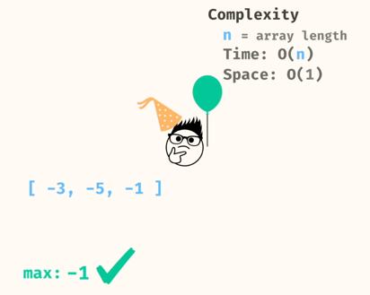
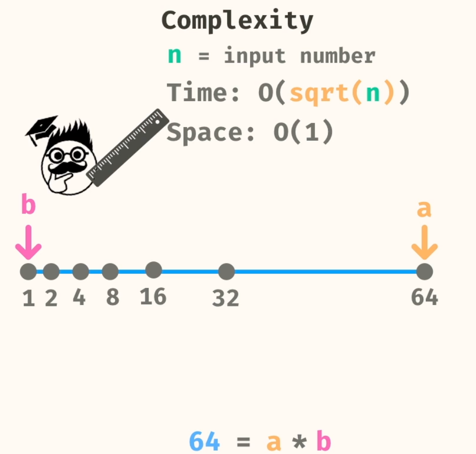

# Problems

## 1. Max Value
Find Max Value from Array.  
Make sure to initialize the max variable to a min value



```
public static double maxValue(double[] numbers) {
    double max = Double.NEGATIVE_INFINITY;
    for (double num : numbers) {
      if (num > max) {
        max = num;
      }
    }
    return max;
  }
  ```  

## 2. Is Prime
We can optimise this by just iterating till the sqrt of the number as the factors always come in pairs and they will repeat after the sqrt of the number. So till sqrt, we would have explored all possible factors of the number.



```
public static boolean isPrime(int number) {
    if (number < 2) {
      return false;
    }
    for (int i = 2; i <= Math.sqrt(number); i += 1) {
      if (number % i == 0) {
        return false;
      }
    }
    return true;
  }
  ```

