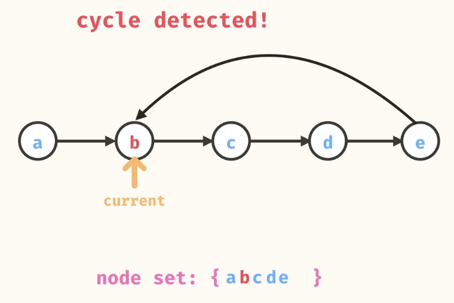
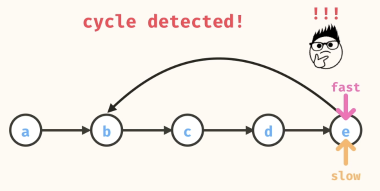
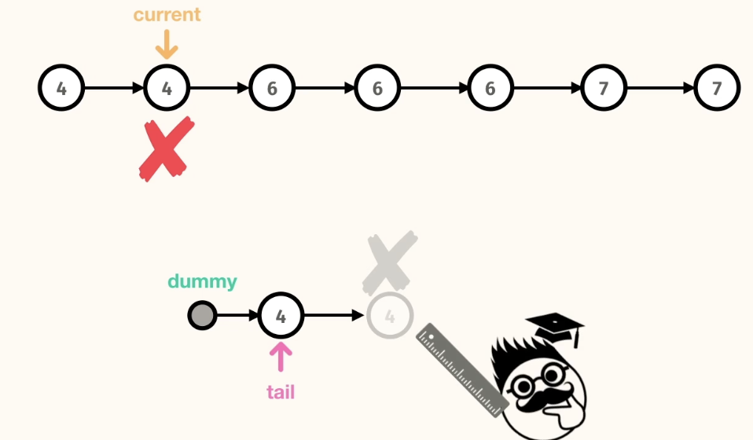
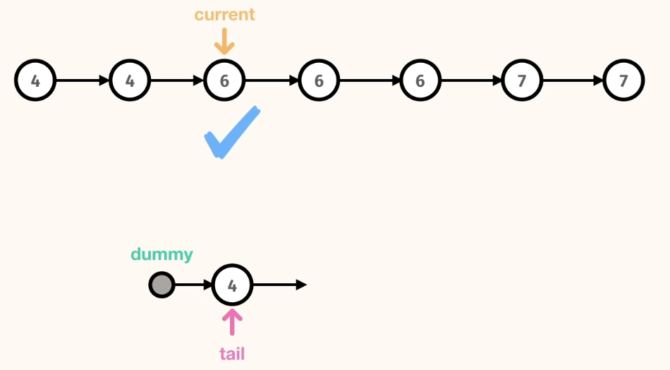
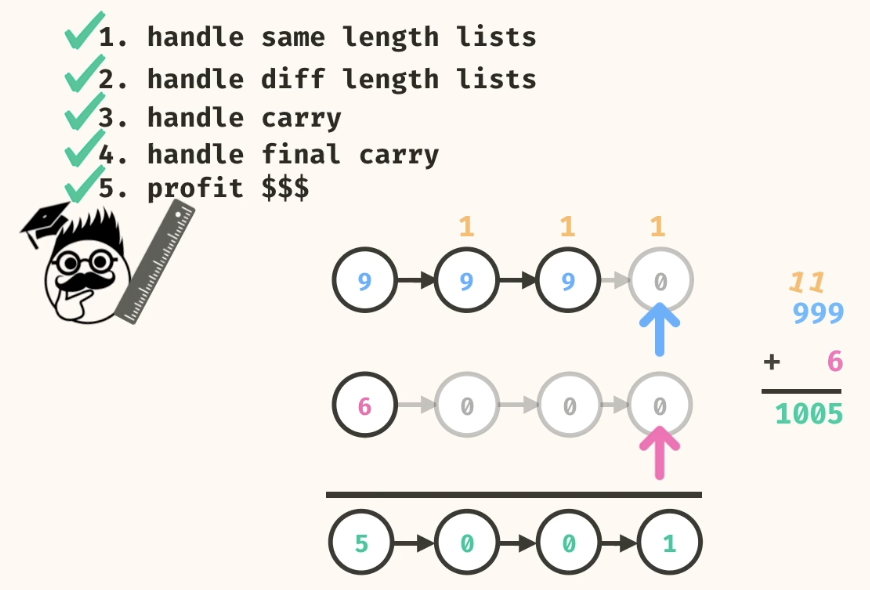
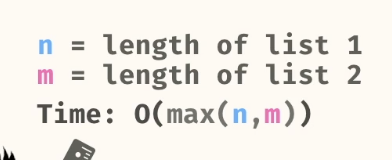

### Linked List -2

## Table of Contents
- [Problems](#problems)
    - [1.linked palindrome](#1linked-palindrome)
    - [2. Middle value in List](#2-middle-value-in-list)
    - [3. Detect Cycle](#3-detect-cycle)
    - [4. undupe sorted linked list](#4-undupe-sorted-linked-list)
    - [5. create linked list](#5-create-linked-list)
    - [6. build a queue](#6-build-a-queue)
    - [7. Add Lists](#7-add-lists)

### Problems
#### 1.linked palindrome
return a boolean indicating whether or not the linked list is a palindrome

```
// 3 -> 2 -> 7 -> 7 -> 2 -> 3
Source.linkedPalindrome(a); // true
```
----
- Reverse list and check if both lists are equal
----
Solution without using lib reverse functions
```
public static <T> boolean linkedPalindrome(Node<T> head) {
    Node<T> rev = reverseLinkedList(head);

    Node<T> l1 = head;
    Node<T> r1 = rev;

    while(l1!=null && r1!=null){
      if(l1.val != r1.val) return false;
      l1 = l1.next;
      r1 = r1.next;
    }

    return true;
  }

private static<T> Node<T> reverseLinkedList(Node<T> head){
    if (head == null) return head;

    Node<T> prev = null;
    Node<T> curr = head;

    while(curr!=null){
      Node<T> n  = curr;
      curr = curr.next;
      n.next = prev;
      prev = n;
    }

    return prev;
  }
```
----
Using lib functions

```
public static <T> boolean linkedPalindrome(Node<T> head) {
    List<T> values = new ArrayList<>();
    Node<T> current = head;
    while (current != null) {
      values.add(current.val);
      current = current.next;
    }
    List<T> copy = new ArrayList<>(values);
    Collections.reverse(copy);
    return values.equals(copy);
  }
```

```
n = number of nodes
Time: O(n)
Space: O(n)
```

#### 2. Middle value in List
Check different cases

```
// a -> b -> c -> d -> e
Source.middleValue(a); // c

// a -> b -> c -> d -> e -> f
Source.middleValue(a); // d

// x -> y 
Source.middleValue(x); // y

// q
Source.middleValue(q); // q
```
----
- Use Slow and fast pointers

```
public static <T> T middleValue(Node<T> head) {
    Node<T> slow = head;
    Node<T> fast = head;

    while(fast!=null && fast.next!=null){
      slow = slow.next;
      fast = fast.next.next;
    }
    
    return slow.val;
  }
```

```
n = number of nodes
Time: O(n)
Space: O(1)
```

#### 3. Detect Cycle
return a boolean indicating whether or not the linked list contains a cycle


1. Use Set to track visited nodes. If we visit the same node again, cycle detected.


```
public static <T> boolean linkedListCycle(Node<T> head) {
    HashSet<T> values = new HashSet<>();
    Node<T> current = head;
    while (current != null) {
      if (values.contains(current.val)) {
        return true;
      }
      values.add(current.val);
      current = current.next;
    }
    return false;
  }
```

```
n = number of nodes
Time: O(n)
Space: O(n)
```
---
2. Use Slow and fast Pointers. If there is a cycle ,at one point both pointers will collide


---
```
public static <T> boolean linkedListCycle(Node<T> head) {
    Node<T> slow = head;
    Node<T> fast = head;

    while(fast!=null && fast.next!=null){
      slow = slow.next;
      fast= fast.next.next;
      if(slow == fast) return true;
    }
    
    return false;
  }
```

```
n = number of nodes
Time: O(n)
Space: O(1)
```

#### 4. undupe sorted linked list
take in a linked list that contains values in increasing order and return a new linked list containing the original values, with duplicates removed. The relative order of values in the resulting linked list should be unchanged.

```
// 4 -> 4 -> 6 -> 6 -> 6 -> 7 -> 7

undupeSortedLinkedList(a); // 4 -> 6 -> 7
```
----
- Dummy Head is an important concept in this problem.

  



----

```
public static <T> Node<T> undupeSortedLinkedList(Node<T> head) {
    Node<T> dummyHead = new Node<T>(null);
    Node<T> tail = dummyHead;

    while(head!=null){
      if(tail.val!= head.val){
        tail.next = new Node<T>(head.val);
        tail = tail.next;
      }
      head = head.next;
    }
    return dummyHead.next;
  }
```

```
n = size of linked list
Time: O(n)
Space: O(n)
```
#### 5. create linked list
```

Source.createLinkedList(List.of("h", "e", "y"));
// h -> e -> y

```
**Hint**: Use the concept of Dummy Head.

- Iterative Solution
```
public static <T> Node<T> createLinkedList(List<T> values) {
    Node<T> dummyHead = new Node<>(null);
    Node<T> tail = dummyHead;
    for (T val : values) {
      Node<T> newNode = new Node<>(val);
      tail.next = newNode;
      tail = newNode;
    }
    return dummyHead.next;
  }
```

- Recursive Solution. 

```
public static <T> Node<T> createLinkedList(List<T> values) {
    return createLinkedList(values, 0);
  }

  private static <T> Node<T> createLinkedList(List<T> values, int i){
    if(i == values.size()) return null;

    Node<T> node = new Node<T>(values.get(i));
    node.next = createLinkedList(values,i+1);
    return node;
  }
```

```
n = size of linked list
Time: O(n)
Space: O(n)
```
#### 6. build a queue

Implement the enqueue and dequeue methods for the existing class. The enqueue method should add a given value into the queue. The dequeue should return and remove an item from the queue following first-in, first-out order.

```
Queue<String> queue = new Queue<>();
queue.enqueue("a");
queue.size(); // -> 1
queue.dequeue(); // -> a
queue.enqueue("b");
queue.enqueue("c");
queue.size(); // -> 2
queue.dequeue(); // -> b
queue.dequeue(); // -> c
queue.size(); // -> 0
```

```
static class Queue<T> {
    private Node<T> head;
    private Node<T> tail;
    private int size;

    public Queue() {
      this.head = null;
      this.tail = null;
      this.size = 0;
    }

    public int size() {
      return this.size;
    }

    public void enqueue(T val) {
      Node<T> node = new Node<T>(val);
      if(this.size == 0){
        this.head = node;
        this.tail = node;
      }else{
        tail.next = node;
        tail = tail.next;
      }
      size++;
    }

    public T dequeue() {
      if(size == 0) return null;
      T ret = head.val;
      head = head.next;
      size--;

      if (size == 0)  tail = null;  // <- Important: avoid dangling tail reference
      
      return ret;
    }
```

```
n = number of items currently on the Queue
Total Queue Space: O(n)
enqueue
    Time: O(1)
    Space: O(1)
dequeue
    Time: O(1)
    Space: O(1)

```

#### 7. add lists
Write a method, addLists, that takes in the head of two linked lists, each representing a number. The nodes of the linked lists contain digits as values. The nodes in the input lists are reversed; this means that the least significant digit of the number is the head. The method should return the head of a new linked listed representing the sum of the input lists. The output list should have its digits reversed as well.

```
Say we wanted to compute 621 + 354 normally. The sum is 975:

   621
 + 354
 -----
   975

Then, the reversed linked list format of this problem would appear as:

    1 -> 2 -> 6
 +  4 -> 5 -> 3
 --------------
    5 -> 7 -> 9

```

Scenarios:



```
//Iterative
public static Node<Integer> addLists(Node<Integer> head1, Node<Integer> head2) {
    Node<Integer> dummyHead = new Node<>(0);
    Node<Integer> tail = dummyHead;
    Node<Integer> current1 = head1;
    Node<Integer> current2 = head2;
    int carry = 0;
    while (current1 != null || current2 != null || carry > 0) {
      int value1 = current1 == null ? 0 : current1.val;
      int value2 = current2 == null ? 0 : current2.val;
      int sum = value1 + value2 + carry; 
      int digit = sum % 10;
      carry = sum >= 10 ? 1 : 0;
      tail.next = new Node<>(digit);
      tail = tail.next;
      if (current1 != null) {
        current1 = current1.next;
      }
      if (current2 != null) {
        current2 = current2.next;
      }
    }
    return dummyHead.next;
  }
```



```
//Recursive
public static Node<Integer> addLists(Node<Integer> head1, Node<Integer> head2) {
    return addLists(head1, head2, 0);
  }
  
  public static Node<Integer> addLists(Node<Integer> head1, Node<Integer> head2, int carry) {
    if (head1 == null && head2 == null && carry == 0) {
      return null;
    }
    int value1 = head1 == null ? 0 : head1.val;
    int value2 = head2 == null ? 0 : head2.val;
    int sum = value1 + value2 + carry;
    int digit = sum % 10;
    int nextCarry = sum >= 10 ? 1 : 0;
    Node<Integer> newNode = new Node<>(digit);
    Node<Integer> next1 = head1 == null ? head1 : head1.next;
    Node<Integer> next2 = head2 == null ? head2 : head2.next;
    newNode.next = addLists(next1, next2, nextCarry);
    return newNode;
  }
```