# Binary Tree 2

## Problems
- [1. Lowest Common Ancestor](#1-lowest-common-ancestor)
- [2. Flip Tree](#2-flip-tree)
- [3. Lefty Nodes](#3-lefty-nodes)
- [4. Binary Search Tree](#4-binary-search-tree)

### 1. Lowest Common Ancestor

```
//      a
//    /    \
//   b      c
//  / \      \
// d   e      f
//    / \
//    g  h

Source.lowestCommonAncestor(a, "d", "h"); // b

/*node may be considered an ancestor of itself.*/

Source.lowestCommonAncestor(a, "f", "c"); // c
```

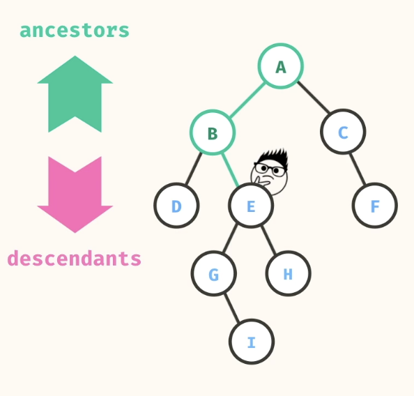

- Find Path from Both Nodes to Root
- Compare Paths from Both Nodes to Root to Find the First Common Node

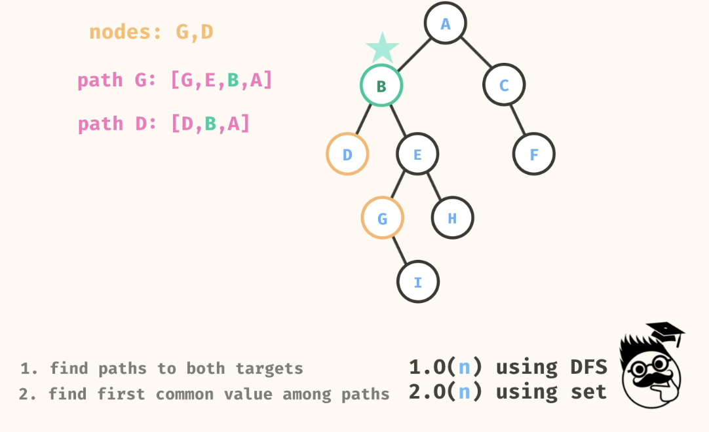

- Note how the Path is found.
- Also note the use of Set to Find the First Common Node.

```
public static String lowestCommonAncestor(Node<String> root, String val1, String val2) {
    List<String> path1 = findPath(root, val1);
    List<String> path2 = findPath(root, val2);
    HashSet<String> set2 = new HashSet<>(path2);
    for (String val : path1) {
      if (set2.contains(val)) {
        return val;
      }
    }
    return null;
  }

public static List<String> findPath(Node<String> root, String targetVal) {
    if (root == null) {
      return null;
    }
    
    if (root.val == targetVal) {
      List<String> newList = new ArrayList<>();
      newList.add(root.val);
      return newList;
    }
    
    List<String> leftPath = findPath(root.left, targetVal);
    if (leftPath != null) {
      leftPath.add(root.val);
      return leftPath;
    }
    
    List<String> rightPath = findPath(root.right, targetVal);
    if (rightPath != null) {
      rightPath.add(root.val);
      return rightPath;
    }
    
    return null;
  }  
```
---
### 2. flip tree
- Easy Problem
```
//      a
//    /    \
//   b      c
//  / \      \
// d   e      f
//    / \
//    g  h

Source.flipTree(a); 

//       a
//    /    \
//   c      b
//  /     /   \
// f     e    d
//     /  \
//    h    g
```

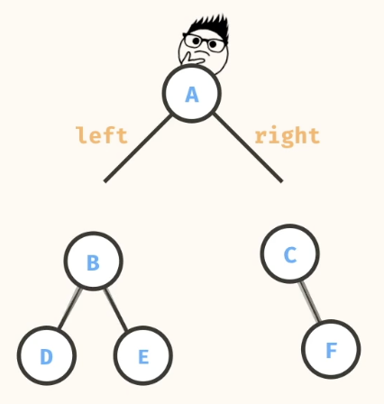 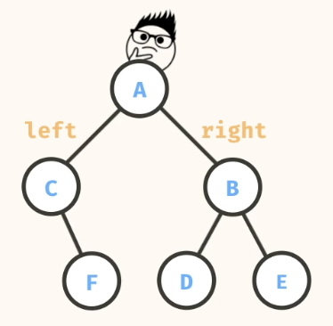

```
public static Node<String> flipTree(Node<String> root) {
    if (root == null) return null;

    Node<String> leftFlipTree = flipTree(root.left);
    Node<String> righFliptTree = flipTree(root.right);
    
    root.right = leftFlipTree;
    root.left = righFliptTree;

    return root;
  }
```

```
n = number of nodes
Time: O(n)
Space: O(n)
```
---
### 3. lefty nodes

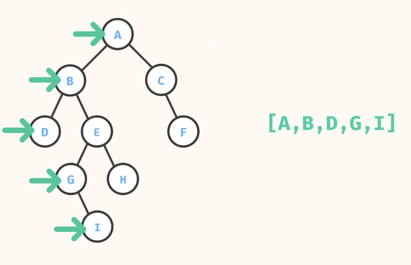

- Level Order Traversal
- Both DFS and BFS can be used.
- If using DFS, traverse from left to right, since we are looking for leftmost nodes.
- Maintin a list of leftmost nodes.

```
  public static List<String> leftyNodes(Node<String> root) {
    Map<Integer,String> levelLeftElementMap = new HashMap<>();
    getLevelLeftElement(root,0,levelLeftElementMap);
    return new ArrayList<>(levelLeftElementMap.values());
  }

  private static void getLevelLeftElement(Node<String>root,int level,Map<Integer,String> levelLeftElementMap){
    if (root == null) return;
    
    if (!levelLeftElementMap.containsKey(level)){
      levelLeftElementMap.put(level,root.val);
    }

    getLevelLeftElement(root.left,level+1,levelLeftElementMap);
    getLevelLeftElement(root.right,level+1,levelLeftElementMap);

    return;
  }
```

```
import java.util.List;
import java.util.ArrayList;

class Node<T> {
  T val;
  Node<T> left;
  Node<T> right;
  
  public Node(T val) {
    this.val = val;
    this.left = null;
    this.right = null;
  }
}

class Source {
  public static List<String> leftyNodes(Node<String> root) {
    List<String> values = new ArrayList<>();
    traverse(root, values, 0);
    return values;
  }

  public static void traverse(Node<String> root, List<String> values, int level) {
    if (root == null) {
      return;
    }
    
    if (level == values.size()) {
      values.add(root.val);
    }
    
    traverse(root.left, values, level + 1);
    traverse(root.right, values, level + 1);
  }
}
```

```
n = number of nodes
Time: O(n)
Space: O(n)
```
---
### 4. Binary Search Tree
A Binary Search Tree is a binary tree where all values within a node's left subtree are smaller than the node's value and all values in a node's right subtree are greater than or equal to the node's value.

The solution should have a best case runtime of O(log(n)).

- Easy Problem

```
//      12
//    /   \
//   5     18
//  / \     \
// 3   9     19

Source.binarySearchTreeIncludes(a, 9); // -> true
Source.binarySearchTreeIncludes(a, 15); // -> false
```

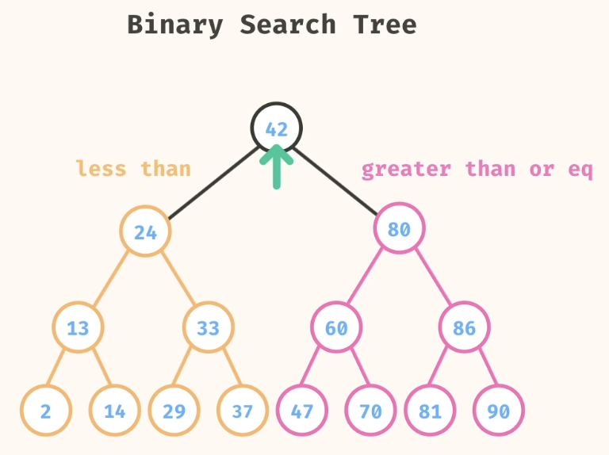

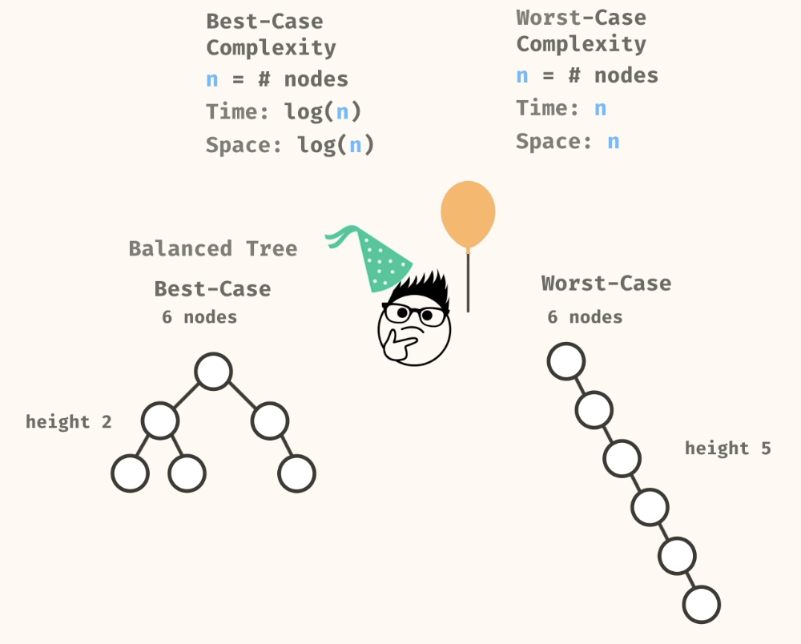

```
public static boolean binarySearchTreeIncludes(Node<Integer> root, int target) {
    if(root == null) return false;
    if (root.val == target) return true;

    if(root.val > target) 
      return binarySearchTreeIncludes(root.left,target);
    else
      return binarySearchTreeIncludes(root.right,target);
  }
```

### 5. is binary search tree
A Binary Search Tree is a binary tree where all values within a node's left subtree are smaller than the node's value and all values in a node's right subtree are greater than the node's value.

```
//      12
//    /   \
//   5     18
//  / \     \
// 3   9     19

Source.isBinarySearchTree(a); // -> true
```
**IMP CASE**
```
//      12
//    /   \
//   5     18
//  / \     \
// 3   15     19

Source.isBinarySearchTree(a); // -> false
```

- Perform an in-order traversal of the tree.
- If the values are in sorted order, then it is a binary search tree.

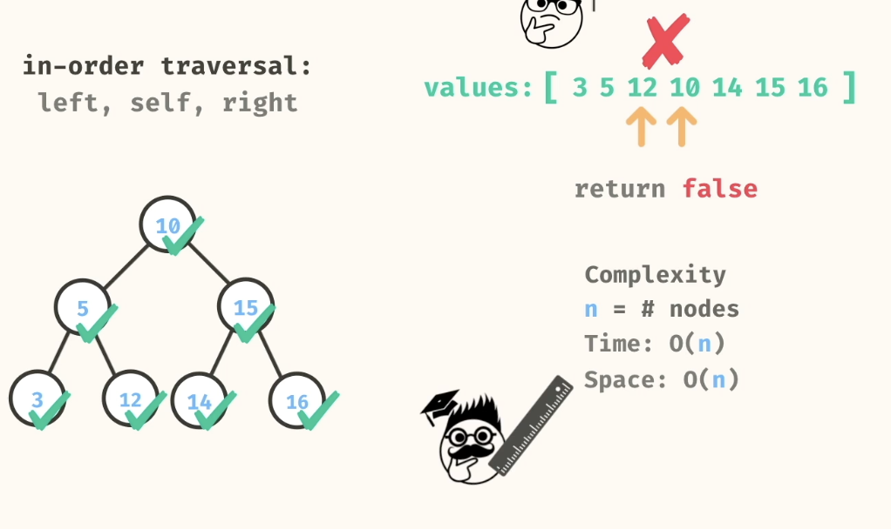
```
public static boolean isBinarySearchTree(Node<Integer> root) {
    List<Integer> values = new ArrayList<>();
    inOrderTraversal(root, values);
    for (int i = 0; i < values.size() - 1; i += 1) {
      if (values.get(i) > values.get(i + 1)) {
        return false;
      }
    }
    return true;
  }
  
  public static void inOrderTraversal(Node<Integer> root, List<Integer> values) {
    if (root == null) {
      return;
    }
    inOrderTraversal(root.left, values);
    values.add(root.val);
    inOrderTraversal(root.right, values);
  }
```

### 6. post order
Post-order traversal is when nodes are recursively visited in the order: left child, right child, self.

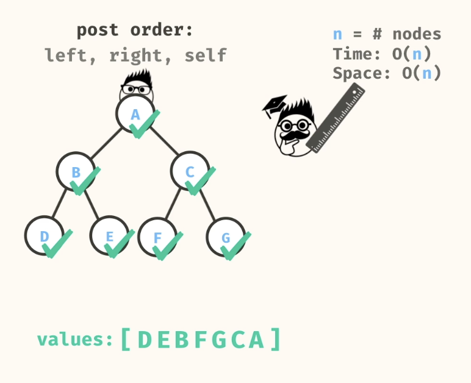

```
public static List<String> postOrder(Node<String> root) {
    List<String> postOrderList = new ArrayList<>();
    postOrderTraversal(root,postOrderList);
    return postOrderList;
  }

  private static void postOrderTraversal(Node<String> root,List<String> postOrderList){
    if(root == null) return;
    postOrderTraversal(root.left,postOrderList);
    postOrderTraversal(root.right,postOrderList);
    postOrderList.add(root.val);
  }
```

### 6.build tree in post 
***DIFFICULT PROBLEM***

Takes in a list of in-ordered values and a list of post-ordered values for a binary tree and build a binary tree that has the given in-order and post-order traversal structure. Return the root of this tree.

- Since Postorder traversal visits the root last, the last element in the post-order list is the root of the tree.
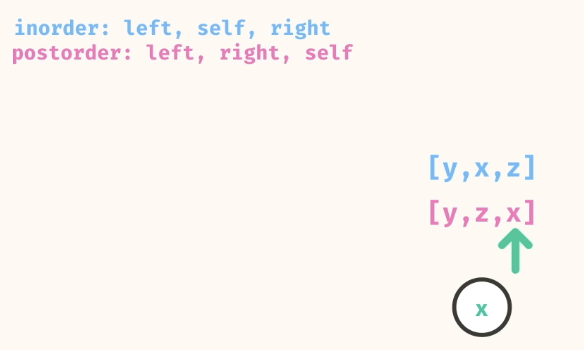

- Find the index of the root in the in-order list.
- The elements to the left of the root in the in-order list are the left subtree, and the elements to the right are the right subtree.
- The post-order list can be split into left and right subtrees based on the number of elements in the left subtree.
- Recursively build the left and right subtrees using the corresponding segments of the in-order and post-order lists.

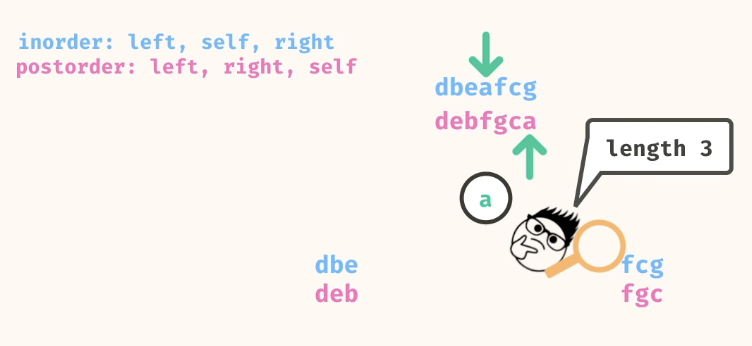

Base case: If either the in-order or post-order list is empty, return null.

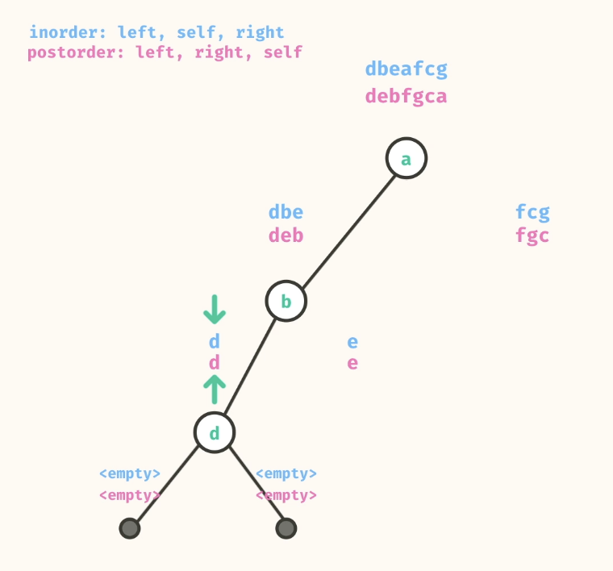
```
public static Node<String> buildTreeInPost(List<String> inOrder, List<String> postOrder) {
    if (inOrder.isEmpty() || postOrder.isEmpty()) {
      return null;
    }
    
    String rootVal = postOrder.get(postOrder.size() - 1);
    Node<String> root = new Node<>(rootVal);
    
    int rootIndex = inOrder.indexOf(rootVal);
    
    List<String> leftInOrder = inOrder.subList(0, rootIndex);
    List<String> rightInOrder = inOrder.subList(rootIndex + 1, inOrder.size());
    
    List<String> leftPostOrder = postOrder.subList(0, rootIndex);
    List<String> rightPostOrder = postOrder.subList(rootIndex, postOrder.size() - 1);
    
    root.left = buildTreeInPost(leftInOrder, leftPostOrder);
    root.right = buildTreeInPost(rightInOrder, rightPostOrder);
    
    return root;
  }
```

```
n = length of array
Time: O(n^2)
Space: O(n^2)
```

### 7. build tree in pre
***DIFFICULT PROBLEM***

Takes in a list of in-ordered values and a list of pre-ordered values for a binary tree and build a binary tree that has the given in-order and pre-order traversal structure. Return the root of this tree.

- Since Preorder traversal visits the root first, the first element in the pre-order list is the root of the tree.
- Find the index of the root in the in-order list.
- The elements to the left of the root in the in-order list are the left subtree, and the elements to the right are the right subtree.
- The pre-order list can be split into left and right subtrees based on the number of elements in the left subtree.

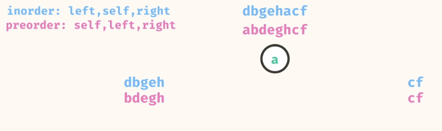

- Instead of creating subslists for the left and right subtrees, we can use indices to keep track of the segments of the lists we are currently working with.

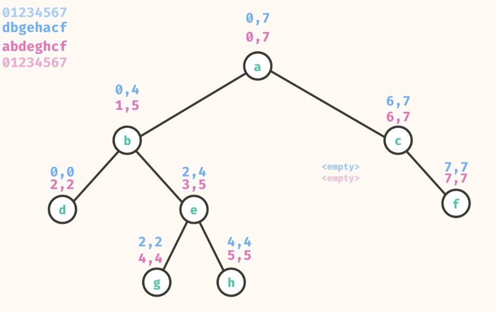

```
public static Node<String> buildTreeInPre(List<String> inOrder, List<String> preOrder) {
    if (inOrder.size()== 0 || preOrder.size() == 0) return null;
    String rootVal = preOrder.get(0);
    Node<String> root = new Node<>(rootVal);

    int mid = inOrder.indexOf(root.val);
    List<String> inOrderLeft = inOrder.subList(0,mid);
    List<String> inOrderRight = inOrder.subList(mid+1,inOrder.size());
    List<String> preOrderLeft = preOrder.subList(1,inOrderLeft.size()+1);
    List<String> preOrderRight = preOrder.subList(preOrderLeft.size()+1,preOrder.size());
    
    root.left = buildTreeInPre(inOrderLeft,preOrderLeft);
    root.right = buildTreeInPre(inOrderRight,preOrderRight);
    return root;
  }
```

```
n = length of array
Time: O(n^2)
Space: O(n^2)
```


