# Exhaustive Recursion
Problems involving all possible combinations, permutations , subsets, arrangements of a set of elements etc.

- [Problems](#problems)
  - [1. subsets](#1-subsets)
  - [2. permutations](#2-permutations)
  - [3. create combinations](#3-create-combinations)
  - [4. parenthetical possibilities](#4-parenthetical-possibilities)
  - [5. substituting synonyms](#5-substituting-synonyms)
- [Backtracking](#backtracking)

## Problems

### 1. subsets

Takes in a list as an argument and return a 2D list where each subarray represents one of the possible subsets of the list.

The elements within the subsets and the subsets themselves may be returned in any order.

You may assume that the input list contains unique elements.

```
Source.subsets(List.of("a", "b")); // ->
// [
//   [],
//   [ "b" ],
//   [ "a" ],
//   [ "a", "b" ]
// ]
```

#### Approach
- Base case - If no elements the result is [[]]
- Recursive case - we have 2 choice to be applied to the result of recursive case. We either include the current element or do not include the curent element.
- If no element - [[]]
- For 1 element. - [[][ A]]
- For 2 elements - [[] [B] [A] [A,B]]
- for 3 elements - [[] [C] [B] [B,C] [A] [A,C] [A,B] [A,B,C] ]
- Time Complexity is 2^n as we have 2 possible decisions, either we include the current element or exclude the current element. The power n comes from the height of the tree. Also by general math for a given pair of n numbers the possible no of subsets will be 2^n.

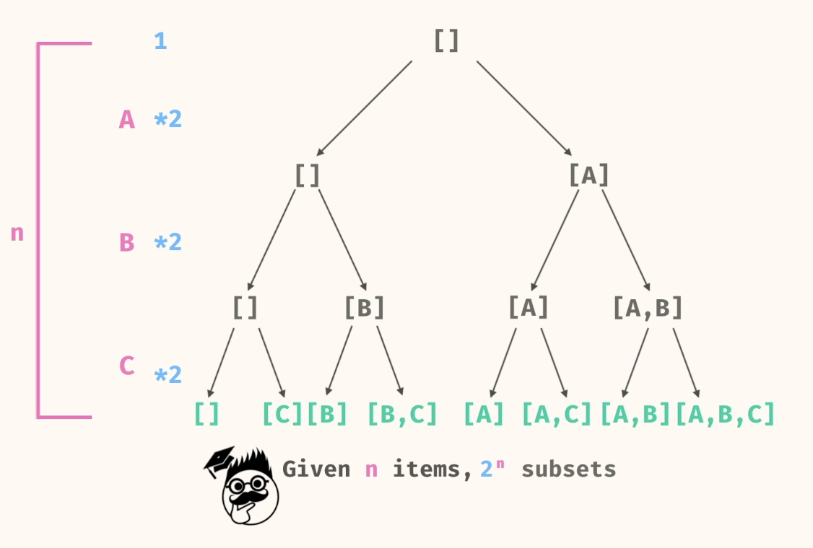

#### Code
##### Iterative
```
public static List<List<String>> subsets(List<String> elements) {
    List<List<String>> allSubsets = new ArrayList<>();
    allSubsets.add(new ArrayList<>());

    for(String ele :elements){
      getAllsubsets(ele,allSubsets);
    }
    
    return allSubsets;
  }

  private static void getAllsubsets(String element, List<List<String>> allSubsets){
      // Important to get this in a variable
      // Since the subsetSize will increase as we loop
      int size = allSubsets.size(); 
  
      for(int i = 0; i < size ; i++) {
          List<String> subsetWithElement = new ArrayList<>(allSubsets.get(i));
          subsetWithElement.add(element);
          allSubsets.add(subsetWithElement);
      }

      return;
  }
```

##### Recursive
```
public static List<List<String>> subsets(List<String> elements) {
if (elements.size() == 0) {
return List.of(List.of());
}

List<List<String>> allSubsets = new ArrayList<>();

String ele = elements.get(0);
List<List<String>> subsetsWithoutEle = subsets(elements.subList(1, elements.size()));
allSubsets.addAll(subsetsWithoutEle);

for (List<String> subsetWithout : subsetsWithoutEle) {
List<String> subsetWith = new ArrayList<>(subsetWithout);
subsetWith.add(ele);
allSubsets.add(subsetWith);
}

return allSubsets;
}
```
- n = length of elements list
- Time: ~O(2^n) 
- Space: ~O(2^n)

2^n - since  we have 2 choices for each element (include or exclude), leading to 2^n possible subsets. N comes from the height of the tree, which is equal to the number of elements in the input list.

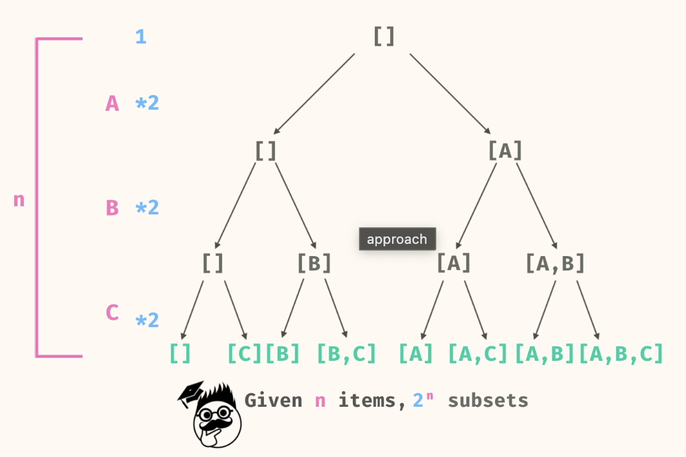

### 2. permutations

Write a method, permutations, that takes in a list an argument. The method should return a 2D list where each subarray represents one of the possible permutations of the list.

The subarrays may be returned in any order.

You may assume that the input list contains unique elements.

```
Source.permutations(List.of("a", "b", "c")); // ->
// [
//   [ "a", "b", "c" ],
//   [ "b", "a", "c" ],
//   [ "b", "c", "a" ],
//   [ "a", "c", "b" ],
//   [ "c", "a", "b" ],
//   [ "c", "b", "a" ]
// ]
```

```
Source.permutations(List.of()); // ->
// [
//  [ ]
// ]
```
#### Approach
- In this case, the choice is the order of the elements in the list. We eventually need to have all elements in the list. So at every stage of a decision tree, the branches, denote the position at which the current element can be inserted.

- Base case - If no elements the result is [[]]
- Recursive case - we insert elements at all possible positions from the result of recursive case.
- So for 1 element. [[A]]
- For 2 elemens. Insert Before A and After A.  [[B,A],[A,B]]

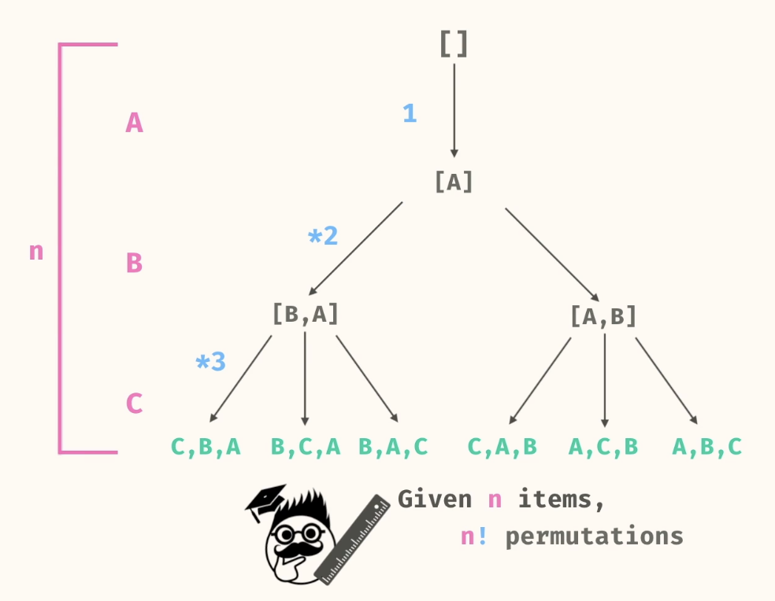

#### Code
**IMP: Check how we create Sublists using the indexes**.

##### Recursive Approach
```
public static List<List<String>> permutations(List<String> elements) {
    if (elements.size() == 0) {
      return List.of(List.of());
    }
    
    List<List<String>> allPerms = new ArrayList<>();
    String firstEle = elements.get(0);
    
    List<List<String>> subPerms = permutations(elements.subList(1, elements.size()));
    for (List<String> subPerm : subPerms) {
      for (int i = 0; i <= subPerm.size(); i += 1) {
        List<String> left = subPerm.subList(0, i);
        List<String> right = subPerm.subList(i, subPerm.size());
        List<String> newPerm = new ArrayList<>();
        newPerm.addAll(left);
        newPerm.add(firstEle);
        newPerm.addAll(right);
        allPerms.add(newPerm);
      }
    }
    
    return allPerms;
  }
```

##### Backtracking approach
- We can use backtracking to generate all permutations by keeping track of used elements and the current path.
```
public static List<List<String>> permutations(List<String> elements) {
    List<List<String>> allPermutations = new ArrayList<>();
    Set<String> usedElement = new HashSet<>();
    backtrack(elements,usedElement, new ArrayList<>(), allPermutations);
    return allPermutations;
  }

  private static void backtrack(List<String> elements,Set<String> usedElement,List<String> path, List<List<String>> allPermutations){

    if(path.size() ==  elements.size()){
      allPermutations.add(new ArrayList<>(path));
      return;
    }

    for(String element: elements){
      if(!usedElement.contains(element)){
        usedElement.add(element);
        path.add(element);
        backtrack(elements,usedElement,path,allPermutations);
        
        path.remove(path.size()-1);
        usedElement.remove(element);
      }
    }
  }
```
- n = length of items list.
- Time: ~O(n!).
- Space: ~O(n!)

### 3. create combinations

Write a method, createCombinations, that takes in a list and a length as arguments. The method should return a 2D list representing all of the combinations of the specifized length.

The items within the combinations and the combinations themselves may be returned in any order.

You may assume that the input list contains unique elements and 1 <= k <= items.length.

```
Source.createCombinations(List.of("a", "b", "c"), 2); // ->
// [
//   [ "a", "b" ],
//   [ "a", "c" ],
//   [ "b", "c" ]
// ]
```

##### Approach
For a given input we
- Remove the first element and decrease the value of K -
- We assume that this will return us the value of all subsets with value K-1 and then we can add K to all of them and then insert this to the final output.
- Remove the first element and keep the value of K same.
- With the same assumption this should already give us all subsets with length as K and hence we can simply add this to final output


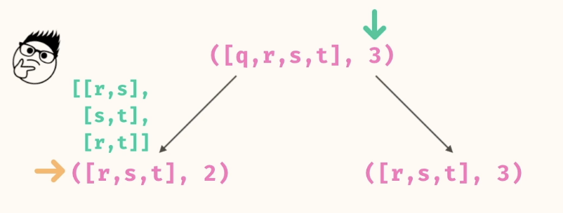.
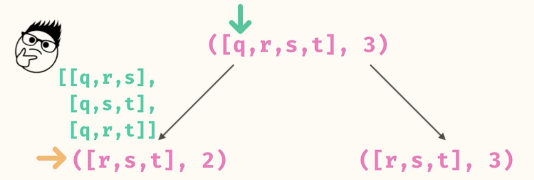

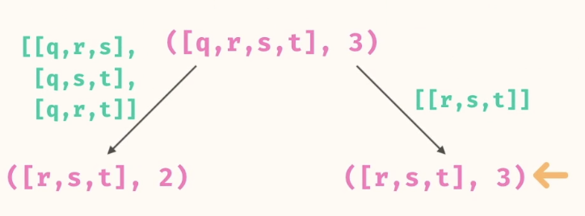

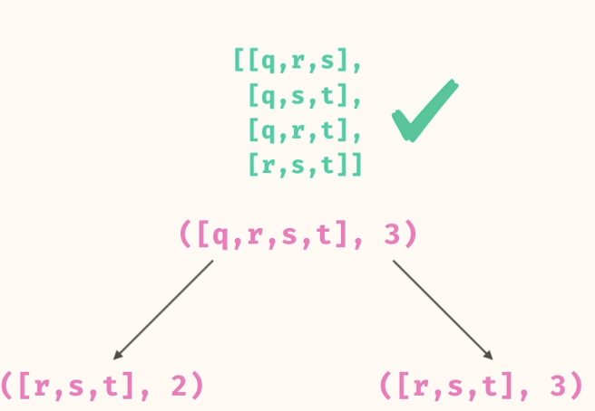

Base Case.

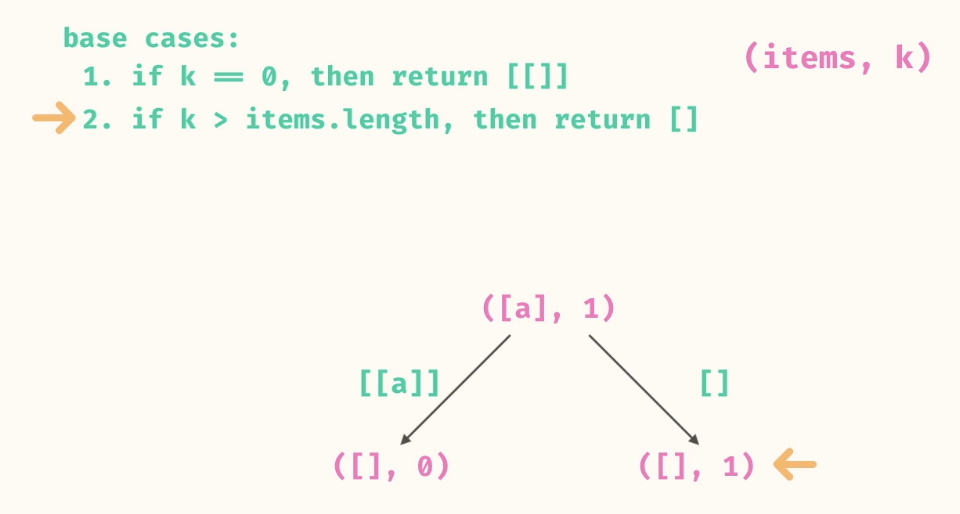

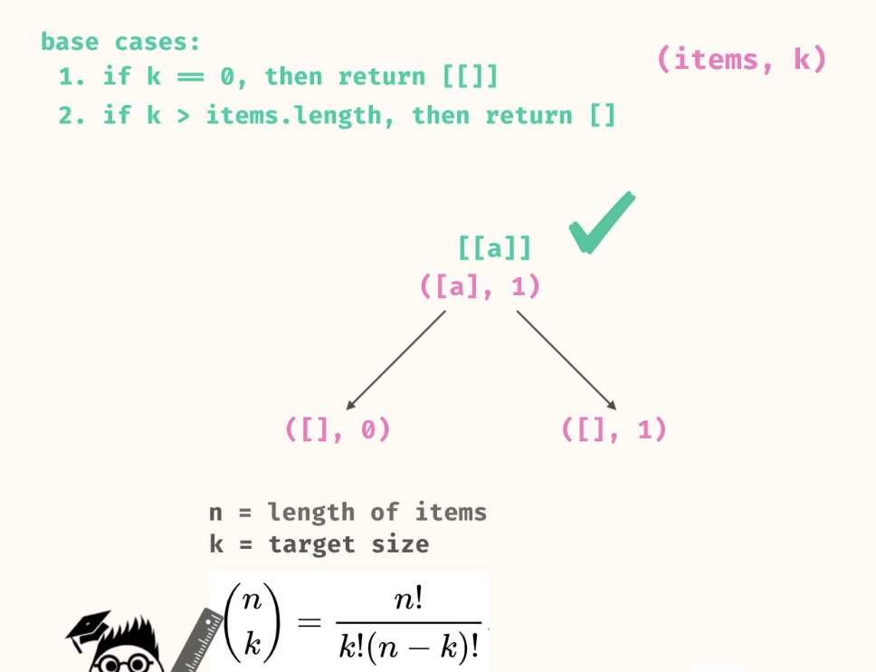

###### Code
```
public static List<List<String>> createCombinations(List<String> items, int k) {
if (k == 0) {
return List.of(List.of());
} else if (items.size() == 0) {
return List.of();
}

String ele = items.get(0);

List<List<String>> allCombos = new ArrayList<>();
for (List<String> combo : createCombinations(items.subList(1, items.size()), k - 1)) {
List<String> comboWithEle = new ArrayList<>(combo);
comboWithEle.add(ele);
allCombos.add(comboWithEle);
}

allCombos.addAll(createCombinations(items.subList(1, items.size()), k));

return allCombos;
}
```

##### Backtracking approach
- Write a new Backtrack function, which can hold the final result list and the current list. Also include the index of the list which is under consideration.
- Choose the first element and add it to the list and make recursive call by moving the index to next item.
- We assume this will give us all list includeing the first element.
- **BACKTRACK** - Once done we remove the current added element from the current list
- We ithen terate this for all elements of the list


```
[]
/             |              \
["a"]         ["b"]           ["c"]
/     \       /
["a", "b"] ["a", "c"] ["b", "c"]
```

###### Code
Code looks simple, but it is very easy to make mistakes.

```
public static List<List<String>> createCombinations(List<String> items, int k) {
    List<List<String>> res = new ArrayList<>();
    backtrack(items,k,0,new ArrayList<>(),res);
    return res;
}

private static void backtrack(List<String> items, int k, int index, List<String> combination, List<List<String>> result){
  if(combination.size() == k){
    result.add(new ArrayList<>(combination));
    return;
  }

  for(int i = index; i< items.size(); i++){
    combination.add(items.get(i));
    backtrack(items,k,i+1,combination,result);
    combination.remove(combination.size()-1);
  }
}
```

### 4. parenthetical possibilities

Write a method, parentheticalPossibilities, that takes in a string as an argument. The method should return a list containing all of the strings that could be generated by expanding all parentheses of the string into its possibilities.

```
Source.parentheticalPossibilities("x(mn)yz"); // ->
// [ "xmyz", "xnyz" ]

Source.parentheticalPossibilities("taco"); // ->
// ["taco"]


Source.parentheticalPossibilities(""); // ->
// [""]
```

We look at the front of the string.
If it is a regular character we take that character and shrink the input and then make recursive call with the shrinken input.
If the character is within the quotes '()' we branch for each character and then make the recursive call with the shrinken input.

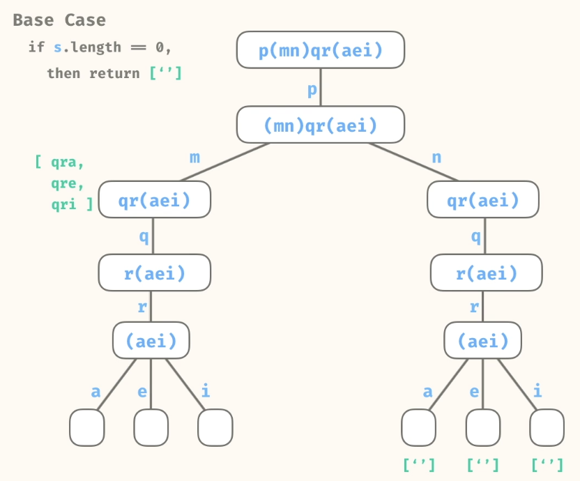

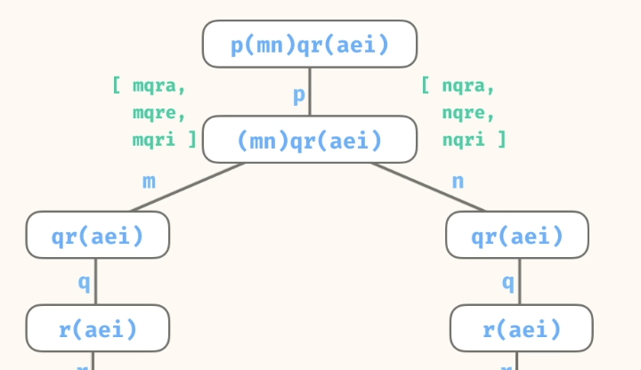

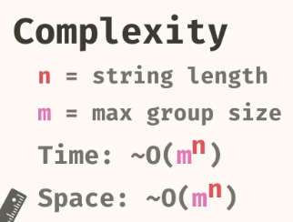


```
public static List<String> parentheticalPossibilities(String s) {
if (s.length() == 0) {
return List.of("");
}

List<String> groupInfo = parseGroup(s);
String group = groupInfo.get(0);
String remainder = groupInfo.get(1);

List<String> suffixes = parentheticalPossibilities(remainder);

List<String> result = new ArrayList<>();
for (char ch : group.toCharArray()) {
for (String suffix : suffixes) {
result.add(ch + suffix);
}
}

return result;
}

private static List<String> parseGroup(String s) {
if (s.charAt(0) == '(') {
int closeIndex = s.indexOf(')');
String group = s.substring(1, closeIndex);
String remainder = s.substring(closeIndex + 1, s.length());
return List.of(group, remainder);
} else {
String group = String.valueOf(s.charAt(0));
String remainder = s.substring(1, s.length());
return List.of(group, remainder);
}
}

```

parseGroup function is used to split the input string as below.
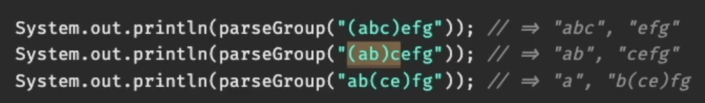

Different approach
```
public static List<String> parentheticalPossibilities(String s) {
List<String> res = new ArrayList<>();

parentheticalPossibilities("",s,0,res);

return res;
}

public static void parentheticalPossibilities(String prefix,String s,int index,List<String> res) {

if (index == s.length() ){
res.add(prefix+"");
return;
}

if(s.charAt(index) == '('){
List<Character> choices = new ArrayList<>();
index++;
while(s.charAt(index)!=')'){
choices.add(s.charAt(index));
index++;
}

for (Character choice : choices){
parenthetica
lPossibilities(prefix+choice,s,index+1,res);
}
}else{
parentheticalPossibilities(prefix+s.charAt(index),s,index+1,res);
}

return;
}
```

### 5. substituting synonyms

Write a method, substitutingSynonyms, that takes in a sentence and a map as arguments. The map contains words as keys whose values are arrays containing synonyms. The method should return a list containing all possible sentences that can be formed by substituting words of the sentence with their synonyms.

You may return the possible sentences in any order, as long as you return all of them.

```
String sentence = "follow the yellow brick road";
Map<String, List<String>> synonyms = Map.of(
"follow", List.of("chase", "pursue"),
"yellow", List.of("gold", "amber", "lemon")
);

Source.substituteSynonyms(sentence, synonyms);
// [
//   "chase the gold brick road",
//   "chase the amber brick road",
//   "chase the lemon brick road",
//   "pursue the gold brick road",
//   "pursue the amber brick road",
//   "pursue the lemon brick road"
// ]
```

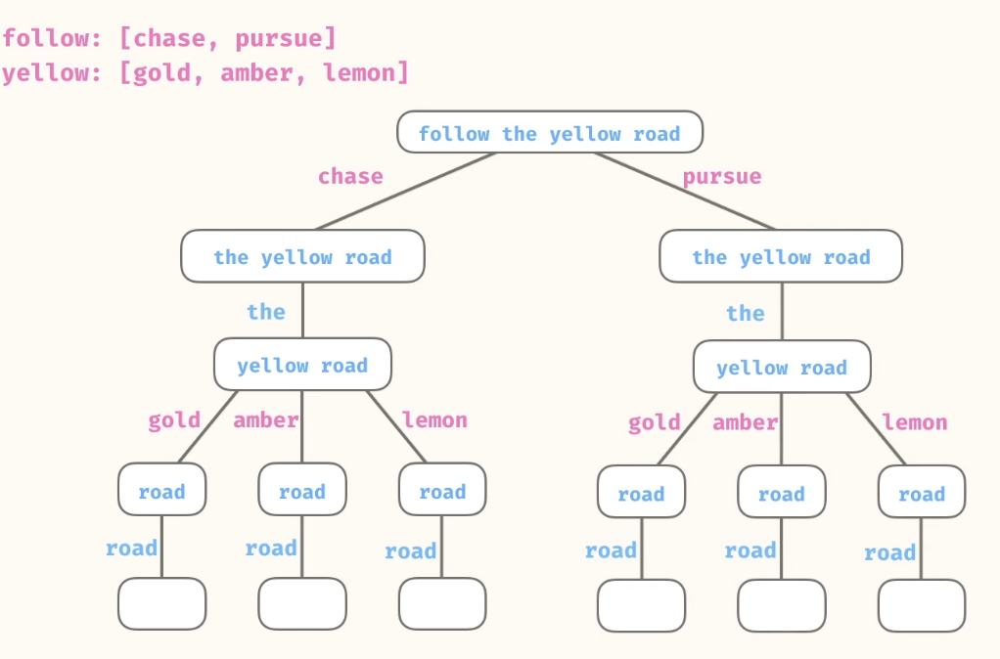.

Base case- If empty string we return empty array list.

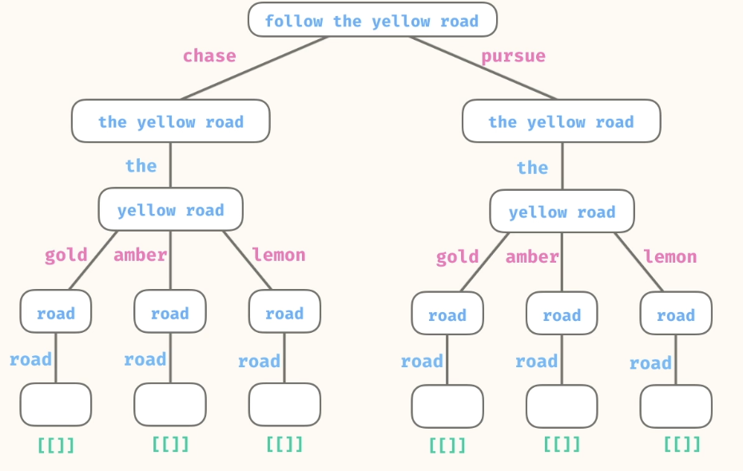

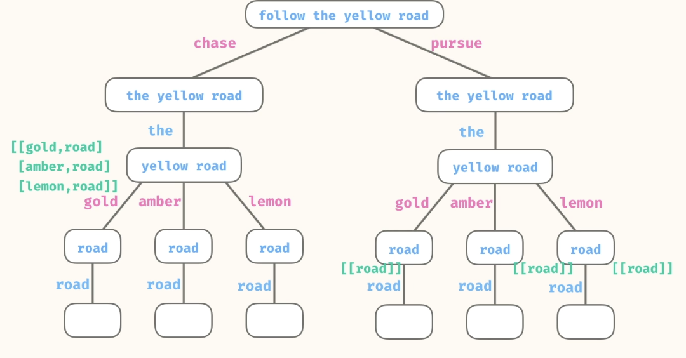

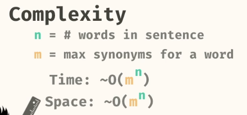

##### Code

```
public static List<String> substituteSynonyms(String sentence, Map<String, List<String>> synonyms) {
List<String> words = Arrays.asList(sentence.split(" "));
List<List<String>> lists = generate(words, synonyms);

List<String> finalSentences = new ArrayList<>();
for (List<String> list : lists) {
finalSentences.add(String.join(" ", list));
}
return finalSentences;
}

public static List<List<String>> generate(List<String> words, Map<String, List<String>> synonyms) {
if (words.size() == 0) {
return List.of(List.of());
}

String word = words.get(0);
List<List<String>> subLists = generate(words.subList(1, words.size()), synonyms);

if (synonyms.containsKey(word)) {
List<List<String>> results = new ArrayList<>();
for (String substitute : synonyms.get(word)) {
for (List<String> subList : subLists) {
List<String> result = new ArrayList<>();
result.add(substitute);
result.addAll(subList);

results.add(result);
}
}
return results;
} else {
List<List<String>> results = new ArrayList<>();
for (List<String> subList : subLists) {
List<String> result = new ArrayList<>();
result.add(word);
result.addAll(subList);

results.add(result);
}
return results;
}
}
```

#### Backtracking
- Parse the Sentence: Split the input sentence into individual words.
- Recursive Backtracking: Create combinations by substituting words with their synonyms if they exist in the map.
- Base Case: If all words have been processed, join the current combination into a sentence and store it.
- Recursive Step: For each word, check if it has synonyms in the map:
- If synonyms exist, recursively process each synonym.
- If no synonyms exist, keep the original word.
- Backtracking: Append the selected word to the current combination and remove it during backtracking to explore other options.

```
[follow]
/          \
[chase]              [pursue]
/                      \
[the]                      [the]
/                           /
[yellow]                      [yellow]
/    |    \                   /    |    \
[gold] [amber] [lemon]       [gold] [amber] [lemon]
|       |       |           |      |       |
[brick] [brick] [brick]     [brick] [brick] [brick]
|       |       |           |      |       |
[road]  [road]  [road]     [road] [road]  [road]

```
##### Code

```
public static List<String> substituteSynonyms(String sentence, Map<String, List<String>> synonyms) {
List<String> result = new ArrayList<>();
String[] words = sentence.split(" ");
backtrack(words, synonyms, 0, new ArrayList<>(), result);
return result;
}

private static void backtrack(String[] words, Map<String, List<String>> synonyms, int index,
List<String> currentCombination, List<String> result) {
if (index == words.length) {
result.add(String.join(" ", currentCombination));
return;
}

String word = words[index];
// Get synonyms or use the original word if none exist
List<String> options = synonyms.getOrDefault(word, List.of(word));

for (String option : options) {
currentCombination.add(option);
backtrack(words, synonyms, index + 1, currentCombination, result);
currentCombination.remove(currentCombination.size() - 1); // Backtrack
}
}

```