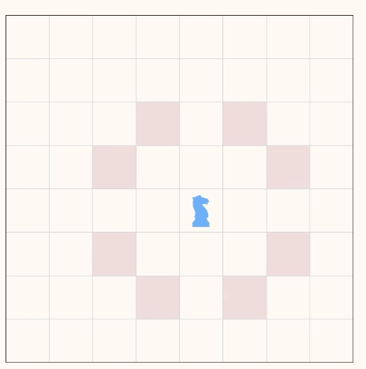
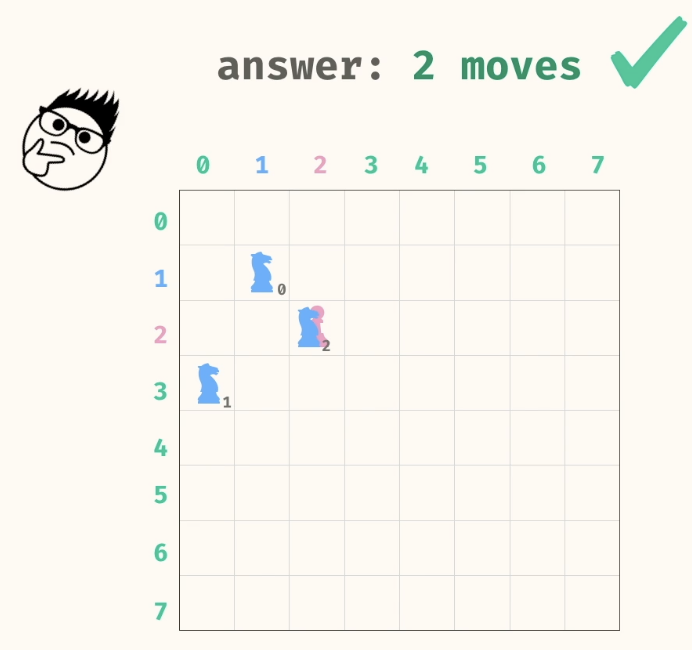
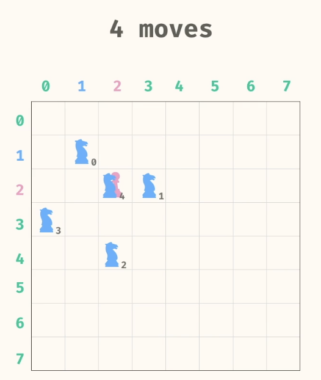
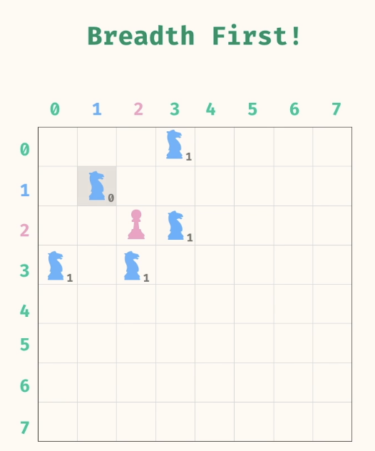
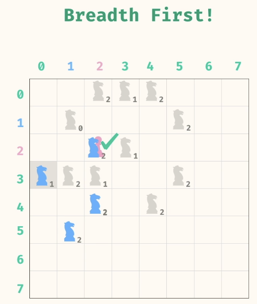
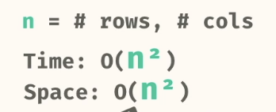

# Graph - Part 2

- [Problems](#problems)
  - [1. Knight attack](#1-knight-attack)

## Problems
### 1. Knight attack

A knight and a pawn are on a chess board. Can you figure out the minimum number of moves required for the knight to travel to the same position of the pawn? On a single move, the knight can move in an "L" shape; two spaces in any direction, then one space in a perpendicular direction. This means that on a single move, a knight has eight possible positions it can move to.

Write a method, knightAttack, that takes in 5 arguments:

n, kr, kc, pr, pc

    n = the length of the chess board
    kr = the starting row of the knight
    kc = the starting column of the knight
    pr = the row of the pawn
    pc = the column of the pawn

The method should return a number representing the minimum number of moves required for the knight to land ontop of the pawn. The knight cannot move out-of-bounds of the board. You can assume that rows and columns are 0-indexed. This means that if n = 8, there are 8 rows and 8 columns numbered 0 to 7. If it is not possible for the knight to attack the pawn, then return -1.

```
Source.knightAttack(8, 1, 1, 2, 2); // -> 2
```

Possible positions that a knight can take




Another way but not a min number


Use BFS
First move


second move from Blue node with 1


Hit the right one




```
  public static int knightAttack(int n, int kr, int kc, int pr, int pc) {
    HashSet<List<Integer>> visited = new HashSet<>();
    ArrayDeque<List<Integer>> queue = new ArrayDeque<>();
    queue.add(List.of(kr, kc, 0));
    visited.add(List.of(kr, kc));
    while (!queue.isEmpty()) {
      List<Integer> entry = queue.remove();
      int r = entry.get(0);
      int c = entry.get(1);
      int distance = entry.get(2);
      if (r == pr && c == pc) {
        return distance;
      }
      List<List<Integer>> neighbors = getKnightMoves(n, r, c);
      for (List<Integer> neighbor : neighbors) {
        if (!visited.contains(neighbor)) {
          int neighborRow = neighbor.get(0);
          int neighborCol = neighbor.get(1);
          queue.add(List.of(neighborRow, neighborCol, distance + 1));
          visited.add(neighbor);
        }
      }
    }
    return -1;
  }

  public static List<List<Integer>> getKnightMoves(int n, int r, int c) {
    List<List<Integer>> positions = List.of(
      List.of(r + 2, c + 1),
      List.of(r - 2, c + 1),
      List.of(r + 2, c - 1),
      List.of(r - 2, c - 1),
      List.of(r + 1, c + 2),
      List.of(r - 1, c + 2),
      List.of(r + 1, c - 2),
      List.of(r - 1, c - 2)
    );
    
    List<List<Integer>> inboundPositions = new ArrayList<>();
    for (List<Integer> position : positions) {
      int newRow = position.get(0);
      int newCol = position.get(1);
      
      if (0 <= newRow && newRow < n && 0 <= newCol && newCol < n) {
        inboundPositions.add(List.of(newRow, newCol));
      }
    }
    
    return inboundPositions;
  }  
```
