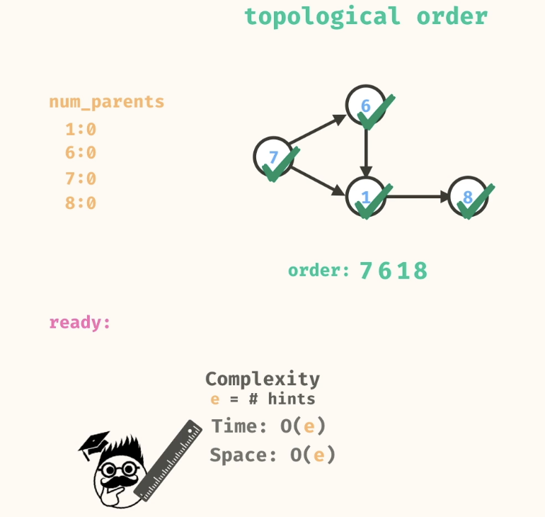

# Graph - Part 2

- [Problems](#problems)
  - [1. Knight attack](#1-knight-attack)
  - [2. can color](#2-can-color)
  - [3. tolerant teams](#3-tolerant-teams)
  - [4. rare routing](#4-rare-routing)
  - [5. Tolological Sort - DAG](#5-tolological-sort---dag)
  - [6. safe cracking](#6-safe-cracking)
  - [7. string search](#7-string-search)

## Problems
### 1. Knight attack

A knight and a pawn are on a chess board. Can you figure out the minimum number of moves required for the knight to travel to the same position of the pawn? On a single move, the knight can move in an "L" shape; two spaces in any direction, then one space in a perpendicular direction. This means that on a single move, a knight has eight possible positions it can move to.

Write a method, knightAttack, that takes in 5 arguments:

n, kr, kc, pr, pc

    n = the length of the chess board
    kr = the starting row of the knight
    kc = the starting column of the knight
    pr = the row of the pawn
    pc = the column of the pawn

The method should return a number representing the minimum number of moves required for the knight to land ontop of the pawn. The knight cannot move out-of-bounds of the board. You can assume that rows and columns are 0-indexed. This means that if n = 8, there are 8 rows and 8 columns numbered 0 to 7. If it is not possible for the knight to attack the pawn, then return -1.

```
Source.knightAttack(8, 1, 1, 2, 2); // -> 2
```

**Possible positions that a knight can take:**

<div align="center">


</div>

**Another way but not a minimum number:**

<div align="center">

</div>

**Use BFS:**

**First move:**
<div align="center">

</div>

**Second move from Blue node with 1:**
<div align="center">

</div>

**Hit the right one:**
<div align="center">

</div>

<div align="center">

</div>

```
  public static int knightAttack(int n, int kr, int kc, int pr, int pc) {
    HashSet<List<Integer>> visited = new HashSet<>();
    ArrayDeque<List<Integer>> queue = new ArrayDeque<>();
    queue.add(List.of(kr, kc, 0));
    visited.add(List.of(kr, kc));
    while (!queue.isEmpty()) {
      List<Integer> entry = queue.remove();
      int r = entry.get(0);
      int c = entry.get(1);
      int distance = entry.get(2);
      if (r == pr && c == pc) {
        return distance;
      }
      List<List<Integer>> neighbors = getKnightMoves(n, r, c);
      for (List<Integer> neighbor : neighbors) {
        if (!visited.contains(neighbor)) {
          int neighborRow = neighbor.get(0);
          int neighborCol = neighbor.get(1);
          queue.add(List.of(neighborRow, neighborCol, distance + 1));
          visited.add(neighbor);
        }
      }
    }
    return -1;
  }

  public static List<List<Integer>> getKnightMoves(int n, int r, int c) {
    List<List<Integer>> positions = List.of(
      List.of(r + 2, c + 1),
      List.of(r - 2, c + 1),
      List.of(r + 2, c - 1),
      List.of(r - 2, c - 1),
      List.of(r + 1, c + 2),
      List.of(r - 1, c + 2),
      List.of(r + 1, c - 2),
      List.of(r - 1, c - 2)
    );
    
    List<List<Integer>> inboundPositions = new ArrayList<>();
    for (List<Integer> position : positions) {
      int newRow = position.get(0);
      int newCol = position.get(1);
      
      if (0 <= newRow && newRow < n && 0 <= newCol && newCol < n) {
        inboundPositions.add(List.of(newRow, newCol));
      }
    }
    
    return inboundPositions;
  }  
```

### 2. can color
Takes in an map representing the adjacency list of an undirected graph and return a boolean indicating whether or not it is possible to color nodes of the graph using two colors in such a way that adjacent nodes are always different colors.

<div align="center">


</div>

#### Approach
- Traverse the graph using BFS or DFS
- Use a map to keep track of visited nodes and colors assigned to each node
- If I travel to a visited node, and it has a diffrent color that what I intend to color now, then return false. 
- If all nodes can be colored without conflicts, return true

<div align="center">

</div>

**DFS - Recursive**
```
public static boolean canColor(Map<String, List<String>> graph) {
    HashMap<String, Boolean> coloring = new HashMap<>();
    for (String node : graph.keySet()) {
      if (!coloring.containsKey(node) && !valid(graph, node, coloring, false)) {
        return false; 
      }
    }
    
    return true;
  }
  
  public static boolean valid(Map<String, List<String>> graph, String node, HashMap<String, Boolean> coloring, boolean currentColor) {
    if (coloring.containsKey(node)) {
      return currentColor == coloring.get(node);
    }
    
    coloring.put(node, currentColor);
    
    for (String neighbor : graph.get(node)) {
      if (!valid(graph, neighbor, coloring, !currentColor)) {
        return false;
      }
    }
    
    return true;
  }
```
**Complexity**
- n = number of nodes
- Time: O(n^2)
- Space: O(n)

### 3. tolerant teams

Takes in a list of rivalries as an argument. A rivalry is a pair of people who should not be placed on the same team. The method should return a boolean indicating whether or not it is possible to separate people into two teams, without rivals being on the same team. The two teams formed do not have to be the same size.


#### Approach
- Convert rivalries into an graph (adjacency list)

<div align="center">

</div>

- Start coloring the graph with red color. The next node is a rival, so color it blue.
- This now is the same problem as the previous one, can color.
- Bipartite graph

<div align="center">

</div>

- When travelling from seb to raj, we would want to color raj as red, but it is already colored blue, so return false.

<div align="center">

</div>

**DFS with Island hopping:**

<div align="center">

</div>

```
public static boolean tolerantTeams(List<List<String>> rivalries) {
    HashMap<String, List<String>> graph = buildGraph(rivalries);
    HashMap<String, Boolean> coloring = new HashMap<>();
    for (String node : graph.keySet()) {
      if (!coloring.containsKey(node) && !isBipartite(graph, node, coloring, false)) {
        return false;
      }
    }
    return true;
}

public static boolean isBipartite(HashMap<String, List<String>> graph, String node, HashMap<String, Boolean> coloring, boolean currentColor) {
    if (coloring.containsKey(node)) {
      return coloring.get(node) == currentColor;
    }
    
    coloring.put(node, currentColor);
    for (String neighbor : graph.get(node)) {
      if (!isBipartite(graph, neighbor, coloring, !currentColor)) {
        return false;
      }
    }
    return true;
  }
  
  public static HashMap<String, List<String>> buildGraph(List<List<String>> edges) {
    HashMap<String, List<String>> graph = new HashMap<>();
    for (List<String> pair : edges) {
      String nodeA = pair.get(0);
      String nodeB = pair.get(1);
      if (!graph.containsKey(nodeA)) {
        graph.put(nodeA, new ArrayList<>());
      }
      if (!graph.containsKey(nodeB)) {
        graph.put(nodeB, new ArrayList<>());
      }
      graph.get(nodeA).add(nodeB);
      graph.get(nodeB).add(nodeA);
    }
    return graph;
  }
```
```
e = number of rivalries
n = number of people
Time: O(e)
Space: O(n)
```
### 4.rare routing

Takes in a number of cities (n) and a two dimensional lisList.of( where each sublist represents a direct road that connects a pair of cities. The method should return a boolean indicating whether or not there exists a unique route for every pair of cities. A route is a sequence of roads that does not visit a city more than once.

Cities will be numbered 0 to n - 1.

You can assume that all roads are two-way roads. This means if there is a road between A and B, then you can use that road to go from A to B or go from B to A.

```
For example, given these roads:

0 --- 1
| \
|  \
|   \
2    3

There is a unique route for between every pair of cities.
So the answer is true.


For example, given these roads:

0 --- 1
| \
|  \
|   \
2 -- 3

There are two routes that can be used to travel from city 1 to city 2:
- first route:  1, 0, 2
- second route: 1, 0, 3, 2 
The answer is false, because routes should be unique.
```

- **One unique route between every pair of cities:**
<div align="center">

</div>

- **Multiple ways to travel from 0 to 3:**
<div align="center">

</div>

- **No way to travel from 0 to 4:**
<div align="center">

</div>

- **If I double visit a node, there must be multiple ways to travel between two nodes:**
<div align="center">

</div>

#### Approach
- Pattern - Cycle detection in undirected graph.
- Use DFS, but since its undirected, we keep track of the parent node to avoid counting the edge that leads back to the parent as a cycle.
- If we encounter a visited node that is not the parent, then we have a cycle and return false.
- If we finish traversing the graph without finding a cycle, then return true.
- Corner case - Consider cities in your graph that are not connected to any other city. 

```
public static boolean rareRouting(int n, List<List<Integer>> roads) {
    Map<Integer,List<Integer>> graph = buidGraph(n, roads);
    Set<Integer> visited = new HashSet<>();

    if(!dfs(graph,visited,0,-1)) return false;

    for(Integer node : graph.keySet()){
      if(!visited.contains(node)) return false;
    }    
    
    return true;
}

private static boolean dfs(Map<Integer,List<Integer>> graph,Set<Integer> visited,Integer node,Integer parent){
    if(visited.contains(node)) return false;

    visited.add(node);
    List<Integer> neighbours = graph.get(node);
    
    for(Integer neighbour : neighbours){
      if(neighbour != parent && !dfs(graph,visited,neighbour,node)) return false;
    }
    return true;
  }

  private static Map<Integer,List<Integer>> buidGraph(int numNodes, List<List<Integer>> edges){
   HashMap<Integer, List<Integer>> graph = new HashMap<>();
    for (int i = 0; i < numNodes; i += 1) {
      graph.put(i, new ArrayList<>());
    }
    
    for (List<Integer> pair : edges) {
      int nodeA = pair.get(0);
      int nodeB = pair.get(1);
      graph.get(nodeA).add(nodeB);
      graph.get(nodeB).add(nodeA);
    }
    return graph;
  }
```


- Time complexity:
O(n^2) - Since its undirected graph, worst case we travel every edge of the graph.
- Space complexity:
O(n^2) - For visited set and adjacency list.

### 5. Tolological Sort - DAG
The topological ordering of a graph is a sequence where "parent nodes" appear before their "children" within the sequence.

- Graph can have multiple topological orderings.
- If a graph has a cycle, then it cannot have a topological ordering.
- Topological sort is only possible for directed acyclic graphs (DAGs).

#### Approach 1 - Kahn's Algorithm - BFS
- Count the in-degree of each node.
- Initialize a queue with nodes that have an in-degree of 0.

<div align="center">

</div>

- While the queue is not empty, remove a node from the queue, add it to the topological order, and decrease the in-degree of its neighbors.

<div align="center">

</div>

- If a neighbor's in-degree becomes 0, add it to the queue.
<div align="center">

</div>

- **If the topological order contains all nodes, return it; otherwise, return an empty list indicating a cycle exists.**

```
public static List<String> topologicalOrder(Map<String, List<String>> graph) {
    Map<String, Integer> numParents = new HashMap<>();
    for (String node : graph.keySet()) {
      numParents.put(node, 0);
    }
    for (String node : graph.keySet()) {
      for (String child : graph.get(node)) {
        numParents.put(child, numParents.get(child) + 1); 
      }
    }
    
    Stack<String> ready = new Stack<>();
    for (String node : numParents.keySet()) {
      if (numParents.get(node) == 0) {
        ready.push(node);
      }
    }
    
    List<String> order = new ArrayList<>();
    while (!ready.isEmpty()) {
      String node = ready.pop();
      order.add(node);
      for (String child : graph.get(node)) {
        numParents.put(child, numParents.get(child) - 1);
        if (numParents.get(child) == 0) {
          ready.push(child);
        }
      }
    }
    
    return order;
  }
```

- e = number of edges
- n = number of nodes
- Time: O(n + e)
As we will traverse each node and edge once.
- Space: O(n)
As we store the in-degree of each node and the topological order.


#### Approach 2 - DFS
- Traverse the graph using DFS.
- Maintain a visited set to track visited nodes.
- Use a stack to store the topological order.
- If we encounter a node that is already in the stack, it indicates a cycle, and we return an empty list.
- If we finish traversing a node, we add it to the stack.
- Finally, reverse the stack to get the topological order.

```
public static List<String> topologicalOrder(Map<String, List<String>> graph) {
    Set<String> visited = new HashSet<>();
    Stack<String> st = new Stack<>();

    for(String node: graph.keySet()){
        dfs(graph,visited,st,node);
    }

    List<String> topoSort = new ArrayList<>();

    while(!st.isEmpty()){
      topoSort.add(st.pop());
    }
    return topoSort;
  }

  private static void dfs(Map<String, List<String>> graph,Set<String> visited,Stack<String> st,String node){

    if(visited.contains(node)) return;
    visited.add(node);

    for(String neighbour: graph.get(node)){
        dfs(graph,visited,st,neighbour);
    }

    st.push(node); // all children done, now push self
  }
```

### 6.safe cracking

Oh-no! You forgot the number combination that unlocks your safe. Luckily, you knew that you'd be forgetful so you previously wrote down a bunch of hints that can be used to determine the correct combination. Each hint is a pair of numbers "x, y" that indicates you must enter digit "x" before "y" (but not necessarily immediately before y).

The keypad on the safe has digits 0-9. You can assume that the hints will generate exactly one working combination and that a digit can occur zero or one time in the answer.

Write a method, safeCracking, that takes in an array of hints as an argument and determines the combination that will unlock the safe. The method should return a string representing the combination.

```
Source.safeCracking(List.of(
  List.of(7, 1),
  List.of(1, 8),
  List.of(7, 8)
)); // -> "718"
```

**Safe cracking examples:**

<div align="center">



</div>

```
public static String safeCracking(List<List<Integer>> hints) {
    
    Map<Integer,List<Integer>> graph = buildGraph(hints);
    Map<Integer, Integer> degreeMap = getDegree(graph);

    Queue<Integer> st = new ArrayDeque<>();
    for(Integer dM : degreeMap.keySet()){
      if (degreeMap.get(dM) == 0) {
        st.add(dM);
        break;
      }
    }

    StringBuffer key = new StringBuffer();
    while(!st.isEmpty()){
      Integer n = st.remove();
      key.append(n);

      for(Integer neighbour: graph.get(n)){
        degreeMap.put(neighbour, degreeMap.get(neighbour) - 1);
        if(degreeMap.get(neighbour) == 0) st.add(neighbour);
      }
    }

    return key.toString();
  }

  public static HashMap<Integer, List<Integer>> buildGraph(List<List<Integer>> edges) {
    HashMap<Integer, List<Integer>> graph = new HashMap<>();
    for (List<Integer> edge : edges) {
      int nodeA = edge.get(0);
      int nodeB = edge.get(1);
      if (!graph.containsKey(nodeA)) {
        graph.put(nodeA, new ArrayList<>());
      }
      if (!graph.containsKey(nodeB)) {
        graph.put(nodeB, new ArrayList<>());
      }
      graph.get(nodeA).add(nodeB);
    }
    return graph;
  }

  private static Map<Integer, Integer> getDegree(Map<Integer,List<Integer>> graph){
    HashMap<Integer, Integer> degreeMap = new HashMap<>();
    for (int node : graph.keySet()) {
      degreeMap.put(node, 0);
    }
    for (int node : graph.keySet()) {
      for (Integer child : graph.get(node)) {
        degreeMap.put(child, degreeMap.get(child) + 1); 
      }
    }

    return degreeMap;
  }
```

#### 7. string search

Write a method, stringSearch, that takes in a grid of letters and a string as arguments. The method should return a boolean indicating whether or not the string can be found in the grid as a path by connecting horizontal or vertical positions. The path can begin at any position, but you cannot reuse a position more than once in the path.

You can assume that all letters are lowercase and alphabetic.

<div align="center">

</div>

#### Approach
- Traverse the grid using DFS.
- For each position, check if the current letter matches the first letter of the string.
- If it matches, recursively check the neighboring positions (up, down, left, right)
- If the entire string is found, return true.
- If all positions are checked and the string is not found, return false.

<div align="center">

</div>

```
 public static boolean stringSearch(List<List<String>> grid, String s) {
    Set<List<Integer>> visited = new HashSet<>();
    
    for (int i =0 ;i< grid.size(); i++){
      for (int j =0 ;j< grid.get(i).size(); j++){
        if ((grid.get(i).get(j).charAt(0) == s.charAt(0))){
          if (isMatch(grid,visited, i, j,0,s))
            return true;
        }
      }
    }
    return false;
  }

  private static boolean isMatch(List<List<String>> grid, Set<List<Integer>> visited, int row, int col, int sIndex, String s) {
    // Base conditions
    if (row < 0 || col < 0 || row >= grid.size() || col >= grid.get(0).size()) return false;
    if (visited.contains(List.of(row, col))) return false;
    if (grid.get(row).get(col).charAt(0) != s.charAt(sIndex)) return false;
    
    // If we’ve reached the last character and it matches, return true
    if (sIndex == s.length() - 1) return true;

    // Mark this cell as visited
    visited.add(List.of(row, col));

    // Recursive DFS to 4 directions
    boolean found = isMatch(grid, visited, row - 1, col, sIndex + 1, s) ||
                    isMatch(grid, visited, row + 1, col, sIndex + 1, s) ||
                    isMatch(grid, visited, row, col - 1, sIndex + 1, s) ||
                    isMatch(grid, visited, row, col + 1, sIndex + 1, s);

    // Backtrack — unmark the visited cell
    visited.remove(List.of(row, col));

    return found;
  }
```

#### Time & Space Complexity:
- R = rows in grid
- C = columns in grid
- L = length of string s

##### Time Complexity:
- Start DFS from each cell → O(R × C)
- DFS explores up to 4 directions initially, then 3 (since one cell is already visited)
- Final: O(R × C × 3^L)
##### Space Complexity:
- Visited set: O(L)
- Recursion stack: O(L)
- Final :O(L). 
