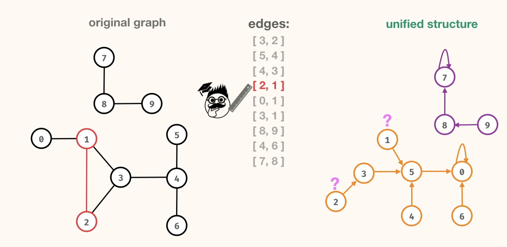

# Union Find

## Introduction

- Lets say we have an Edge list. We will be using this to create a different type of graph

- Perform the union operation on the edge. Have the second node point to the first node.(Vice-versa is also fine)

- find operation: Find the root of the node. i.e Find the node that points to itself.

- Compare with original graph. The no. of components are the same , but the connections are entirely different.

- To find the no of components, we can use the find operation on each node and count the no. of root nodes or nodes that point to themselves.
