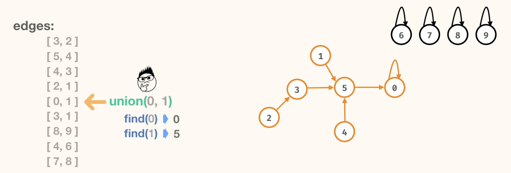

# Union Find

## Introduction


- Lets say we have an Edge list. We will be using this to create a different type of graph

- Perform the union operation on the edge. Have the second node point to the first node.(Vice-versa is also fine)


- find operation: Find the root of the node. i.e Find the node that points to itself.





- Compare with original graph. The no. of components are the same , but the connections are entirely different.


- To find the no of components, we can use the find operation on each node and count the no. of root nodes or nodes that point to themselves.

## Problems

### 1. Count components 
Takes in a number of nodes (n) and a list of edges for an undirected graph and return the number of connected components in the given graph. In the graph, nodes are labeled from 0 to n - 1. 

Approach:
- Create an array list of size = n for tracking root nodes for each node. The index will represent the node and the value at that index will represent the root of that node
- Initialize each node to point to itself.

. 

- Traverse through the edges list. For each edge, perform the union and find operation to connect the nodes.
    - Find: Traverse the root list to find the root of each node
    - Union: Set the root of the second node to the root of the first node.
    - **Update the root list accordingly**

 


- To find the number of components, iterate through the root list and count the number of unique roots (nodes that point to themselves).


```
public static int countComponents(int n, List<List<Integer>> edges) {
    List<Integer> roots = new ArrayList<>();
    
    for(int i=0;i<n;i++){
      roots.add(i);
    }

    for(List<Integer> edge: edges){
      union(roots,edge.get(0),edge.get(1));
    }

    Integer count = 0;
    
    for(int i=0;i<n;i++){
      if(i == roots.get(i)) count = count +1;
    }
    
    return count;
  }

private static void union(List<Integer> roots, Integer parent,Integer child){
    Integer parentRoot = find(roots, parent);
    Integer childRoot = find(roots, child);
    roots.set(childRoot, parentRoot);
}

private static Integer find(List<Integer> roots, Integer node){
    if (roots.get(node) ==  node) return node;
    return find(roots, roots.get(node));
}
```

### 2. union-find code II
- Same component count problem
- Optimise using **size** and **path-compression**


#### Approach:
##### Union By Size:
- Instead of just pointing the second node to the first node, we will check the size of the components and point the smaller component to the larger component.
- This helps in keeping the tree flat and optimizes the find operation.
- We will maintain a size array to keep track of the size of each component.
- When performing the union operation, we will compare the sizes of the root nodes of each node and point the smaller root to the larger root.
- Update the size of the larger root accordingly.


##### Path Compression:
- Find operation could be slow for long chains of nodes.
- To optimize this, we can use path compression.
- During the find operation, we will traverse the graph and make all nodes point directly to the root node.
- This will flatten the structure and make future find operations faster.
----
- without path compression:


- with path compression:


```
public static int countComponents(int n, List<List<Integer>> edges) {
    List<Integer> roots = new ArrayList<>();
    List<Integer> sizes = new ArrayList<>();
    
    for (int i = 0; i < n; i += 1) {
      roots.add(i);
      sizes.add(1);
    }

    for (List<Integer> edge : edges) {
      union(roots, sizes, edge.get(0), edge.get(1));
    }

    System.out.println(roots);
    int count = 0;
    for (int i = 0; i < n; i += 1) {
      if (i == roots.get(i)) {
        count += 1;
      }
    }

    return count;
  }

  private static void union(List<Integer> roots, List<Integer> sizes, int nodeA, int nodeB) {
    int rootA = find(roots, nodeA);
    int rootB = find(roots, nodeB);   

    if (rootA == rootB) {
      return;
    }

    if (sizes.get(rootA) >= sizes.get(rootB)) { // Union by size: attach smaller tree to larger tree
      roots.set(rootB, rootA);
      sizes.set(rootA, sizes.get(rootA) + sizes.get(rootB));
    } else {
      roots.set(rootA, rootB);
      sizes.set(rootB, sizes.get(rootB) + sizes.get(rootA));
    }
  }

  private static int find(List<Integer> roots, int node) {
    if (node == roots.get(node)) {
      return node;
    }

    int found = find(roots, roots.get(node));
    roots.set(node, found); // Path compression: make the node point directly to the root
    return found;
  }
```

```
n = # nodes
e = # edges
Time: O(n + e * α(n))
Space: O(n)
```