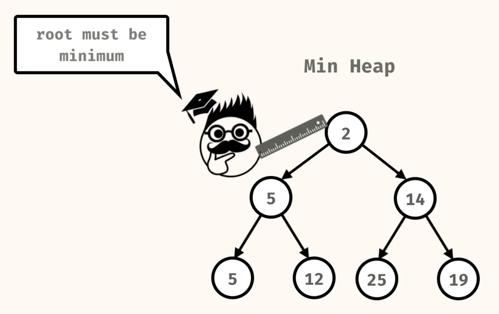
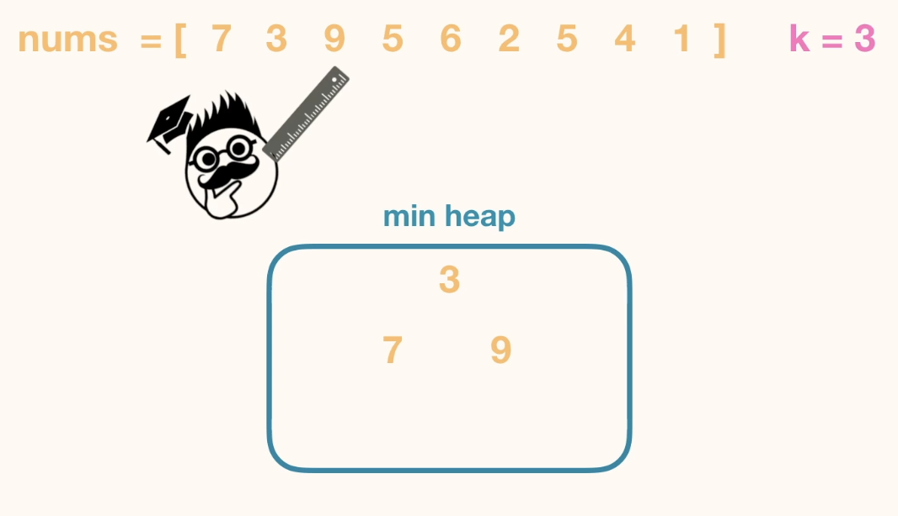

# Heaps
## Introduction
 - Binary tree data structure
 - Maintains a partial order
 - Similar to a binary search tree
 - Heap orderring is more relaxed than binary search tree ordering
 - Easier to maintain than a binary search tree, since there are less strict ordering requirements

 **MIN Heap**
 - Parent node is less than or equal to its children
 
- There is not a strict ordering between siblings. 

 

 **MAX Heap**
- Parent node is greater than or equal to its children
- The largest element is at the root

### Complete Binary Tree
- Binary  tree where every level is fully filled except possibly the last level
- The nodes in the last level are as far left as possible
- Nothing to do with values of the nodes, just the structure. 
- Complete Binary tree is Balanced and has a short efficient height.


## Problems
### 1. Heap Insertion


- Time and Space Complexity. 


- Heap Representation. 


```
//Java code for Heap Insertion
static class MinHeap {
    public List<Double> list;

    public MinHeap() {
      list = new ArrayList<>();
    }

    public int size() {
      return list.size();
    }

    public boolean isEmpty() {
      return list.size() == 0;
    }

    public void swap(int idx1, int idx2) {
      Double temp = this.list.get(idx1);
      this.list.set(idx1, this.list.get(idx2));
      this.list.set(idx2, temp);
    }

    public void siftUp(int idx) {
      int currentIdx = idx;
      while (currentIdx > 0) {
        int parentIdx = (int) Math.floor((currentIdx - 1) / 2.0);
        if (list.get(currentIdx) < list.get(parentIdx)) {
          swap(currentIdx, parentIdx);
          currentIdx = parentIdx;
        } else {
          break;
        }
      }
    }

    public void insert(Double val) {
      list.add(val);
      siftUp(list.size() - 1);
    }
```

### 2. Heap Deletion
- Min Head - extractMin()
- Max Head - extractMax()


- Root node will be the min element in the Min Heap. Remove the root node to get the min element.
. 


- Next goal is to maintain the complete tree . Hence replace it with the last element in the heap. 


- Sift Down


```
static class MinHeap {
    public List<Double> list;

    public MinHeap() {
      list = new ArrayList<>();
    }

    public int size() {
      return list.size();
    }

    public boolean isEmpty() {
      return list.size() == 0;
    }

    public void swap(int idx1, int idx2) {
      Double temp = this.list.get(idx1);
      this.list.set(idx1, this.list.get(idx2));
      this.list.set(idx2, temp);
    }

    public void siftDown(int idx) {
      int currentIdx = idx;
      while (currentIdx < this.size() - 1) {
        int leftChildIdx = currentIdx * 2 + 1;
        int rightChildIdx = currentIdx * 2 + 2;
        
        double leftChildVal = leftChildIdx >= this.size() ? Double.POSITIVE_INFINITY : this.list.get(leftChildIdx);
        double rightChildVal = rightChildIdx >= this.size() ? Double.POSITIVE_INFINITY : this.list.get(rightChildIdx);
        
        double smallerChildVal = leftChildVal < rightChildVal ? leftChildVal : rightChildVal;
        int smallerChildIdx = leftChildVal < rightChildVal ? leftChildIdx : rightChildIdx;

        if (this.list.get(currentIdx) > smallerChildVal) {
          this.swap(currentIdx, smallerChildIdx);
          currentIdx = smallerChildIdx;
        } else {
          break;
        }
      } 
    }

    public Double extractMin() {
      if (this.isEmpty()) {
        return null;
      }

      if (this.size() == 1) {
        return this.list.remove(this.list.size() - 1);
      }

      Double value = this.list.get(0);
      Double lastVal = this.list.remove(this.list.size() - 1);
      this.list.set(0, lastVal);
      this.siftDown(0);
      return value;
    }
  }
```

### 3. Kth Largest
Take in a list of numbers and a value, k and return the k-th largest element of the list.

```
kthLargest(List.of(9,2,6,6,1,5,8,7), 3); // -> 7
```

#### Solution 1 : Sorting
- Sort the list and return the k-th largest element.
.  


**Why use Heaps instead of Sorting?**.  
- Arrays are Fully Sorted,While Heap is Partially sorted and we do not need Fully sortzd array,since we only want the Kth Largest Element and no all elements
- By using Heaps, we can achieve better time complexity for this problem.

#### Solution 2 : Min Heap
- Create a min heap of size k.
- Loop through the list of numbers:
  - If the size of the min heap is less than k, insert the number into the min heap.
  - If the size of the min heap is equal to k and the current number is greater than the root of the min heap, replace the root with the current number.
- After processing all numbers, the root of the min heap will be the k-th largest element.




- Java has a built-in PriorityQueue class that can be used to implement a min heap.

```
public static int kthLargest(List<Integer> numbers, int k) {
    PriorityQueue<Integer> heap = new PriorityQueue<>();
    for(int num: numbers){
      heap.add(num);
      if(heap.size() > k) heap.poll();
    }
    return heap.poll();
  }
```

### 4.k-smallest

Takes in a list of numbers and a value, k and return the k smallest numbers in the list. The resulting list should be ordered from least to greatest.

```
kSmallest(List.of(8, 2, 7, -3, 5, 10), 3) ;
// -> [-3, 2, 5]
```

- Use a max heap to keep track of the k smallest elements.
- Loop through the list of numbers:
  - Insert the number into the max heap.
  - If the size of the max heap exceeds k, remove the root of the max heap.
- After processing all numbers, the max heap will contain the k smallest elements.
- The resulting list can be created by extracting the elemments from the max heap.The elements in this list will be in a decreasing order , since eveytime we remove the root, we are removing the largest element in the max heap.
- The resulting list can be reversed to get the elements in increasing order.


```
  public static List<Integer> kSmallest(List<Integer> numbers, int k) {
    PriorityQueue<Integer> maxHeap = new PriorityQueue<>(Comparator.reverseOrder());
    for (int num : numbers) {
      maxHeap.add(num);
      if (maxHeap.size() > k) {
        maxHeap.poll();
      }
    }
    
    List<Integer> result = new ArrayList<>();
    while (maxHeap.size() > 0) {
      result.add(maxHeap.poll());
    }
    
    Collections.reverse(result);
    return result;
  }
```