# Binary Trees

- [Binary Trees](#binary-trees)
  - [Introduction](#introduction)
  - [Problems](#problems)
    - [1. depth first values](#1-depth-first-values)
    - [2. Breadth first values](#2-breadth-first-values)
    - [3. Tree Sum](#3-tree-sum)
    - [4. Tree Min value](#4-tree-min-value)
    - [5. max root to leaf path sum](#5-max-root-to-leaf-path-sum)
    - [6. tree path finder](#6-tree-path-finder)
    - [7. Height of BT](#7-height-of-bt)
    - [8. bottom right value \[Important - LC-Medium\]](#8-bottom-right-value-important---lc-medium)
    - [9. all tree paths](#9-all-tree-paths)
    - [10. tree levels](#10-tree-levels)
    - [11. leaf list](#11-leaf-list)

## Introduction
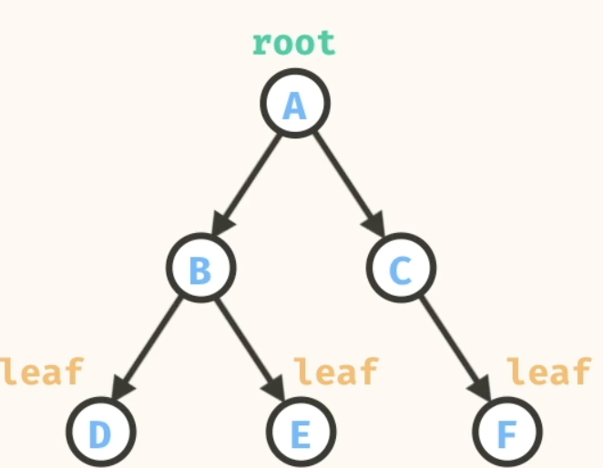

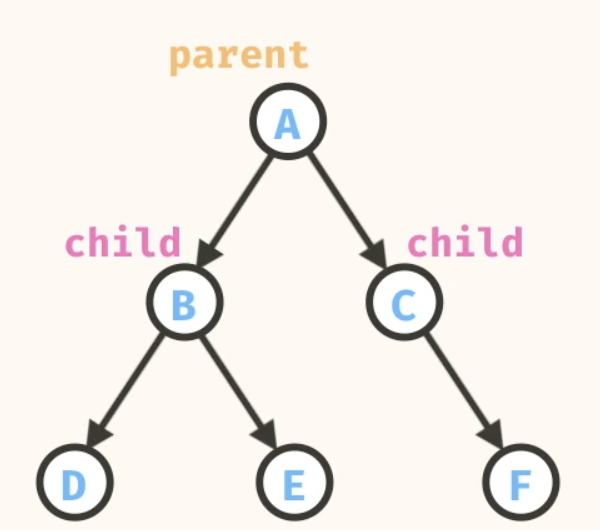

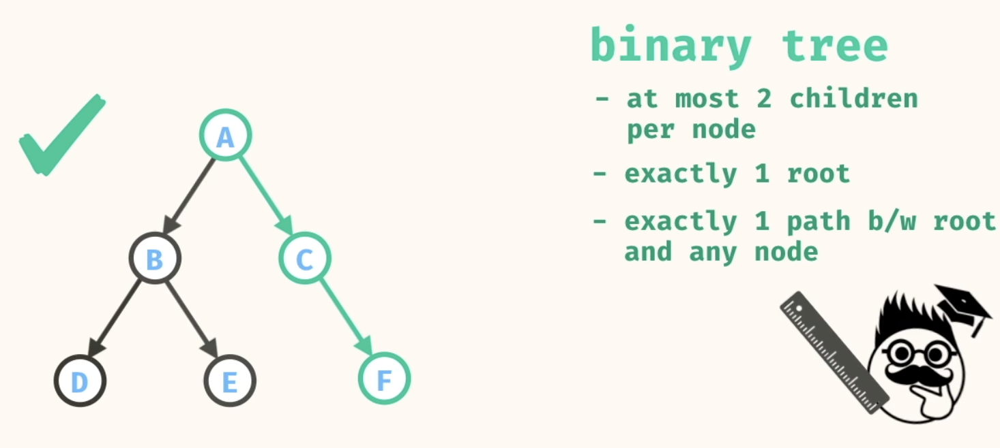

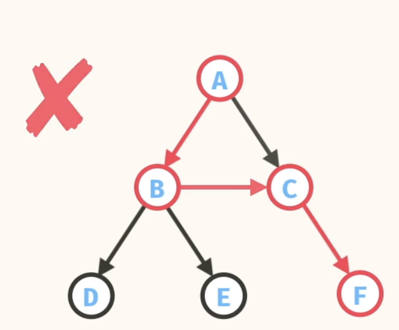

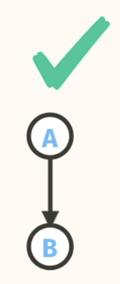  

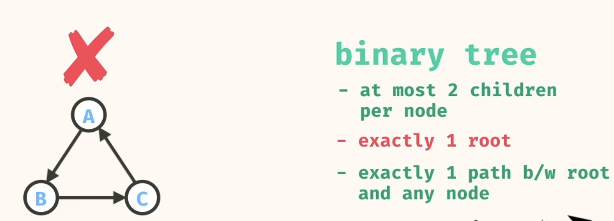

## Problems

### 1. depth first values


```
//      a
//    /   \
//   b     c
//  / \     \
// d   e     f

Source.depthFirstValues(a); 
//    -> ["a", "b", "d", "e", "c", "f"]
```

Use Stack

```
//Iterative
public static List<String> depthFirstValues(Node<String> root) {
    List<String> values = new ArrayList<>();
    Stack<Node<String>> stack = new Stack<>();

    if (root != null) {
      stack.push(root);
    }
    while (!stack.empty()) {
      Node<String> node = stack.pop();
      values.add(node.val);
      if (node.right != null) { // <--- DO NOTE We are pushing right node to stack first
        stack.push(node.right);
      }
      if (node.left != null) {
        stack.push(node.left);
      }
    }
    return values;
  }
```

- n = number of nodes
- Time: O(n)
- Space: O(n)

```
//Recursive
public static List<String> depthFirstValues(Node<String> root) {
    List<String> depthFirstValues = new ArrayList<>();
    depthFirstValues(root,depthFirstValues);
    return depthFirstValues;
  }

  public static void depthFirstValues(Node<String> root, List<String> depthFirstValues){
    if (root == null) return;
    depthFirstValues.add(root.val);
    depthFirstValues(root.left,depthFirstValues);
    depthFirstValues(root.right,depthFirstValues);
    return; 
  }
```

- n = number of nodes
- Time: O(n)
- Space: O(n)


### 2. Breadth first values

```
//      a
//    /   \
//   b     c
//  / \     \
// d   e     f

Source.breadthFirstValues(a); 
//    -> ["a", "b", "c", "d", "e", "f"]
```

USE QUEUE

```
public static List<String> breadthFirstValues(Node<String> root) {
    if (root == null) 
      return List.of();
    }
    List<String> values = new ArrayList<>();
    Queue<Node<String>> queue = new ArrayDeque<>();
    queue.add(root);
    while (!queue.isEmpty()) {
      Node<String> node = queue.remove();
      values.add(node.val);
      if (node.left != null) {
        queue.add(node.left);
      }
      if (node.right != null) {
        queue.add(node.right);
      }
    }
    return values;
  }
```

- n = number of nodes
- Time: O(n)
- Space: O(n)


  No Recursive solution

### 3. Tree Sum

Takes in the root of a binary tree that contains number values. The method should return the total sum of all values in the tree.

```
//       3
//    /    \
//   11     4
//  / \      \
// 4   -2     1

Source.treeSum(a); // -> 21
```

DFS- Recirsive

```
public static int treeSum(Node<Integer> root) {
    if(root == null) return 0;
    return root.val + treeSum(root.left) + treeSum(root.right);
}
```
- n = number of nodes
- Time: O(n)
- Space: O(n)

We can also use DFS Iterative or BFS. All solutions have the same Time and Space complexity.

### 4. Tree Min value
treeMinValue, that takes in the root of a binary tree that contains number values. The method should return the minimum value within the tree.

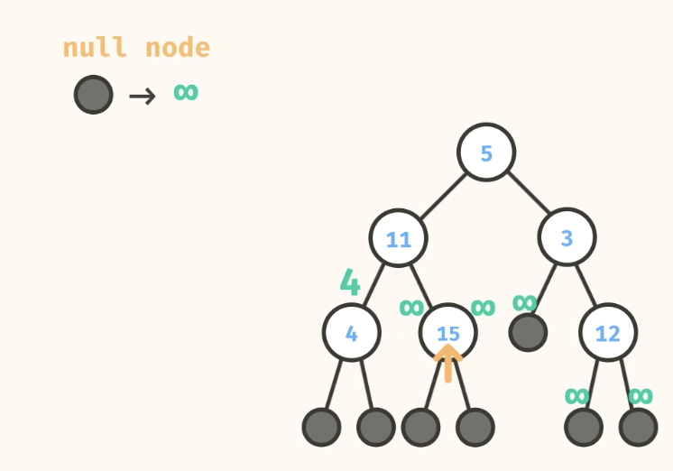

```
public static Double treeMinValue(Node<Double> root) {
    if (root == null) {
      return Double.POSITIVE_INFINITY;
    }
    double minChildVal = Math.min(treeMinValue(root.left), treeMinValue(root.right));
    return Math.min(root.val, minChildVal);
}
```
- n = number of nodes
- Time: O(n)
- Space: O(n)


### 5. max root to leaf path sum
that takes in the root of a binary tree that contains number values. The method should return the maximum sum of any root to leaf path within the tree.
You may assume that the input tree is non-empty.

Check the 2 bases cases. Its easy to miss them.

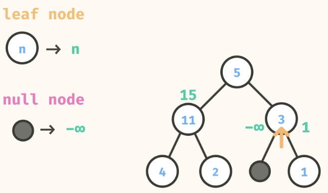

```
public static Double maxPathSum(Node<Double> root) {
    if (root == null) {
      return Double.NEGATIVE_INFINITY;
    }
    if (root.left == null && root.right == null) {
      return root.val;
    }
    return root.val + Math.max(maxPathSum(root.left), maxPathSum(root.right));
  }
```

- n = number of nodes
- Time: O(n)
- Space: O(n)


### 6. tree path finder
The method should return an array representing a path to the target value. If the target value is not found in the tree, then return null.
You may assume that the tree contains unique values.

Notice 2 base cases and also how we need to pass on the list.
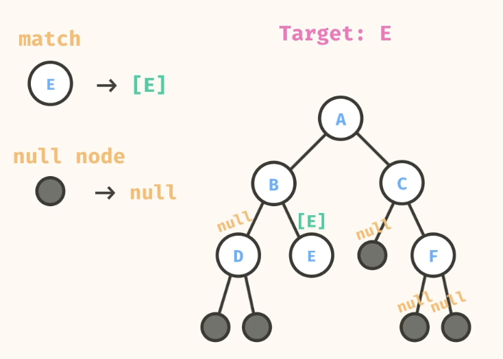

```
public static <T> List<T> pathFinder(Node<T> root, T target) {
    if (root == null) {
      return null;
    }
    
    if (root.val == target) {
      return List.of(root.val);
    }
    
    List<T> leftPath = pathFinder(root.left, target);
    if (leftPath != null) {
      List<T> newPath = new ArrayList<>();
      newPath.add(root.val);
      newPath.addAll(leftPath); 
      return newPath;
    }
    
    List<T> rightPath = pathFinder(root.right, target);
    if (rightPath != null) {
      List<T> newPath = new ArrayList<>();
      newPath.add(root.val);
      newPath.addAll(rightPath);
      return newPath;
    }
    
    return null;
  }
```
- n = number of nodes
- Time: O(n^2) - This is due to addAll methd of Lists. 
- Space: O(n)

Notice the use of reverse operations, since we start adding the target in the list first and then bubbleup, which will result in the list being in reverse order. We then reverse the final list.

```
public static <T> List<T> pathFinder(Node<T> root, T target) {
    List<T> path = findPath(root, target);
    if (path == null) {
      return null;
    } else {
      Collections.reverse(path);
      return path;
    }
  }
  
  public static <T> List<T> findPath(Node<T> root, T target) {
    if (root == null) {
      return null;
    }
    
    if (root.val == target) {
      return new ArrayList<>(List.of(root.val));
    }
    
    List<T> leftPath = findPath(root.left, target);
    if (leftPath != null) {
      leftPath.add(root.val);
      return leftPath;
    }
    
    List<T> rightPath = findPath(root.right, target);
    if (rightPath != null) {
      rightPath.add(root.val);
      return rightPath;
    }
    
    return null;
  }
```
- n = number of nodes
- Time: O(n)
- Space: O(n)

### 7. Height of BT

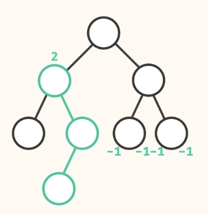

```
public static <T> int howHigh(Node<T> root) {
    if (root == null) {
      return -1;
    }
    return 1 + Math.max(howHigh(root.left), howHigh(root.right));
}
```

- n = number of nodes
- Time: O(n)
- Space: O(n)

### 8. bottom right value [Important - LC-Medium]

bottomRightValue, that takes in the root of a binary tree. The method should return the right-most value in the bottom-most level of the tree.

```
//       3
//    /    \
//   11     10
//  / \      \
// 4   -2     1

Source.bottomRightValue(a); // -> 1
```

Since this will require level based traversal, go for BFS. 
Remember for Level based always go for BFS
In this particular , since we are looging for rightmost value, we visit the left first by inserting left followed by right in queue.

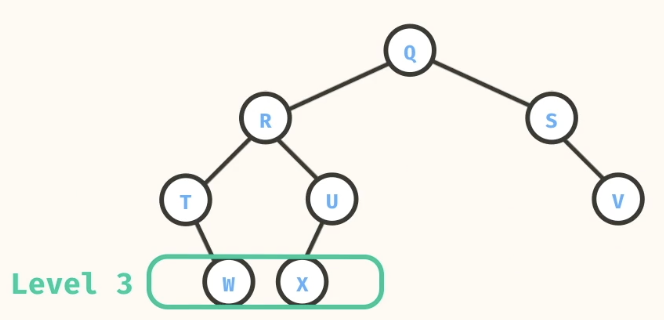
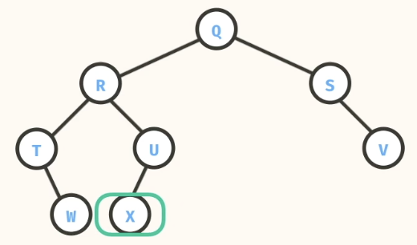

```
public static <T> T bottomRightValue(Node<T> root) {
    ArrayDeque<Node<T>> queue = new ArrayDeque<>();
    queue.add(root);
    Node<T> current = null;
    while(!queue.isEmpty()) {
      current = queue.remove();
      if (current.left != null) {
        queue.add(current.left);
      }
      if (current.right != null) {
        queue.add(current.right);
      }
    }
    return current.val;
  }
```

- n = number of nodes
- Time: O(n)
- Space: O(n)

### 9. all tree paths
The method should return a 2-Dimensional list where each sublist represents a root-to-leaf path in the tree.
The order within an individual path must start at the root and end at the leaf, but the relative order among paths in the outer list does not matter.

Important Problem - Check the video , has good explanation for Time and space complexity;

```
//      a
//    /   \
//   b     c
//  / \     \
// d   e     f

Source.allTreePaths(a); // ->
// [ 
//   [ 'a', 'b', 'd' ], 
//   [ 'a', 'b', 'e' ], 
//   [ 'a', 'c', 'f' ] 
// ]
```

Base Cases - Left Node
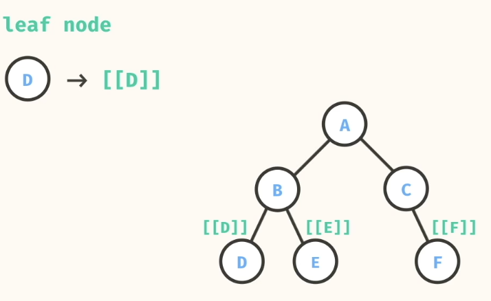

Null Node
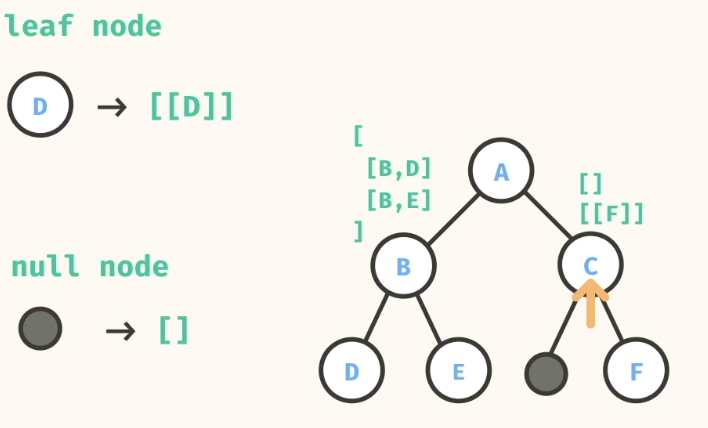

```
public static <T> List<List<T>> allTreePaths(Node<T> root) {
    List<List<T>> paths = _allTreePaths(root);
    
    for (List<T> path : paths) {
      Collections.reverse(path);
    }
    return paths;
  }
  
  public static <T> List<List<T>> _allTreePaths(Node<T> root) {
    if (root == null) {
      return List.of();
    }
    if (root.left == null && root.right == null) {
      List<T> path = new ArrayList<T>();
      path.add(root.val);
      return List.of(path);
    }
    
    List<List<T>> allPaths = new ArrayList<>();
    
    for (List<T> path : _allTreePaths(root.left)) {
      path.add(root.val);
      allPaths.add(path);
    }
    
    for (List<T> path : _allTreePaths(root.right)) {
      path.add(root.val);
      allPaths.add(path);
    }
    
    return allPaths;
  }
```
- n = number of nodes
- Time: O( n*log(n) )
- Space: O( n*log(n) )

It difficult to just specify the time and space complexity in terms of n as it will depend on how the nodes are distributed in a BT. For instance consider the 2 extreme cases below.
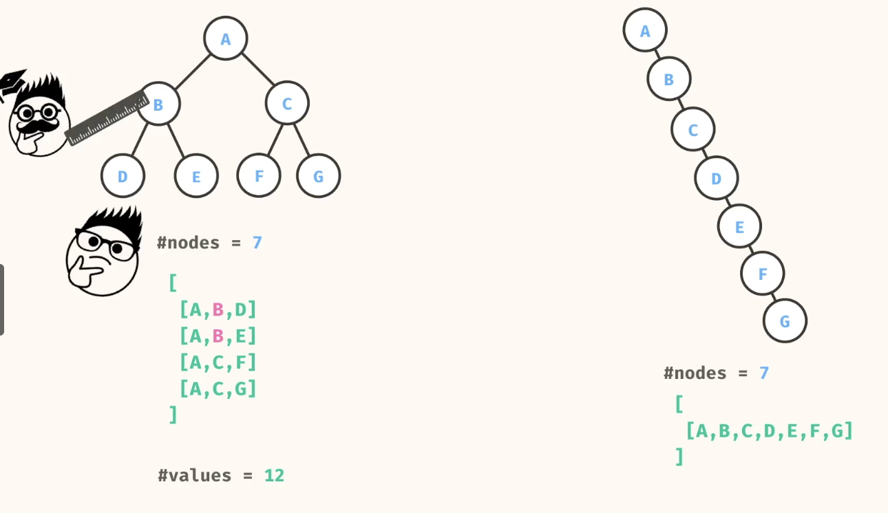

Time and Space compexity will need to be expressed in terms of
- Leaf nodes - Will give us the no of Paths
- Height of the tree

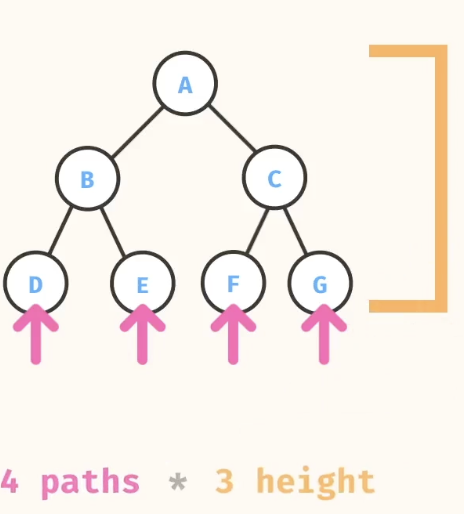
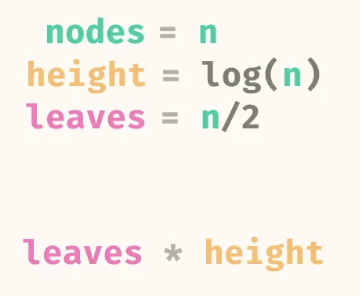
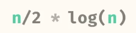.  

#### Backtracking approach
```
public static <T> List<List<T>> allTreePaths(Node<T> root) {
    List<List<T>> result = new ArrayList<>();
    backtrack(root, new ArrayList<>(), result);
    return result;
}

private static <T> void backtrack(
    Node<T> node,
    List<T> path,
    List<List<T>> result
) {
    if (node == null) return;

    path.add(node.val);

    if (node.left == null && node.right == null) {
        result.add(new ArrayList<>(path)); // copy only at leaf
    } else {
        backtrack(node.left, path, result);
        backtrack(node.right, path, result);
    }

    path.remove(path.size() - 1); // backtrack
}
```
n/2*log(n) = n*log(n)

### 10. tree levels
Write a method, treeLevels, that takes in the root of a binary tree. The method should return a 2-Dimensional list where each sublist represents a level of the tree.

```
//      a
//    /   \
//   b     c
//  / \     \
// d   e     f

Source.treeLevels(a); // ->
// [
//   ['a'],
//   ['b', 'c'],
//   ['d', 'e', 'f']
// ]
```

The idea is to keep track of the levels while traversing the tree, traversing the tree can be done both using DFS and BFS. Finally construct the result list using the level info.
Note the use of SimpleEntry for Java, which can be used to store level and the value in a single object.

```
//BFS
public static <T> List<List<T>> treeLevels(Node<T> root) {
    if (root == null) {
      return List.of();
    }
    
    List<List<T>> levels = new ArrayList<>();
    ArrayDeque<SimpleEntry<Node<T>, Integer>> queue = new ArrayDeque<>();
    queue.add(new SimpleEntry<>(root, 0));
    while (!queue.isEmpty()) {
      SimpleEntry<Node<T>, Integer> pair = queue.remove();
      Node<T> node = pair.getKey();
      int level = pair.getValue();
      
      if (level == levels.size()) {
        ArrayList<T> newList = new ArrayList<>();
        newList.add(node.val);
        levels.add(newList);
      } else {
        levels.get(level).add(node.val);
      }
      
      if (node.left != null) {
        queue.add(new SimpleEntry<>(node.left, level + 1));
      }
      if (node.right != null) {
        queue.add(new SimpleEntry<>(node.right, level + 1));
      }
    }
    
    return levels;
}
```
- n = number of nodes
- Time: O(n)
- Space: O(n)


```
//DFS
public static <T> List<List<T>> treeLevels(Node<T> root) {
    List<List<T>> levels = new ArrayList<>();
    treeLevels(root, 0, levels);
    return levels;
  }
  
  public static <T> void treeLevels(Node<T> root, int level, List<List<T>> levels) {
    if (root == null) {
      return;
    }  
    if (level == levels.size()) {
      List<T> newList = new ArrayList<>();
      newList.add(root.val);
      levels.add(newList);
    } else {
      levels.get(level).add(root.val);
    }
    treeLevels(root.left, level + 1, levels);
    treeLevels(root.right, level + 1, levels);
}
```

- n = number of nodes
- Time: O(n)
- Space: O(n)

### 11. leaf list

Write a method, leafList, that takes in the root of a binary tree and returns a list containing the values of all leaf nodes in left-to-right order.

Try and traverse the list using BFS and DFS and try to see which traversal gets the right order.
Use DFS

```
public static <T> List<T> leafList(Node<T> root) {
    List<T> leaves = new ArrayList<>();
    fillLeaves(root, leaves);
    return leaves;
  }
  
  public static <T> void fillLeaves(Node<T> root, List<T> leaves) {
    if (root == null) {
      return;
    }
    
    if (root.left == null && root.right == null) {
      leaves.add(root.val);
    }
    
    fillLeaves(root.left, leaves);
    fillLeaves(root.right, leaves);
  }
```

- n = number of nodes
- Time: O(n)
- Space: O(n)
