# Graphs


- [Introduction](#introduction)
  - [Relation between nodes and Edges](#relaiion-between-nodes-and-edges)
- [Problems](#problems)
  - [1. Has Path](#1-has-path)
  - [2. undirected path](#2-undirected-path)
  - [3. connected components count](#3-connected-components-count)
  - [4 Largest component](#4-largest-component)
  - [5. Shortest Path](#5-shortest-path)
  - [6. island count](#6-island-count)
  - [7. minimum island](#7-minimum-island)
  - [8. Closest Carrot](#8-closest-carrot)
  - [9. longest path](#9-longest-path)
  - [10. semesters required](#10-semesters-required)
  - [11. best bridge](#11-best-bridge)
  - [12. Cycle detection](#12-cycle-detection)
  - [13. prereqs possible](#13-prereqs-possible)

## Introduction
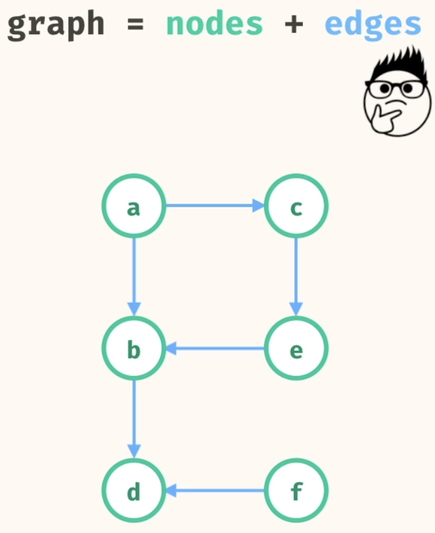

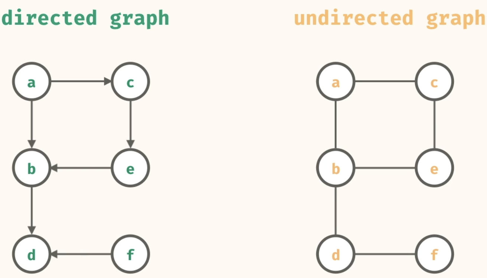

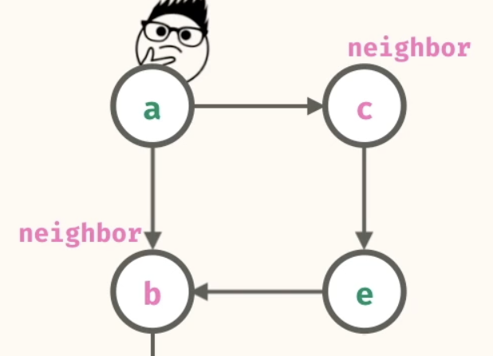

Graph Representation
Adjacency List using HashMap

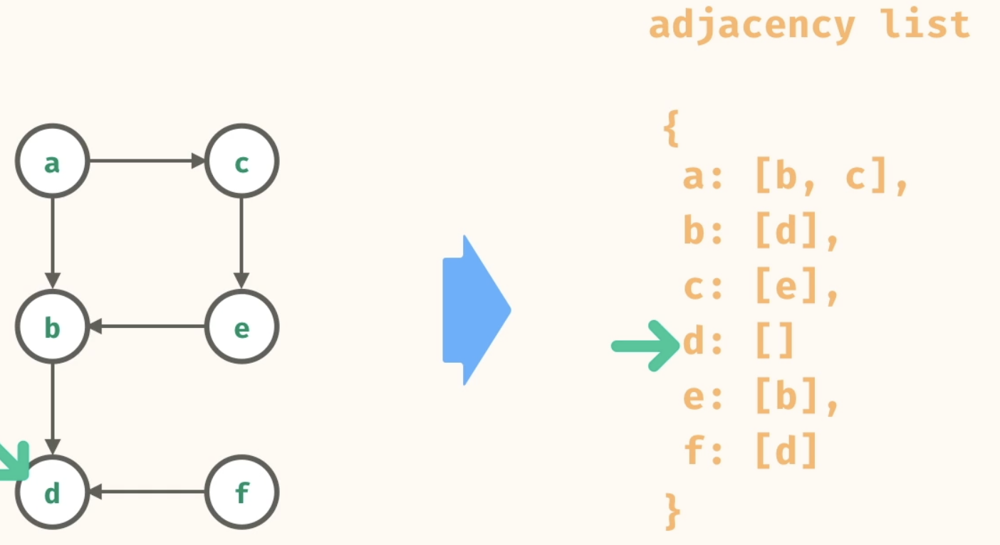

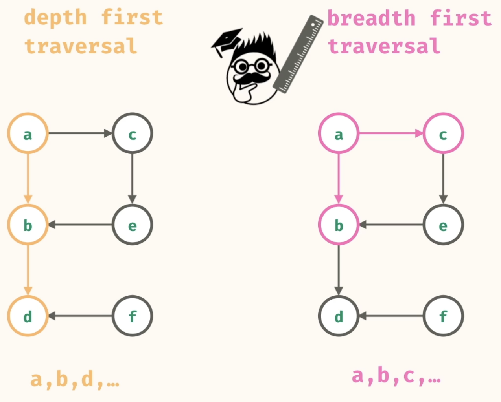

Cyclic and Acyclic Graphs
Traversing a Cyclic Graph will result in infinite Loop
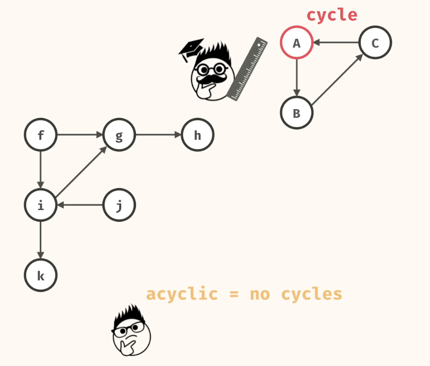

### Relation between nodes and Edges
n(nodes) = 5.  
e(edges) = (5 * 4)/2  
5 * -- Each node will have an edge going to other nodes.   
4 -----As we are not counting an edge to the same node.  
/2 --- as we want to get rid of dupe edges.

max edges. = (n * n-1)/2. 
In general e = O(n2)

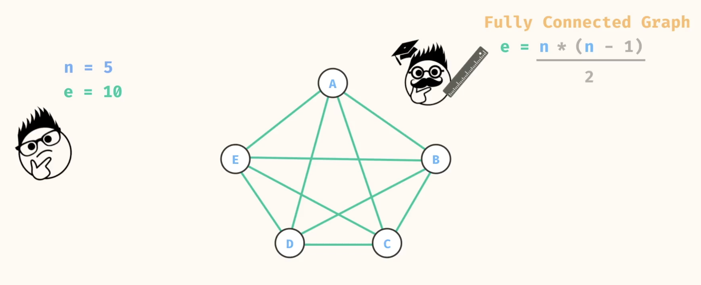  

## Problems

### 1. Has Path
The method should return a boolean indicating whether or not there exists a directed path between the source and destination nodes.
acyclic graph - If cyclic graph traversing it will result in infinite loop

DFS (recursive)
```
public static boolean hasPath(Map<String, List<String>> graph, String src, String dst) {
    if (src == dst) {
      return true;
    }
    for (String neighbor : graph.get(src)) {
      if (hasPath(graph, neighbor, dst)) {
        return true;
      }
    }
    return false;
  }
```

BFS
```
public static boolean hasPath(Map<String, List<String>> graph, String src, String dst) {
    ArrayDeque<String> queue = new ArrayDeque<>();
    queue.add(src);
    while(!queue.isEmpty()) {
     String node = queue.remove();
      if (node == dst) {
        return true;
      }
      for (String neighbor : graph.get(node)) {
        queue.add(neighbor);
      }
    }
    
    return false;
  }
```

Both approaches have 
- n = number of nodes
- e = number edges
- Time: O(e)
- Space: O(n)

### 2. undirected path
undirectedPath, that takes in a list of edges for an undirected graph and two nodes (nodeA, nodeB). The method should return a boolean indicating whether or not there exists a path between nodeA and nodeB.

Learn 
- how to construct AdjMap - Graph from the list of Nodes
- Since no mention of acyclic graph, lets guard aginst cyclic graph, by marking the nodes as visited to avoid getting into infinite loop

```
 List<List<String>> edges = List.of(
  List.of("i", "j"),
  List.of("k", "i"),
  List.of("m", "k"),
  List.of("k", "l"),
  List.of("o", "n")
);

Source.undirectedPath(edges, "j", "m"); // -> true
```

DFS
```
public static boolean undirectedPath(List<List<String>> edges, String nodeA, String nodeB) {
    Map<String, List<String>> graph = buildGraph(edges);
    return dfs(graph, nodeA, nodeB, new HashSet<>());
  }
  
  public static boolean dfs(Map<String, List<String>> graph, String src, String dst, HashSet<String> visited) {
    if (src == dst) {
      return true;
    }
    
    if (visited.contains(src)) {
      return false;
    }
    visited.add(src);
    
    for (String neighbor : graph.get(src)) {
      if (dfs(graph, neighbor, dst, visited)) {
        return true;
      }
    }
    
    return false;
  }

  public static Map<String, List<String>> buildGraph(List<List<String>> edges) {
    Map<String, List<String>> map = new HashMap<>();
    for (List<String> edge : edges) {
      String a = edge.get(0);
      String b = edge.get(1);
      if (!map.containsKey(a)) {
          map.put(a, new ArrayList<>());
      }
      if (!map.containsKey(b)) {
          map.put(b, new ArrayList<>());
      }
      map.get(a).add(b);
      map.get(b).add(a);
    }
    return map;
  }
```

BFS
```
public static boolean undirectedPath(List<List<String>> edges, String nodeA, String nodeB) {
    Map<String, List<String>> graph = buildGraph(edges);
    HashSet<String> visited = new HashSet<>();
    ArrayDeque<String> queue = new ArrayDeque<>();
    queue.add(nodeA);
    while (!queue.isEmpty()) {
      String node = queue.remove();
      if (node == nodeB) {
        return true;
      }
      for (String neighbor : graph.get(node)) {
        if (!visited.contains(neighbor)) {
          queue.add(neighbor);
          visited.add(neighbor);
        }
      }
    }
    
    return false;
  }

//Below method same as DFS
  public static Map<String, List<String>> buildGraph(List<List<String>> edges) { 
  
```
- n = number of nodes
- e = number edges
- Time: O(e)
- Space: O(e)

### 3. connected components count
The method should return the number of connected components within the graph.
Basic traversal with tracking of visited nodes and component count incrementing.

DFS
```
public static int connectedComponentsCount(Map<Integer, List<Integer>> graph) {
    HashSet<Integer> visited = new HashSet<>();
    int count = 0;
    for (int node : graph.keySet()) {
      if (traverseComponent(graph, node, visited)) {
        count += 1;
      }
    }
    return count;
  }
  
  public static boolean traverseComponent(Map<Integer, List<Integer>> graph, int node, HashSet<Integer> visited) {
    if (visited.contains(node)) {
      return false;
    }
    visited.add(node);
    
    for (int neighbor : graph.get(node)) {
      traverseComponent(graph, neighbor, visited);
    }
    
    return true;
  }
```

- n = number of nodes
- e = number edges
- Time: O(e)
- Space: O(e)

### 4 Largest component
largestComponent, that takes in the adjacency list of an undirected graph. The method should return the size of the largest connected component in the graph.

```
 public static int largestComponent(Map<Integer, List<Integer>> graph) {
    HashSet<Integer> visited = new HashSet<>();
    int maxSize = 0;
    for (int node : graph.keySet()) {
      int size = traverseSize(graph, node, visited);
      if (size > maxSize) {
        maxSize = size;
      }
    }
    return maxSize;
  }
  
  public static int traverseSize(Map<Integer, List<Integer>> graph, int node, HashSet<Integer> visited) {
    if (visited.contains(node)) {
      return 0;
    }
    visited.add(node);
    
    int count = 1;
    for (int neighbor : graph.get(node)) {
      count += traverseSize(graph, neighbor, visited);
    }
    return count;
  }
```

- n = number of nodes
- e = number edges
- Time: O(e)
- Space: O(e)

### 5. Shortest Path
Write a method, shortestPath, that takes in a list of edges for an undirected graph and two nodes (nodeA, nodeB). The method should return the length of the shortest path between A and B. Consider the length as the number of edges in the path, not the number of nodes. If there is no path between A and B, then return -1. You can assume that A and B exist as nodes in the graph.

- Use BFS for Shortest path
- Maintain the distance while traversing by attaching the distance of the visiting nodes in queue.

```
public static int shortestPath(List<List<String>> edges, String nodeA, String nodeB) {
    HashMap<String, List<String>> graph = buildGraph(edges);
    HashSet<String> visited = new HashSet<>();
    ArrayDeque<SimpleEntry<String, Integer>> queue = new ArrayDeque<>();
    queue.add(new SimpleEntry<>(nodeA, 0));
    visited.add(nodeA);
    while (!queue.isEmpty()) {
      SimpleEntry<String, Integer> entry = queue.remove();
      String node = entry.getKey();
      int distance = entry.getValue();
    
      if (node == nodeB) {
        return distance;
      }
      
      for (String neighbor : graph.get(node)) {
        if (!visited.contains(neighbor)) {
          queue.add(new SimpleEntry<>(neighbor, distance + 1));
          visited.add(neighbor);
        }
      }
    }
    
    return -1;
  }
```

- e = number edges
- Time: O(e)
- Space: O(e)

### 6. island count
Write a method, islandCount, that takes in a grid containing Ws and Ls. W represents water and L represents land. The method should return the number of islands on the grid. An island is a vertically or horizontally connected region of land.

```
List<List<String>> grid = List.of(
  List.of("W", "L", "W", "W", "W"),
  List.of("W", "L", "W", "W", "W"),
  List.of("W", "W", "W", "L", "W"),
  List.of("W", "W", "L", "L", "W"),
  List.of("L", "W", "W", "L", "L"),
  List.of("L", "L", "W", "W", "W")
);

Source.islandCount(grid); // -> 3
```

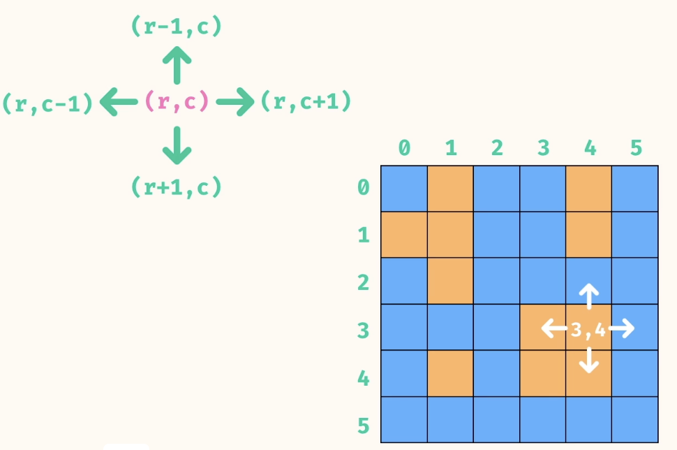

```
public static int islandCount(List<List<String>> grid) {
    HashSet<SimpleEntry<Integer, Integer>> visited = new HashSet<>();    
    int count = 0;
    for (int r = 0; r < grid.size(); r += 1) {
      for (int c = 0; c < grid.get(0).size(); c += 1) {
        if(explore(r, c, grid, visited)) {
          count += 1;
        }
      }
    }
    return count;
}

public static boolean explore(int r, int c, List<List<String>> grid, HashSet<SimpleEntry<Integer, Integer>> visited) {
    boolean rowInbounds = r >= 0 && r < grid.size();
    boolean colInbounds = c >= 0 && c < grid.get(0).size();
    if (!rowInbounds || !colInbounds) {
      return false;
    }
    
    if (grid.get(r).get(c) == "W") {
      return false;
    }
    
    SimpleEntry<Integer, Integer> key = new SimpleEntry<>(r, c);
    if (visited.contains(key)) {
      return false;
    }
    visited.add(key);

    explore(r + 1, c, grid, visited);
    explore(r - 1, c, grid, visited);
    explore(r, c + 1, grid, visited);
    explore(r, c - 1, grid, visited);
    
    return true;
  }
```
- r = number of rows
- c = number of columns
- Time: O(rc)
- Space: O(rc)

### 7. minimum island
Write a method, minimumIsland, that takes in a grid containing Ws and Ls. W represents water and L represents land. The method should return the size of the smallest island. An island is a vertically or horizontally connected region of land.

You may assume that the grid contains at least one island.

```
List<List<String>> grid = List.of(
  List.of("W", "L", "W", "W", "W"),
  List.of("W", "L", "W", "W", "W"),
  List.of("W", "W", "W", "L", "W"),
  List.of("W", "W", "L", "L", "W"),
  List.of("L", "W", "W", "L", "L"),
  List.of("L", "L", "W", "W", "W")
);

Source.minimumIsland(grid); // -> 2
```

Same as Last one, but note the edge cases, where the dfs count function could actually return 0, we we need to guard against it as then 0 will always be minimum

```
public static int minimumIsland(List<List<String>> grid) {
    Set<SimpleEntry<Integer,Integer>> visited = new HashSet<>();

    int minimumIslandCount = Integer.MAX_VALUE;
    for(int row = 0; row<grid.size(); row++){
      for(int col = 0; col<grid.get(row).size(); col++){
        if(grid.get(row).get(col) == "L" && !visited.contains(new SimpleEntry<>(row,col))){
          int count = getIsLandCount(grid,row,col,visited);
          System.out.println(count);
          minimumIslandCount = Math.min(minimumIslandCount,count);
        }
        
      }
    }
    return minimumIslandCount;
}

private static int getIsLandCount(List<List<String>> grid, int row, int col, Set<SimpleEntry<Integer,Integer>> visited){

    if (row < 0 || col < 0 || 
        row >= grid.size() || col >= grid.get(row).size()
       ) return 0;
    
    if(visited.contains(new SimpleEntry<>(row,col))) return 0;
    
    if(grid.get(row).get(col) == "W") return 0;

    visited.add(new SimpleEntry<>(row,col));
    
    int isLandCount = 1 
      + getIsLandCount(grid,row-1,col,visited)
      + getIsLandCount(grid,row+1,col,visited)
      + getIsLandCount(grid,row,col-1,visited)
      + getIsLandCount(grid,row,col+1,visited);
    
    return isLandCount;
}  
```

Edge case can also be handled as simply ignoring the 0 count
```
for (int c = 0; c < grid.get(0).size(); c += 1) {
        double size = exploreSize(r, c, grid, visited);
        if (size > 0 && size < min) {
          min = size;
        }
      }
```

### 8. Closest Carrot
that takes in a grid, a starting row, and a starting column. In the grid, "X"s are walls, "O"s are open spaces, and "C"s are carrots. The method should return a number representing the length of the shortest path from the starting position to a carrot. You may move up, down, left, or right, but cannot pass through walls (X). If there is no possible path to a carrot, then return -1.

```
List<List<String>> grid = List.of(
  List.of("O", "O", "O", "O", "O"),
  List.of("O", "X", "O", "O", "O"),
  List.of("O", "X", "X", "O", "O"),
  List.of("O", "X", "C", "O", "O"),
  List.of("O", "X", "X", "O", "O"),
  List.of("C", "O", "O", "O", "O")
);

Source.closestCarrot(grid, 1, 2); // -> 4
```

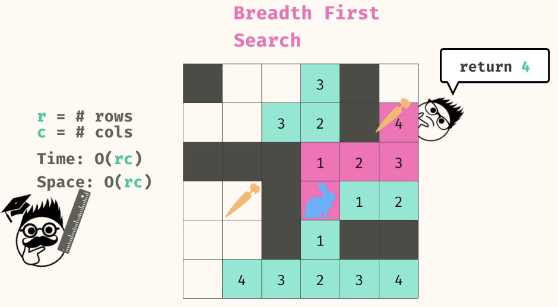

Modification of previous prblem, notice the usage of List for keeping track of 3 things, row, col and distance count.

```
public static int closestCarrot(List<List<String>> grid, int startRow, int startCol) {
    
    Set<SimpleEntry<Integer,Integer>> visited = new HashSet<>();
    Queue<List<Integer>> qu = new ArrayDeque<>();
    qu.add(List.of(startRow,startCol,0));

    while(!qu.isEmpty()){
      List<Integer> l = qu.remove();
      int row = l.get(0);
      int col = l.get(1);
      
      SimpleEntry<Integer,Integer> entry = new SimpleEntry<>(row,col);

      if (!visited.contains(entry)
          && (row >= 0 && col >= 0 && row < grid.size() && col < grid.get(row).size())
          && ( grid.get(row).get(col) != "X")
      ){
          int count = l.get(2);
          if (grid.get(row).get(col) == "C")
            return count;
          else{
            visited.add(entry);
            count = count +1 ; 
            qu.add(List.of(row-1,col,count));
            qu.add(List.of(row+1,col,count));
            qu.add(List.of(row,col+1,count));
            qu.add(List.of(row,col-1,count));
          }
       }
    }
    return -1;
}
```


### 9. longest path

Write a method, longestPath, that takes in an adjacency list for a directed acyclic graph. The method should return the length of the longest path within the graph. A path may start and end at any two nodes. The length of a path is considered the number of edges in the path, not the number of nodes.
```
Map<String, List<String>> graph = Map.of(
  "a", List.of("c", "b"),
  "b", List.of("c"),
  "c", List.of()
);

Source.longestPath(graph); // -> 2
```
Important Problem. The trick is to detemine the terminal nodes which can be identified as nodes which do not have any neighbours, since this is Directed Acyclic graph.
From there on we can use DFS to back calculate the distance. While calculating the distance for a node, get the longest(max) diatance of its neighbours.  

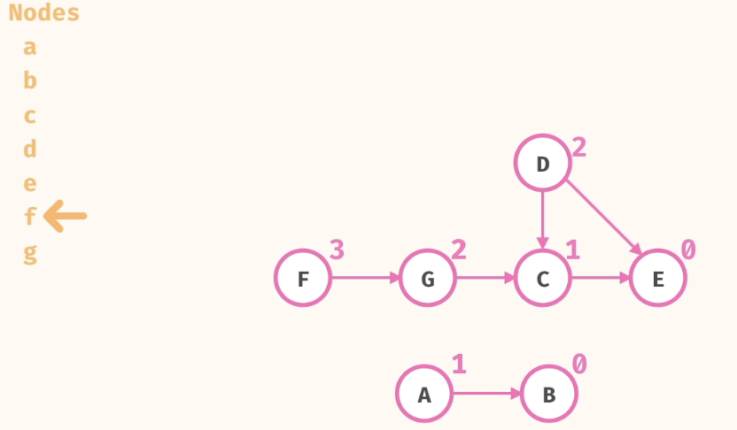

```
public static int longestPath(Map<String, List<String>> graph) {
    HashMap<String, Integer> distance = new HashMap<>();
    for (String node : graph.keySet()) {
      if (graph.get(node).size() == 0) {
        distance.put(node, 0);
      }
    }
    
    for (String node : graph.keySet()) {
      traverseDistance(node, graph, distance);
    }
    
    return Collections.max(distance.values());
}

public static int traverseDistance(String node, Map<String, List<String>> graph, HashMap<String, Integer> distance) {
    if (distance.containsKey(node)) {
      return distance.get(node);
    }
    
    int max = 0;
    for (String neighbor : graph.get(node)) {
      int attempt = traverseDistance(neighbor, graph, distance);
      if (attempt > max) {
        max = attempt;
      }
    }
    
    distance.put(node, max + 1);
    return max + 1;
  }
```

### 10. semesters required

Write a method, semestersRequired, that takes in a number of courses (n) and a list of prerequisites as arguments. Courses have ids ranging from 0 through n - 1. A single prerequisite of List.of(A, B) means that course A must be taken before course B. Return the minimum number of semesters required to complete all n courses. There is no limit on how many courses you can take in a single semester, as long as the prerequisites of a course are satisfied before taking it.

Note that given prerequisite List.of(A, B), you cannot take course A and course B concurrently in the same semester. You must take A in some semester before B.

You can assume that it is possible to eventually complete all courses.

```
int numCourses = 6;
List<List<Integer>> prereqs = List.of(
  List.of(1, 2),
  List.of(2, 4),
  List.of(3, 5),
  List.of(0, 5)
);
Source.semestersRequired(numCourses, prereqs); // -> 3
```

Convert Input to Adjacency List
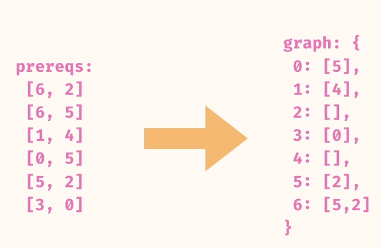. 

The Graph has to be a DAG, else it is not possible to complete all cources. See below Acyclic graph, it mean each course needs the course to tbe completed.
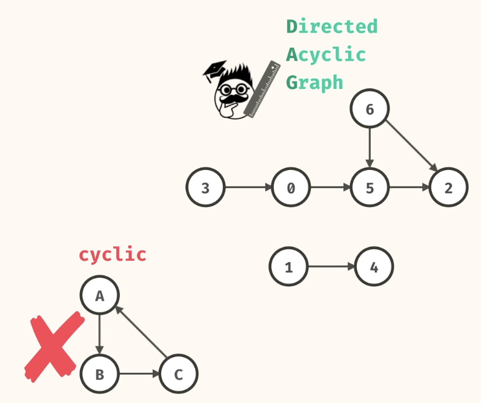. 

It will be the no of nodes in the longest path.

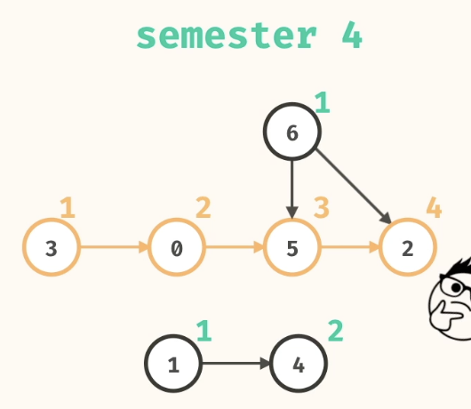

To find the longest Path. Look for terminal Nodes.  
Terminal Nodes have a distance of 1. It means we need 1 semester to take these courses.

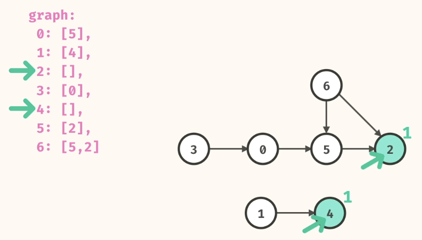
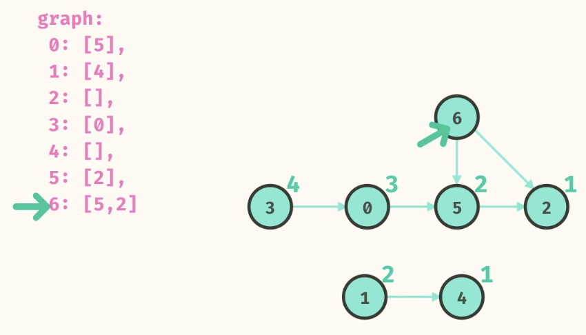
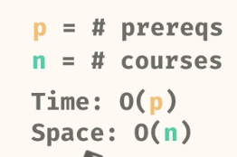

```
  public static int semestersRequired(int numCourses, List<List<Integer>> prereqs) {
    HashMap<Integer, List<Integer>> graph = buildGraph(numCourses, prereqs);
    HashMap<Integer, Integer> distance = new HashMap<>();
    
    for (int node : graph.keySet()) {
      traverseDistance(node, graph, distance);
    }
    
    return Collections.max(distance.values());
  }
  
  public static int traverseDistance(int node, HashMap<Integer, List<Integer>> graph, HashMap<Integer, Integer> distance) {
    if (distance.containsKey(node)) {
      return distance.get(node);
    }
    
    int max = 0;
    for (int neighbor : graph.get(node)) {
      int neighborDistance = traverseDistance(neighbor, graph, distance);
      if (neighborDistance > max) {
        max = neighborDistance;
      }
    }
    
    distance.put(node, max + 1);
    return max + 1;
  }

  
```

### 11. best bridge
Write a method, bestBridge, that takes in a grid as an argument. The grid contains water (W) and land (L). There are exactly two islands in the grid. An island is a vertically or horizontally connected region of land. Return the minimum length bridge needed to connect the two islands. A bridge does not need to form a straight line.

Sme problem on [Leetcode](https://leetcode.com/problems/shortest-bridge/description/)
```
List<List<String>> grid = List.of(
  List.of("W", "W", "W", "L", "L"),
  List.of("L", "L", "W", "W", "L"),
  List.of("L", "L", "L", "W", "L"),
  List.of("W", "L", "W", "W", "W"),
  List.of("W", "W", "W", "W", "W"),
  List.of("W", "W", "W", "W", "W")
);
Source.bestBridge(grid); // -> 1
```
Very interesting problem. A mix of DFS and BFS

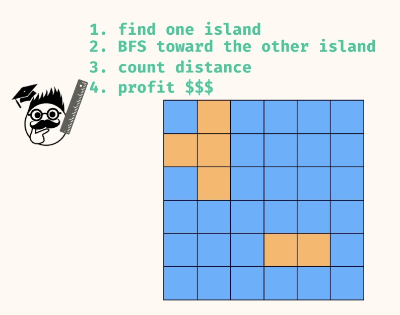

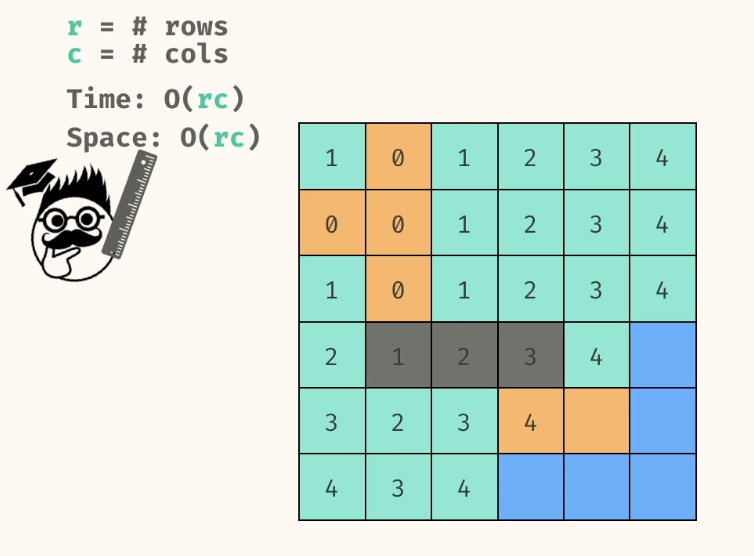

```
public static int bestBridge(List<List<String>> grid) {
    // todo
    Set<SimpleEntry<Integer,Integer>> visited = new HashSet<>();
    boolean isLandFound = false;  
    for(int row =0 ; row<grid.size(); row++){
      for(int col =0 ; col<grid.get(row).size(); col++){
        if(!isLandFound && grid.get(row).get(col).equals("L")){
          dfs(grid,row,col,visited);
          isLandFound = true;
          break;
        }
      }
    }

    Queue<List<Integer>> qu = new ArrayDeque<>();
    
    for(SimpleEntry<Integer,Integer> entry : visited){
      List<Integer> l = new ArrayList<>();
      l.add(entry.getKey());
      l.add(entry.getValue());
      l.add(0);
      qu.add(l);
    }

     
    while(!qu.isEmpty()){
      List<Integer> l = qu.remove();

      int row = l.get(0);
      int col = l.get(1);
      int dist = l.get(2);

      if(row>=0 && col>=0 && row<grid.size() && col < grid.get(row).size()){ 
        if(!visited.contains(new SimpleEntry<>(row,col)) && grid.get(row).get(col) == "L"){
          return dist-1;
        }else{
          if(grid.get(row).get(col).equals("W")) {
            visited.add(new SimpleEntry<>(row,col));
          }
          qu.add(List.of(row-1,col,dist+1));
          qu.add(List.of(row+1,col,dist+1));
          qu.add(List.of(row,col-1,dist+1));
          qu.add(List.of(row,col+1,dist+1));
        }
      }
    }
    return 0;
  }

  private static void dfs(List<List<String>> grid,int row, int col, Set<SimpleEntry<Integer,Integer>> visited){
    if(row<0 || col<0 || row>=grid.size() || col >= grid.get(row).size()) return;
    if (visited.contains(new SimpleEntry<>(row,col))) return;
    if(grid.get(row).get(col) == "W") return;

    visited.add(new SimpleEntry<>(row,col));
    dfs(grid,row-1,col,visited);
    dfs(grid,row+1,col,visited);
    dfs(grid,row,col-1,visited);
    dfs(grid,row,col+1,visited);

    return;
  }
```

### 12. Cycle detection
Write a method, hasCycle, that takes in a Map representing the adjacency list of a directed graph. The method should return a boolean indicating whether or not the graph contains a cycle.

```
Source.hasCycle(Map.of(
  "a", List.of("b"),
  "b", List.of("c"),
  "c", List.of("a")
)); // -> true
```


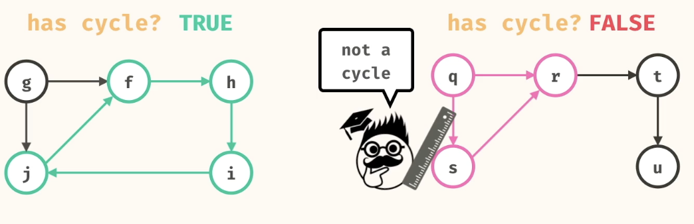

IMP: Introduces the concept of VISITED and VISITING nodes

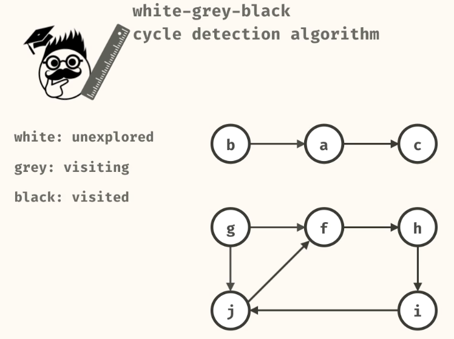

The only way we could encounter a visiting node is when we have a cycle  
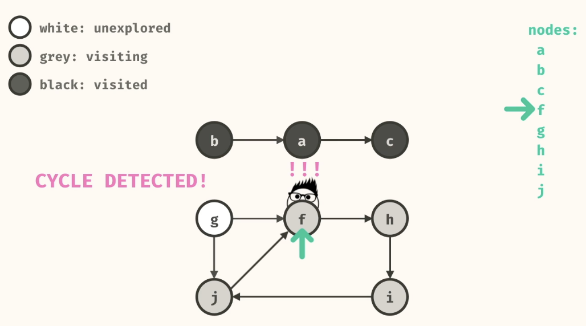

```
  public static boolean hasCycle(Map<String, List<String>> graph) {
    HashSet<String> visited = new HashSet<>();
    for (String node : graph.keySet()) {
      if (cycleDetect(node, graph, new HashSet<>(), visited)) {
        return true;
      }
    }
    return false;
  }
  
  public static boolean cycleDetect(String node, Map<String, List<String>> graph, HashSet<String> visiting, HashSet<String> visited) {
    if (visited.contains(node)) {
      return false;
    } 
    
    if (visiting.contains(node)) {
      return true;
    }
    
    visiting.add(node);
    
    for (String neighbor : graph.get(node)) {
      if (cycleDetect(neighbor, graph, visiting, visited)) {
        return true;
      }
    }
    
    visiting.remove(node);
    visited.add(node);
    return false;
  }
```

### 13. prereqs possible

Write a method, prereqsPossible, that takes in a number of courses (n) and prerequisites as arguments. Courses have ids ranging from 0 through n - 1. A single prerequisite of List.of(A, B) means that course A must be taken before course B. The method should return a boolean indicating whether or not it is possible to complete all courses.


```
int numCourses = 6;
List<List<Integer>> prereqs = List.of(
  List.of(0, 1),
  List.of(2, 3),
  List.of(0, 2),
  List.of(1, 3),
  List.of(4, 5)
);
Source.prereqsPossible(numCourses, prereqs); // -> true
```

It boils down to basic cycle detection problem.

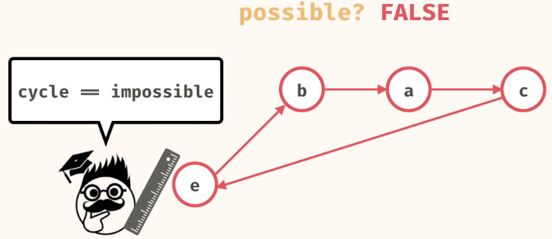
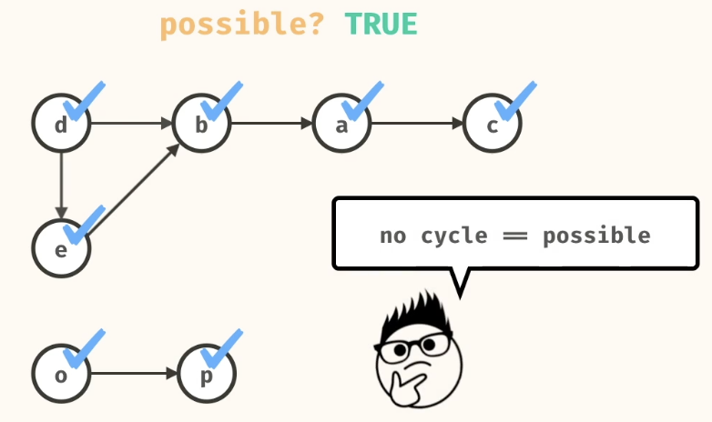
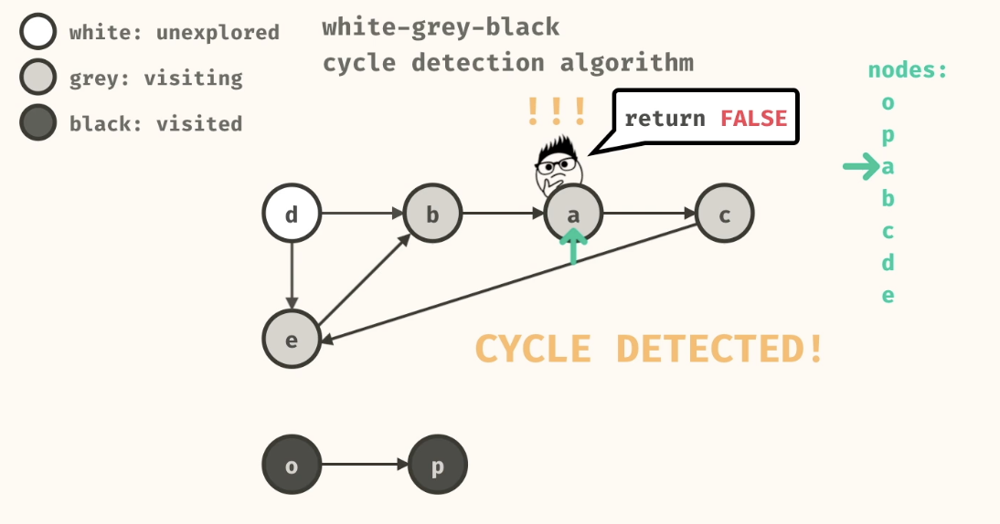
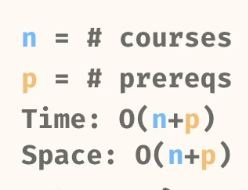


```
  public static boolean prereqsPossible(int numCourses, List<List<Integer>> prereqs) {
    HashSet<Integer> visited = new HashSet<>();
    HashMap<Integer, List<Integer>> graph = buildGraph(numCourses, prereqs);
    for (int node : graph.keySet()) {
      if (hasCycle(node, graph, new HashSet<>(), visited)) {
        return false;
      }
    }
    return true;
  }

  public static boolean hasCycle(int node, HashMap<Integer, List<Integer>> graph, HashSet<Integer> visiting, HashSet<Integer> visited) {
    if (visited.contains(node)) {
      return false;
    }
    
    if (visiting.contains(node)) {
      return true;
    }
    visiting.add(node);
    
    for (int neighbor : graph.get(node)) {
      if (hasCycle(neighbor, graph, visiting, visited)) {
        return true;
      }
    }
    
    visiting.remove(node);
    visited.add(node);
    return false;
  }

  public static HashMap<Integer, List<Integer>> buildGraph(int numCourses, List<List<Integer>> prereqs) {
    HashMap<Integer, List<Integer>> graph = new HashMap<>();
    for (int i = 0; i < numCourses; i += 1) {
      graph.put(i, new ArrayList<>());
    }
    
    for (List<Integer> pair : prereqs) {
      int courseA = pair.get(0);
      int courseB = pair.get(1);
      graph.get(courseA).add(courseB);
    }
    
    return graph;
  }
```
