# Arrays and Strings

- [Arrays and Strings](#arrays-and-strings)
  - [Intro](#intro)
  - [Problems](#problems)
    - [1. running sum](#1-running-sum)
    - [2. has subarray sum](#2-has-subarray-sum)
    - [3. sub array sum count](#3-subarray-sum-count)
    - [4. merge sort](#4-merge-sort)
    - [5. merge intervals](#5-merge-intervals)
    - [6. binary search](#6-binary-search)
    - [7. lexical order](#7-lexical-order)
    - [8. detect dictionary](#8-detect-dictionary)

    - [1. uncompress](#1-uncompress)
    - [2. five sort](#2-five-sort)


## Intro

Important techniques
- Two Pointer
- Hash Map
- Hash Set

## Problems

### 1. running sum
Write a method, runningSum, that takes in a list of numbers. The method should return a new list of the same length where each element contains the running sum up to that index of the original list.

```
For example, the i-th result should be the sum of all elements 0 to i:

result[i] = numbers[0] + numbers[1] + numbers[2] + ... + numbers[i]
```

```
runningSum(List.of(4, 2, 1, 6, 3, 6)); // -> [ 4, 6, 7, 13, 16, 22 ] 
```

- This is an easy problem , but it introduces a very important concpet of **PREFIX SUM**
- Its called Prefix Sum as every element of the output is a sum of some prefix on input.

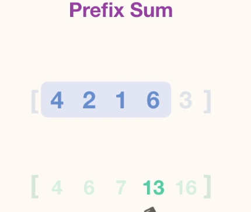

```
public static List<Integer> runningSum(List<Integer> numbers) {
    int total = 0;
    List<Integer> result = new ArrayList<>();
    for (int num : numbers) {
      total += num;
      result.add(total);
    }
    return result;
  }
```

```
n = length of array
Time: O(n)
Space: O(n)
```

### 2. has subarray sum
Take a list of numbers and a targetSum. The method should return a boolean indicating whether or not there exists a subarray of numbers that sums to the given target.

A subarray is a consecutive series of one or more elements of the list.

```
hasSubarraySum(List.of(1, 3, 1, 4, 3), 8); // -> true
```

#### 1. Brute Force Solution
Use Nested Loops. For each element check all the sub elements sum and verify if the sub element sum == target.
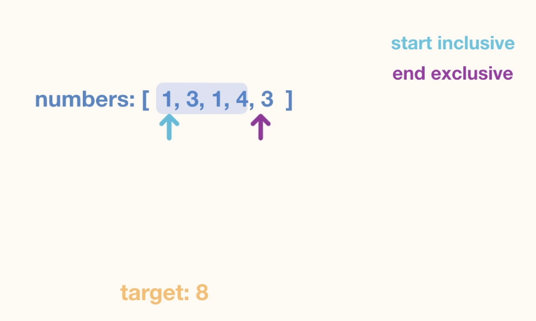
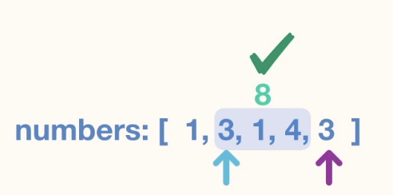

Time Complexity is O(n^3). Third n is becuase we need to loop once more to find the sum of elements in the loop.

#### 2. Use Prefix Sum
Prefix sum gives the sum of all elements for subarrays starting from  index 0. But it does not give the give the sum of elements from other indexes. For that we can subtract the subarray sum of the required index from the prefix sum to get the subarray sum from the required index.  

**NOTE** Do notice that we introduce the first element in the prefix sum array as 0.    

Time Complexity is O(n^2), since we still need to iterate through all elements to find this. 

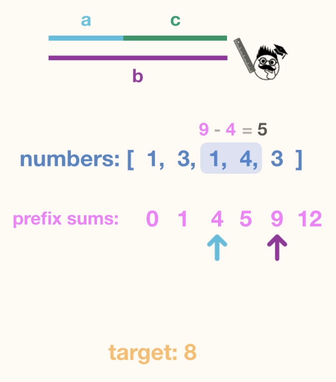

To improve further we can introduce a set. 
Since we now operate on the prefix array we are trying to find 2 pair of elements whose difference is equal to the target. This is more like the pair sum problem.

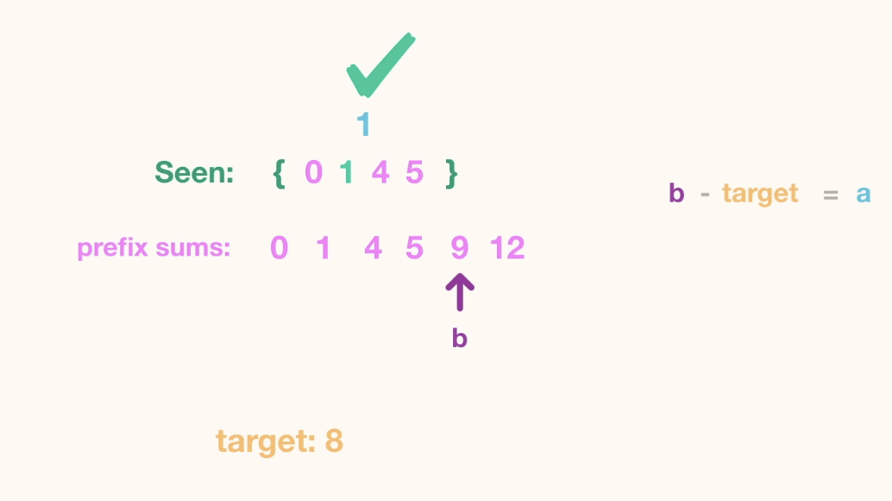

```
public static boolean hasSubarraySum(List<Integer> numbers, int targetSum) {
    List<Integer> prefixSum = new ArrayList<>();
    prefixSum.add(0);
    int currSum =0;
    for(int num: numbers){
      currSum = currSum + num;
      prefixSum.add(currSum);
    }

    Set<Integer> seen = new HashSet<>();
    for(int ps : prefixSum){
      int req = ps - targetSum;
      if (seen.contains(req)) return true;
      seen.add(ps);
    }
    return false;
  }
```

```
n = length of numbers
Time: O(n)
Space: O(n)
```
### 3. subarray sum count

Write a method, subarraySumCount, that takes in a list of numbers and a targetSum. The method should return the number of subarrays that sum to the given target.

A subarray is a consecutive series of one or more elements of the list.
--- 

```
subarraySumCount(
  List.of(-2, 1, 1, 1, -1, 1, 1, 1, 1), 
  3
); // -> 8
```
---
- Difficult problem.
- Use prefix sum array 
- Somewhat similar to previous problem.
- Difference lies in using HashMap to keep track of the no of time we see the compliment and counter.

```
public static int subarraySumCount(List<Integer> numbers, int targetSum) {
    List<Integer> prefixSums = new ArrayList<>();
    prefixSums.add(0);
    int total = 0;
    for (int num : numbers) {
      total += num;
      prefixSums.add(total);
    }

    Map<Integer, Integer> seen = new HashMap<>();
    int count = 0;
    for (int current : prefixSums) {
      int complement = current - targetSum;
      if (seen.containsKey(complement)) {
        count += seen.get(complement);
      }
      if (!seen.containsKey(current)) {
        seen.put(current, 0);
      }
      seen.put(current, seen.get(current) + 1);
    }
    return count;
  }
```

### 4. merge sort
return a new list containing elements of the original list sorted in ascending order using merge sort.

- Divide and Conqueur.   
Recursively Split the list into Halfs with Base case as a list with One elemement, since a list with one element is always sorted.
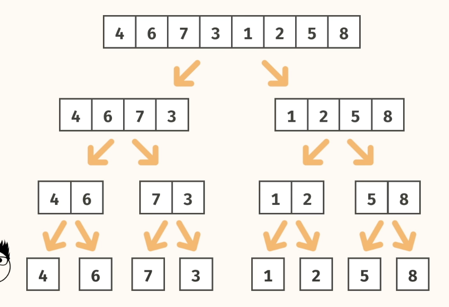

We then start merging the list. This is an important and core part of merge sort
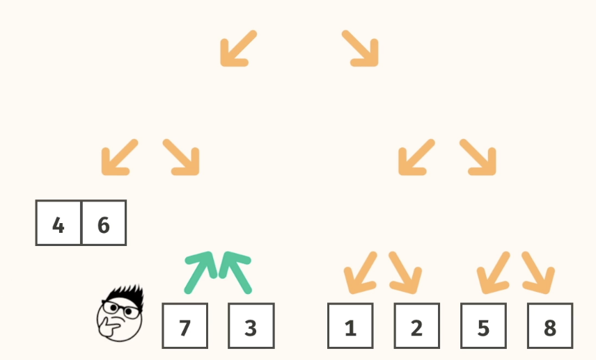

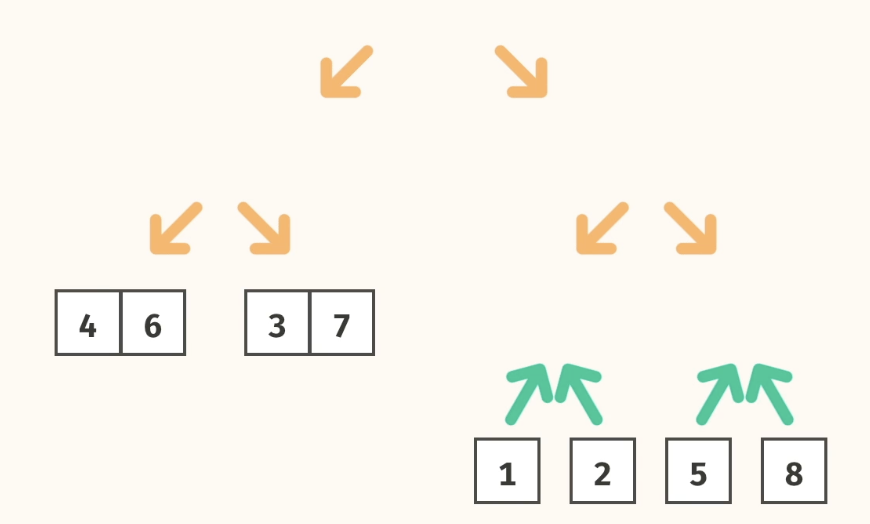

Time complexity
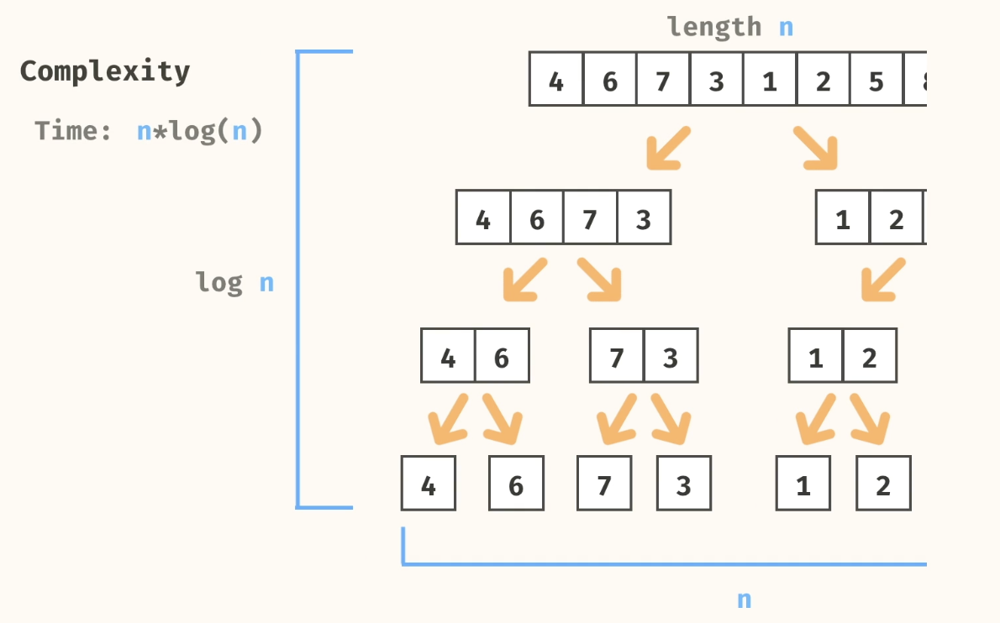

#### Solution
**NOTE** Do notice the List.subList method and the indexes. It takes the start and end indexes with start being inclusive and end being exclusive.
```
public static List<Integer> mergeSort(List<Integer> nums) {
    if (nums.size() <= 1) {
      return nums;
    }
    
    int midIdx = (int) nums.size() / 2;
    List<Integer> left = nums.subList(0, midIdx);
    List<Integer> right = nums.subList(midIdx, nums.size());
    List<Integer> sortedLeft = mergeSort(left);
    List<Integer> sortedRight = mergeSort(right);
    return merge(sortedLeft, sortedRight);
  }
  
  public static List<Integer> merge(List<Integer> list1, List<Integer> list2) {
    List<Integer> merged = new ArrayList<>();
  
    int i = 0;
    int j = 0;
    while (i < list1.size() && j < list2.size()) {
      if (list1.get(i) < list2.get(j)) {
        merged.add(list1.get(i));
        i += 1;
      } else {
        merged.add(list2.get(j));
        j += 1;
      }
    }
    
    merged.addAll(list1.subList(i, list1.size()));
    merged.addAll(list2.subList(j, list2.size()));
    return merged;
  }
```

```
n = array size
Time: O(nlogn)
Space: O(n)
```

### 5. merge intervals 
[Leet Code](https://leetcode.com/problems/merge-intervals/description/)

Take in a list of intervals as an argument. Each interval is a list containing a pair of numbers representing a start and end time. Combine overlapping intervals and return a list containing the combined intervals.

```
List<List<Integer>> intervals = List.of(
  List.of(1, 4),
  List.of(12, 15),
  List.of(3, 7),
  List.of(8, 13)
);
Source.combineIntervals(intervals);
// -> [ [1, 7], [8, 15] ]
```

#### Approach
- Intervals will be combined based on where their start times are.If the start time of one interval is before the end time of another interval , they need to be combined.
- Sort the intervals, based on the start times.
- Traverse through the sorted intervals. 
- Create a new List for combined intervals and insert the first interval in the combined intervals
- Keep track of the last combined interval and compare the start time of the last interval with the start time of the current interval. If they overlap, merge the intervals in the combined interval.

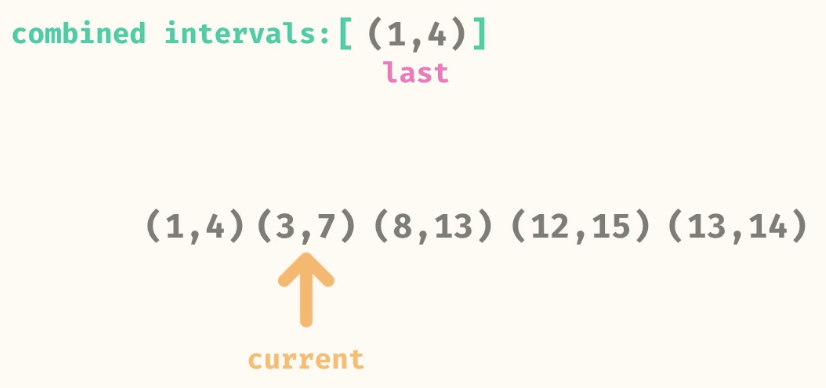
---
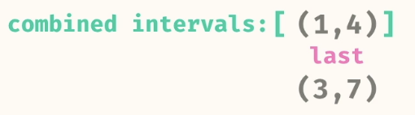
---
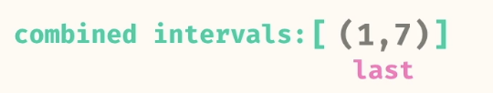
---

#### Solution
```
public static List<List<Integer>> combineIntervals(List<List<Integer>> intervals) {
    List<List<Integer>> sortedIntervals = new ArrayList<>(intervals);
    Collections.sort(sortedIntervals, (l1,l2)-> Integer.compare(l1.get(0),l2.get(0)));

    
    List<List<Integer>> mergedIntervals = new ArrayList<>();
    mergedIntervals.add(new ArrayList<>(sortedIntervals.get(0)));

    for(List<Integer> interval: sortedIntervals){
      List<Integer> last = mergedIntervals.get(mergedIntervals.size()-1);
      
      int lastEnd = last.get(1);
      int currentStart = interval.get(0);
      int currentEnd = interval.get(1);
      
      if(lastEnd >= currentStart){
        if(lastEnd < currentEnd){
          last.set(1,currentEnd);
        }
      }else{
        mergedIntervals.add(new ArrayList<>(interval));
      }
    }
    return mergedIntervals;
  }
```
- If the input is an Array instead of List.
```
public int[][] merge(int[][] intervals) {
        Arrays.sort(intervals, (a, b) -> Integer.compare(a[0], b[0]));
        LinkedList<int[]> merged = new LinkedList<>();
        for (int[] interval : intervals) {
            // if the list of merged intervals is empty or if the current
            // interval does not overlap with the previous, simply append it.
            if (merged.isEmpty() || merged.getLast()[1] < interval[0]) {
                merged.add(interval);
            }
            // otherwise, there is overlap, so we merge the current and previous
            // intervals.
            else {
                merged.getLast()[1] = Math.max(
                    merged.getLast()[1],
                    interval[1]
                );
            }
        }
        return merged.toArray(new int[merged.size()][]);
    }
```
```
n = number of intervals
Time: O(nlogn)
Space: O(n)
```

### 6. binary search

Classic Binary Search
--
Iterative Approach
```
public static int binarySearch(List<Integer> numbers, int target) {
    int lo = 0;
    int hi = numbers.size() - 1;
    while (lo <= hi) {
      int midIdx = (int) ((lo + hi) / 2);
      int midVal = numbers.get(midIdx);
      if (target < midVal) {
        hi = midIdx - 1;
      } else if (target > midVal) {
        lo = midIdx + 1;
      } else {
        return midIdx;
      }
    }
    return -1;
  }
```
---
Recursive approach
```
 public static int binarySearch(List<Integer> numbers, int target) {
    return binarySearch(numbers,target,0,numbers.size()-1);
  }

  private static int binarySearch(List<Integer> numbers, int target, int start, int end) {
    if(start>end) return -1;
    int mid = (start+end)/2;
    if(numbers.get(mid) == target) return mid;

    if (numbers.get(mid) < target) {
      return binarySearch(numbers,target,mid+1,end);
    }else {
      return binarySearch(numbers,target,start,mid-1);
    }
  }
```
---
```
n = length of numbers list
Time: O(logn)
Space: O(1)
```

### 7. lexical order
Write a method, lexicalOrder, that takes in 2 words and an alphabet string as an argument. The method should return true if the first word should appear before the second word if lexically-ordered according to the given alphabet order. If the second word should appear first, then return false.

Note that the alphabet string may be any arbitrary string.

Intuitively, Lexical Order is like "dictionary" order:

You can assume that all characters are lowercase a-z.

You can assume that the alphabet contains all 26 letters.

```
String alphabet = "abcdefghijklmnopqrstuvwxyz";
Source.lexicalOrder("apple", "dock", alphabet); // -> true
```

- The first character that differs between the 2 words determines the order.   
``` apple apply```
- Corner cases.  We solve this by considering the missing letter as something with the least value.  
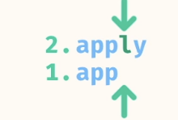
#### Solution

```
public static boolean lexicalOrder(String word1, String word2, String alphabet) {
    for (int i = 0; i < Math.max(word1.length(), word2.length()); i += 1) {
      char char1 = i < word1.length() ? word1.charAt(i) : '\0';
      char char2 = i < word2.length() ? word2.charAt(i) : '\0';
      int value1 = alphabet.indexOf(char1); //If index is not found it will return -1.
      int value2 = alphabet.indexOf(char2);
      if (value1 < value2) {
        return true;
      } else if (value1 > value2) {
        return false;
      } 
    }
    return true;
  }
```

```
n = length of shorter string
Time: O(n)
Space: O(1)
```

### 8. detect dictionary
Return a boolean indicating whether or not all words of the dictionary are lexically-ordered according to the alphabet.

You can assume that all characters are lowercase a-z.

You can assume that the alphabet contains all 26 letters.

```
List<String> dictionary = List.of("zoo", "tick", "tack", "door");
String alphabet = "ghzstijbacdopnfklmeqrxyuvw";
Source.detectDictionary(dictionary, alphabet); // -> true
```
--- 
Just an extension of the previous problem

```
public static boolean detectDictionary(List<String> dictionary, String alphabet) {
   
    for(int i=1;i<dictionary.size();i++){
      if(!isLexicalOrder(dictionary.get(i-1),dictionary.get(i),alphabet)) return false;
    }

    return true;
  }

  private static boolean isLexicalOrder(String word1, String word2, String alphabet){
    for(int i=0; i< Math.max(word1.length() ,word2.length()); i++){
      char c1 = i<word1.length() ? word1.charAt(i) :'\n';
      char c2 = i<word2.length() ? word2.charAt(i) :'\n';

      if(alphabet.indexOf(c1)<alphabet.indexOf(c2)) return true;
      if(alphabet.indexOf(c1)>alphabet.indexOf(c2)) return false;
    }

    return true;
  }
```

```
n = # of words in dictionary
k = # length of longest word
Time: O(nk)
Space: O(1)
```

//TODO check which chapter this should belong to
### 1. uncompress
return an uncompressed version of the string where each 'char' of a group is repeated 'number' times consecutively.

- Two Pointer  

```Source.uncompress("2c3a1t"); // -> "ccaaat"```

Use 2 pointers, to traverse the string and identify the numbers and characters

```
public static String uncompress(String s) {
    String result = "";
    String numbers = "0123456789";
    int i = 0;
    int j = 0;
    while (j < s.length()) {
      if (numbers.contains(String.valueOf(s.charAt(j)))) {
        j += 1;
      } else {
        int num = Integer.parseInt(s.substring(i, j));
        for (int count = 0; count < num; count += 1) {
          result += s.charAt(j);
        }
        j += 1;
        i = j;
      }
    }
    return result;
}
```


### 2. five sort
rearrange elements of the ArrayList such that all 5s appear at the end. Your method should perform this operation in-place by mutating the original ArrayList.

- Two Pointers

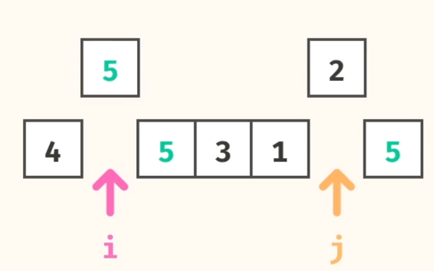
```
List<Integer> array = new ArrayList<>(List.of(12, 5, 1, 5, 12, 7));
Source.fiveSort(array);
// -> [12, 7, 1, 12, 5, 5] 
```

```
public static List<Integer> fiveSort(List<Integer> array) {
    int i = 0;
    int j = array.size() - 1;
    while (i < j) {
      if (array.get(j) == 5) {
        j -= 1;
      } else if (array.get(i) != 5) {
        i += 1;
      } else {
        Collections.swap(array, i, j);
      }
    }
    return array;
  }
```

Second solution, where both pointers start at end.

```
public static List<Integer> fiveSort(List<Integer> array) {
    int back = array.size()-1;
    int front = back;

    while(front >=0){
      if (array.get(front) == 5){
        int backElement = array.get(back);
        array.set(front,backElement);
        array.set(back,5);
        back--;
      }
      front--;
    }
    return array;
}
```