# System Design: Facebook Post Search

## Requirements

### 1. Functional Requirements

* Users can **create posts**.
* Users can **like posts**.
* Users can **search posts by keyword**.
* Search results can be **sorted by**:
  * Recency
  * Like count

### Non-Functional Requirements

* **Low latency**: Queries should return in <500ms (p50), scalable to p95.
* **Scalability**: Handle billions of posts, 10k QPS search, 100k likes/sec.
* **Freshness**: New posts should be searchable within <1 minute.
* **Availability**: High availability (e.g. 99.99%).
* **Discoverability**: Even cold/old posts must be searchable.

### Out of Scope

* Personalization (results are the same for all users)
* Privacy rules and group visibility
* Sophisticated relevance/ranking algorithms
* Fuzzy matching / typo-tolerance
* Images and multimedia in posts
* Real-time updates to search UI

---

## 2. Core Entities

* **User**: Can create posts, like posts.
* **Post**: Text content, user ID, timestamp.
* **Like**: User ID + Post ID (many-to-many); contributes to ranking.

---

## 3. Scale Estimations

* **Users**: 1B total
* **Post creation**: 1B * 1 post/day / (100k seconds/day) = 10k posts/sec
* **Likes**: 1B * 10 likes/day / (100k seconds/day) = 100k likes/sec
* **Searches**: 1B * 1 search/day / (100k seconds/day) = 10k searches/sec
* **Storage**:
  * Posts/day: 1B
  * Over 10 years: 1B posts/day * 365 days/year * 10 years = 3.6T posts
  * Size/post: \~1KB
  * Total: \~3.6PB

---

## 4. API

--

## 5. High-Level Design

### 1) Users should be able to create and like posts

* **Ingestion service** handles both POST and LIKE operations.
* Data written to source-of-truth DB (e.g., DynamoDB or scalable NoSQL).
* Likes stored as separate records or counters to support high write throughput.

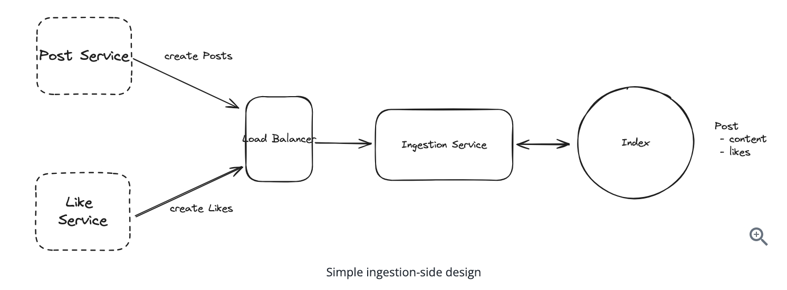

### 2) Users should be able to search posts by keyword

* Search API (e.g., `/posts/search?q=...`).
* Query routed to index storage (e.g., Redis / Inverted Index).

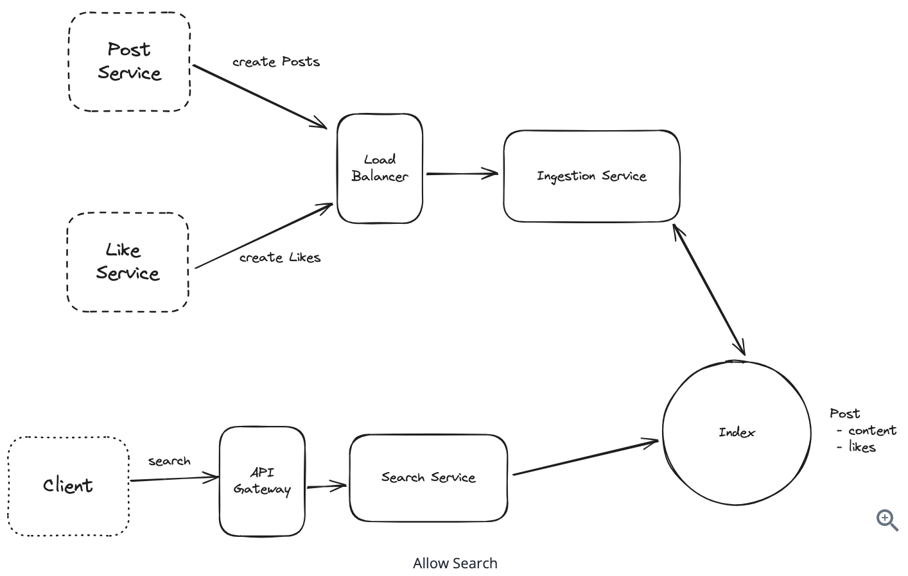 

#### Bad Solution

* Use an unindexed database and perform full table scan on post content.

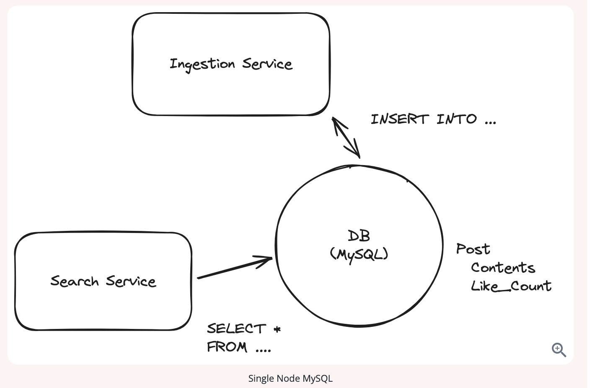
#### Great Solution

* Build a **custom inverted index**:

  * Map: `keyword -> list of post IDs`
  * Store in Redis (hot), S3 (cold)
  * Keep indexes bounded in size
  * Index created asynchronously via post-processing of ingestion events
  * maps each tokenized keyword to a posting list of post IDs that contain that word.
  * For each keyword, we maintain two views:
    - A Recency View: A list of post IDs ordered by timestamp (Redis List).
    - A Popularity View: A sorted set of post IDs ordered by like count (Redis Sorted Set).

### 3) Users should be able to get search results sorted by recency or like count

#### Bad Solution

* Fetch all posts for a keywork.
* Look up the timestamp or like count, then sort those in memory. 

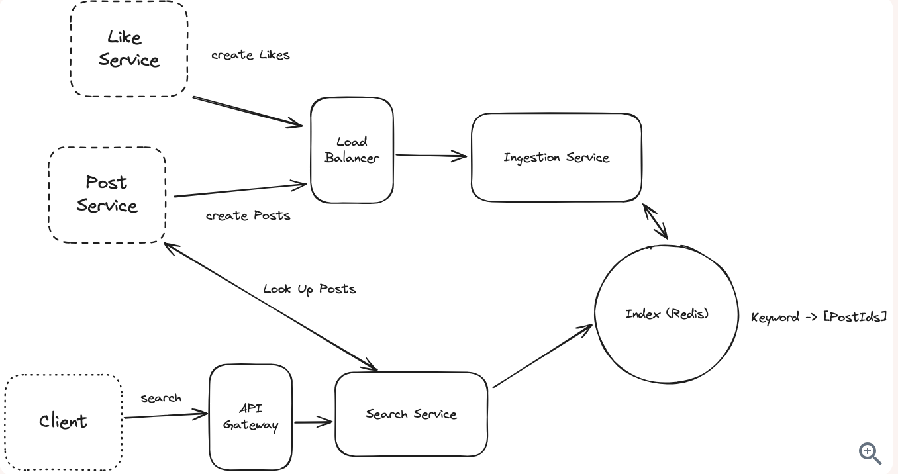 

#### Great Solution

* Maintain **two separate indexes per keyword**:

  * **Created Index**: Redis List sorted by post creation time
  * **Likes Index**: Redis Sorted Set with post ID as value, like count as score
* Query retrieves from appropriate index depending on sort parameter

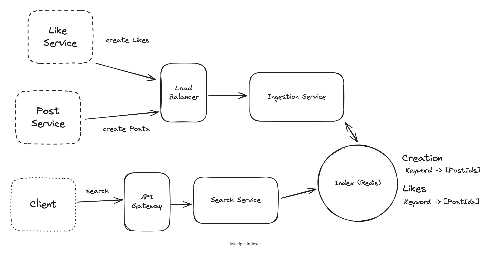
---

## 5. Potential Deep Dives

### 1) Handling High Read Traffic
* Use Caching, since we can tolerate a staless of < 1 minute
* Exploit the fact that search results are not personalized.
--
* **Good**: Use Redis

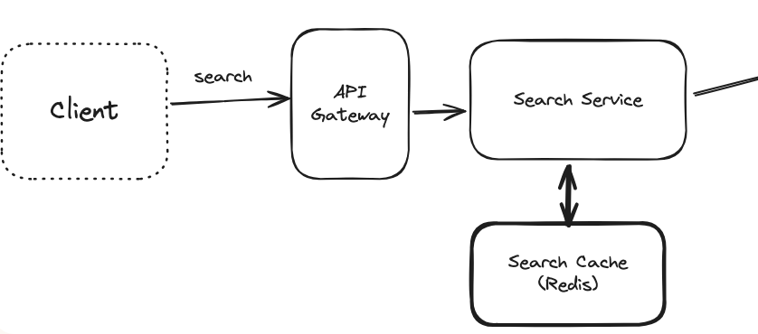
--
* **Great**: Use CDN
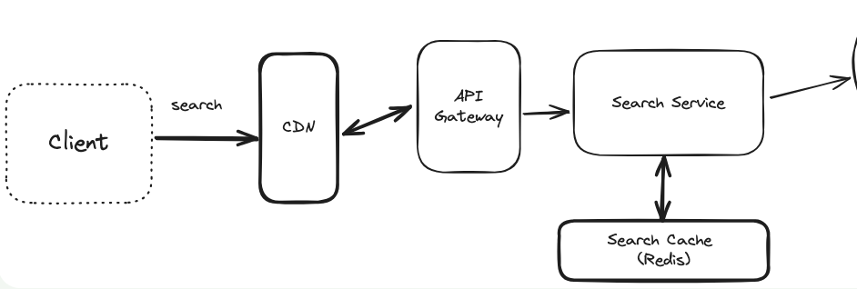

### 2) Multi-keyword / Phrase Queries

How can we support complex keyword or phrase-based queries? for example, searching for "Taylor Swift" or "Taylor_Swift"?
--
* **Good**: Intersection and Filter
  * Split input query into individual tokens.
  * Perform intersection across inverted lists for those tokens.

Challenges:
  * High cardinality keywords can lead to large posting lists.
  * Requires multiple lookups and intersections, which can be slow.
---
* **Great**:bigrams or shingles 
  * Use bigrams (pairs of consecutive words) to capture word adjacency, improving relevance for short phrases.
  * Use shingles (n-grams of arbitrary length) for capturing longer phrase patterns.
  * Challenge: bigrams reduce false positives but may miss meaningful variations; shingles offer flexibility but increase storage overhead.

- Combine both techniques selectively — index bigrams for frequently searched pairs, and apply shingles for specific domains or power users.
- Filter out stop words (e.g., "the", "of") to reduce unnecessary index size and noise.
- Maintain metadata on phrase frequency to prioritize indexing important multi-word terms.

### 3) High Write Volume (Posts + Likes)

#### Post Creation

* **Solution**:
  * Use Kafka to buffer and stream post data.
  * Partition the load by partitioning Kafka topics which can be consumed by multiple Ingestion service insrtances.
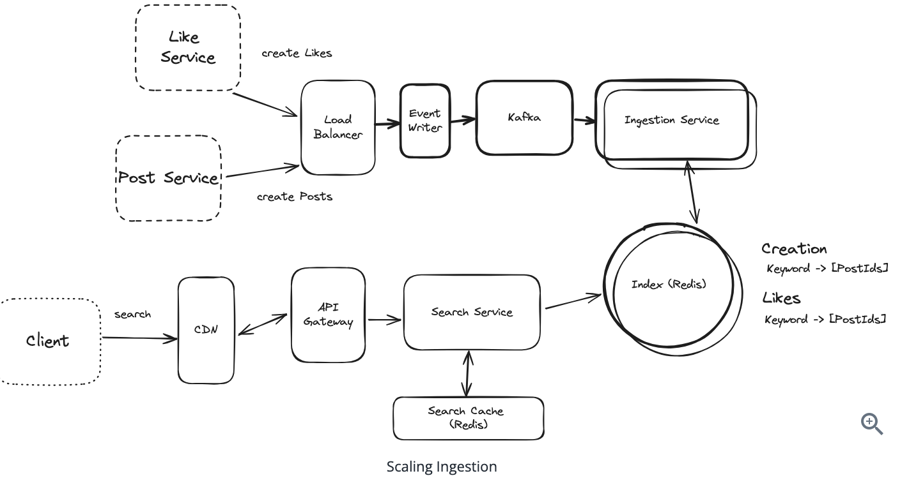  

#### Likes

* **Good**: Batch like events within a time window.
  * Reduce number of index updates by coalescing events.

* **Great**: Two Stage architecture
  * Use power-of-two thresholding (e.g., update index at 1, 2, 4, 8 likes).
  * Reduces index thrashing while still capturing trending behavior.

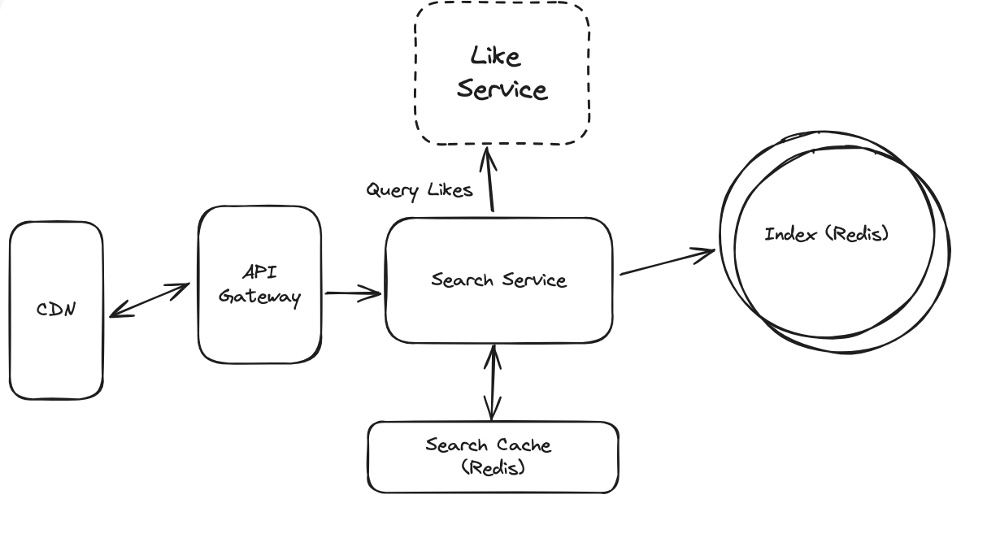  

### 4) Storage Optimization

How do we scale the system to store and serve multi-petabyte datasets efficiently?

* Cap index sizes per keyword (e.g., top 1k–10k post IDs).
* Periodically move cold keyword indexes to blob storage (e.g., S3, R2).
* On index miss:
  * Load posting list from cold storage.
  * Serve result with acceptable latency penalty.
  * Optionally repopulate hot index if keyword sees renewed interest.

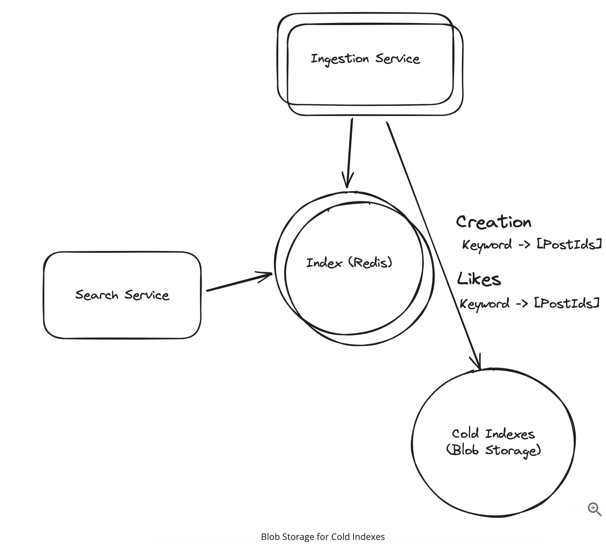  

---
## 6. Final Design
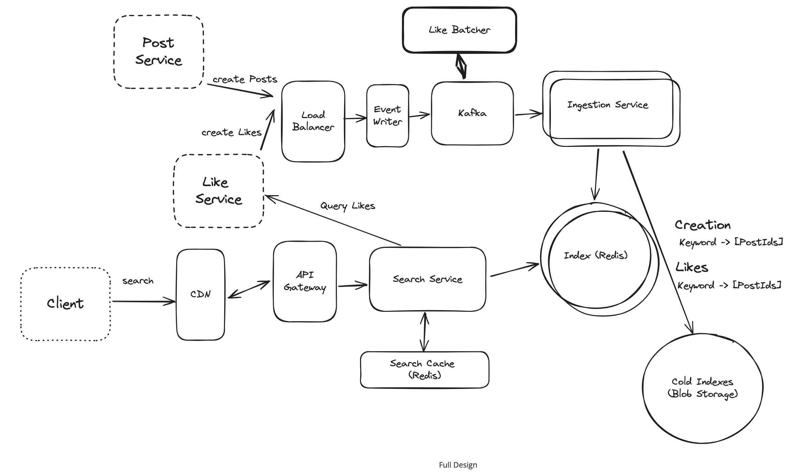