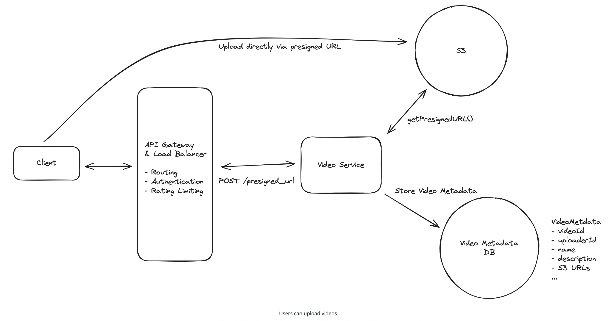
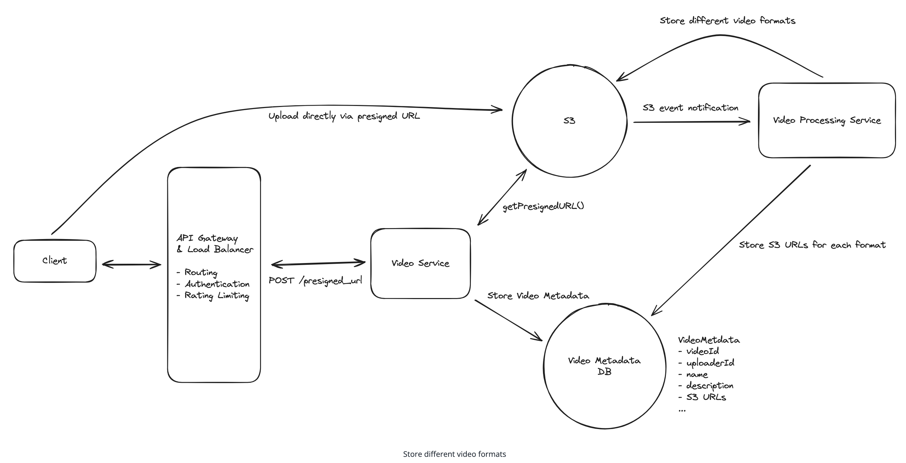
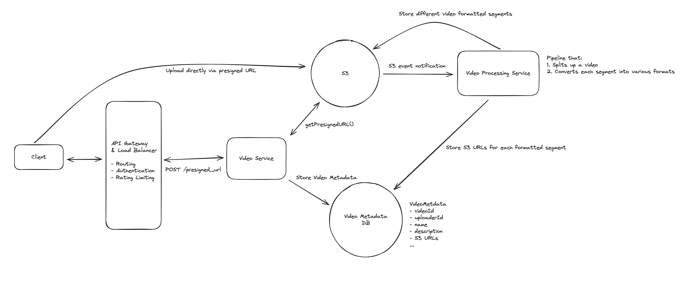
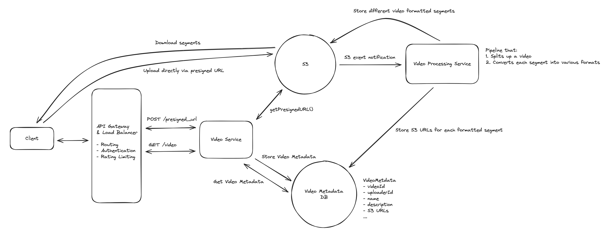
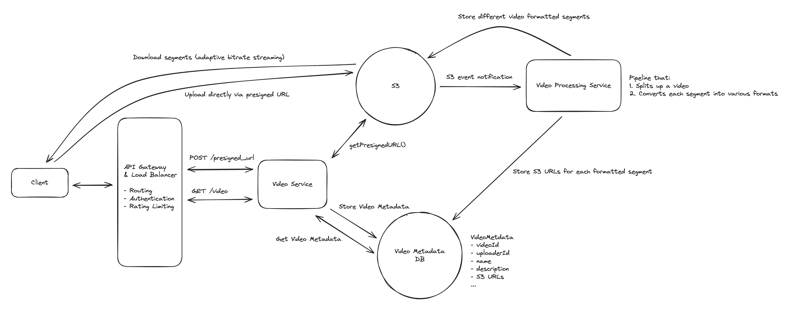
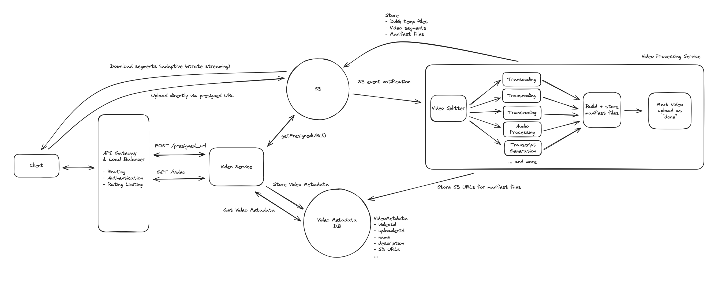
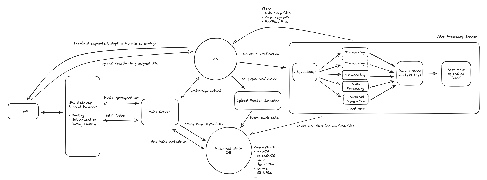
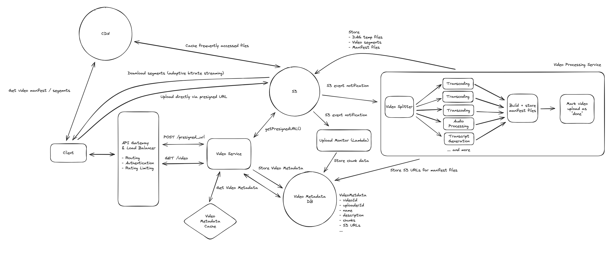

# YouTube - Video Streaming Platform

## Introduction
YouTube is a video-sharing platform that allows users to upload, view, and interact with video content.

## Requirements

### Functional Requirements
- Users can upload videos
- Users can watch (stream) videos

**Out of Scope:**
- Users can view information about videos (view counts, etc.)
- Users can search for videos
- Users can comment on videos
- Users can see recommended videos
- Users can make a channel and manage their channel
- Users can subscribe to channels

### Non-Functional Requirements
- High availability (prioritizing availability over consistency)
- Support for large video uploads (10s of GBs)
- Low latency streaming, even in low bandwidth environments
- Scale to handle ~1M videos uploaded per day, 100M videos watched per day
- Support for resumable uploads

## Core Entities
- User
- Video
- VideoMetadata

## API

### Upload a Video
```
POST /presigned_url
Request:
{
  VideoMetadata
}
->
{
  "presigned_url": "https://s3.amazonaws.com/...",
  "video_id": "abc123"
}
```

### Stream a Video
```
GET /videos/{videoId} -> VideoMetadata
```

## HLD

### Background: Video Streaming
Essential concepts for video system design:

- **Video Codec**: Compresses/decompresses digital video (encoder/decoder)
  - Trade-offs: compression time, platform support, efficiency, quality
  - Popular: H.264, H.265 (HEVC), VP9, AV1, MPEG-2, MPEG-4

- **Video Container**: File format storing video data (frames, audio) + metadata
  - Different from codec: codec = compression method, container = storage format
  - Support varies by device/OS

- **Bitrate**: Bits transmitted per time (kbps/mbps)
  - Higher resolution/framerate = higher bitrate
  - Compression reduces bitrate while maintaining quality

- **Manifest Files**: Text documents with video stream details
  - **Primary manifest**: Lists all available video versions
  - **Media manifest**: Lists links to video segments (few seconds each)
  - Used by video players as "index" for streaming

*Note: "Video format" = container + codec combination*

### 1) Users can upload videos

#### Storage Considerations
- **Video Metadata**: Store in Cassandra (horizontally partitionable, high availability)
- **Video Data**: Store in S3 via presigned URLs with multi-part upload
- **API Change**: POST /upload → POST /presigned_url (client uploads directly to S3)

. 

#### What to Store for Video Data

##### ❌ Bad Solution: Store the raw video
- Store original video file as-is
- **Cons**: No optimization for streaming, large file sizes

##### ✅ Good Solution: Store different video formats
- Transcode to multiple formats for different devices/bandwidths
- **Pros**: Better compatibility, adaptive streaming support


##### ✅✅ Great Solution: Store different video formats as segments
- Split videos into small segments (few seconds each)
- Store segments in different formats
- **Pros**: Enables adaptive bitrate streaming, better user experience



### 2) Users can watch videos
Now that we're storing videos, users should be able to watch them.

#### Streaming Options

##### ❌ Bad Solution: Download the video file
- Download complete video before playing
- **Cons**: High latency, poor user experience, bandwidth waste

##### ✅ Good Solution: Download segments incrementally
- Download video segments as needed
- **Pros**: Faster start times, better bandwidth utilization


##### ✅✅ Great Solution: Adaptive bitrate streaming
- Dynamically adjust video quality based on network conditions
- **Pros**: Smooth playback, optimal quality for current conditions


## Deep Dives

### 1. Video Processing for Adaptive Bitrate Streaming

#### Problem
How to efficiently process uploaded videos to support smooth streaming across different devices and network conditions.

#### Solution: DAG-Based Processing Pipeline
- **Input**: Original video file
- **Output**: 
  - Video segment files in different formats stored in S3
  - Manifest files (primary + media) stored in S3

#### Processing Steps
1. **Segment Creation**: Split video into small chunks (few seconds each)
2. **Transcoding**: Convert each segment to multiple formats (H.264, H.265, VP9)
3. **Audio Processing**: Extract and process audio tracks
4. **Transcript Generation**: Generate video transcripts
5. **Manifest Creation**: Create manifest files pointing to segments

#### Scalability Considerations
- **Parallel Processing**: Segments can be processed independently
- **Worker Nodes**: Scale horizontally based on queue depth
- **CPU-Intensive**: Transcoding is CPU-bound, requires multiple cores
- **Storage**: Use S3 for intermediate files, pass URLs between workers


---

### 2. Resumable Uploads

#### Problem
How to handle large video uploads that may be interrupted by network issues or user actions.

#### Solution: Chunked Upload with Fingerprinting
1. **Chunking**: Divide video into 5-10MB chunks
2. **Fingerprinting**: Generate hash for each chunk
3. **Progress Tracking**: Store chunk status in VideoMetadata
4. **Resume Logic**: Skip already uploaded chunks on resume

#### Implementation Details
- **VideoMetadata Schema**:
  ```json
  {
    "chunks": [
      {"fingerprint": "abc123", "status": "uploaded"},
      {"fingerprint": "def456", "status": "not_uploaded"}
    ]
  }
  ```
- **S3 Integration**: Use multipart upload with S3 event notifications
- **Lambda Function**: Update chunk status when S3 receives chunk

#### Benefits
- **Reliability**: Handles network interruptions gracefully
- **User Experience**: No need to restart large uploads
- **Efficiency**: Only upload missing chunks


---

### 3. Scaling for High Traffic

#### Problem
How to handle ~1M video uploads and 100M video views per day.

#### Component Scaling Analysis

##### Video Service
- **Stateless**: Horizontally scalable with load balancer
- **HTTP Requests**: Handle presigned URL generation and metadata queries

##### Video Metadata Database
- **Cassandra**: Leaderless replication, consistent hashing
- **Partitioning**: By videoId for uniform distribution
- **Hot Video Problem**: Popular videos may create hotspots

##### Video Processing Service
- **Queue-Based**: Internal queuing for burst handling
- **Elastic Scaling**: Scale worker nodes based on queue depth
- **DAG Orchestration**: Parallel processing of video segments

##### S3 Storage
- **Multi-Region**: Global availability
- **Elastic**: Handles high traffic and file volumes
- **Latency**: May be slow for users far from data centers

#### Optimization Strategies

##### Caching for Hot Videos
- **Redis/Memcached**: Cache popular video metadata
- **LRU Strategy**: Evict least recently used entries
- **Partitioning**: Cache partitioned by videoId
- **Benefits**: Faster access, reduced database load

##### CDN for Global Distribution
- **Edge Servers**: Cache video segments and manifest files
- **Geographic Proximity**: Reduce latency for global users
- **Offload Backend**: CDN handles streaming without backend interaction
- **Benefits**: Lower latency, reduced bandwidth costs

#### Final Optimized Architecture
- **Load Balancer**: Distribute requests across video services
- **Cache Layer**: Redis for hot video metadata
- **CDN**: CloudFront/Akamai for global video distribution
- **Database**: Cassandra with replication for hot video handling

---

### 4. Additional Deep Dives

#### Speeding Up Uploads
- **Pipelining**: Client segments video and uploads segments
- **Parallel Processing**: Backend processes segments as they arrive
- **Trade-offs**: Client complexity vs. faster upload experience

#### Resume Streaming
- **User Progress**: Store watch position per user per video
- **Resume API**: Return to last watched position
- **Storage**: Additional user-video relationship table

#### View Counts
- **Real-time Updates**: Use event streaming for view count updates
- **Caching**: Cache view counts to reduce database writes
- **Batching**: Batch view count updates for efficiency

## Final Design
The complete YouTube system design includes:
- **Upload Flow**: Presigned URLs → S3 → Processing Pipeline → CDN
- **Streaming Flow**: CDN → Adaptive Bitrate → Client
- **Scalability**: Horizontal scaling, caching, CDN distribution
- **Reliability**: Resumable uploads, fault tolerance, high availability 

