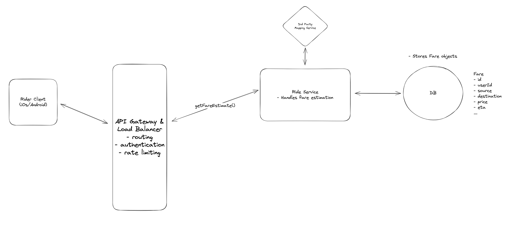
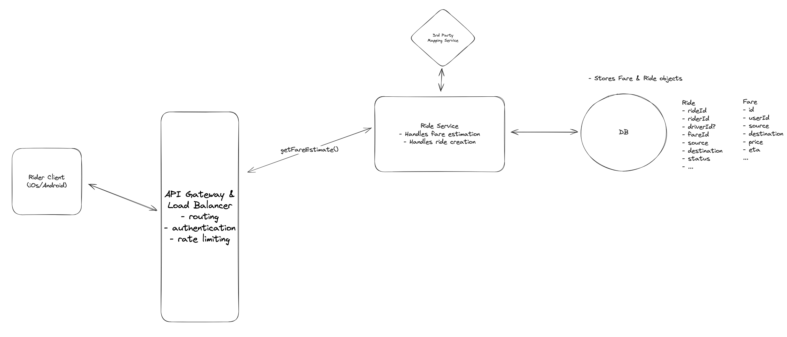
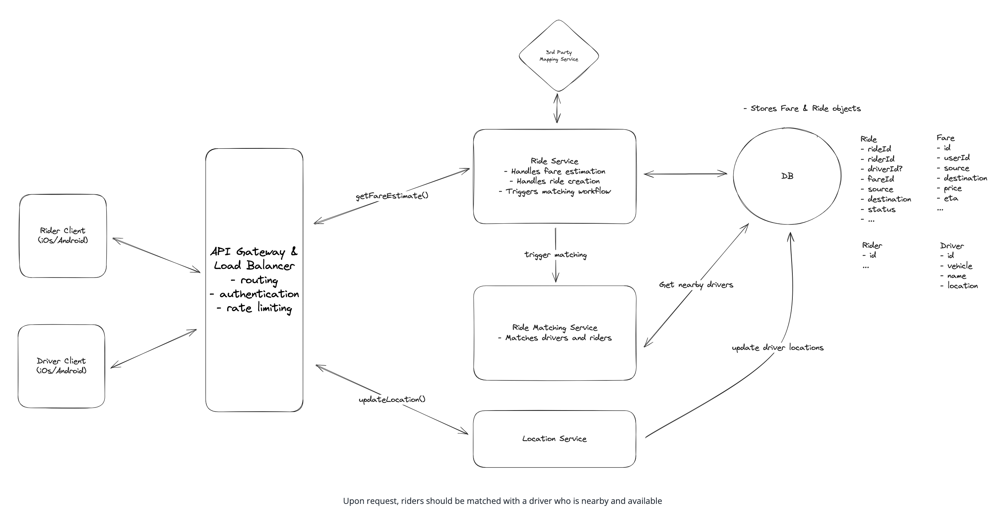
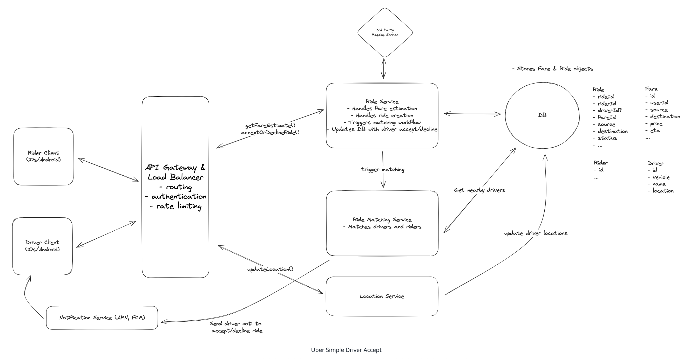
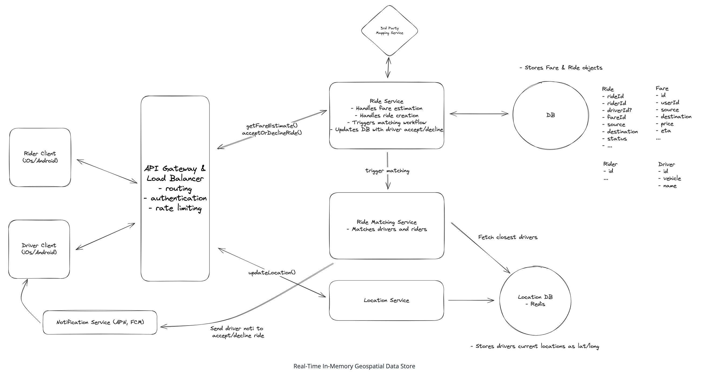
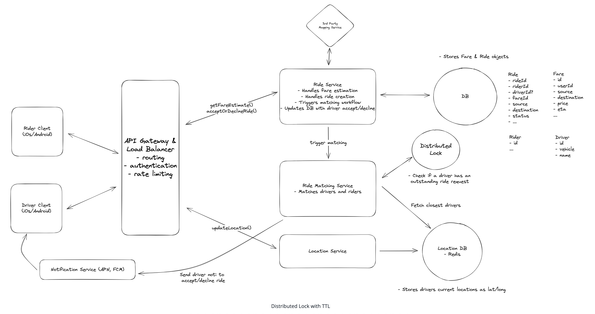
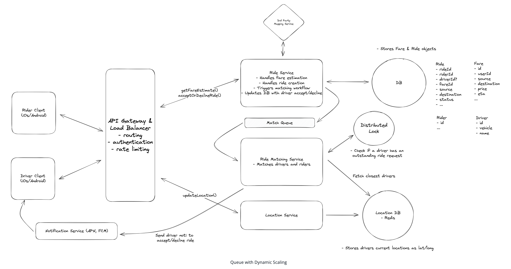
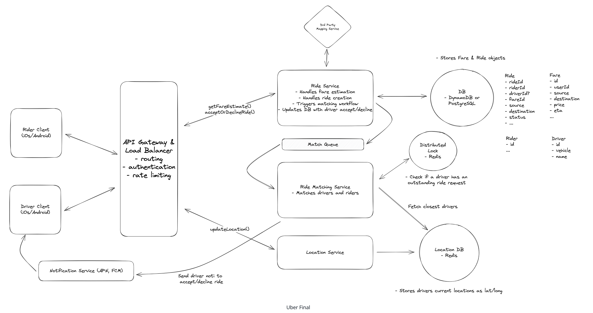

# Uber - Ride-Sharing Service

## Introduction
Uber is a ride-sharing platform that connects passengers with drivers. It allows users to book rides on-demand from their smartphones, matching them with a nearby driver who will take them from their location to their desired destination.

## Requirements

### Functional Requirements
**Core Requirements (In Scope):**
- Riders request estimated fare.
- Riders accept fare to get matched to a driver
- Riders should be matched with a driver who is nearby and available
- Drivers can accept/decline and navigate to pickup/drop-off.

**Out of Scope:**
- Riders should be able to rate their ride and driver post-trip
- Drivers should be able to rate passengers
- Riders should be able to schedule rides in advance
- Riders should be able to request different categories of rides (e.g., X, XL, Comfort)

### Non-Functional Requirements
**Core Requirements:**
- Low latency ride matching (< 1 minute to match or failure)
- Strong consistency in ride matching to prevent any driver from being assigned multiple rides simultaneously
- Handle high throughput, especially during peak hours or special events (100k requests from same location)

**Out of Scope:**
- Security and privacy of user and driver data, complying with regulations like GDPR
- The system should be resilient to failures, with redundancy and failover mechanisms in place
- The system should have robust monitoring, logging, and alerting to quickly identify and resolve issues
- The system should facilitate easy updates and maintenance without significant downtime (CI/CD pipelines)

## Core Entities
- **Rider**: User who requests rides (name, contact details, payment methods)
- **Driver**: User who provides transportation (personal details, vehicle info, availability status)
- **Fare**: Estimated fare for a ride (pickup/destination, estimated fare, ETA)
- **Ride**: Individual ride from request to completion (rider/driver, vehicle, state, route, actual fare, timestamps)
- **Location**: Real-time location of drivers (latitude/longitude, timestamp)

## API

### Get Fare Estimate
```
POST /fare -> Fare
Body: {
  "pickupLocation": "",
  "destination": ""
}
```

### Request Ride
```
POST /rides -> Ride
Body: {
  "fareId": ""
}
```

### Update Driver Location
```
POST /drivers/location -> Success/Error
Body: {
  "lat": "",
  "long": ""
}
```
*Note: driverId is in session cookie/JWT, not in body*

### Accept/Decline Ride Request
```
PATCH /rides/:rideId -> Ride
Body: {
  "accept/deny": ""
}
```

## HLD

### 1) Riders should be able to input a start location and a destination and get an estimated fare

#### Components
- **Rider Client**: iOS/Android app for users
- **API Gateway**: Entry point with authentication and rate limiting
- **Ride Service**: Manages ride state and fare calculations
- **Third Party Mapping API**: Google Maps for distance/time calculations
- **Database**: Stores Fare entities

. 

#### Flow
1. Rider enters pickup/destination → POST /fare
2. API Gateway handles auth/rate limiting → Ride Service
3. Ride Service calls Mapping API for distance/time
4. Apply pricing model → create Fare entity in Database
5. Return Fare to rider for decision


### 2) Riders should be able to request a ride based on the estimated fare

#### Components Added
- **Ride Table**: Stores ride information linked to accepted Fare

. 

#### Flow
1. Rider confirms ride request → POST /rides with fareId
2. API Gateway → Ride Service
3. Create Ride entry with status "requested"
4. Trigger matching flow for driver assignment

### 3) Upon request, riders should be matched with a driver who is nearby and available

#### Components Added
- **Driver Client**: Interface for drivers to receive requests and update location
- **Location Service**: Manages real-time driver location data
- **Ride Matching Service**: Handles ride requests and driver matching algorithm

. 

#### Flow
1. Ride request → Ride Matching Service
2. Create ride object → trigger matching workflow
3. Drivers continuously send location updates to Location Service
4. Matching workflow queries for closest available drivers
5. Find optimal match based on proximity, availability, rating

### 4) Drivers should be able to accept/decline a request and navigate to pickup/drop-off

#### Components Added
- **Notification Service**: Sends real-time notifications to drivers via APN (Apple Push Notification) and FCM (Firebase Cloud Messaging)


#### Flow
1. Ride Matching Service sends notification to top driver
2. Driver receives notification → opens Driver Client
3. Driver accepts/declines → PATCH /rides/:rideId
4. API Gateway → Ride Service
5. Update ride status to "accepted" + assign driver
6. Return pickup coordinates to Driver Client
7. Driver uses GPS to navigate to pickup

## Deep Dives

### 1) How do we handle frequent driver location updates and efficient proximity searches?

#### Problem
- **High Frequency Writes**: 10M drivers × every 5 seconds = 2M updates/second
- **Query Efficiency**: Full table scan for proximity search is inefficient
- **Cost**: 2M writes/second to DynamoDB = ~$100k/day

#### Solutions

##### ❌ Bad Solution: Direct Database Writes and Proximity Queries
- Write each location update directly to database
- Perform proximity searches on raw data
- **Cons**: Doesn't scale, high latency, poor performance

##### ✅ Good Solution: Batch Processing and Specialized Geospatial Database
- **Batch Processing**: Aggregate updates over short intervals
- **Geospatial Database**: PostgreSQL with PostGIS plugin
- **Quad-trees**: Specialized indexing for 2D spatial data
- **Cons**: Delay in location data, batch processing overhead

##### ✅✅ Great Solution: Real-Time In-Memory Geospatial Data Store
- **Redis**: In-memory geospatial data store
- **Geohashing**: Encode lat/long into single string key
- **GEOSEARCH**: Optimized proximity search commands
- **TTL**: Automatic data expiration
- **Benefits**: Real-time updates, high throughput, low latency
- **Durability**: Redis persistence (RDB/AOF) + Sentinel for HA


---

### 2) How can we manage system overload from frequent driver location updates?

#### Problem
High-frequency location updates strain server resources and network bandwidth.

#### Solution: Adaptive Location Update Intervals
- **Dynamic Adjustment**: Based on speed, direction, proximity to requests, driver status
- **Client-Side Logic**: Use device sensors and algorithms to determine optimal interval
- **Examples**: Stationary/slow = less frequent, fast/changing direction = more frequent
- **Benefits**: Reduces updates while maintaining accuracy
- **Challenge**: Complex algorithm design for optimal frequency

---

### 3) How do we prevent multiple ride requests from being sent to the same driver simultaneously?

#### Problem
Ensure strong consistency: one driver = one ride request at a time, 10-second acceptance window.

#### Solutions

##### ❌ Bad Solution: Application-Level Locking with Manual Timeout Checks
- Mark ride request as "locked" when sent to driver
- Start timer for lock duration
- **Cons**: No coordination between service instances, inconsistent lock state, scalability issues

##### ✅ Good Solution: Database Status Update with Timeout Handling
- Move lock to database using transactions
- Update driver status to "outstanding_request"
- **Cons**: In-memory timeout lost if service crashes, requires cron job for cleanup

##### ✅✅ Great Solution: Distributed Lock with TTL
- **Redis**: Distributed lock with driverId as key
- **TTL**: 10-second automatic expiration
- **Flow**: Acquire lock → send request → accept = release lock, deny/expire = auto-release
- **Benefits**: Automatic cleanup, no coordination issues
- **Challenge**: Reliance on Redis availability


---

### 4) How can we ensure no ride requests are dropped during peak demand periods?

#### Problem
High volume during peak periods leads to dropped requests and poor user experience.

#### Solutions

##### ❌ Bad Solution: First-Come, First-Served with No Queue
- Process requests as they come in
- **Cons**: Doesn't scale, drops requests, no recovery from service failures

##### ✅✅ Great Solution: Queue with Dynamic Scaling
- **Message Queue**: Kafka/SQS for request queuing
- **Dynamic Scaling**: Scale Ride Matching Service based on queue size
- **Geographic Partitioning**: Partition queues by region
- **Offset Committing**: Only commit after successful match
- **Fault Tolerance**: Failed requests remain in queue for recovery
- **Priority Queue**: Prioritize based on driver proximity, rating, etc.


---

### 5) How can you further scale the system to reduce latency and improve throughput?

#### Solutions

##### ❌ Bad Solution: Vertical Scaling
- Increase server capacity (CPU, memory, storage)
- **Cons**: Expensive, requires downtime, not infinitely scalable, not fault tolerant

##### ✅✅ Great Solution: Geo-Sharding with Read Replicas
- **Horizontal Scaling**: Add more servers
- **Geographic Sharding**: Shard data by region
- **Read Replicas**: Improve read throughput
- **Benefits**: Reduces latency (closer to clients), scales horizontally
- **Scatter-Gather**: Only needed for proximity searches on boundaries
- **Consistent Hashing**: Distribute data evenly across shards
- **Replication Strategy**: Ensure fault tolerance and high availability

## Final Design

 

- **Real-time Location Tracking**: Redis geospatial store for driver locations
- **Intelligent Matching**: Adaptive algorithms with distributed locking
- **Queue-based Processing**: Kafka/SQS for peak demand handling
- **Geographic Distribution**: Geo-sharding for low latency
- **Fault Tolerance**: Replication and failover mechanisms
- **Scalability**: Horizontal scaling with dynamic load management 

