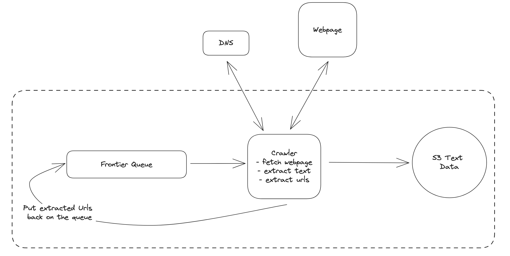
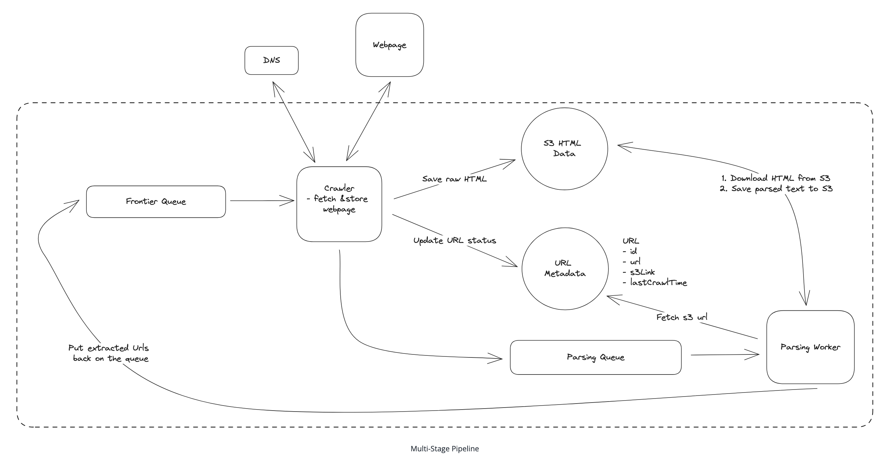
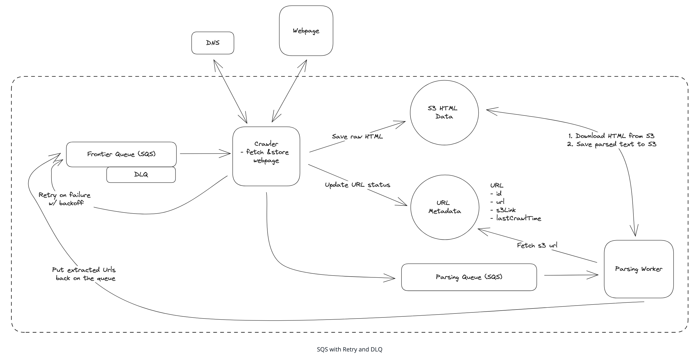
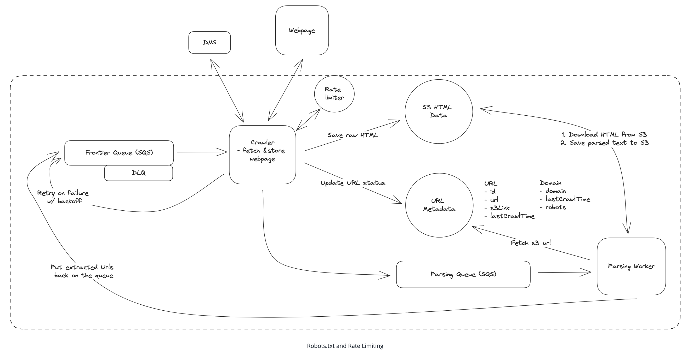
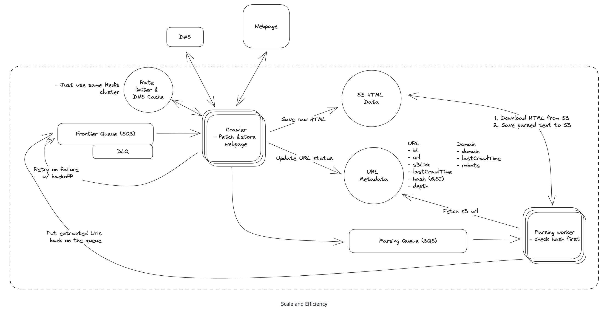

# Web Crawler - System Design

## Introduction
A web crawler is a program that automatically traverses the web by downloading web pages and following links from one page to another. It is used to index the web for search engines, collect data for research, or monitor websites for changes.

For this design, we'll focus on a web crawler whose goal is to extract text data from the web to train an LLM (Large Language Model), similar to what companies like OpenAI, Google, or Meta would use.

## Requirements

### Functional Requirements
**Core Requirements:**
- Crawl the web starting from a given set of seed URLs
- Extract text data from each web page and store the text for later processing

**Out of Scope:**
- The actual processing of the text data (e.g., training an LLM)
- Handling of non-text data (e.g., images, videos, etc.)
- Handling of dynamic content (e.g., JavaScript-rendered pages)
- Handling of authentication (e.g., login-required pages)

### Non-Functional Requirements
**Core Requirements:**
- Fault tolerance to handle failures gracefully and resume crawling without losing progress
- Politeness to adhere to robots.txt and not overload website servers inappropriately
- Efficiency to crawl the web in under 5 days
- Scalability to handle 10B pages

**Out of Scope:**
- Security to protect the system from malicious actors
- Cost to operate the system within budget constraints
- Compliance to adhere to legal requirements and privacy regulations

## System Interface & Data Flow

### System Interface
- **Input**: Seed URLs to start crawling from
- **Output**: Text data extracted from web pages

### Data Flow
1. Take seed URL from frontier and request IP from DNS
2. Fetch HTML from external server using IP
3. Extract text data from the HTML
4. Store the text data in a database
5. Extract any linked URLs from the web pages and add them to the list of URLs to crawl
6. Repeat steps 1-5 until all URLs have been crawled

## HLD

### Core Components
- **Frontier Queue**: Queue of URLs to crawl (Kafka, Redis, or SQS)
- **Crawler**: Fetches web pages, extracts text data, and extracts new URLs
- **DNS**: Resolves domain names to IP addresses
- **Webpage**: External servers hosting the web pages we crawl
- **S3 Text Data**: Blob storage for extracted text data (highly scalable and durable)



## Deep Dives

### 1) How can we ensure we are fault tolerant and don't lose progress?

#### Problem
Single crawler service doing multiple tasks (DNS, fetching, extraction) - failure in any task loses all progress.

#### Solution: Multi-Stage Pipeline

##### Pipeline Stages
1. **URL Fetcher**: Fetches HTML from external server
   - Stores raw HTML in blob storage
   - Can retry fetch without losing progress on other data
2. **Text & URL Extraction**: Extracts text data and linked URLs
   - Combines text extraction and URL extraction in single stage
   - Processes stored HTML from blob storage

 

##### Additional State Management
- **Metadata DB**: DynamoDB/PostgreSQL with URL tracking table
- **Queue Message**: Contains URL ID from Metadata DB (not raw HTML)
- **Benefits**: Robust to changing requirements, fault isolation

#### Failure Handling

##### ❌ Bad Solution: In Memory Timer
- Wait few seconds using in-memory timer and retry
- **Cons**: Timer lost if crawler goes down, not robust

##### ✅ Good Solution: Kafka with Manual Exponential Backoff
- Separate topic for failed URLs
- Store retry time in message
- **Cons**: Complex to implement and maintain

##### ✅✅ Great Solution: SQS with Exponential Backoff
- **Built-in Retries**: Configurable exponential backoff out of the box
- **Visibility Timeout**: 30s → 2min → 5min → 15min (max)
- **Dead Letter Queue**: After 5 retries, consider site offline
- **Benefits**: No custom implementation needed

#### Crawler Failure Recovery
- **Kafka**: Messages retained in log, crawlers track progress via offsets
- **SQS**: Messages remain until explicitly deleted, visibility timeout hides from other crawlers
- **Recovery**: New crawler picks up where failed one left off

 

---

### 2) How can we ensure politeness and adhere to robots.txt?

#### Problem
Need to respect website resources and follow robots.txt rules.

#### Robots.txt Understanding
- **Purpose**: Tells crawlers which pages they can crawl and how frequently
- **Example**:
  ```
  User-agent: *
  Disallow: /private/
  Crawl-delay: 10
  ```

#### Implementation Strategy

##### Robots.txt Handling
1. **Fetch robots.txt** for each domain (one-time download)
2. **Parse and store** in Metadata DB
3. **Check before crawling**: Disallow directive and Crawl-delay
4. **Domain tracking**: Store last crawl time per domain in Domain table
5. **Queue management**: Put URLs back with delay if Crawl-delay not met

##### Rate Limiting
- **Global limit**: 1 request per second per domain
- **Centralized tracking**: Redis for request counts per domain per second
- **Sliding window**: Track requests per domain per second
- **Jitter**: Add randomness to prevent synchronized behavior among crawlers


---

### 3) How to scale to 10B pages and efficiently crawl them in under 5 days?

#### Problem
Need to handle 10B pages in under 5 days with 2MB average page size.

#### Scaling Calculations
- **Network capacity**: 400 Gbps per instance
- **Theoretical max**: 400 Gbps / 8 bits/byte / 2MB = 25,000 pages/second
- **Practical utilization**: 30% = 7,500 pages/second
- **Single machine time**: 10B / 7,500 = 15.4 days
- **Required machines**: 15.4 days / 4 machines = 3.85 days (< 5 days requirement)

#### Component Scaling

##### Crawler Workers
- **Horizontal scaling**: Multiple crawler instances
- **I/O intensive**: Network bandwidth is primary constraint
- **Load testing**: Required for accurate performance numbers

##### Parser Workers
- **Dynamic scaling**: Scale based on Further Processing Queue size
- **Serverless options**: Lambda functions, ECS tasks
- **Keep pace**: Ensure parsing keeps up with crawling

##### DNS Optimization
- **DNS caching**: Cache lookups per domain
- **Rate limits**: Consider provider limits and costs
- **Multiple providers**: Round-robin between multiple DNS providers to vaoid hitting rate limits.
#### Efficiency Optimizations

##### Duplicate Detection
- **URL checking**: Check Metadata DB before queuing
- **Content hashing**: Hash page content for duplicate detection
- **Index approach**: Store hash in Metadata DB with index
- **Bloom filter**: Probabilistic duplicate detection (Redis built-in)
- **Trade-off**: Index simpler, Bloom filter more complex

##### Crawler Traps
- **Maximum depth**: Track crawl depth in URL table
- **Threshold**: Stop crawling if depth exceeds limit
- **Prevention**: Avoid infinite loops on self-referencing pages

---

## Additional Deep Dives

#### Dynamic Content Handling
- **Headless browsers**: Puppeteer for JavaScript-rendered pages
- **Content extraction**: Wait for dynamic content to load

#### System Monitoring
- **Health monitoring**: Datadog/New Relic for crawler performance
- **Alerting**: Notify on system issues

#### Large File Handling
- **Content-Length**: Check file size before downloading
- **Size limits**: Skip files that are too large

#### Continual Updates
- **URL Scheduler**: Schedule URLs for re-crawling
- **Logic-based**: Use last crawl time, popularity, etc.
- **Metadata DB**: Store URLs for scheduling instead of direct queuing

## Final Design
The complete web crawler system includes:
- **Multi-stage pipeline**: Fault-tolerant URL fetching and text extraction
- **Queue-based processing**: SQS with exponential backoff and DLQ
- **Politeness mechanisms**: Robots.txt compliance and rate limiting
- **Scalable architecture**: Horizontal scaling with DNS optimization
- **Efficiency features**: Duplicate detection and crawler trap prevention
- **Monitoring**: Health tracking and alerting systems 

