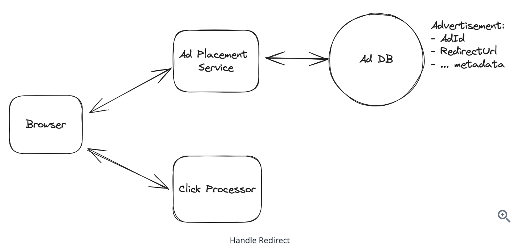
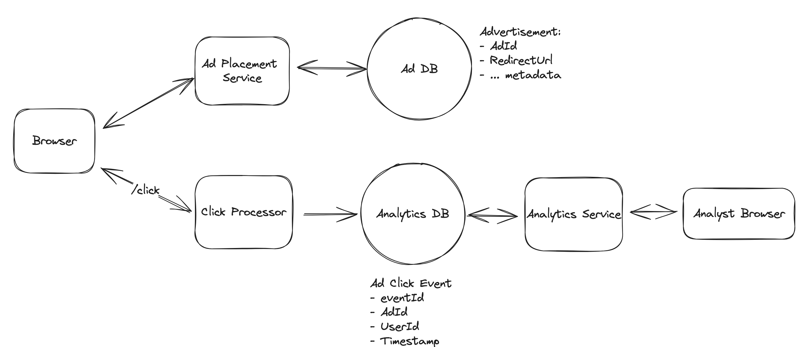
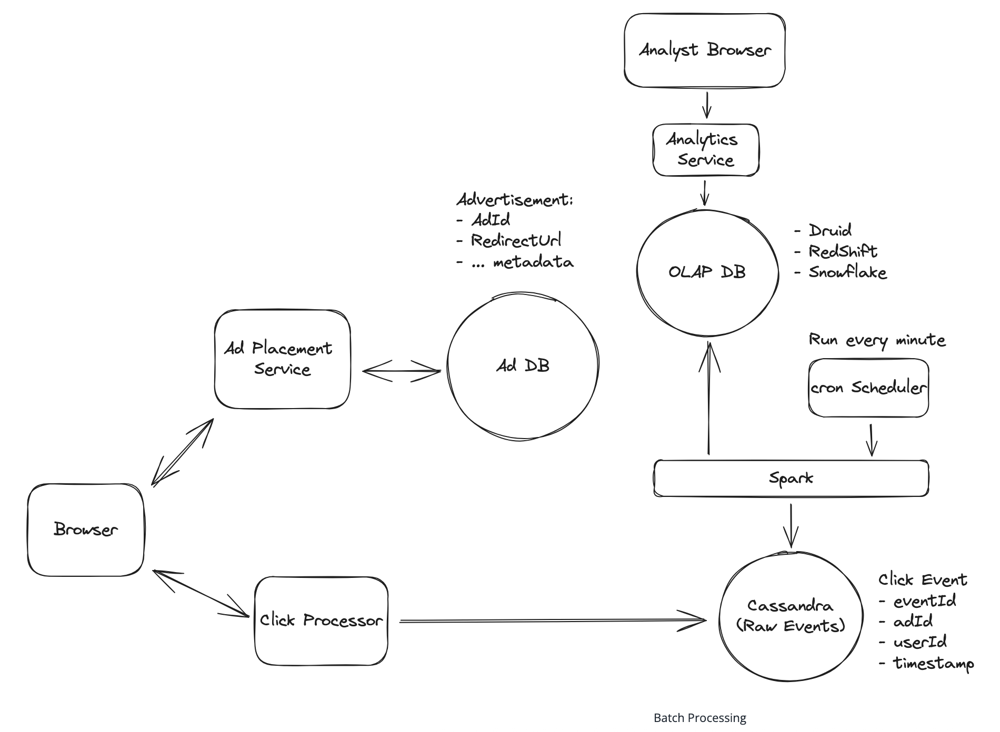
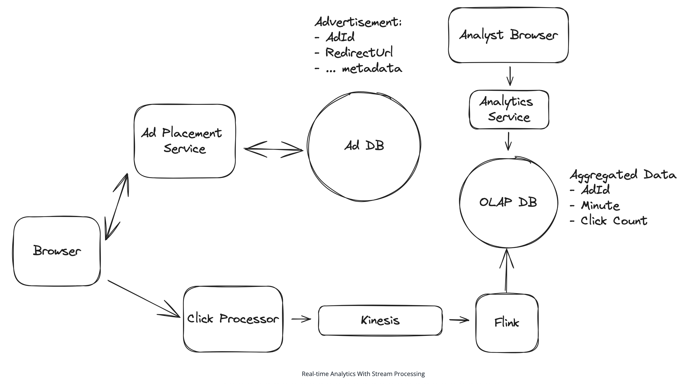
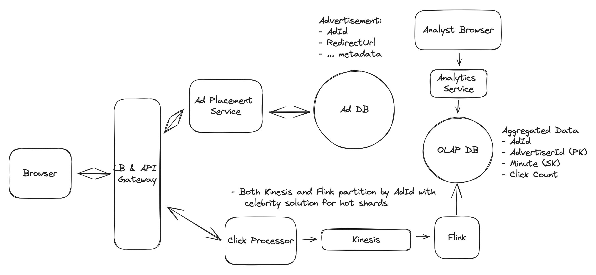
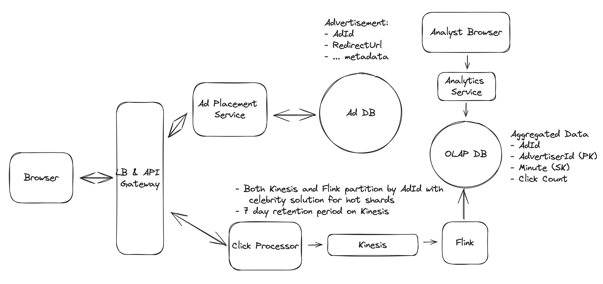
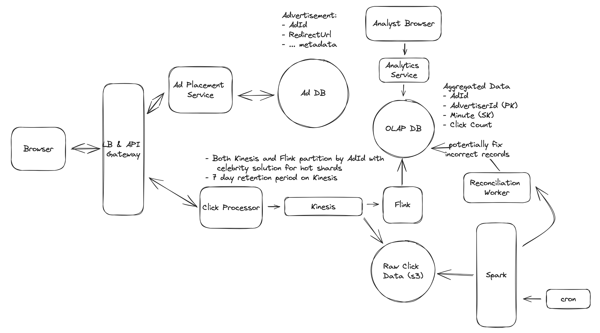
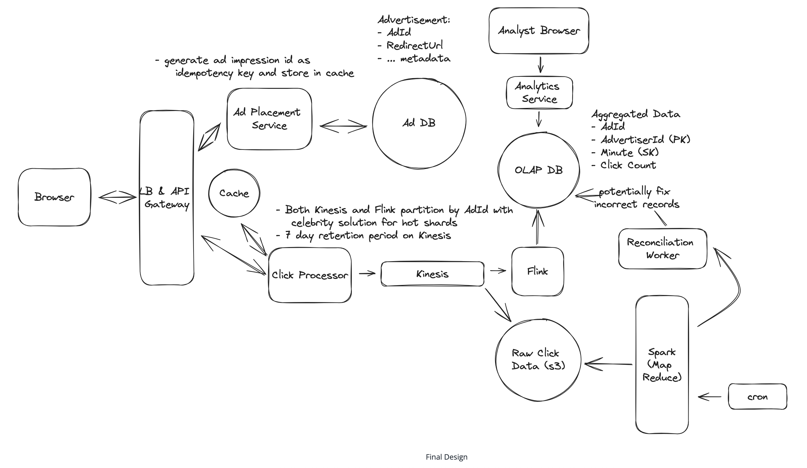

# Ad Click Aggregator

## Understanding the Problem
🖱 What is an Ad Click Aggregator
An Ad Click Aggregator is a system that collects and aggregates data on ad clicks. It is used by advertisers to track the performance of their ads and optimize their campaigns. For our purposes, we will assume these are ads displayed on a website or app, like Facebook.

## Functional Requirements
Core Requirements
1. Users can click on an ad and be redirected to the advertiser's website
2. Advertisers can query ad click metrics over time with a minimum granularity of 1 minute

Below the line (out of scope):
- Ad targeting
- Ad serving
- Cross device tracking
- Integration with offline marketing channels

## Non-Functional Requirements
**Scale:**
- 10M active ads at any given time
- 10k ad clicks per second at peak
- 100M clicks per day

Core Requirements
1. Scalable to support a peak of 10k clicks per second
2. Low latency analytics queries for advertisers (sub-second response time)
3. Fault tolerant and accurate data collection. We should not lose any click data
4. As realtime as possible. Advertisers should be able to query data as soon as possible after the click
5. Idempotent click tracking. We should not count the same click multiple times

Below the line (out of scope):
- Fraud or spam detection
- Demographic and geo profiling of users
- Conversion tracking

## The Set Up
### System Interface
1. Input: Ad click data from users.
2. Output: Ad click metrics for advertisers.

### Data Flow
1. User clicks on an ad on a website.
2. The click is tracked and stored in the system.
3. The user is redirected to the advertiser's website.
4. Advertisers query the system for aggregated click metrics.

## High-Level Design

### 1) Users can click on ads and be redirected to the target

- **Ad Placement Service**: Places ads on website with correct redirect URL
- **Click Endpoint**: `/click` endpoint tracks click and redirects user

#### Handle Redirect

**Good Solution: Client side redirect**
- Send redirect URL with each ad
- Browser automatically redirects to target URL
- In parallel, POST to `/click` endpoint to track click

**Challenges:**
- Users could bypass click tracking entirely
- Sophisticated users could grab URL and navigate directly

**Great Solution: Server side redirect**
- User clicks → sends request to our server
- Server tracks click and responds with 302 redirect
- Ensures we track every click

**Challenges:**
- Added complexity that could slow down user experience

### 2) Advertisers can query ad click metrics over time at 1 minute intervals

**Bad Solution: Store and Query From the Same Database**
- Store click events in database
- Query with GROUP BY for metrics

| EventId | Ad Id | User Id | Timestamp |
|---------|-------|---------|-----------|
| 1       | 123   | 456     | 1640000000|

- **Challenges**: Database becomes bottleneck at 10k clicks/second, GROUP BY queries are slow

**Good Solution: Separate Analytics Database with Batch Processing**
- **Event Database**: Cassandra (optimized for writes)
- **Batch Processing**: Spark every 5 minutes
- **Analytics Database**: OLAP (Redshift/Snowflake/BigQuery)
- **Data Flow**: Click → Event Store → Spark Job → OLAP → Query
- **Challenges**: Data is couple minutes old, not scalable for sudden spikes

 

**Great Solution: Real-time Analytics With Stream Processing**
- **Stream**: Kafka/Kinesis for real-time event processing
- **Stream Processor**: Flink/Spark Streaming for real-time aggregation
- **Data Flow**: Click → Stream → Stream Processor → OLAP → Query
- **Advantages**: Much lower latency (can aggregate every couple seconds), better scalability

 

## Potential Deep Dives

### 1) How can we scale to support 10k clicks per second?

**Scaling Strategy:**
- **Click Processor Service**: Horizontal scaling with load balancer
- **Stream (Kafka/Kinesis)**: Sharding by AdId (1MB/s or 1000 records/s per shard)
- **Stream Processor (Flink)**: Separate job per shard
- **OLAP Database**: Shard by AdvertiserId for faster queries

**Hot Shards Problem:**
- Popular ads (like Nike with LeBron) overwhelm single shard
- **Solution**: Append random number to AdId: `AdId:0-N`
- Only for popular ads determined by ad spend/click volume

 

### 2) How can we ensure that we don't lose any click data?

**Stream Retention Policy:**
- Kafka/Kinesis: Distributed, fault-tolerant, 7-day retention
- If stream processor goes down, can read lost data from stream

 

**Checkpointing (Flink):**
- Periodically write state to S3
- **For our case**: Not necessary due to small aggregation windows
- At most lose 1 minute of aggregated data, can re-read from stream

**Reconciliation:**
- Dump raw events to S3 data lake
- Run batch job to re-aggregate and compare with stream results
- Fix discrepancies and update OLAP DB
- Combines real-time + batch processing for accuracy

 

### 3) How can we prevent abuse from users clicking on ads multiple times?

**Bad Solution: Add userId To Click Event Payload**
- Require users to be logged in
- Dedup based on userId + adId combination
- **Challenges**: Requires all users logged in, doesn't account for retargeting

**Great Solution: Generate a Unique Impression ID**
- Ad Placement Service generates unique impression ID for each ad instance
- Impression ID sent to browser with ad
- Browser sends impression ID with click data
- Dedup based on impression ID

**Dedup Process:**
- Check if impression ID exists in cache before putting in stream
- If exists → duplicate, ignore
- If not exists → put click in stream and add impression ID to cache

**Security Enhancement:**
- Sign impression ID with secret key before sending to browser
- Verify signature when click comes in
- Prevents malicious users from sending fake clicks

**Cache Scaling:**
- Use distributed cache (Redis Cluster/Memcached)
- Cache data: 100M impressions × 16 bytes = 1.6 GB
- Enable cache persistence and replication

### 4) How can we ensure that advertisers can query metrics at low latency?

**Pre-aggregation Strategy:**
- Data already aggregated and stored in OLAP database
- Queries are fast for small time windows

**Large Time Window Optimization:**
- **Problem**: Queries slow for days, weeks, years
- **Solution**: Pre-aggregate data in OLAP database
  - Create new table with higher granularity (daily/weekly)
  - Nightly cron job aggregates data and stores in new table
  - Query pre-aggregated table for higher granularity
- **Trade-off**: Storage space for query performance

## Final Design

