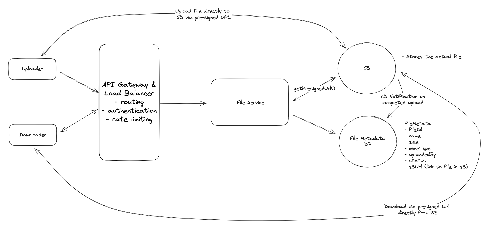

# Dropbox

## Introduction
Dropbox is a cloud-based file storage service that allows users to store and share files. It provides a secure and reliable way to store and access files from anywhere, on any device.

## Requirements


## Core Entities


## API

### upload a file
```
POST /files
Request:
{
  File, 
  FileMetadata
}
```
### download a file
```
GET /files/{fileId} -> File & FileMetadata
```

### share a file
```
POST /files/{fileId}/share
Request:
{
  User[] // The users to share the file with
}
```

## HLD

### Metadata and File Storage

- **Metadata**: Stored in a NoSQL database (e.g., DynamoDB)
  - Contains: file ID, name, size, MIME type, uploader ID, status (`uploading`, `uploaded`)
- **File Content**: Stored in Blob Storage (e.g., AWS S3, GCS)
  - Supports large file sizes, auto-scaling, versioning, and lifecycle management

---

### File Upload

#### ❌ Bad: Upload to Backend Server
- **Client → Backend → Local file system**
- Metadata saved to DB


**Cons:**
- Not scalable (limited storage, I/O bottleneck)
- Single point of failure
- Backend becomes a bottleneck for large files

#### ✅ Good: Backend Uploads to Blob Storage
- **Client → Backend → Blob Storage**
- Metadata saved after successful upload


**Pros:**
- Offloads file storage to scalable service  
- Better reliability than local FS

**Cons:**
- Redundant transfer (client uploads to backend, backend uploads to Blob)
- Increased latency and cost

#### ✅✅ Best: Client Uploads Directly to Blob Storage
- **Client → Blob Storage (via Presigned URL)**
- Backend gets notified (e.g., S3 Notifications) and updates metadata


**Pros:**
- Minimizes server load
- Faster, more scalable
- Transaction-like flow via upload status tracking

**Cons:**
- Slightly more complex to orchestrate presigned URL flow

---

### File Download

#### ❌ Bad: Backend Downloads and Forwards
- **Client → Backend → Blob Storage → Backend → Client**

**Cons:**
- Doubles bandwidth usage and latency
- Costly and inefficient

#### ✅ Good: Direct Download from Blob Storage
- **Client → Blob (via Presigned URL)**


**Pros:**
- Faster and more efficient
- Less backend involvement

**Cons:**
- May still be slow for global users (single-region Blob)

#### ✅✅ Best: Use CDN for Global Acceleration
- **Client → CDN (signed URL, expires in minutes)**


**Pros:**
- Reduced latency for global users
- Scalable, secure

**Cons:**
- Higher cost; requires cache invalidation strategy

---

### File Sharing

#### ❌ Bad: Embed ShareList in Metadata
- List of shared users directly inside file metadata

**Cons:**
- Metadata becomes bloated
- Harder to scale and query

#### ✅ Good: Use Cache for Shared Users
- Use in-memory cache (e.g., Redis) to speed up share list retrieval

**Pros:**
- Faster access for frequent queries

**Cons:**
- Cache invalidation complexity
- Still tied to metadata if not designed carefully

#### ✅✅ Best: Separate Table for Sharing
- New DB table: `file_id → [user_ids]`

**Pros:**
- Decouples logic
- Cleaner design, better indexing and query performance

---

### File Sync Across Devices

#### Local → Remote
- File watcher (e.g., FSEvents, FileSystemWatcher) detects changes
- Uploads new content + updates metadata
- Simple conflict strategy: *last-write-wins*

#### Remote → Local

##### ❌ Polling Only
- Clients poll `GET /files/{fileId}/changes`

**Cons:**
- Wastes bandwidth
- Slow sync

##### ✅ WebSockets/SSE Only
- Push updates from backend to clients

**Pros:**
- Real-time sync

**Cons:**
- Hard to scale (persistent connections)

##### ✅✅ Best: Hybrid Sync Strategy
- **WebSockets for fresh files**
- **Polling for stale files**

**Pros:**
- Efficient use of resources
- Real-time for critical paths, polling fallback

---

#### Final HLD

---

## Deep Dives

## Potential Deep Dives

---

## Potential Deep Dives

---

### 1. Large File Upload Support

#### 🚨 Problem
Uploading large files (e.g., 50GB) via a single HTTP POST request is unreliable due to:
- Server/browser payload limits
- Network interruptions (no resumability)
- Upload timeouts
- Poor user experience (no progress feedback)

#### ✅ Client-Side Chunked Upload
- File is split into 5–10MB chunks **on the client**
- Each chunk and full file is fingerprinted (e.g., SHA-256)
- Each chunk is uploaded using a **presigned URL**
- Upload status is tracked in file metadata (e.g., chunk-level states)
- **Resumability**: On reconnect, client resumes remaining chunks
- **Metadata update**:
  - Option A: Client sends `PATCH` requests to update status
  - ✅ Option B (preferred): Backend updates metadata via **S3 Event Notifications**


#### ✅✅ Use S3 Multipart Upload (Preferred in Real World)
- Client uses AWS SDK for multipart upload
- S3 handles parallel uploads, retries, merging parts

**Pros**:
- Highly reliable
- Built-in retry/resume support

**Cons**:
- Vendor-specific
- Less transparent in interviews unless you explain inner workings

---

### 2. Speed Optimization: Uploads, Downloads, and Syncing

#### 🚀 Upload
- **Parallel chunk upload** to maximize throughput
- **Adaptive chunk sizing** based on network conditions

#### 📥 Download
- Avoid routing downloads through backend
- Use **presigned download URLs**
- ✅ Use a **CDN (e.g., CloudFront)** for latency reduction

#### 🔁 Syncing
- Hybrid strategy:
  - **WebSockets/SSE** for active files (real-time sync)
  - **Polling** for stale files (conserves resources)

#### 📦 Compression
- Compress before upload / decompress after download
- Only compress when effective (e.g., text files)

**Algorithms**:
- Gzip: good support
- Brotli: higher ratio, newer
- Zstandard: best speed + compression

> Skip compression for images/videos where compression gain is negligible.

---

### 3. File Security

#### 🔐 Encryption
- **In Transit**: HTTPS (TLS)
- **At Rest**: Enable S3 encryption (SSE)

#### 🛂 Access Control
- Validate access based on `shared_files` table
- Do not embed access lists in file metadata

#### 🔗 Signed URLs (Presigned URLs)
- Time-limited (e.g., 5 mins)
- Bound to specific object path and HTTP method
- Optional: Restrict by IP, user agent

#### 🌐 CDN Integration
- Generate signed URLs for CDN as well (e.g., CloudFront)
- CDN validates signature and expiration before serving content

---

### 4. Resumable Uploads

#### 🔄 Flow
1. **Fingerprint** file and chunks using content hash (SHA-256)
2. Client checks if file exists:  
   `GET /files/{fingerprint}` → check metadata
3. Client only uploads missing chunks via presigned URLs
4. S3 sends **event notifications** as chunks are uploaded
5. Backend updates `FileMetadata` chunk statuses
6. Once all chunks are `"uploaded"`, mark file as complete

#### Benefits
- Supports large files over unreliable networks
- No need to re-upload completed chunks
- Enables progress indicators and retries

---

### 5. Trade-Offs to Discuss in Interviews

| Area | Trade-Off |
|------|-----------|
| **Availability vs Consistency** | Eventual consistency OK for sync; prioritize availability |
| **Backend Simplicity vs Performance** | Direct-to-Blob upload offloads work but adds orchestration complexity |
| **Polling vs WebSockets** | Polling is simple but inefficient; WebSockets are real-time but harder to scale |
| **CDN Usage** | Improves performance, but increases cost; use caching policies |
| **Chunk Size** | Small chunks = more overhead; large chunks = less control over retries |
| **Compression** | Not always worth it (e.g., for media); evaluate per file type |

---
