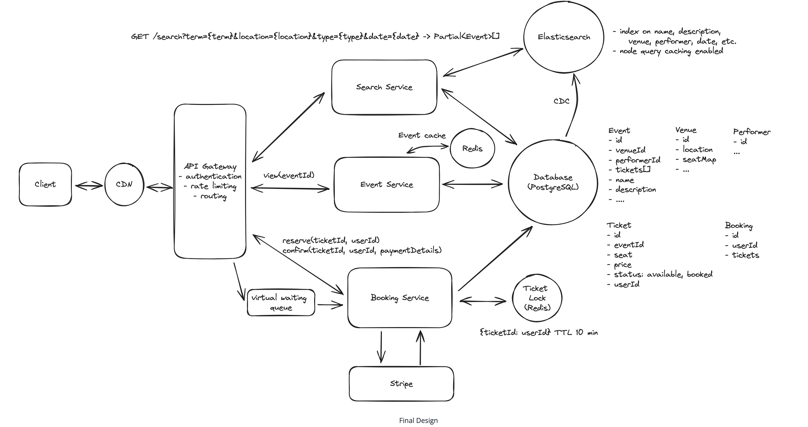

# TicketMaster
Ticketmaster is an online platform that allows users to purchase tickets for concerts, sports events, theater, and other live entertainment.

## Requirements


## Core Entities


## Api Endpoints
```
// Get Event

GET /events/:eventId -> Event & Venue & Performer & Ticket[]

- tickets are to render the seat map on the Client
```

```
//Search Events

GET /events/search?keyword={keyword}&start={start_date}&end={end_date}&pageSize={page_size}&page={page_number} -> Event[]

```

```
// Book tickets for an event

POST /bookings/:eventId -> bookingId
 {
   "ticketIds": string[], 
   "paymentDetails": ...
 }
```

## HLD
1) Users should be able to view events
2) Users should be able to search for events
3) Users should be able to book tickets for events. 


## Deep Dives

### 1. Improving the Booking Experience (Ticket Reservation)

#### Problem
Users may spend time filling out payment info only to find their ticket was booked by someone else.

#### Bad Solution: Pessimistic Locking
- Uses `SELECT FOR UPDATE` to lock rows.
- Keeps DB transactions open during checkout (~5 minutes).
- ❌ Causes contention, deadlocks, scaling issues.

#### Good Solution: Status Field with Expiration + Cron
- Ticket states: `available`, `reserved`, `booked`.
- Reservation sets status to `reserved` with an expiration timestamp.
- A cron job reverts `reserved` tickets to `available` if expired.
- ✅ Better than pessimistic locks but introduces lag.

#### Great Solution: Implicit Status
- Use short DB transactions to check status + expiration inline.
- Only treat a ticket as `reserved` if not expired.
- Periodic sweep job (optional) cleans up expired reservations.
- ✅ Robust even if sweep job is delayed.

#### Great Solution: Distributed Lock with TTL (e.g., Redis)
- Store ticket lock in Redis with TTL (e.g., 10 min).
- Manual release on success or auto-expire on timeout.
- ✅ Decouples DB logic and enables scalable locking.

---

### 2. Scaling the View API

#### Requirements
- Handle 10s of millions of concurrent read requests during popular events.

#### Solution: Caching + Load Balancing + Horizontal Scaling
- Cache event metadata aggressively (names, venue, performers).
- Use Redis/Memcached for fast access.
- Load balance using algorithms like Round Robin or Least Connections.
- Horizontally scale stateless services (e.g., Event Service).

---

### 3. Real-Time UX During Popular Events

#### Problem
Seat maps become stale quickly; users experience frustration on booking failures.

#### Good Solution: Server-Sent Events (SSE)
- Push seat updates to clients in real-time when seats are booked/reserved.
- ✅ Works well for moderately popular events.

#### Great Solution: Virtual Waiting Queue
- Queue users before showing the seat map.
- Use WebSockets to notify users when it's their turn.
- Controls system load and improves fairness during high demand.

---

### 4. Improving Search Latency

#### Problem
Wildcard searches using `LIKE` cause full table scans and high latency.

#### Good Solution: SQL Full-Text Indexes
- Use built-in full-text search in PostgreSQL/MySQL.
- ✅ Faster than `LIKE`, but harder to maintain and tune.

#### Great Solution: Elasticsearch (or Similar)
- Inverted index for high-speed text search.
- Support for fuzzy search (typos, misspellings).
- Use CDC (Change Data Capture) to sync updates from SQL DB.
- ✅ Better relevance, speed, typo tolerance.

---

### 5. Caching Search Results

#### Goal
Reduce repeated load on search infra.

#### Good Solution: Query Caching (Redis/Memcached)
- Cache key: query parameters.
- Set TTL based on freshness needs (e.g., 24h).
- ✅ Simple to implement, improves latency.

#### Great Solution: Query & Edge Caching
- Use Elasticsearch’s built-in caching.
- Implement adaptive caching for high-frequency queries.
- Use CDNs (e.g., CloudFront) for non-personalized search result caching.
- ✅ Reduces latency and central infra load.


## Final Design
