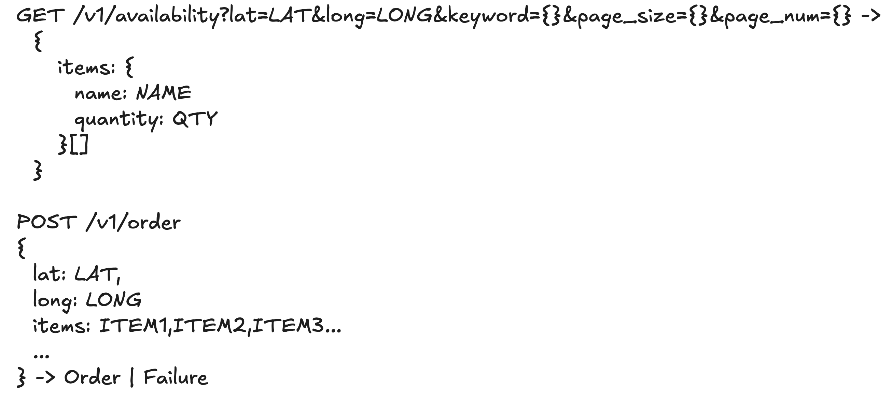
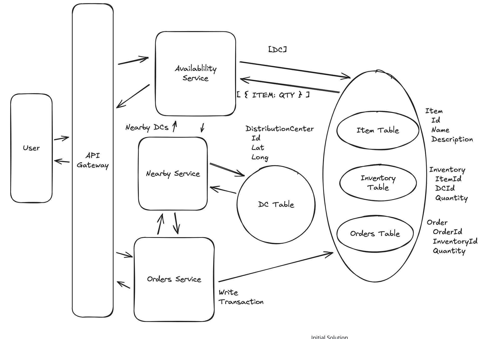
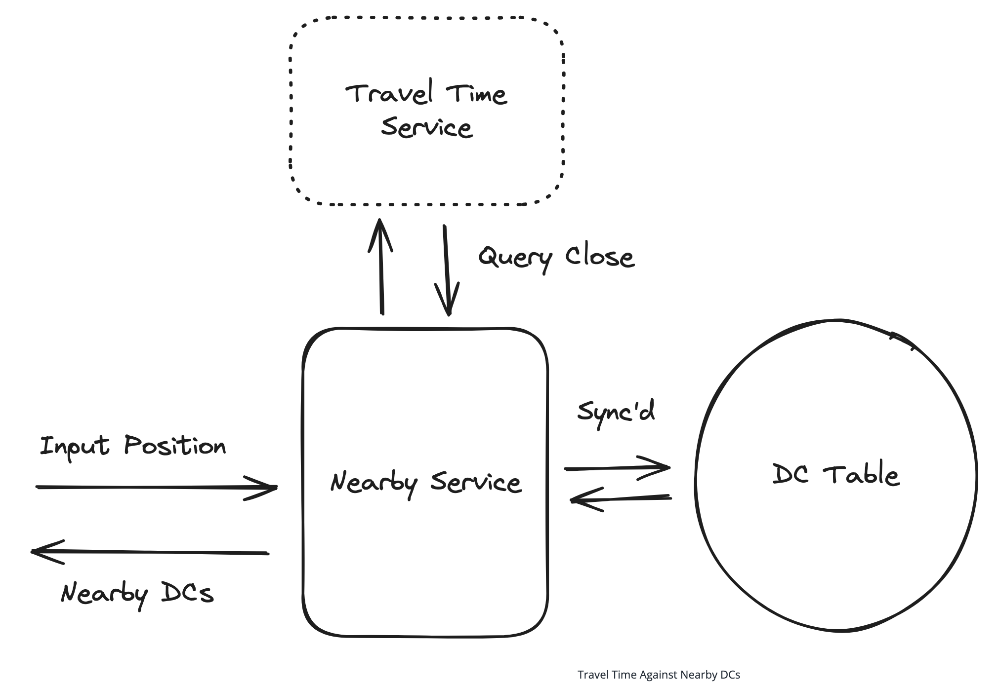
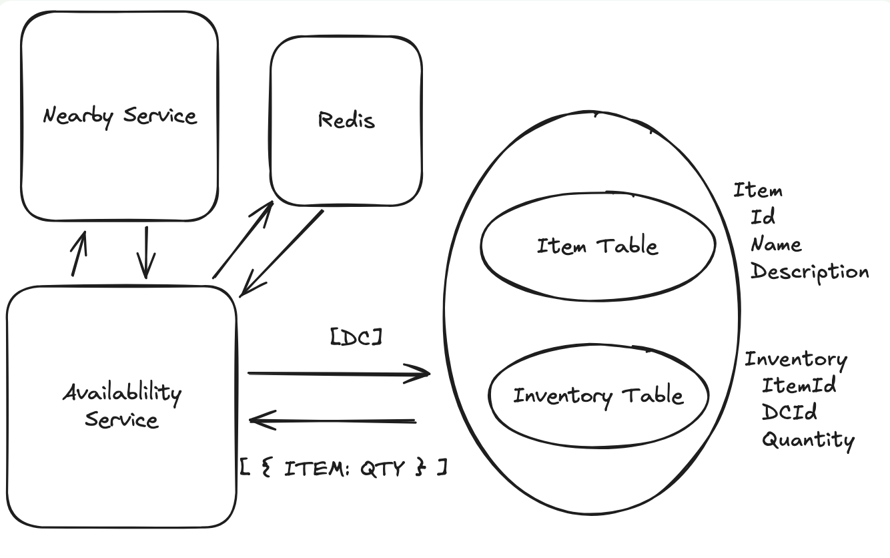
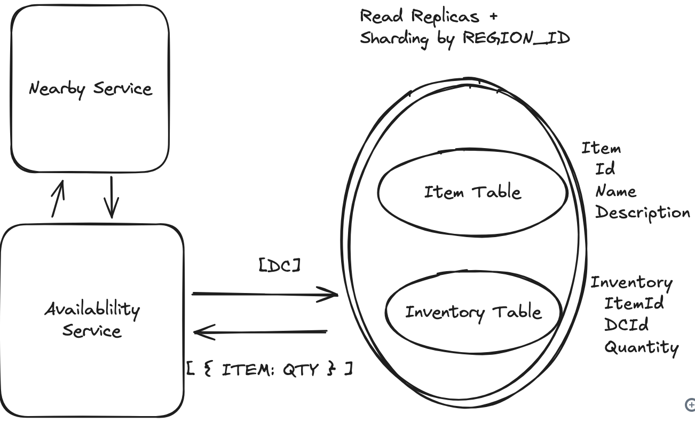
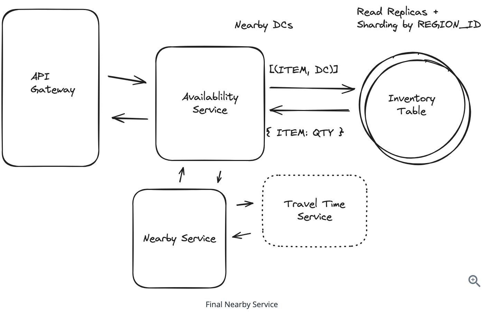

# Local Delivery System Design - GoPuff
Gopuff delivers goods typically found in a convenience store via rapid delivery and 500+ micro-fulfillment centers.

## Requirements

## Core Entities
- Item
- Inventory
- Distribution Center
- Order

## API
2 Apis:
- **Availability API**: For checking item availability.
- **Order API**: For placing orders.  

## HLD
- We can use Postgres , since the data needs to be consistent and we can update the inventory in a single transaction.

## Potential Deep Dives

### 1. Make Availability Lookups Incorporate Traffic and Drive Time

#### Problem
The initial Nearby Service uses only static geometric distance (e.g., Euclidean or Haversine), which can be inaccurate due to:
- Traffic conditions
- Road networks (e.g., rivers, highways)
- Regional access constraints

#### Bad Solutions
- **Simple SQL Distance**:
  - Uses great-circle distance to find nearby DCs.
  - Ignores drive time and traffic; may include unreachable DCs.
- **Calling Travel Time Service for All DCs**:
  - Accurate but inefficient — too many external calls for every query.

#### Great Solution: Two-Stage Filtering with Travel Time Estimation
1. **Pre-filter** DCs using a large radius (e.g., 60 miles) from user’s location.
2. **Call external Travel Time Estimation Service** only on these filtered DCs.
   - Takes traffic and road conditions into account.
   - Periodic in-memory sync of DC locations (every 5 mins) avoids constant DB hits.

> ✅ Efficient and accurate — only a small subset of DCs are checked in depth.

---

### 2. Make Availability Lookups Fast and Scalable

#### Problem
Estimated load:
- ~10M orders/day  
- Each user views ~10 pages before buying  
- Only ~5% of sessions convert  
→ **~20,000 availability queries/second**

#### Solution A: Query Inventory Through Cache (Redis)
- Use **Redis** for caching inventory responses.
- Cache keys include user location + filters.
- **Low TTL** (e.g., 1 minute) ensures freshness.
- On cache miss: Query DB, return result, and write to cache.
- **Orders Service** is responsible for invalidating/expiring affected cache entries upon writes.

#### Solution B: Read Replicas & Partitioning
- **Partition inventory data** by region (e.g., first 3 digits of ZIP code).
- Ensures most availability queries hit only 1 or 2 partitions.
- Use **Postgres read replicas** for Availability Service:
  - Can tolerate slight staleness.
  - Strong consistency (writes) reserved for Orders Service using the Postgres leader.

> ✅ Combines horizontal scaling with efficient data access and freshness.

## Final Design
[This only captures the Get Availability API, not the Order API.]

