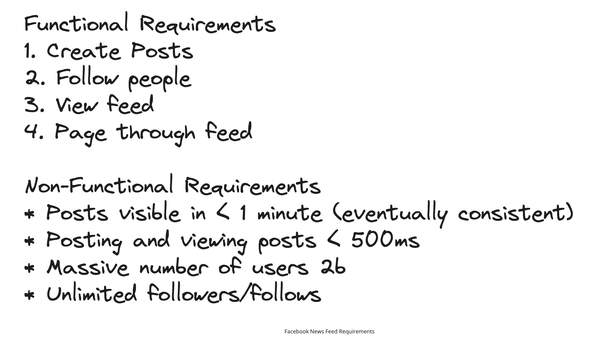
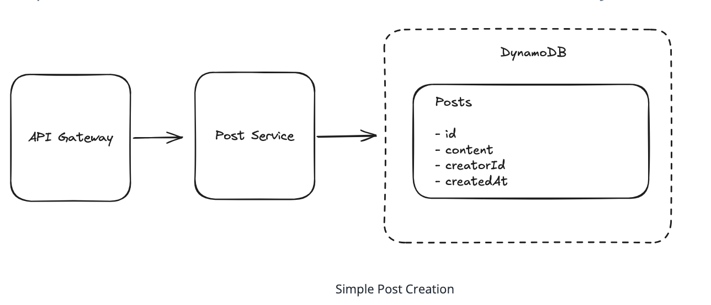
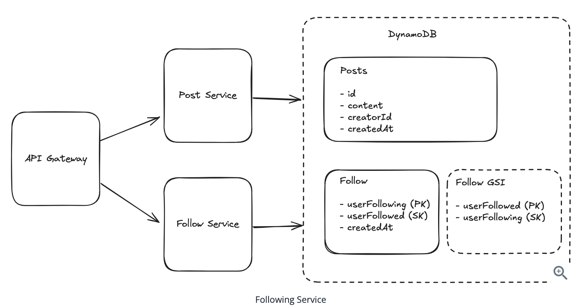
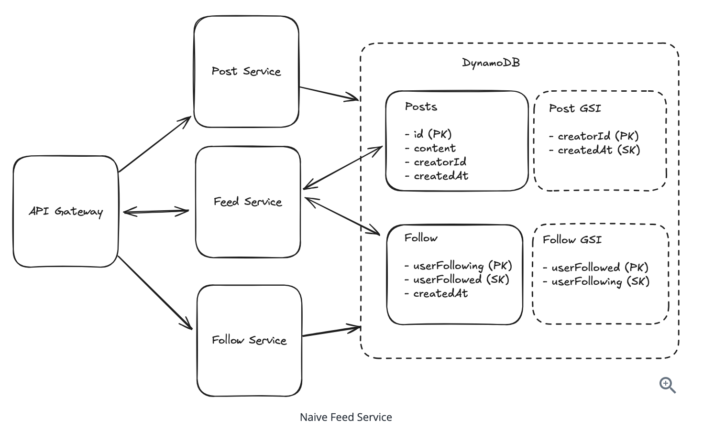
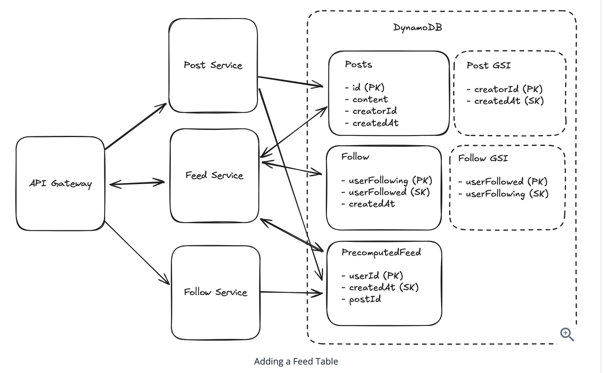
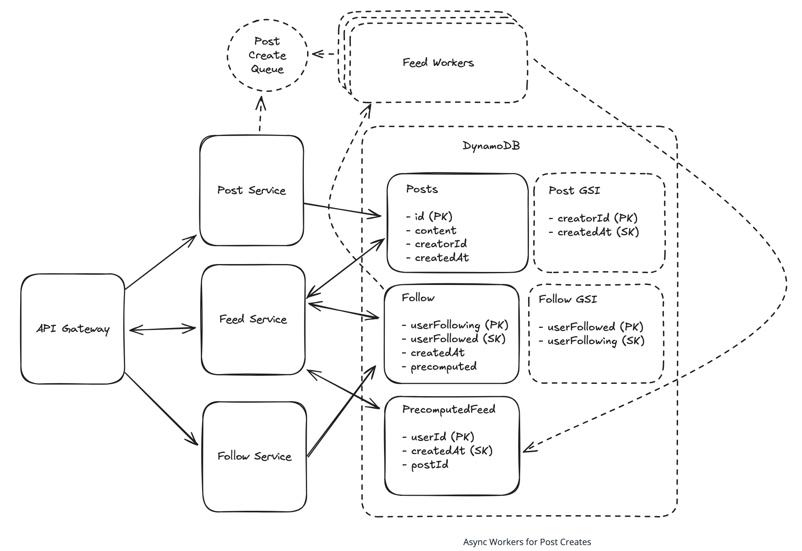
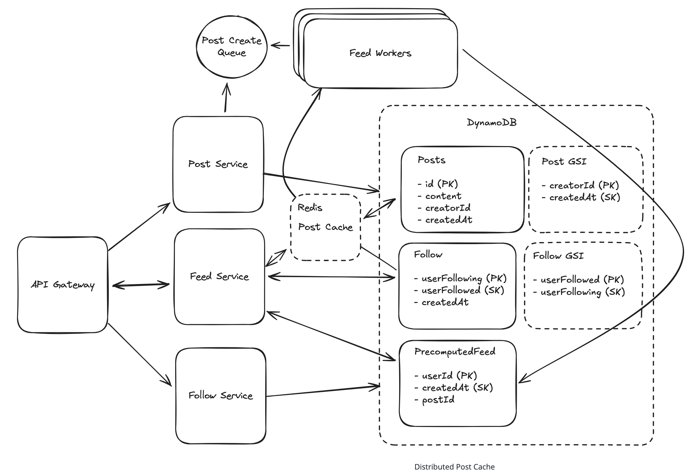
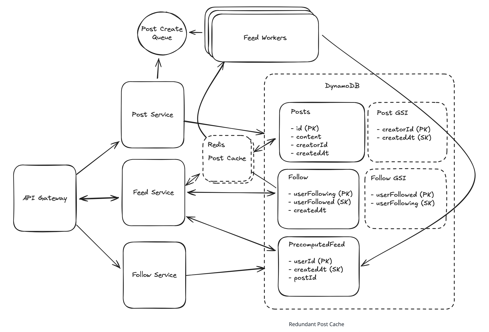

# Facebook NewsFeed
Facebook is a social network which pioneered the News Feed, a product which shows recent stories from users in your social graph.

## Requirements


## Core Entities

- **User**: A users in our system.
- **Follow**: A uni-directional link between users in our system.
- **Post**: A post made by a user in our system. Posts can be made by any user, and are shown in the feed of users who follow the poster.

## API Design

```
// POST /posts 
{
    "content": { }
}
// -> 200 OK
{
    "postId": // ...
}
```
---
```
// PUT /users/[id]/followers
{ } 
// -> 200 OK
```
---
```
// GET /feed?pageSize={size}&cursor={timestamp?}
{
    items: Post[],
    nextCursor: string
}
```
## HLD

### 1. Users should be able to create posts.


### 2. Users should be able to friend/follow people.


### 3. Users should be able to view a feed of posts from people they follow.
1. Query all users followed by user A.
2. Fetch all posts from those users (via GSI on `creatorID`).
3. Sort by `createdAt`.



⚠️ Problems with Naive Feed

1. Users may follow thousands of users.
2. Each followed user may have thousands of posts.
3. Sorting and querying become inefficient at scale.

### 4. Users should be able to page through their feed.

- Use **timestamp as a cursor**.
- Efficient due to chronological sorting.

```http
GET /feed?pageSize=10&cursor=2025-06-01T00:00:00Z
```

## Potential Deep Dives
### 1. How do we handle users who are following a large number of users?
- When a user follows many accounts, querying the Follow table can take time.
- Fetching posts for each followed user leads to fan-out — a single request generates many sub-requests.
- To avoid high latency, compute feed results **on post creation** (fan-out on write) instead of at read time.
- Introduce a `PrecomputedFeed` table:
  - Stores a compact list of post IDs (e.g., 200 recent posts) for each user.
  - Partition key: `userId`, no secondary indexes needed.
  - Storage estimate: 2KB per user → 2TB total for 1B users.
- If a user scrolls past the stored posts, fallback to querying Follow + Post tables.
- Product-side solutions like capping follow counts (e.g., Facebook’s 5,000 friend limit) are commonly used.
. 

### 2. How do we handle users with a large number of followers?
#### 🔴 Bad Solution: Synchronous Fan-out
- Post Service attempts to synchronously update millions of feeds.
- ❗ Leads to:
  - Too many concurrent connections.
  - Uneven load distribution (one host overloaded).

#### 🟡 Good Solution: Async Workers
- Use a queue (e.g., Amazon SQS).
- Workers pull jobs to update relevant feeds.
- Post creation enqueues task with `postId` and `creatorId`.
- ✅ Smooths out traffic spikes, supports high throughput.

#### 🟢 Great Solution: Hybrid Feeds with Async Workers
- Skip feed precomputation for high-follower accounts.
- Add a flag in Follow table to mark such follows.
- Feed Service reads both:
  - Precomputed feed entries.
  - Recent posts from high-follower accounts (non-precomputed).
- ✅ Mix of fan-out on write (precomputed) and fan-out on read (dynamic).
- ✅ Tuning threshold per account is possible.


### 3. How can we handle uneven reads of Posts?

#### 🟡 Good Solution: Distributed Post Cache
- Insert distributed cache (e.g., Redis) between readers and Post table.
- Use LRU eviction + long TTL since posts are rarely edited.
- Invalidate cache only on post edits.
- ✅ Dramatically reduces read pressure on DB.



#### 🟢 Great Solution: Redundant Post Cache
- Use multiple uncoordinated cache clusters.
- Each can independently cache the same `postId`.
- More DB hits possible (N caches → N DB hits), but tolerable.
- ✅ Enables N× read throughput without coordination.
- ✅ Eliminates hot key bottleneck on individual partitions.

