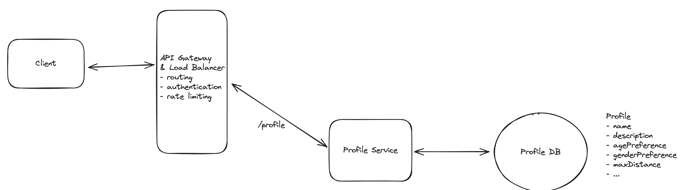
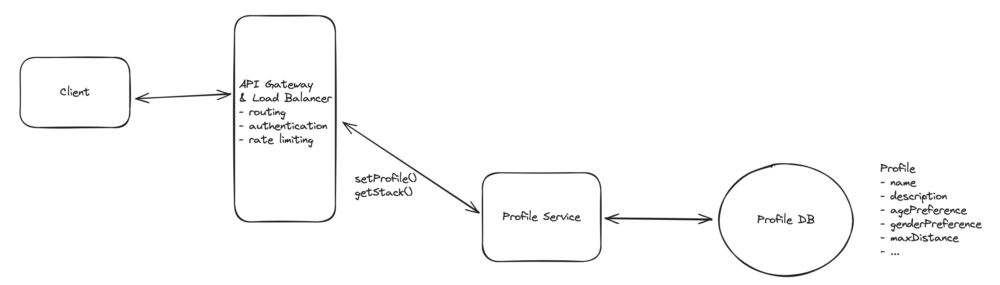
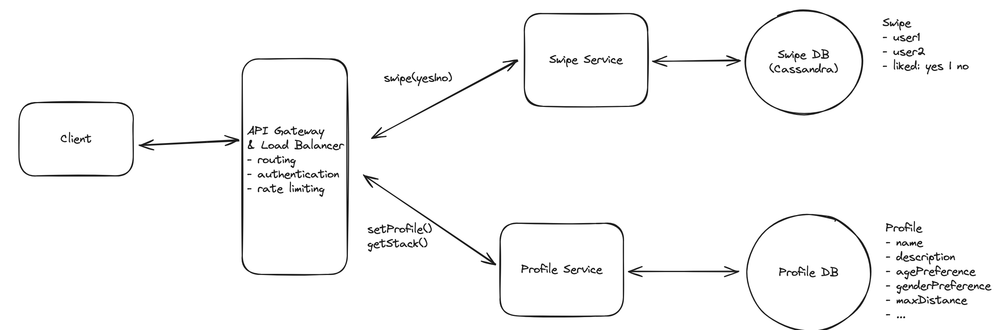
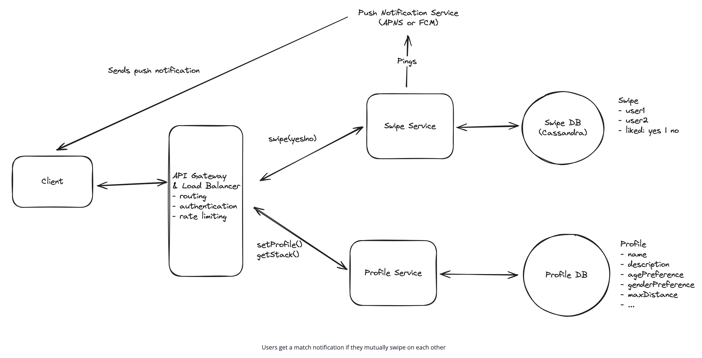
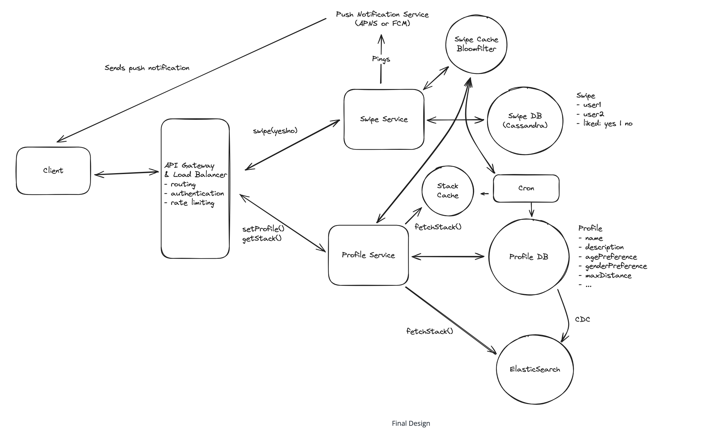

# Tinder 
Mbile dating app that helps people connect by allowing users to swipe right to like or left to pass on profiles. It uses location data and user-specified filters to suggest potential matches nearby.

## Requirements
### Functional Requirements
- Users can create a profile with preferences (e.g. age range, interests) and specify a maximum distance.
- Users can view a stack of potential matches in line with their preferences and within max distance of their current location.
- Users can swipe right / left on profiles one-by-one, to express "yes" or "no" on other users.
- Users get a match notification if they mutually swipe on each other.

Out of scope
- Users should be able to upload pictures.
- Users should be able to chat via DM after matching.
- Users can send "super swipes" or purchase other premium features.

### Non-Functional Requirements
- The system should have strong consistency for swiping. If a user swipes "yes" on a user who already swiped "yes" on them, they should get a match notification.
- The system should scale to lots of daily users / concurrent users (20M daily actives, ~100 swipes/user/day on average).
- The system should load the potential matches stack with low latency (e.g. < 300ms).
- The system should avoid showing user profiles that the user has previously swiped on.

<u>out of scope</u>
- The system should protect against fake profiles.
- The system should have monitoring / alerting.

## Core Entities
- User: This represents both a user using the app and a profile that might be shown to the user. We typically omit the "user" concept when listing entities, but because users are swiping on other users, we'll include it here.
- Swipe: Expression of "yes" or "no" on a user profile; belongs to a user (swiping_user) and is about another user (target_user).
- Match: A connection between 2 users as a result of them both swiping "yes" on each other.

## APIs
1. Create Profile
```
POST /profile
{
  "age_min": 20,
  "age_max": 30,
  "distance": 10,
  "interestedIn": "female" | "male" | "both",
  ... 
}
```

2. Get User Feed.
```
GET /feed?lat={}&long={}&distance={} -> User[]
```

3. User Swipe
```
POST /swipe/{userId}
Request:
{
  decision: "yes" | "no"
}
```

## HLD
### 1. Users can create a profile with preferences (e.g. age range, interests) and specify a maximum distance.
- Simple Client Server Architecture to start with.  



### 2. Users can view a stack of potential matches.
- Need to consider User's current location, preferences, and maximum distance.  
- ❌ Bad: Querying the database for all users and filtering in the application layer, we will improve this later.
```
SELECT * FROM users
WHERE age BETWEEN 18 AND 35
AND interestedIn = 'female'
AND lat BETWEEN userLat - maxDistance AND userLat + maxDistance
AND long BETWEEN userLong - maxDistance AND userLong + maxDistance
```
. 

### 3. Users can swipe right / left on profiles one-by-one, to express "yes" or "no" on other users.
- Every swipe (left = no, right = yes) is persisted immediately.
- **Write Heavy** - Since Swipes are so effortles, we will be having a lot of them.
- **Recommended**: Cassandra (or similar write-optimized NoSQL DB).
  - Partition by `swiping_user_id` for fast lookups.
  - Supports high write volumes (20M DAUs × 100 swipes/day = ~2B writes/day).
  - Con: Eventual consistency — mitigated during deep dive discussions. 

. 


### 4. Users get a match notification if they mutually swipe on each other
- When both users swipe right, they are considered a match.

🔔 **Notification Logic**
- **Person A** swipes right on **Person B** → swipe is stored.
- Later, **Person B** swipes right on **Person A** → system detects mutual interest.
  - **Person B** sees instant match confirmation in-app.
  - **Person A** receives a **push notification** via:
    - **APNS** (iOS)
    - **FCM** (Android)

. 

✅ **Real-Time Match Trigger**
- Push notifications handled outside core logic via native services.
- Ensures that even if one user swiped days earlier, the match is communicated immediately when the second user swipes.


#### 🔁 Flow
1. Client sends a POST `/swipe` request with decision.
2. API Gateway routes to Swipe Service.
3. Swipe Service stores the swipe and checks for a reciprocal swipe.
4. If mutual swipe exists, a match is declared.
4. Users get a match notification if they mutually swipe on each other

## Potential Deep Dives

### 1. How can we ensure that swiping is consistent and low latency?

Swiping needs to be **immediately recorded** and must detect matches accurately, even when swipes occur nearly simultaneously.

#### ❌ Bad: Database Polling for Matches
- Swipes are saved first.
- Periodic background jobs reconcile mutual swipes.
- High-latency for match notification.
- Can miss real-time matches and degrade UX.

#### ✅ Good: Use Transactions
- Use transactional semantics to:
  - Record the swipe
  - Check for inverse swipe
  - Declare a match — all in one go.
- Ensures atomicity but doesn't scale well with high throughput or eventual consistency models.

#### 🌟 Great: Sharded Cassandra with Single Partition Transactions
- Partition data by `swiping_user_id`.
- Each partition stores who this user has swiped on.
- Inverse swipe lookups stay fast — contained within a single partition.
- Scales well with high write volume.
- **Trade-off**: Eventual consistency; can delay match detection slightly unless handled carefully.

#### 🌟 Great: Redis for Atomic Operations
- Keep Redis as a fast-access layer.
- On swipe:
  - Check for inverse swipe in Redis.
  - If not found, store swipe in Redis.
  - If found, declare match instantly and send notifications.
- Extremely low latency.
- Can periodically sync to the main DB for durability.

### 2. How can we ensure low latency for feed/stack generation?
Feed generation should happen under 300ms. This requires intelligent data access strategies and caching.

#### ✅ Good: Use Indexes for Real-Time Querying
- Add spatial and attribute indexes to the DB.
- Index by age, location (lat/long), and gender preference.
- Enables efficient real-time filtering on `/feed` endpoint.
- **Problem**: Still too slow under large user volumes.

#### ✅ Good: Precomputation and Caching
- Periodically compute "feeds" for active users.
- Cache the stack of recommended profiles.
- On app open, serve feed from cache.
- **Challenge**: Feeds may go stale (e.g., location changes, updated preferences).

#### 🌟 Great: Combine Pre-Computing and Indexed DB
- Pre-compute feeds for active users and cache with a short TTL (e.g. 1 hour).
- On user activity or location change:
  - Trigger a background job to refresh the feed.
- Tuneable parameters:
  - TTL
  - Number of profiles cached
  - Which users to warm up
- Balances freshness and speed efficiently.

### ⚠️ How to Avoid Stale Feeds

A **stale feed** contains profiles that no longer match user preferences or location filters. To mitigate this:

- Use background jobs to refresh feeds.
- Only precompute for likely-to-return users.
- Tune TTLs and cache size based on activity patterns.

### 3. How can the system avoid showing user profiles that the user has previously swiped on?

Avoiding repeats is crucial for user trust and overall experience.

#### ❌ Bad: DB Query + Contains Check
- Query for potential matches.
- For each, check if the current user has already swiped.
- Extremely inefficient at scale.

#### ✅ Great: Cache + DB Query + Contains Check
- Maintain a local/in-memory cache of recently swiped `target_user_ids`.
- Filter potential profiles against this cache before returning feed.
- Fall back to DB for less recent history.

#### 🌟 Great: Cache + Contains Check + Bloom Filter
- Use a **Bloom filter** to check swipe history probabilistically.
- Tiny memory footprint and fast reads.
- Occasional false positives (user might miss a valid match).
- Trade-off between UX and scalability — acceptable for swipe logic.

## Final Design


