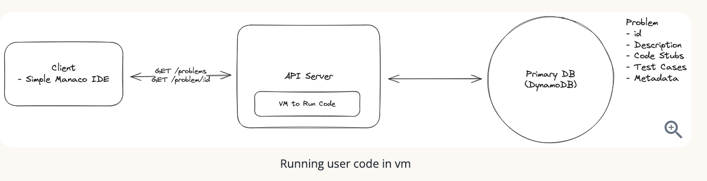

# Leetcode 

## Requirement
### Functional 
1. Users should be able to view a list of coding problems.
2. Users should be able to view a given problem, code a solution in multiple languages.
3. Users should be able to submit their solution and get instant feedback.
4. Users should be able to view a live leaderboard for competitions.

#### Out of scope
- User authentication
- User profiles
- Payment processing
- User analytics
- Social features

### Non-Functional

1. The system should prioritize availability over consistency.
2. The system should support isolation and security when running user code.
3. The system should return submission results within 5 seconds.
4. The system should scale to support competitions with 100,000 users.

#### Out of scope
- The system should be fault-tolerant.
- The system should provide secure transactions for purchases.
- The system should be well-tested and easy to deploy (CI/CD pipelines).
- The system should have regular backups.

## Core Entities
- Problem: This entity will store the problem statement, test cases, and the expected output.
- Submission: This entity will store the user's code submission and the result of running the code against the test cases.
- Leaderboard: This entity will store the leaderboard for competitions.

## APIs
1. Get Problem List
```
GET /problems?page=1&limit=100 -> Partial<Problem>[]
```
2. Get Problem Details
```
GET /problems/:id?language={language} -> Problem
```

3. Submit Solution
```
POST /problems/:id/submit -> Submission
{
  code: string,
  language: string
}

- userId not passed into the API, we can assume the user is authenticated and the userId is stored in the session
```

4. Get Leaderboard

```
GET /leaderboard/:competitionId?page=1&limit=100 -> Leaderboard[]
```

## HLD
### 1. Users should be able to view a list of coding problems
-  Choose a NoSQL DB like DynamoDB because we don't need complex queries and I plan to nest the test cases as a subdocument in the problem entity.


```
// Problem Entity
{
  id: string,
  title: string,
  question: string,
  level: string,
  tags: string[],
  codeStubs: {
    python: string,
    javascript: string,
    typescript: string,
    ...
  },
  testCases: {
    type: string,
    input: string,
    output: string
  }[]
}
```
### 2. Users should be able to view a given problem and code a solution

- Monaco Editor - a web-based code editor that supports multiple languages and syntax highlighting.


### 3. Users should be able to submit their solution and get instant feedback

#### ❌ Bad: Run Code in the API Server
- **Security Risks**: Allows arbitrary code execution on core infrastructure. Risk of data deletion, DDoS, or crypto mining.
- **Performance Issues**: Unbounded CPU/memory usage can bring down the entire server.
- **No Isolation**: A single user's buggy or malicious code can crash the entire application server.

#### ⚠️ Okay: Run Code in a Virtual Machine (VM)
- **Isolation**: VM crashes don’t affect host; can be reset easily.
- **Challenges**:
  - **Startup Time**: VMs are slow to boot.
  - **Resource Management**: Requires lifecycle orchestration to prevent sprawl and cost.
. 

#### ✅ Great: Run Code in Containers (Docker)
- **Efficient**: Lightweight, fast startup compared to VMs.
- **Isolated Sandboxes**: Each language gets its own container with required dependencies.
- **Scalable**: Reuse containers across submissions.
- **Challenges**:
  - Need strict isolation (seccomp, read-only FS, no network).
  - Must enforce CPU/memory/time limits per container.  

### ✅✅ Alternative: Serverless Functions
- **Elastic Scalability**: Automatically scales with demand.
- **Stateless & Event-Driven**: Great for short-lived execution.
- **Challenges**:
  - **Cold Start**: First execution latency.
  - **Resource Caps**: Not suitable for long-running tasks.

### 🤔 Final Pick
> **Use Containers** for controlled environments with predictable load. Avoids cold start latency and offers flexibility in tuning limits and security.


#### 🛠️ Code Submission Flow
1. User submits code via frontend.
2. API Server receives submission and language ID.
3. Passes request to corresponding language container.
4. Container executes code in a sandbox.
5. Result is returned to API Server.
6. API Server logs result and returns to client.

### 4. Users should be able to view a live leaderboard for competitions

- Competition Definition
  - Duration: 90 minutes
  - Problems: 10
  - Participants: Up to 100,000 users
- If using SQL the query would be
```
SELECT userId, COUNT(*) as numSuccessfulSubmissions
FROM submissions
WHERE competitionId = :competitionId AND passed = true
GROUP BY userId
ORDER BY numSuccessfulSubmissions DESC
```

- If using Dynamo DB - need to have the partition key be the competitionId. Then you'd pull all items into memory and group and sort.

## Potential Deep Dives
### 1. Support isolation and security when running user code.
Include in the container setup to further enhance security:
- **Read-Only Filesystem**: Mount code directories as read-only to prevent unauthorized writes.
- **CPU & Memory Bounds**: Enforce strict limits per container; kill containers that exceed them.
- **Execution Timeout**: Kill any process exceeding the allowed time (e.g., 5 seconds).
- **No Network Access**: Disable egress completely using VPC rules, NACLs, or Docker network restrictions.


### 2. Make fetching the leaderboard more efficient.
#### ❌ Bad: Frequent Polling + Full DB Scan
- Every client poll triggers DB query, sort, group.
- Unscalable with many users.

#### ⚠️ Better: Caching with Periodic Refresh
- Store leaderboard in cache (e.g., Redis), refresh from DB every 30s.
- Still involves polling and isn't truly real-time.

#### ✅ Best: Redis Sorted Set + Polling
- Update Redis on each submission using `ZADD`.
- Fetch top N users with `ZREVRANGE` and scores.
- Fast, scalable, and supports pagination.
- Clients can still poll every 5s without burdening DB.

### 3. Scale to support competitions with 100,000 users.

#### ❌ Bad: Vertical Scaling
- Not viable; high cost and CPU limits per instance.
- Doesn’t scale dynamically.

#### ✅ Better: Horizontal Scaling
- Scale containers by language using ECS/Kubernetes.
- Use autoscaling rules based on CPU/memory usage.

#### ✅✅ Best: Add a Queue
- API server pushes submissions to a queue (e.g., SQS).
- Worker containers pull from queue at capacity.
- Introduces async flow; client polls `/check/:id` for result.
- Adds fault tolerance (e.g., retries on failure).

> 🔁 This is exactly how LeetCode handles submissions in production.


### 4. handle running test cases

- **One Set of Test Cases** per problem, shared across languages.
- **Test Harness**: Written per language to deserialize input, run code, and compare output.
- **Serialization**: Use a common format (e.g., JSON). For trees, serialize as arrays (e.g., `[3, 9, 20, null, null, 15, 7]`).
- **Example**: Python’s TreeNode must deserialize the array into an actual binary tree object before execution.

```python
# Sample input (Python)
input = [3, 9, 20, None, None, 15, 7]  # Deserialized to TreeNode
expected_output = 3
```

### Final Design

