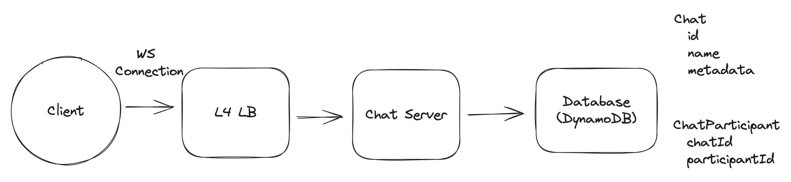
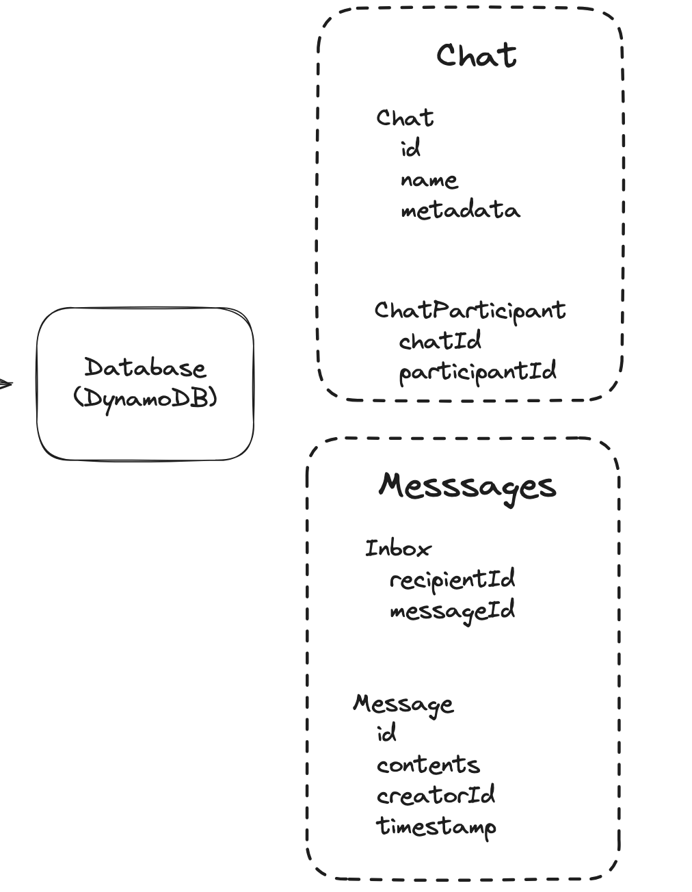
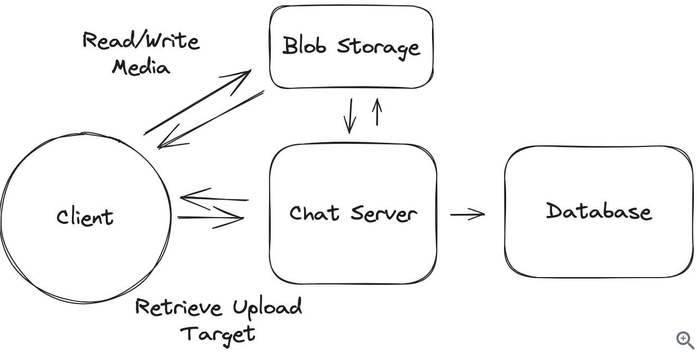
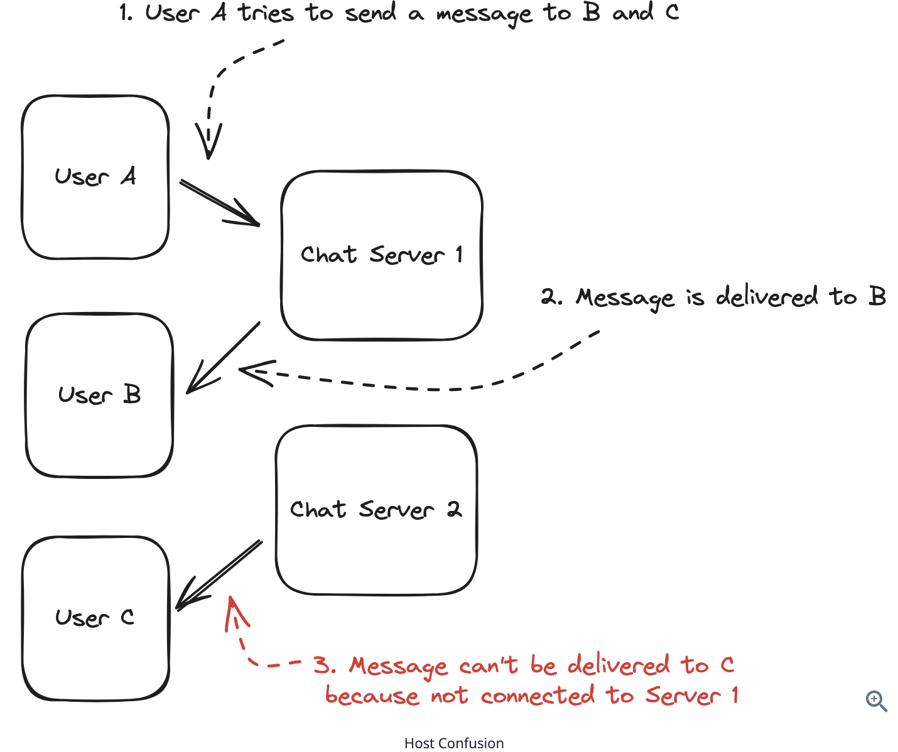
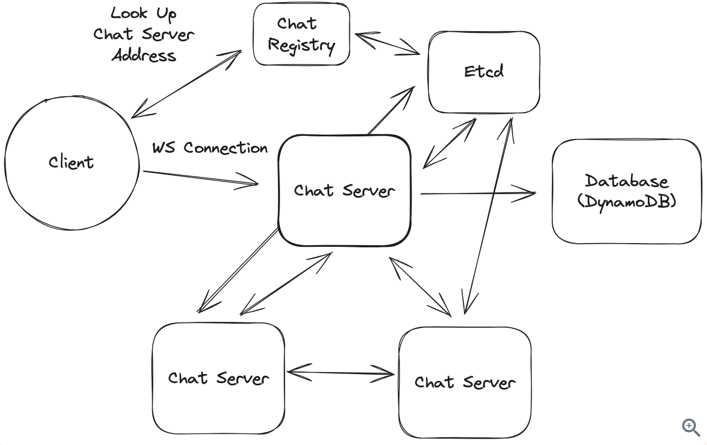
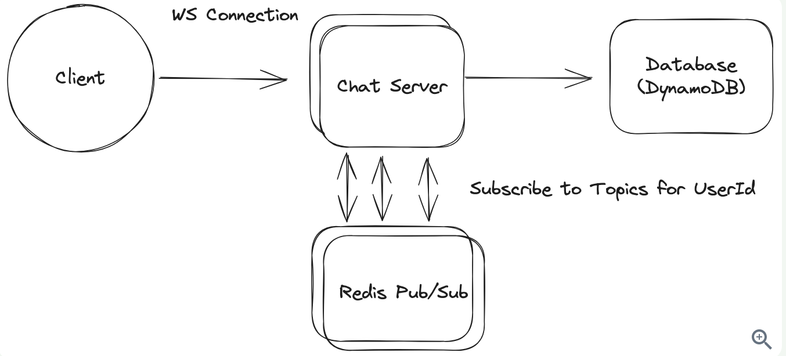
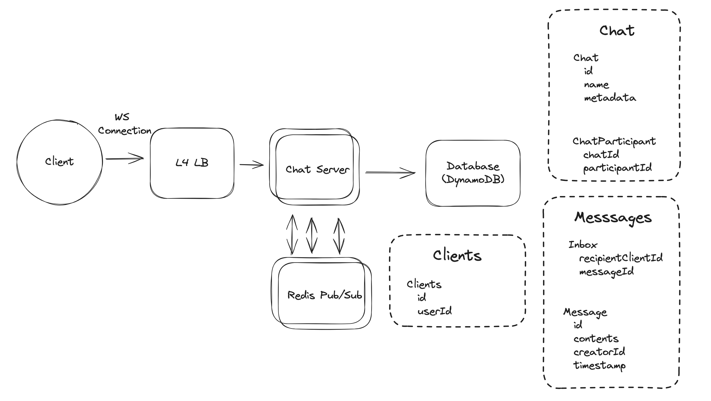

# WhatsApp - Messaging Service

## Introduction
WhatsApp is a messaging service that allows users to send and receive encrypted messages and calls from their phones and computers. Originally built on Erlang, it's renowned for handling high scale with limited engineering and infrastructure outlay.

## Requirements

### Functional Requirements
**Core Requirements (In Scope):**
- Users should be able to start group chats with multiple participants (limit 100)
- Users should be able to send/receive messages
- Users should be able to receive messages sent while they are not online (up to 30 days)
- Users should be able to send/receive media in their messages

**Out of Scope:**
- Audio/Video calling
- Interactions with businesses
- Registration and profile management

### Non-Functional Requirements
**Core Requirements:**
- Messages should be delivered to available users with low latency, < 500ms
- We should guarantee deliverability of messages
- The system should be able to handle billions of users with high throughput
- Messages should be stored on centralized servers no longer than necessary
- The system should be resilient against failures of individual components

**Out of Scope:**
- Exhaustive treatment of security concerns
- Spam and scraping prevention systems

## Core Entities
- Users
- Chats
- Messages
- Clients: A user might have multiple devices (phone, tablet, desktop)

## API
Using WebSocket connections for real-time bidirectional communication:

**Note**: Each of these commands will have a parallel command that is sent to other clients. When the command has been received by clients, they'll send an ack command back to the server letting it know the command has been received (and it doesn't have to be sent again)!

### Create Chat
```
-> createChat
{
  "participants": [],
  "name": ""
} -> {
  "chatId": ""
}
```

### Send Message
```
-> sendMessage
{
  "chatId": "",
  "message": "",
  "attachments": []
} -> "SUCCESS" | "FAILURE"
```

### Create Attachment
```
-> createAttachment
{
  "body": ...,
  "hash": ""
} -> {
  "attachmentId": ""
}
```

### Modify Chat Participants
```
-> modifyChatParticipants
{
  "chatId": "",
  "userId": "",
  "operation": "ADD" | "REMOVE"
} -> "SUCCESS" | "FAILURE"
```

### Receive Messages
```
<- newMessage
{
  "chatId": "",
  "userId": "",
  "message": "",
  "attachments": []
} -> "RECEIVED"
```

### Chat Updates
```
<- chatUpdate
{
  "chatId": "",
  "participants": []
} -> "RECEIVED"
```

## HLD

### 1) Users should be able to start group chats with multiple participants (limit 100)

#### Create a Chat
- **Service**: Chat Server behind L4 load balancer (supports WebSockets)
- **Database**: DynamoDB for fast key/value performance and scalability

#### Steps:
1. User connects and sends createChat message
2. Service creates Chat record and ChatParticipant records in transaction
3. Returns chatId to user

#### Database Schema:
- **Chat Table**: Primary key on chatId
- **ChatParticipant Table**: Composite primary key (chatId, participantId)
  - Range lookup on chatId → all participants for a chat
  - GSI with participantId as partition key → all chats for a user


### 2) Users should be able to send/receive messages

#### Single Host Solution (Initial)
- **Connection Tracking**: Hash map mapping userId to WebSocket connection
- **Message Flow**:
  1. User sends sendMessage to Chat Server
  2. Server looks up all participants via ChatParticipant table
  3. Server sends message via WebSocket connections

#### Assumptions:
- All users online
- Connected to same Chat Server
- WebSocket connection for each user

### 3) Users should be able to receive messages sent while they are not online (up to 30 days)

#### Offline Message Handling
- **Inbox Table**: Stores undelivered messages for each user
- **Message Flow**:
  1. Send message → write to Message table + create Inbox entries
  2. Return SUCCESS/FAILURE with message ID
  3. Attempt immediate delivery to connected clients
  4. Client sends ack → delete from Inbox
  5. Offline clients: store in Inbox until connection

#### Offline Delivery:
1. Look up user's Inbox for undelivered message IDs
2. Fetch messages from Message table
3. Send via newMessage command
4. Client acks → delete from Inbox
5. Cron job deletes messages older than 30 days


### 4) Users should be able to send/receive media in their messages

#### Media Handling Options

##### ❌ Bad Solution: Keep attachments in DB
- Store media directly in database
- **Cons**: Not scalable, high storage costs

##### ✅ Good Solution: Send attachments via chat server
- Handle media through existing chat infrastructure
- **Cons**: Bandwidth intensive, not optimized

##### ✅✅ Great Solution: Manage attachments separately
- **Separate HTTP Service**: Purpose-built for media uploads
- **Benefits**: Optimized for bandwidth/storage, scalable
- **Implementation**: Attachments uploaded via separate service, referenced in messages

. 

## Deep Dives

### 1) How can we handle billions of simultaneous users?

#### Problem
Single-host system doesn't scale. Need to handle billions of users with hundreds of chat servers.


#### Scaling Challenges
- **Connection Distribution**: Users connected to different Chat Servers
- **Message Routing**: How to route messages between servers
- **Back-of-envelope**: 1B users → 200M connected → hundreds of chat servers

#### Solutions

##### ❌ Bad Solution: Naively horizontally scale
- Just add more chat servers
- **Problem**: No message routing between servers


##### ❌ Bad Solution: Keep a Kafka topic per user
- Create topic for each user
- **Problem**: Too many topics, not scalable

##### ✅ Good Solution: Consistent Hashing of Chat Servers
- Hash user ID to determine which server handles them
- **Problem**: Users can be on different servers

. 

##### ✅✅ Great Solution: Offload to Pub/Sub
- **Redis Pub/Sub**: Lightweight message routing
- **Subscription Model**: Each user has a subscription topic
- **At-most-once Delivery**: Acceptable since we have Inbox for durability

#### Pub/Sub Implementation
**On Connection:**
1. Chat Server subscribes to user's topic in Pub/Sub
2. Messages received on subscription → forwarded to WebSocket

**On Message Send:**
1. Publish message to recipient's Pub/Sub topic
2. All subscribing Chat Servers receive message
3. Forward to user's WebSocket connection

**Benefits:**
- Decouples Chat Servers
- Handles routing automatically
- Leverages existing Inbox for durability

**Challenges:**
- Additional latency (single-digit ms)
- All-to-all connections between Chat Servers and Redis


---

### 2) What do we do to handle multiple clients for a given user?

#### Problem
Users have multiple devices (phone, tablet, desktop) that need to stay in sync.

#### Challenges
- **Client Resolution**: Map user to multiple active clients
- **Client Deactivation**: Remove inactive clients
- **Message Delivery**: Deliver to all user's clients

#### Solution: Client-Aware Design

##### Database Changes
- **Clients Table**: Track clients by user ID
- **Inbox Table**: Per-client instead of per-user
- **Message Delivery**: Send to all user's clients

##### Implementation
1. **Client Lookup**: When sending message, look up all clients for each participant
2. **Inbox Management**: Create Inbox entry for each client
3. **Delivery**: Send message to all user's clients
4. **Pub/Sub**: No changes needed (still subscribe to userId topic)
5. **Limits**: 3 clients per account to control storage/throughput

##### Benefits
- **Multi-device Sync**: All devices receive messages
- **Client Management**: Track and deactivate clients
- **Scalable**: Reasonable limits prevent abuse

---

## Final Design

