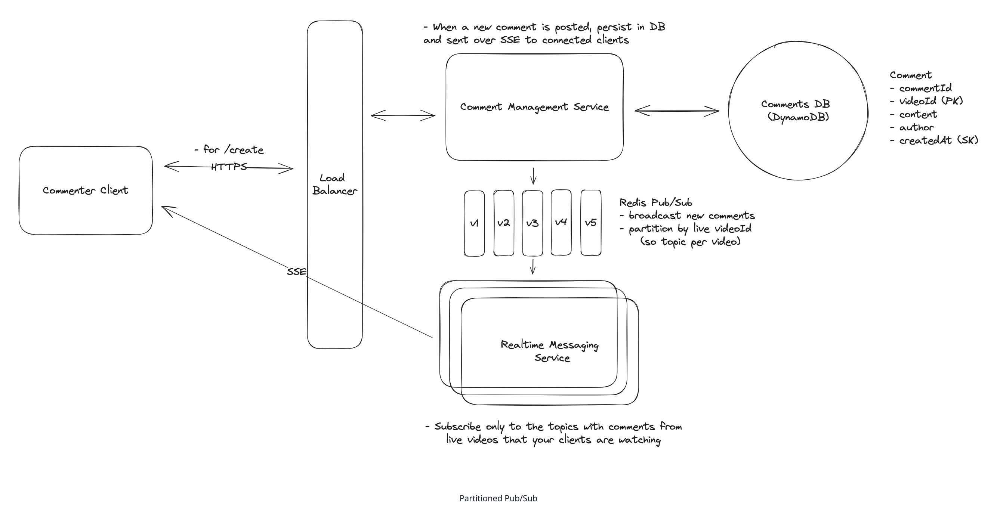

# Facebook Live Comments
Facebook Live Comments is a feature that enables viewers to post comments on a live video feed. Viewers can see a continuous stream of comments in near-real-time.

## Requirements
### Functional Requirements

- Viewers can post comments on a Live video feed.
- Viewers can see new comments being posted while they are watching the live video.
- Viewers can see comments made before they joined the live feed.

<u>Out of Scope</u>
- Viewers can reply to comments
- Viewers can react to comments

### Non-Functional Requirements
- Scale to millions of users per Video.
- Prioritize availability over consistency, eventual consistency is fine.
- Low latency, broadcasting comments to viewers in near-real time (< 200ms end-to-end latency under typical network conditions)

<u>Out of Scope</u>
- Secure, ensuring that only authorized users can post comments.
- Enforce integrity constraints, ensuring that comments are appropriate (ie. not spam, hate speech, etc.)

## Core Entities
- User
- Live Video
- Comment

## API 
1. Create a comment.
```POST /comments/:liveVideoId
Header: JWT | SessionToken
{
    "message": "Cool video!"
} 
```

2. Fetch past comments for a given live video.
```
GET /comments/:liveVideoId?cursor={last_comment_id}&pageSize=10&sort=desc
```

## HLD
### 1. Viewers can post comments on a Live video feed
- DynamoDB because it is a fast, scalable, and highly available database. It's is a good fit for our use case because we are storing simple comments that don't require complex relationships or transactions

. 

### 2. Viewers can see new comments being posted while they are watching the live video.


<u>Downsides</u>
- Inefficient with scale.
- Causes load on the DB.
- Not suitable for real-time needs.  

### 3. Viewers can see comments made before they joined the live feed
#### Bad: Offset Pagination
Offset pagination is a technique that uses an offset to specify the starting point for fetching a set of results.
<u>Issues</u>
- Slow for large data sets.
- Inconsistent if comments are added/deleted (unstable).
#### Good: Cursor Pagination
Uses a cursor to specify the starting point for fetching a set of results. The cursor is a unique identifier that points to a specific item in the list of results.  
<u>Advantages</u>
- Stable and efficient.
- Well-supported by DynamoDB via LastEvaluatedKey

## Deep Dives
### 1. Ensure comments are broadcasted to viewers in real-time
#### Good - WebSockets


<u>Approach</u>
- Establishes a bi-directional, persistent connection between client and server.
- The server can push comments immediately to connected clients upon creation.

<u>Advantages</u>
- Real-time updates.
- Efficient for balanced read/write scenarios.

<u>Challenges</u>
- Commenting is infrequent; viewing is frequent → heavy read/write imbalance.
- High overhead to maintain a two-way connection for each viewer.
- Overkill given that most viewers do not post comments.  

#### Great - Server-Sent Events (SSE). 
<u>Approach</u>
- Uses a unidirectional HTTP-based connection to push updates from server to client.
- Clients send comments via standard HTTP POST; SSE streams updates back.

<u>Advantages</u>
- Lightweight, efficient for read-heavy patterns.
- Simpler than WebSockets; fits Facebook Live's write-light, read-heavy nature.
- Modern browsers support automatic reconnection and resume with Last-Event-ID.

<u>Challenges</u>
- Some proxies/load balancers buffer or block streaming HTTP responses.
- Browser-imposed limits on concurrent SSE connections per domain.
- Monitoring/debugging long-lived connections can be complex.


### 2. Scale to support millions of concurrent viewers
#### Bad: Horizontal Scaling with Load Balancers and Pub/Sub


<u>Approach</u>
- Seperate Read and Write services, since write traffic is low compared to read traffic and each service can be scaled independently.
- Each Realtime Messaging service tracks SSE connections per liveVideoId.
```{
    "liveVideoId1": ["sseConnection1", "sseConnection2", "sseConnection3"],
    "liveVideoId2": ["sseConnection4", "sseConnection5", "sseConnection6"],
    "liveVideoId3": ["sseConnection7", "sseConnection8", "sseConnection9"],
}
```
- Comment Management Service publishes new comments to a pub/sub channel.
- All messaging servers subscribe and rebroadcast to connected viewers.  

<u>Challenges</u>
- All servers process all comments, even for videos they aren’t serving.
- High compute and memory usage → inefficient and unscalable at FB's scale.

#### Good: Pub/Sub partitioning into channels per live video
. 
<u>Approach</u>
- Each live video has its own pub/sub channel.
- Each messaging server subscribes only to relevant channels.
- Create N channels and determine which channel to broadcast a comment to based on hash(liveVideoId) % N. This ensures there is a reasonable upper bound on the number of channels.

<u>Challenges</u>
- Still possible that servers get viewers from many different streams (due to round-robin load balancing).
- Leads to increased complexity in server-side subscription management.

#### Great: Partitioned Pub/Sub with L7 Load Balancer
The goal is to have each server primarily handle viewers of the same live video, making it easier to limit the number of topics or channels each server needs to subscribe to.


<u>Approach</u>
- Use a Layer 7 load balancer (e.g., NGINX or Envoy) to route clients based on liveVideoId.
- Ensures that all viewers for the same video are colocated on the same messaging server.

<u>Options</u>
- Consistent Hashing via Scripted Routing:
    - Load balancer applies hash on liveVideoId to route traffic consistently.
- Dynamic Lookup via Coordination Service (e.g., ZooKeeper):
    - Tracks mapping of liveVideoId → server.
    - Allows dynamic rebalancing and scaling.

<u>Advantages</u>
- Efficient server utilization.
- Avoids the many-streams-per-server issue.

<u>Challenges</u>
- Increases system complexity and operational overhead.
- Requires caching and failure-handling logic.  

#### Great: Scalable Dispatcher.

 
<u>Approach</u>
- Dedicated dispatcher service routes comments to the appropriate messaging server.
- Avoids the complexities with pub/sub broadcast model.

<u>Advantages</u>
- Precise control over message delivery.
- Reduces load on unrelated servers.

<u>Challenges</u>
- More operational complexity.
- Requires robust routing and failover mechanisms.

