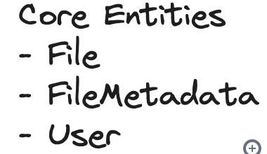
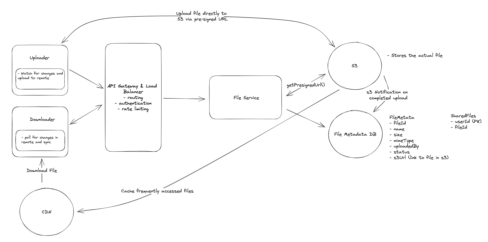

# Drop Box
Dropbox is a cloud-based file storage service that allows users to store and share files. It provides a secure and reliable way to store and access files from anywhere, on any device.      

## Requirements
   

## Core Entities
  

## API or System Interface
- File Upload
```POST /files
Request:
{
  File, 
  FileMetadata
}
```
- File Download
```
GET /files/{fileId} -> File & FileMetadata
```
- Share File
```
POST /files/{fileId}/share
Request:
{
  User[] // The users to share the file with
}
```
- query for changes to files on the remote server
```
GET /files/{fileId}/changes -> FileMetadata[]
```

## High-Level Design
1. Users should be able to upload a file from any device
 - Bad - Upload File to a single server
 - Good - Store File in Blob Storage - S3
 - Great - UPload File directly to S3 instead of uploading it to Web app server first and then Webapp uploading to S3 . This will avoid dupe uploads
2. Users should be able to download a file from any device
 - Bad - Download from File server
 - Good - Download from S3
 - Greate - Download from CDN
3. Users should be able to share a file with other users
4. Users can automatically sync files across devices




## Deep Dives
1. Support large files
-  Chunking
  
  
      Will help in supporting
- Progress Indicator
- Resumable Uploads

2. 


